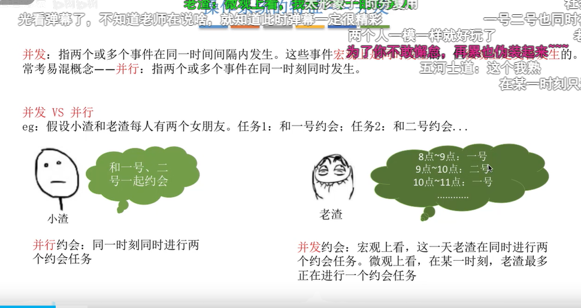
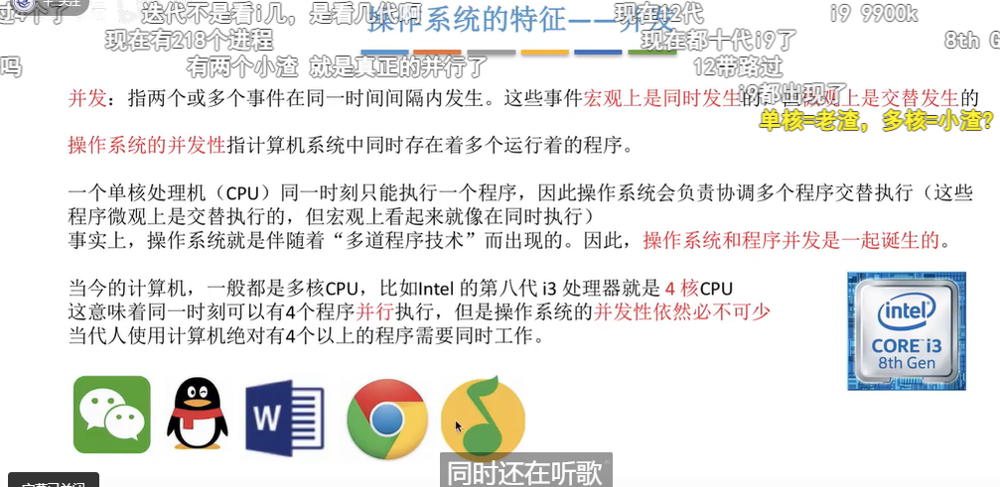
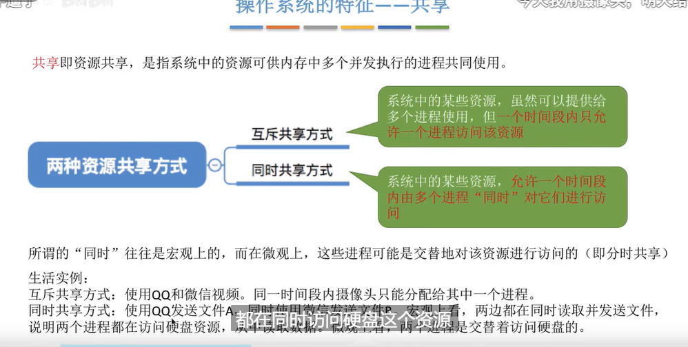
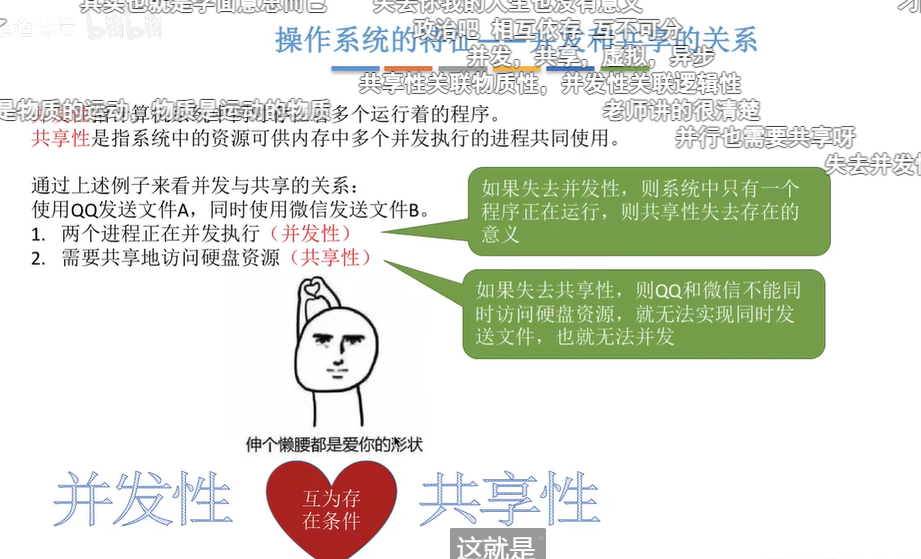
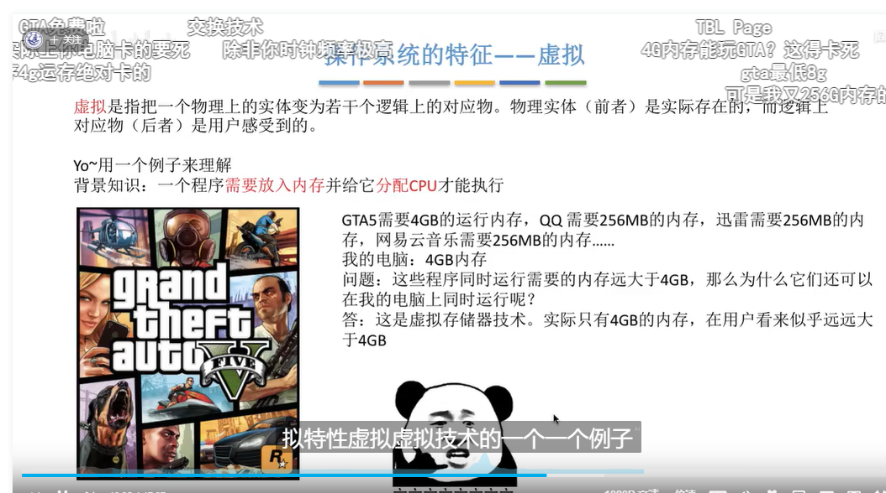
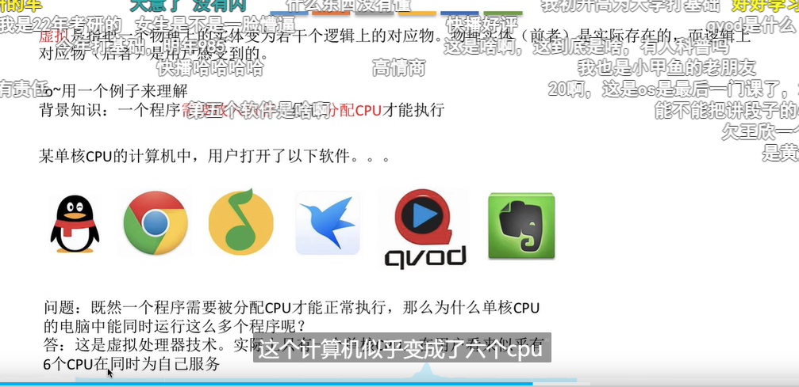
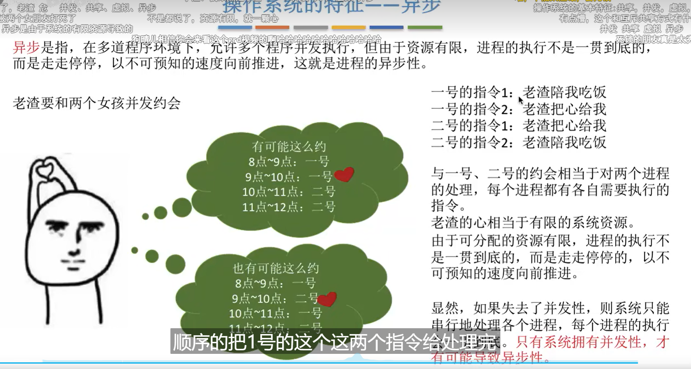
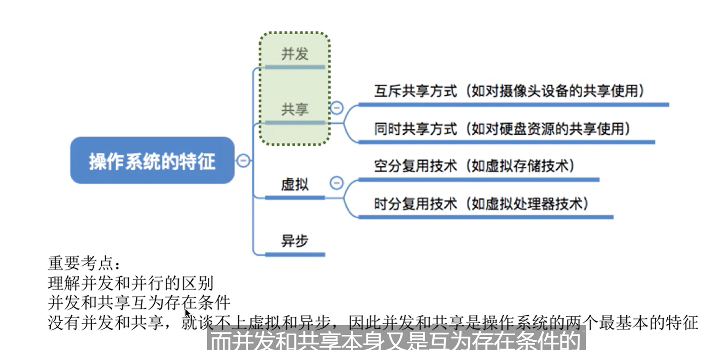

# 操作系统的特征

>操作系统的特征 --- 并发 共享 虚拟 异步

## 并发  

并发性：指计算机中存在多个运行的程序；（时分复用，单核cpu）；仅仅是宏观上的同时；

​	

---

## 共享

定义：资源共享，指系统中的资源可供内存中多个并发执行的进程共同使用；

互斥共享方式； 一段时间只允许一个进程去访问共享资源；

和 同时共享方式；分时共享；宏观上的同时发生；  一段时间允许多个进程“同时“对他们进行访问；

当然也是存在微观上的共享，你一边玩游戏一边放音乐，扬声器这个声音输出设备，会同时播放两者所有的声音；所以这个也是微观上的共享；

## 共享和并发的关系

​	

---

## 虚拟

虚拟是指把一个物理上的实体变为若干个逻辑上的对应物；

物理实体（前者），是实际存在的，而逻辑上的对应物（后者）是用户感受到的；

### 空分复用技术；

### 时分复用技术；

##  异步

异步也是和并发性，才有可能导致异步性；

## 关系

并发和共享就是计算机系统的最基本的特征；

