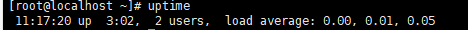
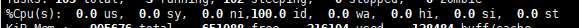

# CPU内存IO


**所有的电脑都在做四件事情：**

1. input  输入
2. store 存储  内存
3. process  处理 cpu
4. output 输出


### CPU

平均负载：load average 

####uptime  查看 average load  平均负载；分别是1分钟，5分钟  10分钟的平均负载；



<font color=red>q： cpu 资源是如何以一种什么样的方式被消耗殆尽的？？？？？</font>


其实这里的负载就是cpu的最大工作量；	

CPU的系统负荷，基本上等同于上面的类比。大桥的通行能力，就是CPU的最大工作量；桥梁上的车辆，就是一个个等待CPU处理的进程（process）。	


**如果CPU每分钟最多处理100个进程，那么系统负荷0.2，意味着CPU在这1分钟里只处理20个进程；系统负荷1.0，意味着CPU在这1分钟里正好处理100个进程；系统负荷1.7，意味着除了CPU正在处理的100个进程以外，还有70个进程正排队等着CPU处理。**


为了电脑顺畅运行，系统负荷最好不要超过1.0，这样就没有进程需要等待了，所有进程都能第一时间得到处理。很显然，1.0是一个关键值，超过这个值，系统就不在最佳状态了，你要动手干预了。


####**TOP 几个跟cpu使用率有关的参数**



* us user用户进程占用的cpu百分比；
* sy system 内核进程占用的cpu的百分比；
* ni
* id  idel  空闲cpu的百分比；
* wa 等待io的cpu百分比；
* hi  cpu硬中断时间百分比
* si cpu软中断时间百分比；
* st
* **注：这里显示数据是所有cpu的平均值，如果想看每一个cpu的处理情况，按1即可；折叠，再次按1；**
* M T P 命令 按照内存  TIME+ cpu的累计时间  cpu来进行排序

```
我们普遍的认为io凭借那
%iowait 表示在一个采样周期内有百分之几的时间属于以下情况：CPU空闲、并且有仍未完成的I/O请求。

对 %iowait 常见的误解有两个：
　　一是误以为 %iowait 表示CPU不能工作的时间，
　　二是误以为 %iowait 表示I/O有瓶颈。

首先 %iowait 升高并不能证明等待I/O的进程数量增多了，也不能证明等待I/O的总时间增加了。
　　例如，在CPU繁忙期间发生的I/O，无论IO是多还是少，%iowait都不会变；当CPU繁忙程度下降时，有一部分IO落入CPU空闲时间段内，导致%iowait升高。
　　再比如，IO的并发度低，%iowait就高；IO的并发度高，%iowait可能就比较低。

可见%iowait是一个非常模糊的指标，如果看到 %iowait 升高，还需检查I/O量有没有明显增加，avserv/avwait/avque等指标有没有明显增大，应用有没有感觉变慢，如果都没有，就没什么好担心的。

```

### 内存

**虚拟内存和物理内存？？？**必须要搞定！！！！


free  

total  used free shared cache/buffer available 

swap total used  free   

ps -ef 

vistual 虚拟内存


```shell
   VSZ   RSS
3701784 413924

VSZ是指已分配的线性空间大小，这个大小通常并不等于程序实际用到的内存大小，产生这个的可能性很多，比如内存映射，共享的动态库，或者向系统申请了更多的堆，都会扩展线性空间大小。

RSZ是Resident Set Size，常驻内存大小，即进程实际占用的物理内存大小
```

top

```shell
VIRT：virtual memory usage 虚拟内存
1、进程“需要的”虚拟内存大小，包括进程使用的库、代码、数据等
2、假如进程申请100m的内存，但实际只使用了10m，那么它会增长100m，而不是实际的使用量

RES：resident memory usage 常驻内存
1、进程当前使用的内存大小，但不包括swap out
2、包含其他进程的共享
3、如果申请100m的内存，实际使用10m，它只增长10m，与VIRT相反
4、关于库占用内存的情况，它只统计加载的库文件所占内存大小

SHR：shared memory 共享内存
1、除了自身进程的共享内存，也包括其他进程的共享内存
2、虽然进程只使用了几个共享库的函数，但它包含了整个共享库的大小
3、计算某个进程所占的物理内存大小公式：RES – SHR
4、swap out后，它将会降下来
```

### IO  

>主要分为磁盘IO和网络IO；

#### 磁盘io

iostat -d -x 


#### 网络IO

netstat  -ano  

ss -antpl 


####一个硬件资源有多少种？

cpu  内存   外部资源(磁盘 网络)

操作系统对磁盘和网络的资源都是通过IO来进行管理；


###IO密集型 vs CPU密集型

瓶颈在哪里？来决定是那种密集型；


 io就是io密集型；主要是数据存储和传输；小数量高频率的读写；


复杂的算法的，图像处理，加解密，序列化和反序列化，zip的加密；


问题：是否存在网络密集型和内存密集型；


#### top命令---cpu使用率；

- Cpu(s): 0.3% us   user

  用户空间占用CPU百分比

  - **解释**：进程在用户地址空间中消耗CPU时间的百分比。像shell程序、各种语言的编译器、数据库应用、web服务器和各种桌面应用都算是运行在用户地址空间的进程，这些程序如果不是处于**idle状态**，那么**绝大多数**的**CPU时间**都是运行在**用户态**。**
    **
  
- 1.0% sy   system 

  内核空间占用CPU百分比

  - **解释**：进程在内核地址空间中消耗CPU时间的百分比。所有进程要使用的**系统资源**都是由**Linux内核**处理的。当处于用户态(用户地址空间)的进程需要使用系统的资源时，比如需要**分配一些内存**、或是**执行IO操作**、再或者是去**创建一个子进程**，此时就会进入**内核态(内核地址空间)**运行。事实上，决定进程在下一时刻是否会被运行的**进程调度程序**就运行在**内核态**。对于操作系统的设计来说，消耗在内核态的时间应该是越少越好，在实践中有一类典型的情况会使sy变大，那就是**大量的IO操作**，因此在调查IO相关的问题时需要着重关注它。**
    **
  
- 0.0% ni   用户进程空间内改变过优先级的进程占用CPU百分比

  - **解释**：ni是nice的缩写，**可以通过nice值调整进程用户态的优先级**，这里显示的ni表示调整过nice值的进程消耗掉的CPU时间。如果系统中没有进程被调整过nice值，那么ni就显示为0

- 98.7% id   **空闲CPU百分比** idel 空闲的意思

- 0.0% wa   等待输入输出的CPU时间百分比

  - **解释**：CPU等待磁盘IO操作的时间。**和CPU的处理速度相比，磁盘IO操作是非常慢的**，有很多这样的操作，比如：<font color=red>**CPU在启动一个磁盘读写操作后，需要等待磁盘读写操作的结果。在磁盘读写操作完成前，CPU只能处于空闲状态。**</font>        Linux系统在**计算系统平均负载**时会把**CPU等待IO操作的时间也计算进去**，所以在我们看到系统平均负载过高时，可以通过**wa来判断系统的性能瓶颈是不是过多的IO操作造成的**。 这里好像有一个DMA；

- 0.1% hi    硬中断占用百分比  hard interrupt 

- 0.0% si   软中断占用百分比   soft interrupt

  - **解释**：这两个值表示系统处理中断消耗的时间。中断分为硬中断和软中断，hi表示处理硬中断消耗的时间，si表示处理软中断消耗的时间。**硬中断是硬盘、网卡等硬件设备发送给CPU的中断消息**，      **当CPU收到中断消息后需要进行适当的处理(消耗CPU时间)。**    **软中断是由程序发出的中断，最终也会执行相应的处理程序(消耗CPU时间)**


### DMA 直接内存访问 direct memory access

以前我们当来中断的时候全程都会有cpu的参与；

现在会直接交给DMA等准备好数据 直接通知cpu去处理就行了；

说白了就是代替cpu做了部分工作；


