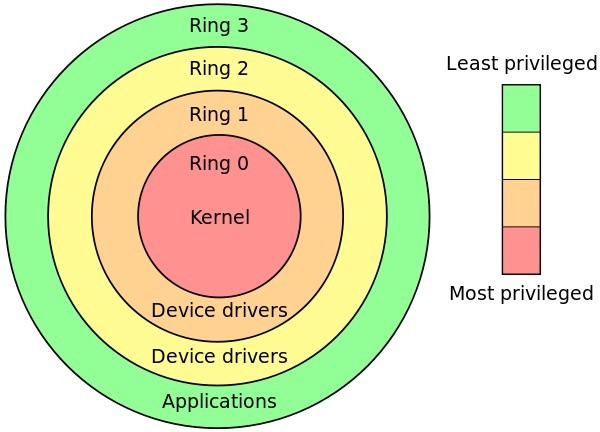

#CPU的上下文切换

我们都知道 Linux 是一个多任务操作系统，它支持的任务同时运行的数量远远大于 CPU 的数量。当然，这些任务实际上并不是同时运行的（Single CPU），而是因为系统在短时间内将 CPU 轮流分配给任务，造成了多个任务同时运行的假象。

## CPU 上下文（CPU Context）

在每个任务运行之前，CPU 需要知道在哪里加载和启动任务。这意味着系统需要提前帮助设置 CPU **寄存器**和**程序计数器**。

CPU 寄存器是内置于 CPU 中的小型但速度极快的内存。程序计数器用于存储 CPU 正在执行的或下一条要执行指令的位置。

它们都是 CPU 在运行任何任务之前必须依赖的依赖环境，因此也被称为 “CPU 上下文”。如下图所示：

知道了 CPU 上下文是什么，我想你理解 **CPU 上下文切换**就很容易了。“CPU上下文切换”指的是先保存上一个任务的 CPU 上下文（CPU寄存器和程序计数器），然后将新任务的上下文加载到这些寄存器和程序计数器中，最后跳转到程序计数器。

这些保存的上下文存储在系统内核中，并在重新安排任务执行时再次加载。这确保了任务的原始状态不受影响，并且任务似乎在持续运行。

## CPU 上下文切换的类型

你可能会说 CPU 上下文切换无非就是更新 CPU 寄存器和程序计数器值，而这些寄存器是为了快速运行任务而设计的，那为什么会影响 CPU 性能呢？

在回答这个问题之前，请问，你有没有想过这些“任务”是什么？你可能会说一个任务就是一个**进程**或者一个**线程**。是的，进程和线程正是最常见的任务，但除此之外，还有其他类型的任务。

别忘了**硬件中断**也是一个常见的任务，硬件触发信号，会引起中断处理程序的调用。

因此，CPU 上下文切换至少有三种不同的类型：

- 进程上下文切换
- 线程上下文切换
- 中断上下文切换

让我们一一来看看。

## 进程上下文切换

Linux 按照特权级别将进程的运行空间划分为内核空间和用户空间，分别对应下图中 `Ring 0` 和 `Ring 3` 的 CPU 特权级别的 。

- **内核空间**（`Ring 0`）拥有最高权限，可以直接访问所有资源
- **用户空间**（`Ring 3`）只能访问受限资源，不能直接访问内存等硬件设备。它必须通过**系统调用**被**陷入（trapped）**内核中才能访问这些特权资源。

从另一个角度看，一个进程既可以在用户空间也可以在内核空间运行。当一个进程在**用户空间**运行时，称为该进程的**用户态**，当它落入**内核空间**时，称为该进程的**内核态**。

从**用户态**到**内核态**的转换需要通过**系统调用**来完成。例如，当我们查看一个文件的内容时，我们需要以下系统调用：

- `open()`：打开文件
- `read()`：读取文件的内容
- `write()`：将文件的内容写入到输出文件（包括标准输出）
- `close()`：关闭文件

那么在上述系统调用过程中是否会发生 CPU 上下文切换呢？当然是的。

这需要先保存 CPU 寄存器中原来的用户态指令的位置。接下来，为了执行内核态的代码，需要将 CPU 寄存器更新到内核态指令的新位置。最后是跳转到内核态运行内核任务。

那么系统调用结束后，CPU 寄存器需要**恢复**原来保存的用户状态，然后切换到用户空间继续运行进程。

> 因此，在一次系统调用的过程中，实际上有两次 CPU 上下文切换。

但需要指出的是，系统调用进程不会涉及进程切换，也不会涉及虚拟内存等系统资源切换。这与我们通常所说的“进程上下文切换”不同。进程上下文切换是指从一个进程切换到另一个进程，而系统调用期间始终运行同一个进程

系统调用过程通常被称为**特权模式切换**，而不是**上下文切换**。但实际上，在系统调用过程中，CPU 的上下文切换也是不可避免的。

### 进程上下文切换 vs 系统调用

那么进程上下文切换和系统调用有什么区别呢？首先，进程是由内核管理的，进程切换只能发生在内核态。因此，进程上下文不仅包括**虚拟内存**、**栈**和**全局变量**等用户空间资源，还包括**内核栈**和**寄存器**等内核空间的状态。

所以**进程上下文切换**比**系统调用**要多出一步：

> 在保存当前进程的内核状态和 CPU 寄存器之前，需要保存进程的虚拟内存、栈等；并加载下一个进程的内核状态。

根据 Tsuna 的测试报告，每次上下文切换需要几十纳秒至微秒的 CPU 时间。这个时间是相当可观的，尤其是在大量进程上下文切换的情况下，很容易导致 CPU 花费大量时间来保存和恢复寄存器、内核栈、虚拟内存等资源。这正是我们在上一篇文章中谈到的，一个导致平均负载上升的重要因素。

那么，该进程何时会被调度/切换到在 CPU 上运行？其实有很多场景，下面我为大家总结一下：

- 当一个进程的 CPU 时间片用完时，它会被系统**挂起**，并切换到其他等待 CPU 运行的进程。
- 当系统资源不足（如内存不足）时，直到资源充足之前，进程无法运行。此时进程也会被**挂起**，系统会调度其他进程运行。
- 当一个进程通过 `sleep` 函数自动**挂起自己**时，自然会被重新调度。
- 当优先级较高的进程运行时，为了保证高优先级进程的运行，当前进程会被高优先级进程**挂起运行**。
- 当发生硬件中断时，CPU 上的进程会被**中断挂起**，转而执行内核中的中断服务程序。

了解这些场景是非常有必要的，因为一旦上下文切换出现性能问题，它们就是幕后杀手。

## 线程上下文切换

线程和进程最大的区别在于，线程是**任务调度**的基本单位，而进程是**资源获取**的基本单位。

说白了，内核中所谓的任务调度，实际的调度对象是线程；而进程只为线程提供虚拟内存和全局变量等资源。所以，对于线程和进程，我们可以这样理解：

- 当一个进程只有一个线程时，可以认为一个进程等于一个线程
- 当一个进程有多个线程时，这些线程共享相同的资源，例如虚拟内存和全局变量。
- 此外，线程也有自己的私有数据，比如栈和寄存器，在上下文切换时也需要保存。

这样，线程的上下文切换其实可以分为两种情况：

- 首先，前后两个线程属于不同的进程。此时，由于资源不共享，切换过程与进程上下文切换相同。
- 其次，前后两个线程属于同一个进程。此时，由于虚拟内存是共享的，所以切换时虚拟内存的资源保持不变，只需要切换线程的私有数据、寄存器等未共享的数据。

显然，同一个进程内的线程切换比切换多个进程消耗的资源要少。这也是多线程替代多进程的优势。

## 中断上下文切换

除了前面两种上下文切换之外，还有另外一种场景也输出 CPU 上下文切换的，那就是**中断**。

为了快速响应事件，硬件中断会中断正常的调度和执行过程，进而调用**中断处理程序**。

在中断其他进程时，需要保存进程的当前状态，以便中断后进程仍能从原始状态恢复。

与进程上下文不同，中断上下文切换不涉及进程的用户态。因此，即使中断进程中断了处于用户态的进程，也不需要保存和恢复进程的虚拟内存、全局变量等用户态资源。

另外，和进程上下文切换一样，中断上下文切换也会消耗 CPU。过多的切换次数会消耗大量的 CPU 资源，甚至严重降低系统的整体性能。因此，当您发现中断过多时，需要注意排查它是否会对您的系统造成严重的性能问题。

## 结论

综上所述，无论哪种场景导致上下文切换，你都应该知道：

CPU 上下文切换是保证 Linux 系统正常运行的核心功能之一，一般不需要我们特别关注。

但是过多的上下文切换会消耗 CPU 的时间来保存和恢复寄存器、内核栈、虚拟内存等数据，从而缩短进程的实际运行时间，导致系统整体性能显着下降。