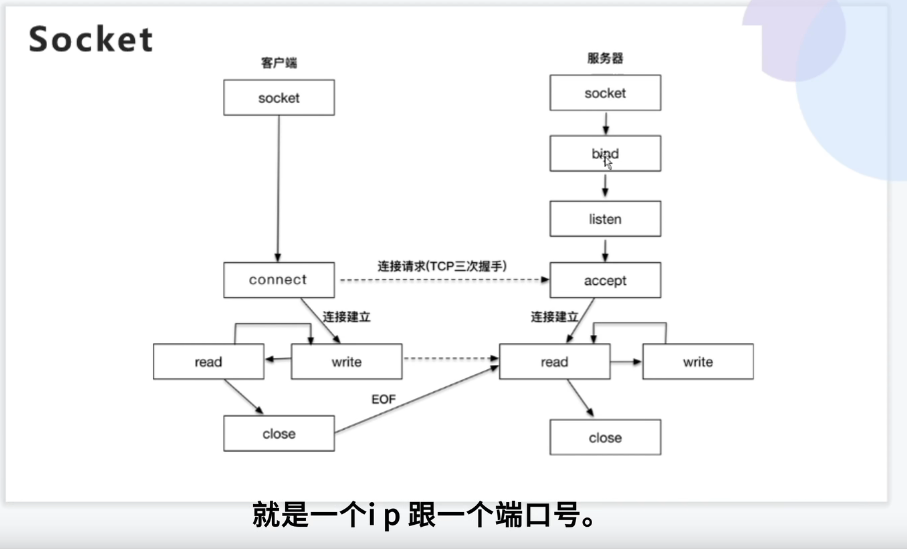
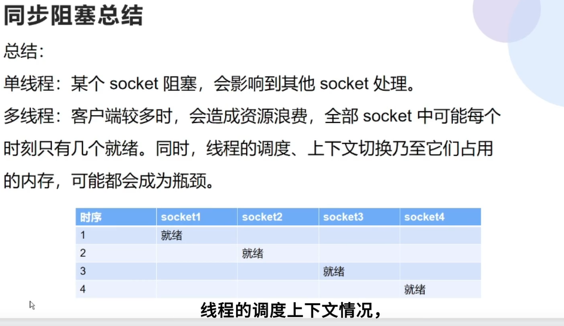
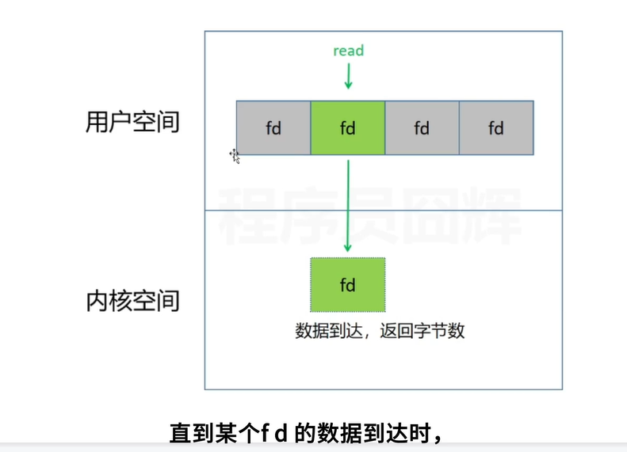
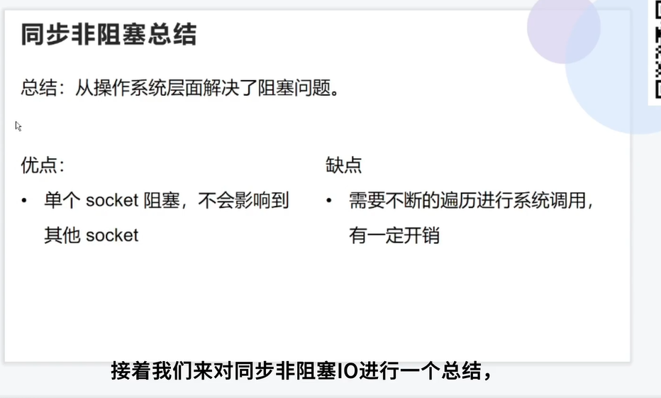
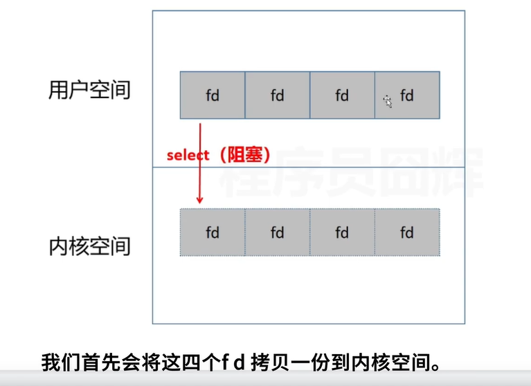
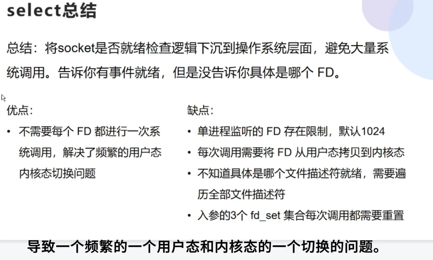
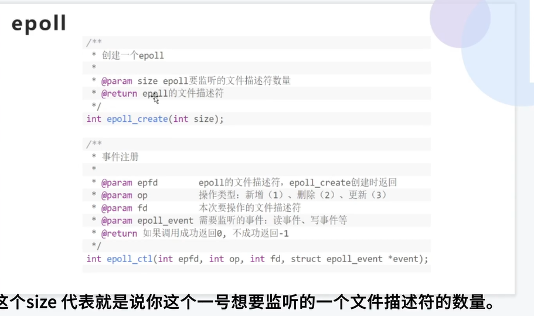
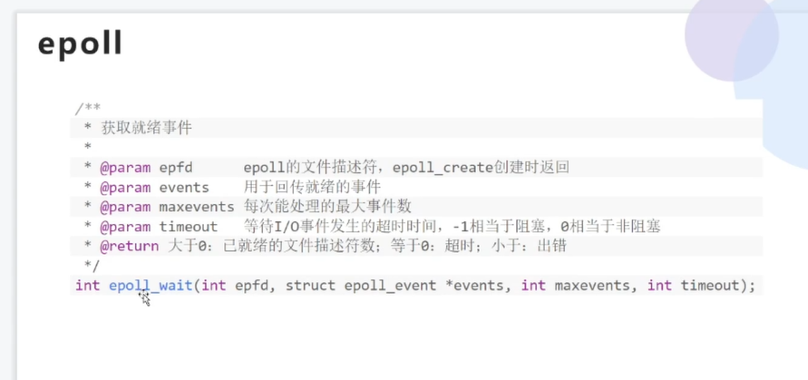
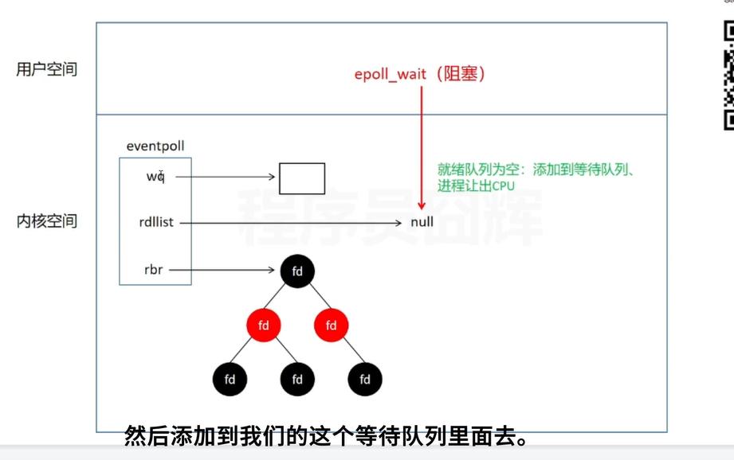
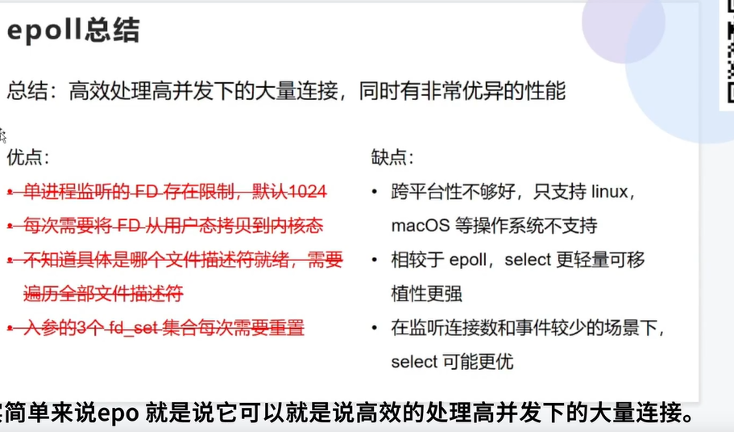

# IO模型

>
>
>linux一切资源都是通过文件的方式访问和管理；FD就是一个文件索引，指向某一个资源；内核通过fd来访问资源；


### 异步，同步；

>回调方式不一样；


#### 同步：

通过轮询的方式；

#### 异步

通过回调，通知的方式；


 **实际上同步与异步是针对应用程序与内核的交互而言的。同步过程中进程触发IO操作并等待(也就是我们说的阻塞)或者轮询的去查看IO操作(也就是我们说的非阻塞)是否完成。 异步过程中进程触发IO操作以后，直接返回，做自己的事情，IO交给内核来处理，完成后内核通知进程IO完成。**


###阻塞，非阻塞；

>是否继续向下运行；


### 文件描述符；fd；

文件描述符（File descriptor）是计算机科学中的一个术语，是一个用于表述指向文件的引用的抽象化概念。

<font color=red>**linux中的一切资源都可以通过文件的方式访问和管理；**</font>

**FD 就是文件的索引和符号，指向某一个资源，内核就是通过FD来访问和管理资源；**

文件描述符在形式上是一个非负整数。**实际上，它是一个索引值，指向内核为每一个进程所维护的该进程打开文件的记录表。当程序打开一个现有文件或者创建一个新文件时，内核向进程返回一个文件描述符。**  **当我们去操作这些文件的时候直接通过文件描述符来操作；**在程序设计中，一些涉及底层的程序编写往往会围绕着文件描述符展开。但是文件描述符这一概念往往只适用于UNIX、Linux这样的操作系统。


注:什么是单工、半双工、全工通信？

信息只能单向传送为单工；

信息能双向传送但不能同时双向传送称为半双工；

信息能够同时双向传送则称为全双工。


### socket





socket eof 就是一个结束的常量 -1  而不是一个字符，因为

**EOF 是 end of file 的缩写，表示”文字流”([stream](https://so.csdn.net/so/search?q=stream&spm=1001.2101.3001.7020))的结尾。这里的”文字流”，可以是文件(file)，也可以是标准输入(stdin)。**

**EOF 是一个常量而不是一个字符！。**


### 同步阻塞

```shell
# code  server  
#注意 这里有两个 fd 一个是listen_fd监听 fd  另外一个就是建立连接之后的fd；tcp fd；
int listen_fd = socket(domain，type，protocol);
bind(listen_fd,my_addr,children);# 绑定端口
listen(listen_fd,backlog);

while(1){
# 会被阻塞；tcp连接；当我们对他进行操作 read write 写入数据和读取数据
accept_fd = accept(listen_fd,addr,addrlen); 
read(accept_fd,buf,nbyte);#  会被阻塞会阻塞后面的线程或者进程；没有数据会被阻塞到这里；
logicHandle(buf);
}


# 只有处理完一个客户端才会处理下一个客户端；
#code client1
int fd = socket(domain,type,protocol);
#会被阻塞主；
connect(fd,server_addr,addrlen);
write(fd,buf,nbyte);
#code client2 
int fd = socket(domain,type,protocol);
#会被阻塞主；
connect(fd,server_addr,addrlen);
write(fd,buf,nbyte);

```

**总结：**

**单线程**，某一个socket会被  阻塞，会影响到其他的socket处理；

**多线程**（**多进程**），客户端较多时，会造成资源的浪费，**全部的socket可能只有几个需要去处理**，同时线程的调度，上下文切换，乃至占用的内存，都有可能会成为瓶颈；





### 同步非 阻塞； （用户去主动的轮询文件描述符）

在用户态 不断去 遍历，但是会存在当没有任何的 fd就绪的时候，需要大量的无效的遍历；


**操作系统的底层知识：** 用户态和内核态，主要是为了防止一些应用程序瞎搞，把操作系统搞挂了，一般牵扯到资源一般都会发生系统调用，用户态到内核态的切换；

用户态到内核态的切换流程：

例如read，首先内核先从网卡copy 到socket缓冲区（内核态内），然后再从内核空间copy到用户空间；

write 相反，需要先从用户空间copy到内核态，然后到网卡；




流程：这里有四个socket连接fd，我们用户态回去挨个去遍历read，当返回  -1 那么直接对下一个fd遍历，直到有数据返回的时候，然后进行后续的逻辑处理；


**非阻塞IO和阻塞IO的 最大区别是，当调用accept 和read 系统调用的时候，如果没有就绪的事件的时，非阻塞IO会直接返回，而不是阻塞住；**

````shell
#code server
#accept_fd != -1 就代表没有socket就绪；
#accept_fd ==  非负值，代表有socket就绪；
while(1){
	setNonblocking(listen_fd);
	accept_fd= accept(listen_fd,addr,addrlen);
	if(accept_fd>0){
		fd_list.add(fd);
	}
}

#code client 
int fd = socket(domain,type,protocol);
connect(fd,serv_addr,addrlen);

````

总结：从操作系统层面解决了阻塞的问题 ；

**优点： 不会阻塞到后面的socket；单个socket的阻塞不会影响到其他的 socket；**

**缺点：需要频繁的去系统调用去查看有没有accept或者read去检查数据有没有到到来；当socket特别多的时候会有很大的开销；**

​		    **当没有数据到来的时候，相当于是在空转；**





### select/poll（ 内核还是需要主动去轮询文件描述符；）

>其实select  和epoll 就是获取那个文件描述符read触发了写事件；
>
>然后用read 直接去取数据就可以了；

为了解决**非阻塞IO的频繁系统调用**问题；所以出现了select；

````shell
hnt select(int nfds, fd_set *readfds, fd_set *writefds,
                  fd_set *exceptfds, struct timeval *timeout);
 #nfds  监听的文件描述符数量的大小
 #fd_set 代表是文件描述符的集合；需要去监听的文件描述符；
 #return int 返回的是就绪的socket 数目；
````



优点： **不需要每个FD都进行一次系统调用，解决了频繁的用户态内核态切换问题；**（会赋值一个 需要监听的fd集合到内核态；然后内核去监听这个fd集合；）




select 缺点：

* 单进程监听的fd存在限制，默认1024；（poll解决了整个问题；）

* 每次需要将FD集合从用户态拷贝到内核态；  copy的开销；从用户态到内核态的开销；

* **不知道具体那个fd就绪，需要在用户态遍历全部的文件描述符；**

* fd_set 每次需要重置；（poll 解决）

  

**内核需要将消息传递到用户空间，都需要内核拷贝动作。需要维护一个用来存放大量fd的数据结构，使得用户空间和内核空间在传递该结构时复制开销大。**

- 每次调用select，都需把fd集合从用户态拷贝到内核态，fd很多时开销就很大i 很大
- 同时每次调用select都需在内核遍历传递进来的所有fd，fd很多时开销就很大 还需要去便利  很大；
- select支持的文件描述符数量太小了，默认最大支持1024个
- 主动轮询效率很低
- select  返回的数据仅仅是一个  int 发生


会有一个fd的集合；然后在内核遍历，当有返回的时候直接返回为就绪的socket的数目；

然后用户态进行遍历就好了；

### poll解决的问题；


 **管理多个描述符也是进行轮询，根据描述符的状态进行处理，但poll没有最大文件描述符数量的限制---没有最大连接数限制，因其基于链表存储**


**可以监听更多的文件描述符；解决了1024的限制；**

**不需要重置文件描述符的集合；**


###epoll；

**epoll模型修改主动轮询为被动通知，当有事件发生时，被动接收通知。所以epoll模型注册套接字后，主程序可做其他事情，当事件发生时，接收到通知后再去处理。**

可理解为**event poll**，epoll会把哪个流发生哪种I/O事件通知我们。所以epoll是事件驱动（每个事件关联fd），此时我们对这些流的操作都是有意义的。复杂度也降到O(1)。

返回具体的fd，直接用户态读取fd的信息就可以了，不需要在用户态再去遍历；

````shell
#code epoll
#创建一个epoll
#size  epoll要监听的文件描述符的数量；
#@return epoll的文件描述符；
int epoll_create(int size);  


#事件的注册；ctl  control 控制； 
#@epfd epoll的文件描述符，epoll_create的返回；
#@op 操作类型，1 add  2 delete 3 update
#@fd本次要操作的文件描述符；
#@epoll_event 要监听的事件  read  write；
#@return 成功 0 失败-1；
 int epoll_ctl(int epfd, int op, int fd, struct epoll_event *event);


#获取就绪事件
#@epoll_event 回传就绪的事件；
#@return 已经就绪的文件描述符数目；
# 值成功时，epoll_wait() 返回为请求的 I/O 准备好的文件描述符的数量，如果在请求的超时毫秒内没有文件描述符准备好，则返回零。 发生错误时，epoll_wait() 返回 -1
  int epoll_wait(int epfd, struct epoll_event *events,
                      int maxevents, int timeout)
#当epoll_wait >1  会去 rdllist去获取就绪的fd；
#当 rdllist 是null，那么就会被阻塞；
````







**epoll_create 创建一个数据结构；eventpoll；**

* rbr 就是监听的fd；是一个红黑树，可有快速的添加删除和遍历；
* rdllist  记录的是已经就绪的fd；
* wq；等待队列；




epoll的优缺点：

**总结：高效处理高并发的大量连接；**

**优点：** 

* **直到具体的那些文件描述符就绪；**

**缺点：**

* 跨平台不好，仅仅支持linux 和macOS；
* **相比较于epoll，select更加轻量级可移植性更强；**
* **监听的连接数和事件比较少情况下，select更加优；**





###用户态切换到内核态的消耗？


https://www.cnblogs.com/aspirant/p/6877350.html?utm_source=itdadao&utm_medium=referral


IO复用,AIO,BIO,NIO,同步，异步，阻塞和非阻塞 区别(百度)
还有一篇：聊聊BIO，NIO和AIO (1)

如果面试问到IO操作，这篇文章提到的问题，基本是必问，百度的面试官问我三个问题

(1)什么是NIO(Non-blocked IO),AIO,BIO

(2) java IO 与 NIO(New IO)的区别

(3)select 与 epoll,poll区别

我胡乱说了一气，自己边说边觉得完蛋了。果然，二面没过，很简单的问题，回来后赶紧作了总结：

一、什么是socket？什么是I/O操作？ 
我们都知道unix(like)世界里，一切皆文件，而文件是什么呢？文件就是一串二进制流而已，不管socket,还是FIFO、管道、终端，对我们来说，一切都是文件，一切都是流。在信息 交换的过程中，我们都是对这些流进行数据的收发操作，简称为I/O操作(input and output)，往流中读出数据，系统调用read，写入数据，系统调用write。不过话说回来了 ，计算机里有这么多的流，我怎么知道要操作哪个流呢？对，就是文件描述符，即通常所说的fd，一个fd就是一个整数，所以，对这个整数的操作，就是对这个文件（流）的操作。我们创建一个socket,通过系统调用会返回一个文件描述符，那么剩下对socket的操作就会转化为对这个描述符的操作。不能不说这又是一种分层和抽象的思想。

二、同步异步，阻塞非阻塞区别联系

    实际上同步与异步是针对应用程序与内核的交互而言的。同步过程中进程触发IO操作并等待(也就是我们说的阻塞)或者轮询的去查看IO操作(也就是我们说的非阻塞)是否完成。 异步过程中进程触发IO操作以后，直接返回，做自己的事情，IO交给内核来处理，完成后内核通知进程IO完成。

同步和异步针对应用程序来说，关注的是程序中间的协作关系；阻塞与非阻塞更关注的是单个进程的执行状态。

同步有阻塞和非阻塞之分，异步没有，它一定是非阻塞的。

阻塞、非阻塞、多路IO复用，都是同步IO，异步必定是非阻塞的，所以不存在异步阻塞和异步非阻塞的说法。真正的异步IO需要CPU的深度参与。换句话说，只有用户线程在操作IO的时候根本不去考虑IO的执行全部都交给CPU去完成，而自己只等待一个完成信号的时候，才是真正的异步IO。所以，拉一个子线程去轮询、去死循环，或者使用select、poll、epool，都不是异步。

同步：执行一个操作之后，进程触发IO操作并等待(也就是我们说的阻塞)或者轮询的去查看IO操作(也就是我们说的非阻塞)是否完成，等待结果，然后才继续执行后续的操作。

异步：执行一个操作后，可以去执行其他的操作，然后等待通知再回来执行刚才没执行完的操作。

阻塞：进程给CPU传达一个任务之后，一直等待CPU处理完成，然后才执行后面的操作。

非阻塞：进程给CPU传达任我后，继续处理后续的操作，隔断时间再来询问之前的操作是否完成。这样的过程其实也叫轮询。

我认为， 同步与异步的根本区别是：

(1) 这是 BIO，同步阻塞的模型，下面也有，


由上面的图可以看出，IO读分为两部分，(a)是数据通过网关到达内核，内核准备好数据，(b)数据从内核缓存写入用户缓存。

同步：不管是BIO,NIO,还是IO多路复用，第二步数据从内核缓存写入用户缓存一定是由 用户线程自行读取数据，处理数据。

异步：第二步数据是内核写入的，并放在了用户线程指定的缓存区，写入完毕后通知用户线程。

 

二、阻塞？
什么是程序的阻塞呢？想象这种情形，比如你等快递，但快递一直没来，你会怎么做？有两种方式：

快递没来，我可以先去睡觉，然后快递来了给我打电话叫我去取就行了。
快递没来，我就不停的给快递打电话说：擦，怎么还没来，给老子快点，直到快递来。
很显然，你无法忍受第二种方式，不仅耽搁自己的时间，也会让快递很想打你。
而在计算机世界，这两种情形就对应阻塞和非阻塞忙轮询。

非阻塞忙轮询：数据没来，进程就不停的去检测数据，直到数据来。
阻塞：数据没来，啥都不做，直到数据来了，才进行下一步的处理。
先说说阻塞，因为一个线程只能处理一个套接字的I/O事件，如果想同时处理多个，可以利用非阻塞忙轮询的方式,伪代码如下： 

复制代码
while true  
{  
    for i in stream[]  
    {  
        if i has data  
        read until unavailable  
    }  
}  
复制代码
我们只要把所有流从头到尾查询一遍，就可以处理多个流了，但这样做很不好，因为如果所有的流都没有I/O事件，白白浪费CPU时间片。正如有一位科学家所说，计算机所有的问题都可以增加一个中间层来解决，同样，为了避免这里cpu的空转，我们不让这个线程亲自去检查流中是否有事件，而是引进了一个代理(一开始是select,后来是poll)，这个代理很牛，它可以同时观察许多流的I/O事件，如果没有事件，代理就阻塞，线程就不会挨个挨个去轮询了，伪代码如下：  

复制代码
while true  
{  
    select(streams[]) //这一步死在这里，知道有一个流有I/O事件时，才往下执行  
    for i in streams[]  
    {  
        if i has data  
        read until unavailable  
    }  
}  
复制代码
 但是依然有个问题，我们从select那里仅仅知道了，有I/O事件发生了，却并不知道是哪那几个流（可能有一个，多个，甚至全部），我们只能无差别轮询所有流，找出能读出数据，或者写入数据的流，对他们进行操作。所以select具有O(n)的无差别轮询复杂度，同时处理的流越多，无差别轮询时间就越长。

epoll可以理解为event poll，不同于忙轮询和无差别轮询，epoll会把哪个流发生了怎样的I/O事件通知我们。所以我们说epoll实际上是事件驱动（每个事件关联上fd）的，此时我们对这些流的操作都是有意义的。（复杂度降低到了O(1)）伪代码如下：

复制代码
while true  
{  
    active_stream[] = epoll_wait(epollfd)  
    for i in active_stream[]  
    {  
        read or write till  
    }  
}  
复制代码
可以看到，select和epoll最大的区别就是：select只是告诉你一定数目的流有事件了，至于哪个流有事件，还得你一个一个地去轮询，而epoll会把发生的事件告诉你，通过发生的事件，就自然而然定位到哪个流了。不能不说epoll跟select相比，是质的飞跃，我觉得这也是一种牺牲空间，换取时间的思想，毕竟现在硬件越来越便宜了。

更详细的Select,poll,epoll 请参考：select、poll、epoll之间的区别(搜狗面试)

三、I/O多路复用
好了，我们讲了这么多，再来总结一下，到底什么是I/O多路复用。
先讲一下I/O模型：
首先，输入操作一般包含两个步骤：

**等待数据准备好（waiting for data to be ready）。对于一个套接口上的操作，这一步骤关系到数据从网络到达，并将其复制到内核的某个缓冲区。**

**将数据从内核缓冲区复制到进程缓冲区（copying the data from the kernel to the process）。**

其次了解一下常用的3种I/O模型：

1、阻塞I/O模型(BIO)
最广泛的模型是阻塞I/O模型，默认情况下，所有套接口都是阻塞的。 进程调用recvfrom系统调用，整个过程是阻塞的，直到数据复制到进程缓冲区时才返回（当然，系统调用被中断也会返回）。 **睡眠就是阻塞；**


2、非阻塞I/O模型(NIO)
当我们把一个套接口设置为非阻塞时，就是在告诉内核，当请求的I/O操作无法完成时，不要将进程睡眠，而是返回一个错误。当数据没有准备好时，内核立即返回EWOULDBLOCK错误，第四次调用系统调用时，数据已经存在，这时将数据复制到进程缓冲区中。这其中有一个操作时轮询（polling）。


3、I/O复用模型

此模型用到select和poll函数，这两个函数也会使进程阻塞，select先阻塞，有活动套接字才返回，但是和阻塞I/O不同的是，这两个函数可以同时阻塞多个I/O操作，而且可以同时对多个读操作，多个写操作的I/O函数进行检测，直到有数据可读或可写（就是监听多个socket）。select被调用后，进程会被阻塞，内核监视所有select负责的socket，当有任何一个socket的数据准备好了，select就会返回套接字可读，我们就可以调用recvfrom处理数据。
正因为阻塞I/O只能阻塞一个I/O操作，而I/O复用模型能够阻塞多个I/O操作，所以才叫做多路复用。


 

4、信号驱动I/O模型（signal driven I/O， SIGIO）

　　首先我们允许套接口进行信号驱动I/O,并安装一个信号处理函数，进程继续运行并不阻塞。当数据准备好时，进程会收到一个SIGIO信号，可以在信号处理函数中调用I/O操作函数处理数据。当数据报准备好读取时，内核就为该进程产生一个SIGIO信号。我们随后既可以在信号处理函数中调用recvfrom读取数据报，并通知主循环数据已准备好待处理，也可以立即通知主循环，让它来读取数据报。无论如何处理SIGIO信号，这种模型的优势在于等待数据报到达(第一阶段)期间，进程可以继续执行，不被阻塞。免去了select的阻塞与轮询，当有活跃套接字时，由注册的handler处理。


5、异步I/O模型(AIO, asynchronous I/O)

　　进程发起read操作之后，立刻就可以开始去做其它的事。而另一方面，从kernel的角度，当它受到一个asynchronous read之后，首先它会立刻返回，所以不会对用户进程产生任何block。然后，kernel会等待数据准备完成，然后将数据拷贝到用户内存，当这一切都完成之后，kernel会给用户进程发送一个signal，告诉它read操作完成了。

　　这个模型工作机制是：告诉内核启动某个操作，并让内核在整个操作(包括第二阶段，即将数据从内核拷贝到进程缓冲区中)完成后通知我们。

这种模型和前一种模型区别在于：信号驱动I/O是由内核通知我们何时可以启动一个I/O操作，而异步I/O模型是由内核通知我们I/O操作何时完成。


高性能IO模型浅析  

服务器端编程经常需要构造高性能的IO模型，常见的IO模型有四种：

（1）同步阻塞IO（Blocking IO）：即传统的IO模型。

（2）同步非阻塞IO（Non-blocking IO）：默认创建的socket都是阻塞的，非阻塞IO要求socket被设置为NONBLOCK。注意这里所说的NIO并非Java的NIO（New IO）库。

（3）IO多路复用（IO Multiplexing）：即经典的Reactor设计模式，Java中的Selector和Linux中的epoll都是这种模型。

（4）异步IO（Asynchronous IO）：即经典的Proactor设计模式，也称为异步非阻塞IO。 

为了方便描述，我们统一使用IO的读操作作为示例。 

一、同步阻塞IO 

同步阻塞IO模型是最简单的IO模型，用户线程在内核进行IO操作时被阻塞。


图1 同步阻塞IO

如图1所示，用户线程通过系统调用read发起IO读操作，由用户空间转到内核空间。内核等到数据包到达后，然后将接收的数据拷贝到用户空间，完成read操作。

用户线程使用同步阻塞IO模型的伪代码描述为：

复制代码
{

read(socket, buffer);

process(buffer);

}
复制代码
 即用户需要等待read将socket中的数据读取到buffer后，才继续处理接收的数据。整个IO请求的过程中，用户线程是被阻塞的，这导致用户在发起IO请求时，不能做任何事情，对CPU的资源利用率不够。 

二、同步非阻塞IO 

同步非阻塞IO是在同步阻塞IO的基础上，将socket设置为NONBLOCK。这样做用户线程可以在发起IO请求后可以立即返回。

 

图2 同步非阻塞IO

如图2所示，由于socket是非阻塞的方式，因此用户线程发起IO请求时立即返回。但并未读取到任何数据，用户线程需要不断地发起IO请求，直到数据到达后，才真正读取到数据，继续执行。

用户线程使用同步非阻塞IO模型的伪代码描述为：

复制代码
{

while(read(socket, buffer) != SUCCESS)

;

process(buffer);

}
复制代码


即用户需要不断地调用read，尝试读取socket中的数据，直到读取成功后，才继续处理接收的数据。整个IO请求的过程中，虽然用户线程每次发起IO请求后可以立即返回，但是为了等到数据，仍需要不断地轮询、重复请求，消耗了大量的CPU的资源。一般很少直接使用这种模型，而是在其他IO模型中使用非阻塞IO这一特性。

 

三、IO多路复用

IO多路复用模型是建立在内核提供的多路分离函数select基础之上的，使用select函数可以避免同步非阻塞IO模型中轮询等待的问题。


图3 多路分离函数select

如图3所示，用户首先将需要进行IO操作的socket添加到select中，然后阻塞等待select系统调用返回。当数据到达时，socket被激活，select函数返回。用户线程正式发起read请求，读取数据并继续执行。

从流程上来看，使用select函数进行IO请求和同步阻塞模型没有太大的区别，甚至还多了添加监视socket，以及调用select函数的额外操作，效率更差。但是，使用select以后最大的优势是用户可以在一个线程内同时处理多个socket的IO请求。用户可以注册多个socket，然后不断地调用select读取被激活的socket，即可达到在同一个线程内同时处理多个IO请求的目的。而在同步阻塞模型中，必须通过多线程的方式才能达到这个目的。

用户线程使用select函数的伪代码描述为：

复制代码
{

select(socket);

while(1) {

sockets = select();

for(socket in sockets) {

if(can_read(socket)) {

read(socket, buffer);

process(buffer);

}

}

}

}
复制代码
 其中while循环前将socket添加到select监视中，然后在while内一直调用select获取被激活的socket，一旦socket可读，便调用read函数将socket中的数据读取出来。 

然而，使用select函数的优点并不仅限于此。虽然上述方式允许单线程内处理多个IO请求，但是每个IO请求的过程还是阻塞的（在select函数上阻塞），平均时间甚至比同步阻塞IO模型还要长。如果用户线程只注册自己感兴趣的socket或者IO请求，然后去做自己的事情，等到数据到来时再进行处理，则可以提高CPU的利用率。

IO多路复用模型使用了Reactor设计模式实现了这一机制。


图4 Reactor设计模式

如图4所示，EventHandler抽象类表示IO事件处理器，它拥有IO文件句柄Handle（通过get_handle获取），以及对Handle的操作handle_event（读/写等）。继承于EventHandler的子类可以对事件处理器的行为进行定制。Reactor类用于管理EventHandler（注册、删除等），并使用handle_events实现事件循环，不断调用同步事件多路分离器（一般是内核）的多路分离函数select，只要某个文件句柄被激活（可读/写等），select就返回（阻塞），handle_events就会调用与文件句柄关联的事件处理器的handle_event进行相关操作。


图5 IO多路复用

如图5所示，通过Reactor的方式，可以将用户线程轮询IO操作状态的工作统一交给handle_events事件循环进行处理。用户线程注册事件处理器之后可以继续执行做其他的工作（异步），而Reactor线程负责调用内核的select函数检查socket状态。当有socket被激活时，则通知相应的用户线程（或执行用户线程的回调函数），执行handle_event进行数据读取、处理的工作。由于select函数是阻塞的，因此多路IO复用模型也被称为异步阻塞IO模型。注意，这里的所说的阻塞是指select函数执行时线程被阻塞，而不是指socket。一般在使用IO多路复用模型时，socket都是设置为NONBLOCK的，不过这并不会产生影响，因为用户发起IO请求时，数据已经到达了，用户线程一定不会被阻塞。

用户线程使用IO多路复用模型的伪代码描述为：

复制代码
void UserEventHandler::handle_event() {

if(can_read(socket)) {

read(socket, buffer);

process(buffer);

}

}

 

{

Reactor.register(new UserEventHandler(socket));

}
复制代码


用户需要重写EventHandler的handle_event函数进行读取数据、处理数据的工作，用户线程只需要将自己的EventHandler注册到Reactor即可。Reactor中handle_events事件循环的伪代码大致如下。

复制代码
Reactor::handle_events() {

while(1) {

sockets = select();

for(socket in sockets) {

get_event_handler(socket).handle_event();

}

}

}
复制代码
事件循环不断地调用select获取被激活的socket，然后根据获取socket对应的EventHandler，执行器handle_event函数即可。

IO多路复用是最常使用的IO模型，但是其异步程度还不够“彻底”，因为它使用了会阻塞线程的select系统调用。因此IO多路复用只能称为异步阻塞IO，而非真正的异步IO。 

四、异步IO 

“真正”的异步IO需要操作系统更强的支持。在IO多路复用模型中，事件循环将文件句柄的状态事件通知给用户线程，由用户线程自行读取数据、处理数据。而在异步IO模型中，当用户线程收到通知时，数据已经被内核读取完毕，并放在了用户线程指定的缓冲区内，内核在IO完成后通知用户线程直接使用即可。

异步IO模型使用了Proactor设计模式实现了这一机制。


图6 Proactor设计模式

如图6，Proactor模式和Reactor模式在结构上比较相似，不过在用户（Client）使用方式上差别较大。Reactor模式中，用户线程通过向Reactor对象注册感兴趣的事件监听，然后事件触发时调用事件处理函数。而Proactor模式中，用户线程将AsynchronousOperation（读/写等）、Proactor以及操作完成时的CompletionHandler注册到AsynchronousOperationProcessor。AsynchronousOperationProcessor使用Facade模式提供了一组异步操作API（读/写等）供用户使用，当用户线程调用异步API后，便继续执行自己的任务。AsynchronousOperationProcessor 会开启独立的内核线程执行异步操作，实现真正的异步。当异步IO操作完成时，AsynchronousOperationProcessor将用户线程与AsynchronousOperation一起注册的Proactor和CompletionHandler取出，然后将CompletionHandler与IO操作的结果数据一起转发给Proactor，Proactor负责回调每一个异步操作的事件完成处理函数handle_event。虽然Proactor模式中每个异步操作都可以绑定一个Proactor对象，但是一般在操作系统中，Proactor被实现为Singleton模式，以便于集中化分发操作完成事件。


图7 异步IO

如图7所示，异步IO模型中，用户线程直接使用内核提供的异步IO API发起read请求，且发起后立即返回，继续执行用户线程代码。不过此时用户线程已经将调用的AsynchronousOperation和CompletionHandler注册到内核，然后操作系统开启独立的内核线程去处理IO操作。当read请求的数据到达时，由内核负责读取socket中的数据，并写入用户指定的缓冲区中。最后内核将read的数据和用户线程注册的CompletionHandler分发给内部Proactor，Proactor将IO完成的信息通知给用户线程（一般通过调用用户线程注册的完成事件处理函数），完成异步IO。

用户线程使用异步IO模型的伪代码描述为：

复制代码
void UserCompletionHandler::handle_event(buffer) {

process(buffer);

}

 

{

aio_read(socket, new UserCompletionHandler);

}
复制代码
 用户需要重写CompletionHandler的handle_event函数进行处理数据的工作，参数buffer表示Proactor已经准备好的数据，用户线程直接调用内核提供的异步IO API，并将重写的CompletionHandler注册即可。

相比于IO多路复用模型，异步IO并不十分常用，不少高性能并发服务程序使用IO多路复用模型+多线程任务处理的架构基本可以满足需求。况且目前操作系统对异步IO的支持并非特别完善，更多的是采用IO多路复用模型模拟异步IO的方式（IO事件触发时不直接通知用户线程，而是将数据读写完毕后放到用户指定的缓冲区中）。Java7之后已经支持了异步IO，感兴趣的读者可以尝试使用。 

参考：高性能IO模型浅析

参考：什么是IO多路复用，理解IO多路复用

参考：关于同步、异步与阻塞、非阻塞的理解


