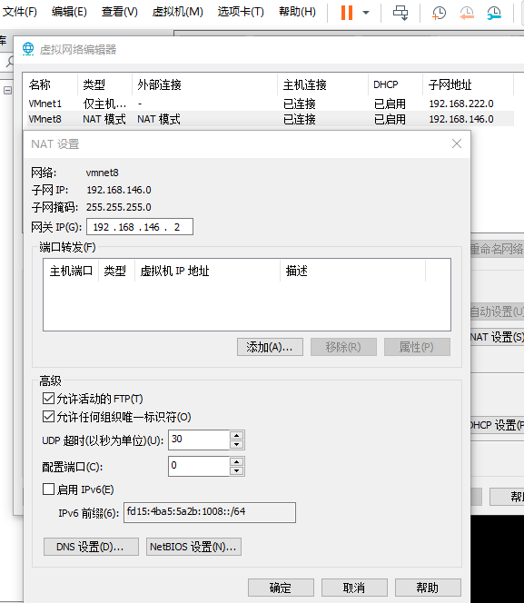
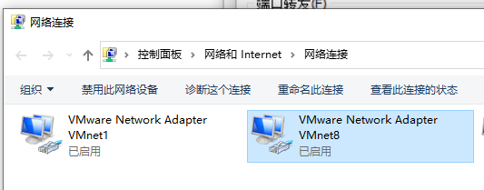

#Route and TraceRoute

> 主要是学习路由知识

命令：

* route
* traceroute(linux) 追踪路由轨迹；windows(tracert)

route 命令

````shell
route add -host 199.199.199.199 dev ens33  
route add -net  192.168.146.0/24 dev ens33 
#-net 设置网络
#-host 直接设置主机
#gw 设置网关 gateway
#dev 用那块网卡 g
#add添加路由  route add -host 199.199.199.199
#del 删除路由  route del -net  192.168.146.0/24
#Flags 参数的意思  U use 在被使用 G 就是网关；
[root@192 ~]# route add -net 192.168.0.0/16 gw 192.168.0.1 dev ens33
[root@192 ~]# route
Kernel IP routing table
Destination     Gatewayng Genmask         Flags Metric Ref    Use Iface
default         192.168.1.1     0.0.0.0         UG    100    0        0 ens33
192.168.0.0     192.168.0.1     255.255.0.0     UG    0      0        0 ens33
192.168.0.0     0.0.0.0         255.255.0.0     U     0      0        0 ens33
192.168.1.0     0.0.0.0         255.255.255.0   U     100    0        0 ens33

````


输入命令

cat /proc/version

显示如下

Linux version 4.10.0-28-generic (buildd@lgw01-12)     linux内核版本号

gcc version 5.4.0                                 gcc编译器版本号

Ubuntu 5.4.0-6ubuntu1                            Ubuntu版本号

uname -a

cat /etc/os-release  发行版本；


### route 查看路由

`````shell
[root@localhost ~]# route
Kernel IP routing table
Destination     Gateway         Genmask         Flags Metric Ref    Use Iface
default         gateway         0.0.0.0         UG    100    0        0 ens33
192.168.146.0   0.0.0.0         255.255.255.0   U     100    0        0 ens33、


# 网卡 docker0 的网卡；
[root@localhost ~]# ifconfig
docker0: flags=4099<UP,BROADCAST,MULTICAST>  mtu 1500
        inet 172.17.0.1  netmask 255.255.0.0  broadcast 0.0.0.0
        ether 02:42:b0:7b:13:02  txqueuelen 0  (Ethernet)
        RX packets 0  bytes 0 (0.0 B)
        RX errors 0  dropped 0  overruns 0  frame 0
        TX packets 0  bytes 0 (0.0 B)
        TX errors 0  dropped 0 overruns 0  carrier 0  collisions 0

ens33: flags=4163<UP,BROADCAST,RUNNING,MULTICAST>  mtu 1500
        inet 192.168.146.30  netmask 255.255.255.0  broadcast 192.168.146.255
        inet6 fe80::8201:1e5f:1853:2326  prefixlen 64  scopeid 0x20<link>
        inet6 fe80::67e4:722b:239f:ae3d  prefixlen 64  scopeid 0x20<link>
        ether 00:0c:29:ae:d2:1a  txqueuelen 1000  (Ethernet)
        RX packets 41872  bytes 2525131 (2.4 MiB)
        RX errors 0  dropped 0  overruns 0  frame 0
        TX packets 4251  bytes 269470 (263.1 KiB)
        TX errors 0  dropped 0 overruns 0  carrier 0  collisions 0

lo: flags=73<UP,LOOPBACK,RUNNING>  mtu 65536
        inet 127.0.0.1  netmask 255.0.0.0
        inet6 ::1  prefixlen 128  scopeid 0x10<host>
        loop  txqueuelen 1000  (Local Loopback)
        RX packets 0  bytes 0 (0.0 B)
        RX errors 0  dropped 0  overruns 0  frame 0
        TX packets 0  bytes 0 (0.0 B)
        TX errors 0  dropped 0 overruns 0  carrier 0  collisions 0
        

#具有docker的网络  docker0 初始的默认网路；
[root@localhost ~]# route 
Kernel IP routing table
Destination     Gateway         Genmask         Flags Metric Ref    Use Iface
default         gateway         0.0.0.0         UG    100    0        0 ens33
172.17.0.0      0.0.0.0         255.255.0.0     U     0      0        0 docker0
192.168.146.0   0.0.0.0         255.255.255.0   U     100    0        0 ens33
#注意 docker 这里的虚拟网卡docker0 就是为了在主机可以访问到虚拟网卡里面
# 这里实现的方式就是NAT 外部访问不到内部，但是内部可以访问到外网，就是利用NAT转换成本机的地址（1）NAT外网的ip来进行上网；

#docker0 网络的具体信息
[root@localhost ~]# docker network inspect a6f22
[
    {
        "Name": "bridge",
        "Id": "a6f22c07270afb759c9c053cbadf9310e69291798c01e0f765325e8b6ff2f58c",
        "Created": "2022-05-19T19:16:59.458721492+08:00",
        "Scope": "local",
        "Driver": "bridge",
        
        "EnableIPv6": false,
        "IPAM": {
            "Driver": "default",
            "Options": null,
            "Config": [
                {
                    "Subnet": "172.17.0.0/16",
                    "Gateway": "172.17.0.1"
                }
            ]
        },
        "Internal": false,
        "Attachable": false,
        "Containers": {},
        "Options": {
            "com.docker.network.bridge.default_bridge": "true",
            "com.docker.network.bridge.enable_icc": "true",
            "com.docker.network.bridge.enable_ip_masquerade": "true",
            "com.docker.network.bridge.host_binding_ipv4": "0.0.0.0",
            "com.docker.network.bridge.name": "docker0",
            "com.docker.network.driver.mtu": "1500"
        },
        "Labels": {}
    }
]
 
 #docker 中的nginx 和虚拟机通信的路由

root@7e2f5d6b7734:/etc/apt# route            
Kernel IP routing table
Destination     Gateway         Genmask         Flags Metric Ref    Use Iface
default         172.17.0.1      0.0.0.0         UG    0      0        0 eth0
172.17.0.0      0.0.0.0         255.255.0.0     U     0      0        0 eth0
root@7e2f5d6b7734:/etc/apt# traceroute 192.168.146.29
traceroute to 192.168.146.29 (192.168.146.29), 30 hops max, 60 byte packets
 1  172.17.0.1 (172.17.0.1)  0.131 ms  0.014 ms  0.010 ms
 2  192.168.146.29 (192.168.146.29)  0.455 ms  0.497 ms  0.650 ms
# 直接走gateway 网关 到了 v8 然后查看v8网络的route 发现就在我们v8的网络里面；

`````


### traceroute  追踪路由的轨迹；


###fixed ip设置？  静态ip设置

`````shell
BOOTPROTO=none
# 一个静态ip只需要这三个参数就够了；
PREFIX=24
IPADDR=192.168.146.29
GATEWAY=192.168.146.2

DNS1=8.8.8.8
DNS2=223.5.5.5
# 然后 重启 网络系统  systemctl restart network
#一定要设置  网关  GATEWAY
`````





`````shell
$ route PRINT -4                                                                         
===========================================================================              
接口列表                                                                                     
 21...3c 52 82 38 b1 94 ......Realtek PCIe GBE Family Controller #2                      
 23...88 78 73 83 1c a7 ......Microsoft Wi-Fi Direct Virtual Adapter                     
 19...8a 78 73 83 1c a6 ......Microsoft Wi-Fi Direct Virtual Adapter #3                  
 22...00 50 56 c0 00 01 ......VMware Virtual Ethernet Adapter for VMnet1                 
  8...00 50 56 c0 00 08 ......VMware Virtual Ethernet Adapter for VMnet8                 
  4...88 78 73 83 1c a6 ......Intel(R) Dual Band Wireless-AC 7265                        
  1...........................Software Loopback Interface 1                              
===========================================================================              
                                                                                         
IPv4 路由表                                                                                 
===========================================================================              
活动路由:                                                                                    
网络目标        网络掩码          网关       接口   跃点数                                              
          0.0.0.0          0.0.0.0      192.168.1.1    192.168.1.103     35              
        127.0.0.0        255.0.0.0            在链路上         127.0.0.1    331              
        127.0.0.1  255.255.255.255            在链路上         127.0.0.1    331              
  127.255.255.255  255.255.255.255            在链路上         127.0.0.1    331              
      192.168.1.0    255.255.255.0            在链路上     192.168.1.103    291              
    192.168.1.103  255.255.255.255            在链路上     192.168.1.103    291              
    192.168.1.255  255.255.255.255            在链路上     192.168.1.103    291              
    192.168.146.0    255.255.255.0            在链路上     192.168.146.1    291              
    192.168.146.1  255.255.255.255            在链路上     192.168.146.1    291              
  192.168.146.255  255.255.255.255            在链路上     192.168.146.1    291              
    192.168.222.0    255.255.255.0            在链路上     192.168.222.1    291              
    192.168.222.1  255.255.255.255            在链路上     192.168.222.1    291              
  192.168.222.255  255.255.255.255            在链路上     192.168.222.1    291              
        224.0.0.0        240.0.0.0            在链路上         127.0.0.1    331              
        224.0.0.0        240.0.0.0            在链路上     192.168.1.103    291              
        224.0.0.0        240.0.0.0            在链路上     192.168.146.1    291              
        224.0.0.0        240.0.0.0            在链路上     192.168.222.1    291              
  255.255.255.255  255.255.255.255            在链路上         127.0.0.1    331              
  255.255.255.255  255.255.255.255            在链路上     192.168.1.103    291              
  255.255.255.255  255.255.255.255            在链路上     192.168.146.1    291              
  255.255.255.255  255.255.255.255            在链路上     192.168.222.1    291              
===========================================================================              
永久路由:                                                                                    
  无       
  #注意：
  网络目标        网络掩码          网关 
  192.168.146.0    255.255.255.0            在链路上     192.168.146.1    291              
  192.168.146.1  255.255.255.255            在链路上     192.168.146.1  他会走这个接口进入到虚拟机网络   291              
  192.168.146.255  255.255.255.255            在链路上     192.168.146.1    291   
  
  #注意 在链路上  代表就是在本网络内；
  #ipconfig 
  #虚拟网卡；虚拟机所包含的；
  #VMware Network Adapter VMnet1：这是Host用于与Host-Only虚拟网络进行通信的虚拟网卡
  #VMware Network Adapter VMnet8：这是Host用于与NAT虚拟网络进行通信的虚拟网卡
  
  以太网适配器 VMware Network Adapter VMnet8:

   连接特定的 DNS 后缀 . . . . . . . :
   本地链接 IPv6 地址. . . . . . . . : fe80::29eb:b15:e027:a641%8
   IPv4 地址 . . . . . . . . . . . . : 192.168.146.1
   子网掩码  . . . . . . . . . . . . : 255.255.255.0
   默认网关. . . . . . . . . . . . . :

无线局域网适配器 WLAN:

   连接特定的 DNS 后缀 . . . . . . . :
   本地链接 IPv6 地址. . . . . . . . : fe80::9d2f:4e7b:a0ff:5ffe%4
   IPv4 地址 . . . . . . . . . . . . : 192.168.1.103
   子网掩码  . . . . . . . . . . . . : 255.255.255.0
   默认网关. . . . . . . . . . . . . : 192.168.1.1

`````


###了解一下 路由器？？？
