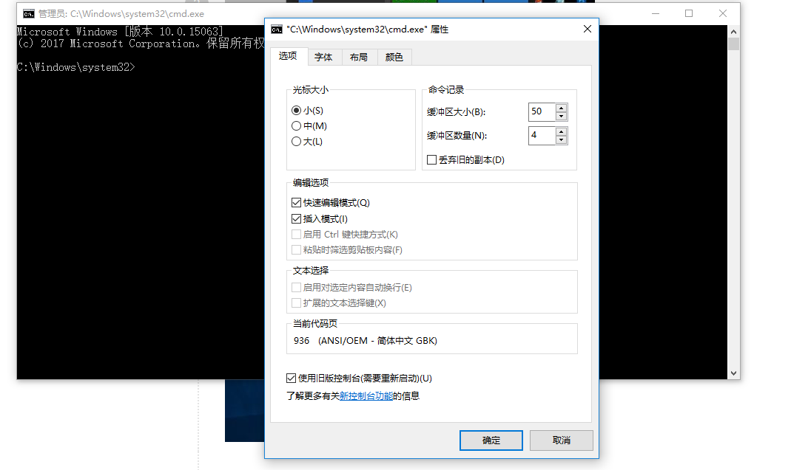
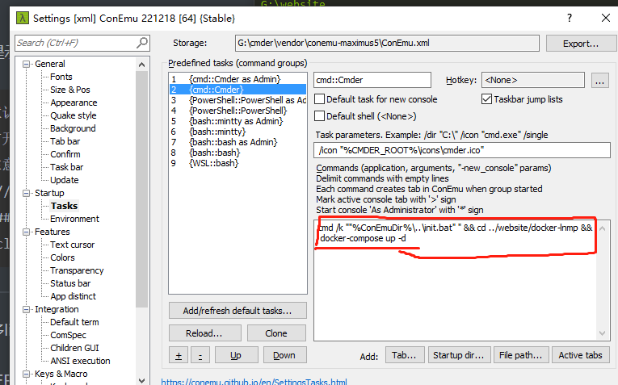
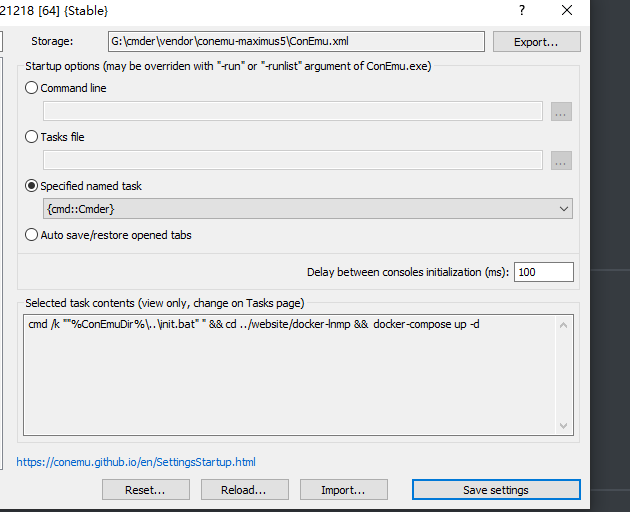
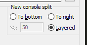

# 最新版本的cmder 的很多bug

---


cmder.app  1.3.20.151

下载最新的；cmder


-----


刚刚安装最新版的win10，发现cmder有个问题，就是新版的光标前面总有一个空格

解决方法：



打开cmd，对其最上栏进行右键

修改为旧版控制台即可！


---


更改提示符：  


```
默认的为λ，改成常用的$
打开cmdervendor目录下面的clink.lua文件，搜索λ，全部替换成$即可！
## 但是我的不可行，所以我就做了下面操作，然后搞定了；
注意 
 //177 行，我也不知大为什么  卧槽 我真的是一脸懵逼；
 ##这样就行了？？？
 clink.prompt.value = string.gsub(prompt, "{lamb}", "$")
```

---

有很多linux的命令不能用的问题；

CMDER_CMD

G:\cmder\vendor\git-for-windows\usr\bin

引入这些命令才能实现；

path %CMDER_CMD%


---

汉字乱码的问题；

没发现 ；汉字乱码的问题；

-----


启动runcommand 命令







---


Another workaround is to uncheck the "Inject ConEmuHk.dll into all processes started in ConEmu tabs" 


option in Settings->General


---


## 分屏

ctrl+T

选择右边 right 就可以了；

split


