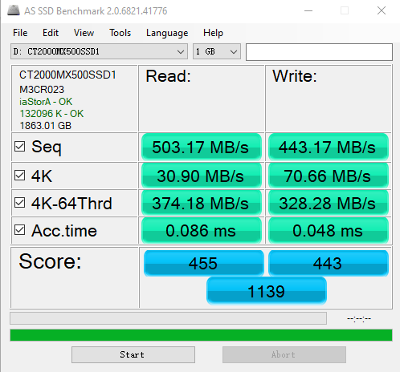
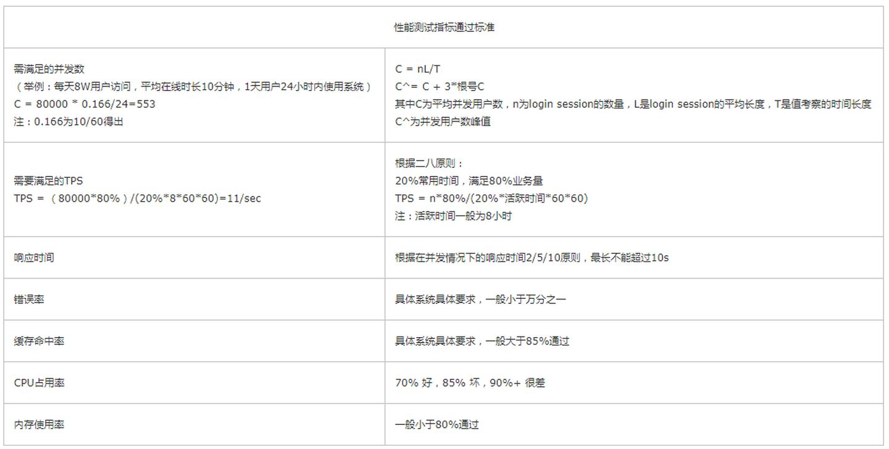

# iowait

> **硬盘的两个指标 ： 一个是响应时间（Response Time），另一个叫作数据传输率（Data Transfer Rate）(吞吐量；)。**
>
> 响应时间 就是rt响应时间，机械硬盘，需要寻道，然后返回数据，肯定需要时间；所以就是响应时间？？？
>
> **//  qps  和 rt 响应时间 http请求的两个指标；**
>
> ----
>
> 
>
> **IOPS 每秒读写次数；**  ====   **可以通过 吞吐量 来计算   每秒的传输率；** 
>
> 每秒的读写次数；每次读写都是4KB； 这就是吞吐量； 
>
> ----
>
> 

​					**2. 吞吐量(Throughput)**   **吞吐量  tps 每秒的吞吐量；**

​					响应时间 RT

　　			响应时间是指系统对请求作出响应的时间


-----


> ---
>
> 




这个指标，**其实就是程序发起一个硬盘的写入请求，直到这个请求返回的时间。**

可以看到，**在上面的两块 SSD 硬盘上，大概时间都是在几十微秒这个级别。如果你去测试一块 HDD 的硬盘，通常会在几毫秒到十几毫秒这个级别。这个性能的差异，就不是 10 倍了，而是在几十倍，乃至几百倍。**


在随机读写的时候，数据传输率也只能到 40MB/s 左右，是顺序读写情况下的几十分之一。

**我们拿这个 40MB/s 和一次读取 4KB 的数据算一下。 这里一般和块是相对的，一般是指4kB；**  

**40MB / 4KB = 10,000**

也就是说，一秒之内，这块 SSD 硬盘可以随机读取 1 万次的 4KB 的数据。如果是写入的话呢，会更多一些，90MB /4KB 差不多是 2 万多次。<font color=red>**这个每秒读写的次数，我们称之为IOPS，也就是每秒输入输出操作的次数。**</font>

事实上，比起响应时间，我们更关注 IOPS 这个性能指标。IOPS 和 DTR（Data Transfer Rate，数据传输率）才是输入输出性能的核心指标。

这是因为，我们在实际的应用开发当中，对于数据的访问，更多的是随机读写，而不是顺序读写。我们平时所说的服务器承受的“并发”，其实是在说，会有很多个不同的进程和请求来访问服务器。自然，它们在硬盘上访问的数据，是很难顺序放在一起的。这种情况下，随机读写的 IOPS 才是服务器性能的核心指标。

好了，回到我们引出 IOPS 这个问题的 HDD 硬盘。我现在要问你了，那一块 HDD 硬盘能够承受的 IOPS 是多少呢？其实我们应该已经在第 36 讲说过答案了。HDD 硬盘的 IOPS 通常也就在 100 左右，而不是在 20 万次。在后面讲解机械硬盘的原理和性能优化的时候，我们还会再来一起看一看，这个 100 是怎么来的，以及我们可以有哪些优化的手段。


## 测试

````php
iostat  // tps == iops;   iops  //每秒的次数多少；
avg-cpu:  %user   %nice %system %iowait  %steal   %idle
          17.02    0.01    2.18    0.04    0.00   80.76
Device:            tps    kB_read/s    kB_wrtn/s    kB_read    kB_wrtn
sda               1.81         2.02        30.87     706768   10777408
````


````php
iotop 
Total DISK READ :       0.00 B/s | Total DISK WRITE :      15.75 K/s
Actual DISK READ:       0.00 B/s | Actual DISK WRITE:      35.44 K/s
  TID  PRIO  USER     DISK READ  DISK WRITE  SWAPIN     IO>    COMMAND                                             
  104 be/3 root        0.00 B/s    7.88 K/s  0.00 %  0.18 % [jbd2/sda1-8]
  383 be/4 root        0.00 B/s    3.94 K/s  0.00 %  0.00 % rsyslogd -n [rs:main Q:Reg]
 1514 be/4 www-data    0.00 B/s    3.94 K/s  0.00 %  0.00 % nginx: worker process
````


````php
// 测试  stress -i 2”，让 stress 这个程序模拟两个进程不停地从内存里往硬盘上写数据。
$ stress -i 2 
    
    
top - 06:56:02 up 3 days, 19:34,  2 users,  load average: 5.99, 1.82, 0.63
Tasks:  88 total,   3 running,  85 sleeping,   0 stopped,   0 zombie
%Cpu(s):  3.0 us, 29.9 sy,  0.0 ni,  0.0 id, 67.2 wa,  0.0 hi,  0.0 si,  0.0 st
KiB Mem :  1741304 total,  1004404 free,   307152 used,   429748 buff/cache
KiB Swap:        0 total,        0 free,        0 used.  1245700 avail Mem 
````


-----


----




qps  =  

怎么从 pv 计算qps  

TPS  

(1000000 pv * 0.8) / (0.2\*8\*60*60)


694  500w pv 需要qps 可以每秒处理500w的请求；


-----


原理：每天80%的访问集中在20%的时间里，这20%时间叫做峰值时间。

**公式：( 总PV数 * 80% ) / ( 每天秒数 * 20% ) = 峰值时间每秒请求数(QPS) 。**

机器：峰值时间每秒QPS / 单台机器的QPS = 需要的机器 。

假设每天500w PV 的在单台机器上，这台机器需要多少QPS？

**( 5000000 * 0.8 ) / (86400 * 0.2 ) = 232 (QPS)。**

一般需要达到232QPS，因为是峰值。

**如果一台机器的QPS是80，需要几台机器来支持？ 232 / 80 = 2.9 = 3**

---

