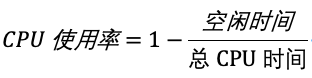

# linux的性能分析


**CPU 性能**、**磁盘 I/O 性能**、**内存性能**以及**网络性能**


主要从这四个方面来进行分析；


Linux 通过 /proc 虚拟文件系统，向用户空间提供了系统内部状态的信息，而 /proc/stat 提供的就是系统的 CPU 和任务统计信息。比方说，如果你只关注 CPU 的话，可以执行下面的命令：

`````shell

# 只保留各个CPU的数据
$ cat /proc/stat | grep ^cpu
cpu  280580 7407 286084 172900810 83602 0 583 0 0 0
cpu0 144745 4181 176701 86423902 52076 0 301 0 0 0
cpu1 135834 3226 109383 86476907 31525 0 282 0 0 0
`````


这里的输出结果是一个表格。其中，第一列表示的是 CPU 编号，如 cpu0、cpu1 ，而第一行没有编号的 cpu ，表示的是所有 CPU 的累加。其他列则表示不同场景下 CPU 的累加节拍数，它的单位是 USER_HZ，也就是 10 ms（1/100 秒），所以这其实就是不同场景下的 CPU 时间。

当然，这里每一列的顺序并不需要你背下来。你只要记住，有需要的时候，查询 man proc 就可以。不过，你要清楚 man proc 文档里每一列的涵义，它们都是 CPU 使用率相关的重要指标，你还会在很多其他的性能工具中看到它们。下面，我来依次解读一下。

**user（通常缩写为 us），代表用户态 CPU 时间。注意，它不包括下面的 nice 时间，但包括了 guest 时间。**

nice（通常缩写为 ni），代表低优先级用户态 CPU 时间，也就是进程的 nice 值被调整为 1-19 之间时的 CPU 时间。这里注意，nice 可取值范围是 -20 到 19，数值越大，优先级反而越低。

system（通常缩写为 sys），代表内核态 CPU 时间。

**idle（通常缩写为 id），代表空闲时间。注意，它不包括等待 I/O 的时间（iowait）。**

**iowait（通常缩写为 wa），代表等待 I/O 的 CPU 时间。**

**irq（通常缩写为 hi），代表处理硬中断的 CPU 时间。 hard interrupt;  === hi**

**softirq（通常缩写为 si），代表处理软中断的 CPU 时间。 soft  interrupt;  === si** 

**steal（通常缩写为 st），代表当系统运行在虚拟机中的时候，被其他虚拟机占用的 CPU 时间。**

guest（通常缩写为 guest），代表通过虚拟化运行其他操作系统的时间，也就是运行虚拟机的 CPU 时间。

guest_nice（通常缩写为 gnice），代表以低优先级运行虚拟机的时间。


而我们通常所说的 CPU 使用率，就是除了空闲时间外的其他时间占总 CPU 时间的百分比，用公式来表示就是：





不过需要注意，top 默认显示的是所有 CPU 的平均值，这个时候你只需要按下数字 1 ，就可以切换到每个 CPU 的使用率了。


## phpcpu的cpu利用率问题


`````php

$ ab -c 10 -n 10000 http://192.168.0.10:10000/
`````


``````php

$ top
...
%Cpu0  : 98.7 us,  1.3 sy,  0.0 ni,  0.0 id,  0.0 wa,  0.0 hi,  0.0 si,  0.0 st
%Cpu1  : 99.3 us,  0.7 sy,  0.0 ni,  0.0 id,  0.0 wa,  0.0 hi,  0.0 si,  0.0 st
...
  PID USER      PR  NI    VIRT    RES    SHR S  %CPU %MEM     TIME+ COMMAND
21514 daemon    20   0  336696  16384   8712 R  41.9  0.2   0:06.00 php-fpm
21513 daemon    20   0  336696  13244   5572 R  40.2  0.2   0:06.08 php-fpm
21515 daemon    20   0  336696  16384   8712 R  40.2  0.2   0:05.67 php-fpm
21512 daemon    20   0  336696  13244   5572 R  39.9  0.2   0:05.87 php-fpm
21516 daemon    20   0  336696  16384   8712 R  35.9  0.2   0:05.61 php-fpm
``````


`````php
# 再使用 perf 等工具，排查出引起性能问题的具体函数。
# -g开启调用关系分析，-p指定php-fpm的进程号21515
$ perf top -g -p 21515
`````


用户 CPU 使用率，包括用户态 CPU 使用率（user）和低优先级用户态 CPU 使用率（nice），表示 CPU 在用户态运行的时间百分比。用户 CPU 使用率高，**通常说明有应用程序比较繁忙。**

系统 CPU 使用率，表示 **CPU 在内核态运行的时间百分比**（不包括中断）。系统 CPU 使用率高，说明内核比较繁忙。

等待 I/O 的 CPU 使用率，通常也称为 iowait，表示等待 I/O 的时间百分比。

iowait 高，通常说明系统与硬件设备的 I/O 交互时间比较长。

**软中断和硬中断的 CPU 使用率，分别表示内核调用软中断处理程序、硬中断处理程序的时间百分比。**

它们的使用率高，通常说明系统发生了大量的中断。除了上面这些，还有在虚拟化环境中会用到的窃取 CPU 使用率（steal）和客户 CPU 使用率（guest），分别表示被其他虚拟机占用的 CPU 时间百分比，和运行客户虚拟机的 CPU 时间百分比。


