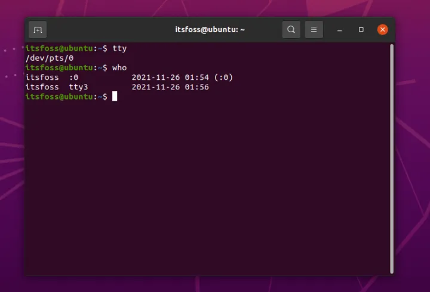

# shell and terminal

---

>换行：另起一行,一般就是代表下一行；  
>
>


## 

##回车 和 换行；

>这个是历史遗留问题；以前的打字机，需要人工的回车和换行，需要两个步骤，所以这是历史

要换行需要按回车键，把回车键看作换行。

### 程序员的认知；

换行与回车是不一样的，回车是把光标移到开始，换行是跳到下一行。

这与打字机的原理一致。

回车可以写成CR，即Carriage Return

换行可以写成LF，即Line Feed

CRLF 就是windows的\r\n;

| 符号 | ASCII码 | 意义   |
| ---- | ------- | ------ |
| \n   | 10      | 换行NL |
| \r   | 13      | 回车CR |

回车加换行是两个字符，一起才能构成键盘上的"回车"。

windows的enter 是  默认的方式是插入回车\r,再插入换行\n； 

```php
# windows \r\n  //换行  windows 的换行；
# shell linux  /n  //换行  linux  and mac
```


---


## shell and terminal


以前计算机比较贵，所以终端和shell分的很清楚；


现在基本不怎么区分了；人人一台电脑，终端设备已经被淘汰了；

现在是一种终端模拟器，也是模拟以前的终端，也是跑在电脑上的软件；


## tty

>Murray 电码减少了操作员发送消息的工作量。这才使得电传打印机在 1908 年有了发展成为商业 *电传打字机(Teletypewriter)*的可能。TTY 即是电传打字机的缩写。
>
>电传打字机和普通 *打字机(typewriter)*的区别在于，电传打字机连接到通信设备，直接发送输入的消息。
>
>[电传打字机使人类在没有计算机的情况下通过电线进行更快的通信成为可能](https://link.zhihu.com/?target=https%3A//en.wikipedia.org/wiki/Teletype_Corporation%23/media/File%3AWhat-is-teletype.jpg)。
>
>从这时起，“TTY” 一词就存在了。


**Linux tty命令用于显示终端机连接标准输入设备的文件名称。????**???


## shell  就是一个解释器；


当你在终端模拟器中输入 `tty` 时，它将打印连接到标准输入的终端文件名，就像手册页描述的一样。


换句话说，要知道你连接的 TTY 编号，只需输入 `tty`。并且，如果有多个用户远程连接到 Linux 机器，你可以使用 `who` 命令来检查其他用户连接到的是哪个 TTY。



Linux tty命令用于显示终端机连接标准输入设备的文件名称。

在Linux操作系统中，所有外围设备都有其名称与代号，这些名称代号以特殊文件的类型存放于/dev目录下。你可以执行tty(teletypewriter)指令查询目前使用的终端机的文件名称。

terminal 就是一个输入和输出设备 ； 看成一个输入和输出设备好一些；


 tty0 -tty6 也是一个真的终端；跟用户设备有关的终端；

 还有一些伪终端；

就是为了满足多用户的伪终端；

pts pterminal slave    就是代表的输入和输出设备；

ptmx pterminal master

注意一下 伪终端这个概念；


## 所以，Linux 中的 TTY 到底是什么？

在 Linux 或 UNIX 中，TTY 变为了一个抽象设备。有时它指的是一个物理输入设备，例如串口，有时它指的是一个允许用户和系统交互的虚拟 TTY（[参考此处](https://link.zhihu.com/?target=https%3A//unix.stackexchange.com/questions/4126/what-is-the-exact-difference-between-a-terminal-a-shell-a-tty-and-a-con)）。

TTY 是 Linux 或 UNIX 的一个子系统，它通过 TTY 驱动程序在内核级别实现进程管理、行编辑和会话管理。

在编程的场景下，你还需要深入研究。但是考虑到本文的范围，这可能是一个容易理解的定义。

如果你好奇的话，你可以查看一个有点旧的资源（[TTY 揭秘](https://link.zhihu.com/?target=https%3A//www.linusakesson.net/programming/tty/index.php)），它尽可能的澄清了 Linux 和 UNIX 系统中的 TTY 的各种技术细节。

事实上，每当你在系统中启动一个终端仿真器或使用任何类型的 shell 时，它都会与虚拟 TTY（也被称为 *伪 TTY(pseudo-TTY)*，即 PTY）进行交互。

你可以在终端仿真器中输入 `tty` 来找到相关联的 PTY。