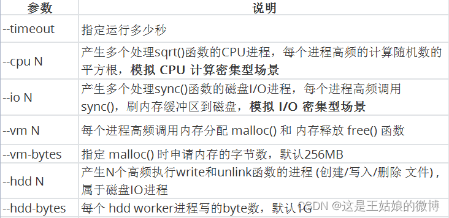
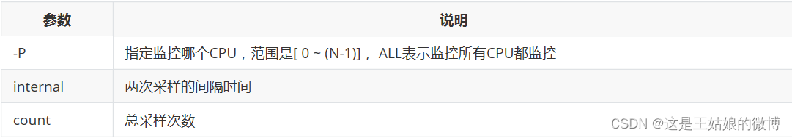
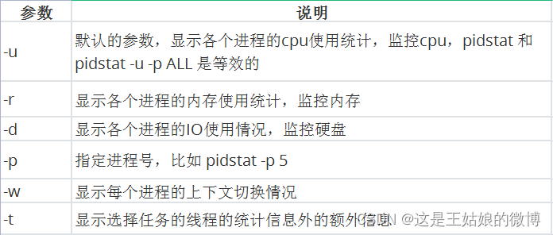
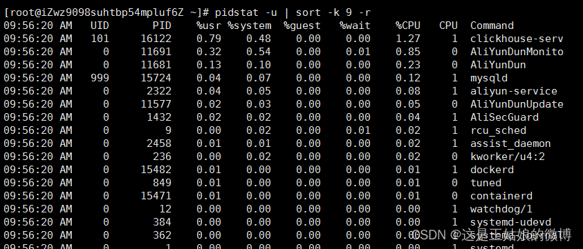
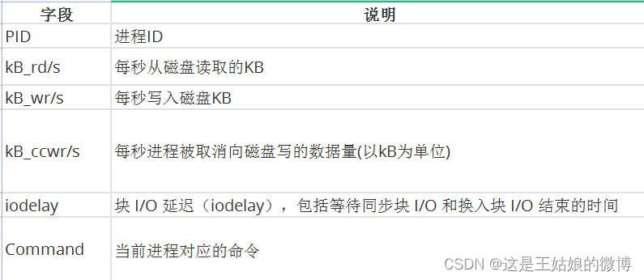

# stress

---


单位时间内 系统处于【可运行状态】和【不可中断状态】的平均进程数，就是平均活跃进程数

【可运行状态】 
    正在使用 CPU 或者正在等待 CPU 的进程
    用 ps aux命令看到的，处于 R 状态(Running 或 Runnable)的进程

【不可中断状态】
    正处于内核态关键流程中的进程，且流程不可打断的，
    比如 等待硬件设备的 I/O 响应，为了保证数据的一致性，进程向磁盘读写数据时，在得到磁盘响应前是不能被其他进程或者中断打断的
    ps  aux命令中 D 状态 的进程  Uninterruptible Sleep


---


### 压测工具 stress 

多进程工具 ，模拟IO密集型应用、CPU密集型应用、多进程等待CPU调度场景,  对CPU，内存，IO等情况进行压测

参数说明:




终端一    模拟四个IO进程, 持续600s  stress --io 2 --timeout 600s
**终端二   -d 参数表示高亮显示变化的区域  watch -d uptime //todo  这个以后可以用一下；高亮显示变化的而部分；**
终端三    mpstat 查看 CPU 使用率情况,  每5秒监控所有 CPU情况   mpstat -P ALL 5
终端四   查看运行中的进程和任务，每5秒刷新一次 pidstat -u 5


---


## mpstat

`````php
【全局命令】mpstat
 全称 Multiprocessor Statistics，多核 CPU 性能分析程序，        
 场景：当系统变慢，CPU平均负载增大时，判断是CPU的使用率增大，还是IO压力增大的情况导 致
格式mpstat [-P {|ALL}] [ <时间间隔> ] [ <次数> ] 比如  mpstat  -P ALL 2 3 每隔2秒出一个报告数据，共出具3次
//多核cpu性能分析 工具 multiprocessor statistic
`````




## 查看 cpu 的核数目；

`````shell
[root@810c31373153 linuxc]# cat /proc/cpuinfo | grep "model name" | wc -l
2
`````


## 查看linux 操作系统的版本和内核版本

`````shell
[root@810c31373153 proc]# cat /proc/version 
Linux version 4.9.60-linuxkit-aufs (root@4a42478ffb9a) (gcc version 6.3.0 (Alpine 6.3.0) ) #1 SMP Mon Nov 6 16:00:12 UTC 2017
[root@810c31373153 proc]# cat /etc/os-release 
NAME="CentOS Linux"
VERSION="7 (Core)"
ID="centos"
ID_LIKE="rhel fedora"
VERSION_ID="7"
PRETTY_NAME="CentOS Linux 7 (Core)"
ANSI_COLOR="0;31"
CPE_NAME="cpe:/o:centos:centos:7"
HOME_URL="https://www.centos.org/"
BUG_REPORT_URL="https://bugs.centos.org/"

CENTOS_MANTISBT_PROJECT="CentOS-7"
CENTOS_MANTISBT_PROJECT_VERSION="7"
REDHAT_SUPPORT_PRODUCT="centos"
REDHAT_SUPPORT_PRODUCT_VERSION="7"
[root@810c31373153 proc]# man uname
[root@810c31373153 proc]# uname -a
Linux 810c31373153 4.9.60-linuxkit-aufs #1 SMP Mon Nov 6 16:00:12 UTC 2017 x86_64 x86_64 x86_64 GNU/Linux
`````


## pidstat


````shell
【局部命令】pidstat  
实时查看进程的 CPU、内存、I/O 、上下文切换等指标
格式 pidstat [ 选项 ] [ <时间间隔> ] [ <次数> ]   比如 pidstat -u 2 3每隔2秒出一个报告数据，一共出具3次
````




//显示每个进程的cpu利用率；




`````shell
全局
uptime ：运行1分钟后，2个核的CPU负载是2，高负荷可以到4,5+
mpstat ：
实际应用场景：当系统变慢，CPU平均负载增大时，可判断是CPU的使用率增大，还是IO压力增大的情况导致
CPU的两个核在用户态使用率是99%，总的CPU使用率是100%，% iowait 为0，不存在io瓶颈

因为sqrt()函数的 CPU进程是在用户态，所以是%usr升高，而%sys没啥变化

局部
pidstat:  对进程和任务的使用情况进行，发现stress进程对2块cpu使用率过高，导致CPU平均负载增加
举一反三：如果不是stress，其他进程造成这类影响的，靠这个思路也能排查出是哪个进程
————————————————
版权声明：本文为CSDN博主「是小王同学啊~」的原创文章，遵循CC 4.0 BY-SA版权协议，转载请附上原文出处链接及本声明。
原文链接：https://blog.csdn.net/wnn654321/article/details/129328100
`````


pidstat 查看进程IO使用情况，显示各活动进程的IO使用统计


每列含义:





## vmstat 显示所有的 进程 内存 磁盘 cpu 中断 上下文切换 信息；

vmstat (*virtual memory statistics*) is a computer [system monitoring](http://eusoft_cef/System_monitor.html) tool that collects and displays summary information about [operating system](http://eusoft_cef/Operating_system.html) memory, processes, interrupts, paging and block [I/O](http://eusoft_cef/Input_output.html). Users of `vmstat` can specify a sampling interval which permits observing system activity in near-real time


进程；   内存   内存磁盘置换   io   系统 cpu

procs -----------memory---------- ---swap-- -----io---- -system-- ------cpu-----
 r  b  swpd   free   buff  cache   si   so    bi    bo   in   cs  us sy id wa st
 1  0      0 383272  27756 13664 56    0    0    10    37    8   139  1  1 99  0  0


