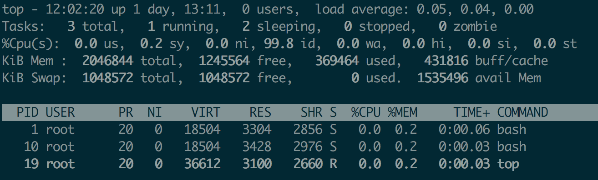

#  进程的不可中断状态和僵尸状态

>**linux中进程的状态**


**当 iowait 升高时，进程很可能因为得不到硬件的响应，而长时间处于不可中断状态。**


**需要注意的是 iowait 高不一定代表I/O 有性能瓶颈。当系统中只有 I/O 类型的进程在运行时，iowait 也会很高，但实际上，磁盘的读写远没有达到性能瓶颈的程度。**

因此，碰到 iowait 升高时，需要先用 dstat、pidstat 等工具，确认是不是磁盘 I/O 的问题，然后再找是哪些进程导致了 I/O。


**等待 I/O 的进程一般是不可中断状态，所以用 ps 命令找到的 D 状态（即不可中断状态）的进程，多为可疑进程。**

从 ps 或者 top 命令的输出中，可以发现它们都处于 D 状态，也就是不可中断状态（Uninterruptible Sleep）。

top 和 ps 是最常用的查看进程状态的工具，从 top 的输出开始，S列（也就是 Status 列）表示进程的状态。



- **R 是 Running 或 Runnable 的缩写，表示进程在 CPU 的就绪队列中，正在运行或者正在等待运行。**

- **D 是 Disk Sleep 的缩写，也就是不可中断状态睡眠（Uninterruptible Sleep），一般表示进程正在跟硬件交互，并且交互过程不允许被其他进程或中断打断。**

  `````php
  不可中断状态（Uninterruptible Sleep）是指进程在等待某些特定事件发生时，无法被中断或唤醒的一种状态。在这种状态下，进程通常被称为处于"disk sleep"（磁盘休眠）状态。
  
  当一个进程需要等待某些I/O操作完成时，例如从磁盘读取数据或等待网络数据到达，它可能会进入不可中断状态。在这种状态下，进程会暂停执行，并且无法响应中断信号或其他唤醒请求，直到所等待的事件发生或超时。
  
  //不可中断状态通常发生在与外部设备或资源交互的情况下，例如磁盘操作、网络操作或设备驱动程序等。进程进入不可中断状态的原因可能包括：
  
  磁盘I/O操作：当进程需要等待磁盘读取或写入操作完成时，可能会进入不可中断状态。
  
  网络操作：当进程需要等待网络数据到达或发送完成时，可能会进入不可中断状态。
  
  设备驱动程序：当进程与某些设备驱动程序进行交互时，可能会进入不可中断状态。
  
  #不可中断状态的存在是为了确保数据的完整性和一致性。当进程在进行关键的I/O操作时，中断或唤醒可能会导致数据损坏或不一致。因此，操作系统会将进程置于不可中断状态，以保护数据的完整性。
  
  #需要注意的是，不可中断状态可能会导致进程的长时间阻塞，这可能会对系统的响应性产生影响。因此，操作系统通常会尽量减少进入不可中断状态的情况，并提供相应的机制来处理异常情况。
  `````

  

- **Z 是 Zombie 的缩写，它表示僵尸进程，也就是进程实际上已经结束了，但是父进程还没有回收它的资源（比如进程的描述符、PID 等）。**

  `````c
  // zombie 僵尸进程怎么去解决！！
  //僵尸进程（Zombie Process）是指一个子进程在完成执行后，但其父进程尚未对其进行处理（即未调用wait()或waitpid()函数来获取子进程的退出状态），导致子进程的退出状态信息仍然保存在系统进程表中的一种状态。僵尸进程不会占用系统资源，但会占用一定的进程表项。
  //或者杀父进程，然后init 进程回去处理子进程；
  `````

  

- **S 是 Interruptible Sleep 的缩写，也就是可中断状态睡眠，表示进程因为等待某个事件而被系统挂起。当进程等待的事件发生时，它会被唤醒并进入 R 状态。**

  ````c
  //不可中断睡眠状态！！
  ````

  

- **I 是 Idle 的缩写，也就是空闲状态，用在不可中断睡眠的内核线程上。前面说了，硬件交互导致的不可中断进程用 D 表示，但对某些内核线程来说，它们有可能实际上并没有任何负载，用 Idle 正是为了区分这种情况。要注意，D 状态的进程会导致平均负载升高， I 状态的进程却不会。**

- **T 或者 t，也就是 Stopped 或 Traced 的缩写，表示进程处于暂停或者跟踪状态。**

- **X，也就是 Dead 的缩写，表示进程已经消亡，所以不会在 top 或者 ps 命令中看到它。**

 

## 不可中断状态


**不可中断状态，这其实是为了保证进程数据与硬件状态一致，并且正常情况下，不可中断状态在很短时间内就会结束。所以，短时的不可中断状态进程，一般可以忽略。**

**但如果系统或硬件发生了故障，进程可能会在不可中断状态保持很久，甚至导致系统中出现大量不可中断进程。这时，就得注意下，系统是不是出现了 I/O 等性能问题。**

 

## 僵尸进程

僵尸进程，这是多进程应用很容易碰到的问题。正常情况下，当一个进程创建了子进程后，它应该通过系统调用 wait() 或者 waitpid() 等待子进程结束，回收子进程的资源；而子进程在结束时，会向它的父进程发送 SIGCHLD 信号，所以，父进程还可以注册 SIGCHLD 信号的处理函数，异步回收资源。

如果父进程没这么做，或是子进程执行太快，父进程还没来得及处理子进程状态，子进程就已经提前退出，那这时的子进程就会变成僵尸进程。换句话说，父亲应该一直对儿子负责，善始善终，如果不作为或者跟不上，都会导致“问题少年”的出现。

通常，僵尸进程持续的时间都比较短，在父进程回收它的资源后就会消亡；或者在父进程退出后，由 init 进程回收后也会消亡。
一旦父进程没有处理子进程的终止，还一直保持运行状态，那么子进程就会一直处于僵尸状态。大量的僵尸进程会用尽 PID 进程号，导致新进程不能创建，所以这种情况一定要避免。

 

## 小结

- **不可中断状态，表示进程正在跟硬件交互，为了保护进程数据和硬件的一致性，系统不允许其他进程或中断打断这个进程。**进程长时间处于不可中断状态，通常表示系统有 I/O 性能问题。
- **僵尸进程，表示进程已经退出，但它的父进程还没有回收子进程占用的资源。**短暂的僵尸状态通常不必理会，但进程长时间处于僵尸状态，就应该注意了，可能有应用程序没有正常处理子进程的退出。