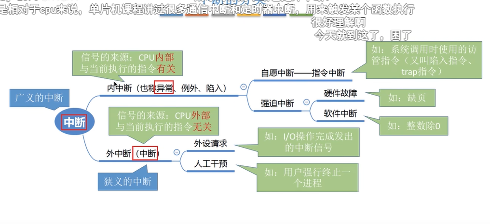
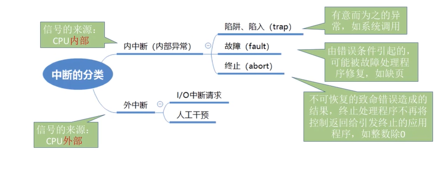
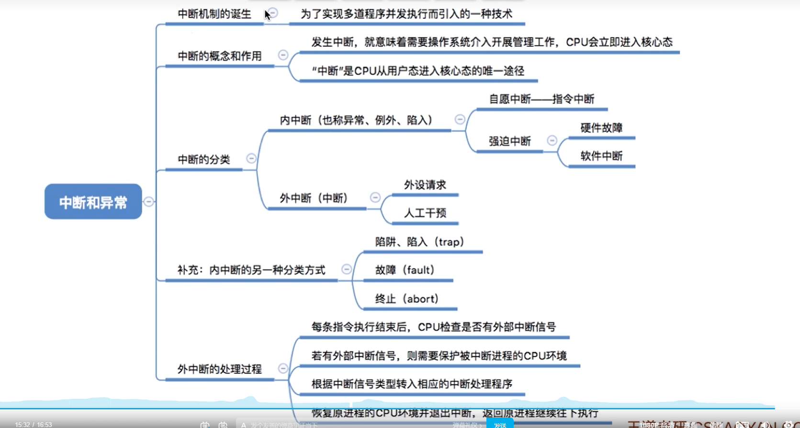

# 中断和异常

>本质就是当发生中断的时候就意味着需要操作系统的介入，开展管理工作；

---

**为了解决资源利用低的问题，所以发明了操作系统，引入了中断机制，实现了多道程序并发执行；**

为什么它可以实现多道程序并发的执行？ 因为可以通过中断来完成上下文的切换；当然也会进行保护现场和恢复现场；

**中断可以使cpu从用户态转换为内核态，使操作系统获取计算机的控制权；**

**用户态到内核态是通过中断来实现的，注意中断是唯一的途径；**

---

## 中断 （外中断） (信号来源：cpu的外部，与当前执行的指令无关；)

中断是cpu外部设备的交互方式；

###中断方式也分为：

异步：比如键盘，鼠标；都是异步的，当有键盘输入的时候会触发中断，然后cpu会去处理数据；

轮询：比如显示器，这里就会牵扯到显存（内存），cpu会不断的轮询去请求显存，然后去显示，所以显卡会有一个数值就是频率赫兹，代表的就是轮询的频率；

---

## 异常（内中断）（信号来源：cpu的外部，与当前执行的指令有关；）

异常

-----

##中断的两种分类方式；

##总结

