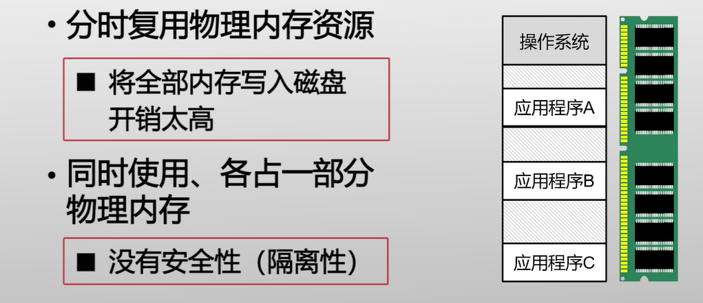
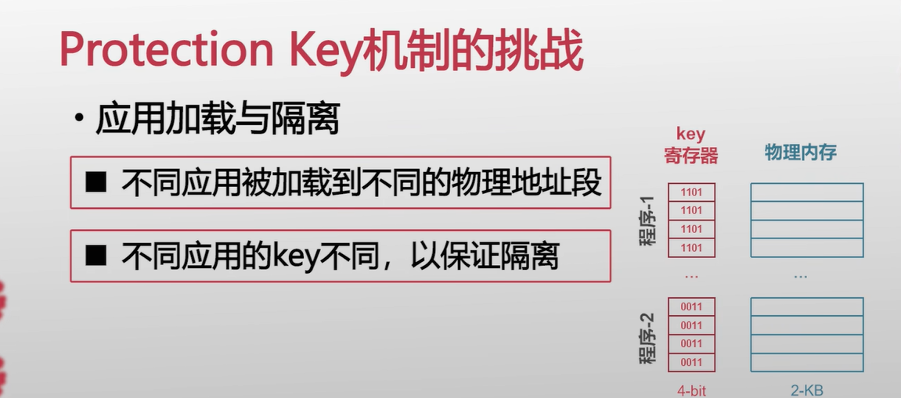
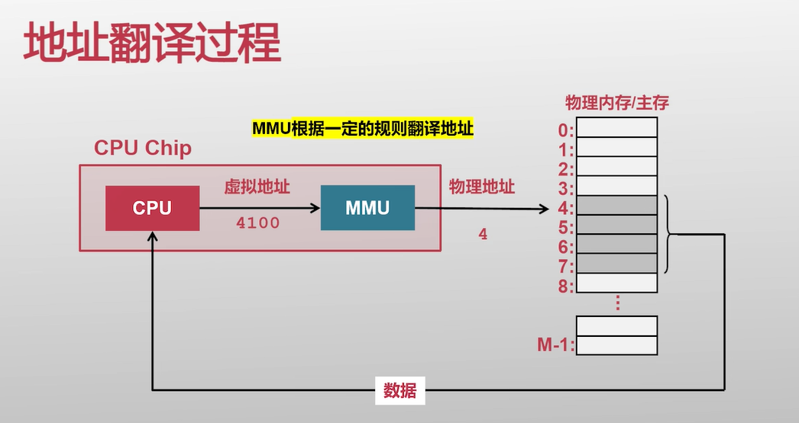
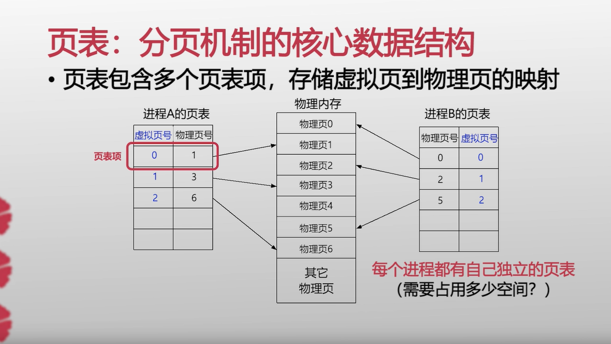

#  内存管理

>数据和代码加载到内存才会被cpu访问到；

## 直接使用内存地址存在的问题？

##内存管理方面的挑战？

进程的切换的方式：  下面就是两种切换方式；

* 将全部的内存写入到磁盘开销太高了，切换恢复的时候效率也很低；也就是内存只存储一个进程的数据；--- 分时复用；
* 同时使用，占用部分的内存；多个进程，共同使用内存，但是安全性和隔离性并不好；

##protection key

**就是不同应用程序都加载到内存的不同的物理地址段，然后用不同的key来做隔离；**

###存在的问题：

代码中所有的地址都需要一个偏移量；地址加载需要一个偏移量；

---

##  最终的优化---解决方法--不直接操作内存---加一层虚拟内存就可以了；

## 最终的解决方案就是虚拟地址

现在的内存管理都是虚拟内存  不直接使用物理地址；

## 虚拟内存

MMU 内存管理单元；Memory   manager Unit

### 分段机制

分段式的计算方式优点和缺点；

缺点：

### 分页机制

这个被广泛使用

把这一块好好计算一下；

分段式和分页式好好看一下；

##  *PCB* Process Control Block  进程控制块；·

## 分页（假设是OS = 32位）

**进程内的是逻辑地址，内存的是物理地址；**  

**内存管理肯定会有逻辑地址和物理地址的转换；**

为什么要进行分页？

* 降低内存的碎片化，提高内存的利用率；

为什么不要去直操作内存？  间接去操作内存；通过逻辑地址；

* 安全性和隔离性；毕竟是多任务的，多个进程共享内存，一般不能直接操作内存（物理地址），需要间接的去操作内存（逻辑地址），所以

pcb 页表寄存器；存放的是页表；

### 逻辑地址的组成

注意逻辑地址叫做page Frame 页框，物理地址是page 页；逻辑地址地址都是从  0x00000000 开始的，到0xFFFFFFFF结束；

假设程序\$x = 12; 逻辑地址；

页的大小 = 4kB；

**逻辑地址 = 页号 + 页内的偏移量；**

20位 是页号；   页内偏移量 = 12位； === 跟页的大小有关；

**物理地址  = 所在页面在物理地址的(起始地址，可以通过页表来计算) + 页内的偏移量（存在于逻辑地址）；就是物理地址；真是的物理地址；**

下面就会存在一个问题，怎么找到物理地址的起始地址？？？就是通过页表来实现的；怎么求初始地址这里是关键；

###  页表的组成   页表项（注意区别页表项和逻辑地址的区别！）

**页表项目 = 页号 +  块号（页表号）；**

来提供页号和页框号（块号）的对应关系； （注意 页号和块号都是从0开始的；）

需要注意的是，这里的页框号并不是物理地址的起始地址；仅仅是代表的是第几块而已；

n块的起始地址 = n * （内存块的大小）;  第0块那么就是0；

