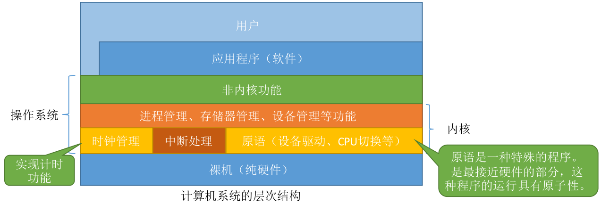

#  内核

##内核
用户态和内核态
用户态和内核态是处理器的两种状态
**当CPU处于用户态时，只能执行**非特权指令；当CPU处于核心态时，特权指令、非特权指令都可以执行**
特权指令：如内存清零指令；非特权指令：如普通的加减乘除运算指令
用程序状态字寄存器（PSW）的某个标志位来标识当前处理器所处的状态，比如0为用户态，1为核心态
用户态转换为内核态是通过中断实现的，并且中断是用户态进入核心态的唯一途径
核心态转换为用户态：通过执行一个特权指令，将程序状态字寄存器（PSW）的标志位设置为用户态来实现的

###两种程序
内核程序运行在核心态，是操作系统的管理者，可以执行特权指令和非特权指令

普通应用程序运行在用户态，只能执行非特权指	令，确保系统的安全运行

##中断
是为了实现**多道程序并发执行引入的一种技术**。发生中断，意味着需要操作系统介入开展管理工作，CPU会立即进入核心态

##系统调用  
系统调用是操作系统提供给程序员或应用程序使用的接口，可以理解为给应用程序调用的特殊函数
应用程序通过系统调用请求操作系统的服务

**与资源有关的操作，如存储分配、IO操作、文件管理等，都必须由系统调用的方式向操作系统请求，由操作系统对各个请求进行协调管理，这样可以保证系统的稳定性和安全性**

**系统调用的相关处理在核心态下进行，因为系统调用涉及到对系统资源的管理，对进程的控制，这些功能需要执行一些特权指令才能完成**
————————————————