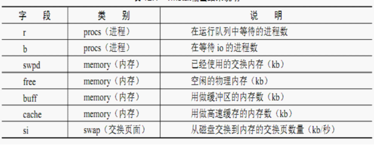
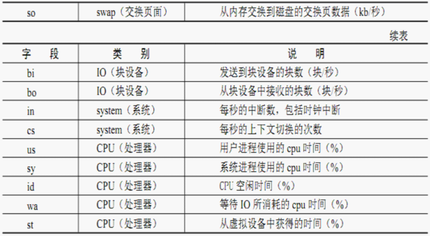

# vmstat


**vmstat, 给定时间监控CPU使用率, 内存使用, 虚拟内存交互, IO读写**

 `````shell
 # 显示  delay count delay  count 多久显示一次  显示多少次
 vmstat 2 1  
   
 eg:  
 r b swpd free buff cache si so bi bo in cs us sy id wa  
 1 0 0 3499840 315836 3819660 0 0 0 1 2 0 0 0 100 0  
 0 0 0 3499584 315836 3819660 0 0 0 0 88 158 0 0 100 0  
 0 0 0 3499708 315836 3819660 0 0 0 2 86 162 0 0 100 0  
 0 0 0 3499708 315836 3819660 0 0 0 10 81 151 0 0 100 0  
 1 0 0 3499732 315836 3819660 0 0 0 2 83 154 0 0 100 0 
 
 `````

# 10. vmstat 监视内存使用情况

vmstat是Virtual Meomory Statistics（虚拟内存统计）的缩写，可实时动态监视操作系统的虚拟内存、进程、CPU活动。

## 10.1. vmstat的语法

　　vmstat [-V] [-n] [delay [count]]

> - -V表示打印出版本信息；
> - -n表示在周期性循环输出时，输出的头部信息仅显示一次；
> - delay是两次输出之间的延迟时间；
> - count是指按照这个时间间隔统计的次数。

```
/root$vmstat 5 5
procs -----------memory---------- ---swap-- -----io---- --system-- -----cpu-----
r  b   swpd   free   buff  cache   si   so    bi    bo   in   cs us sy id wa st
6  0      0 27900472 204216 28188356    0    0     0     9    1    2 11 14 75  0  0
9  0      0 27900380 204228 28188360    0    0     0    13 33312 126221 22 20 58  0  0
2  0      0 27900340 204240 28188364    0    0     0    10 32755 125566 22 20 58  0  0
```

----


## 10.2. 字段说明

- Procs（进程）:

  r: 运行队列中进程数量

  b: 等待IO的进程数量

- Memory（内存）:

  swpd: 使用虚拟内存大小

  free: 可用内存大小

  buff: 用作缓冲的内存大小  更加说的写入 写入 buffer； 

  cache: 用作缓存的内存大小 | 更加关注于读取；缓存；

  

- Swap:

  si: 每秒从交换区写到内存的大小

  so: 每秒写入交换区的内存大小

  

- IO：（现在的Linux版本块的大小为1024bytes)

  bi: 每秒读取的块数

  bo: 每秒写入的块数

  

- system：

  in: 每秒中断数，包括时钟中断 interrupt 

  cs: 每秒上下文切换数  context swap 

  

- CPU（以百分比表示）

  us: 用户进程执行时间(user time)

  sy: 系统进程执行时间(system time)

  id: 空闲时间(包括IO等待时间)

  wa: 等待IO时间






----

**tcpdump(每天学一个 Linux 命令（72）：tcpdump)**

- 
- 

```crystal
# dump出本机12301端口的tcp包  tcpdump -i em1 tcp port 12301 -s 1500 -w abc.pcap
```


---

`````shell
iostat -xz 1  
  
# r/s, w/s, rkB/s, wkB/s：分别表示每秒读写次数和每秒读写数据量（千字节）。读写量过大，可能会引起性能问题。

## avgwait 平均等待的时间；
# await：IO操作的平均等待时间，单位是毫秒。这是应用程序在和磁盘交互时，需要消耗的时间，包括IO等待和实际操作的耗时。如果这个数值过大，可能是硬件设备遇到了瓶颈或者出现故障。
# avgqu-sz：向设备发出的请求平均数量。如果这个数值大于1，可能是硬件设备已经饱和（部分前端硬件设备支持并行写入）。
# %util：设备利用率。这个数值表示设备的繁忙程度，经验值是如果超过60，可能会影响IO性能（可以参照IO操作平均等待时间）。如果到达100%，说明硬件设备已经饱和。

# 如果显示的是逻辑设备的数据，那么设备利用率不代表后端实际的硬件设备已经饱和。值得注意的是，即使IO性能不理想，也不一定意味这应用程序性能会不好，可以利用诸如预读取、写缓存等策略提升应用性能。
`````

