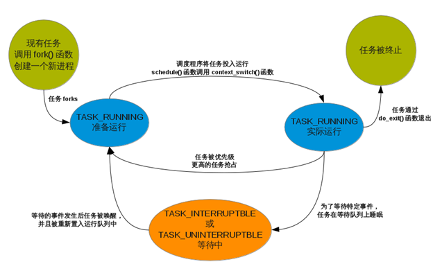
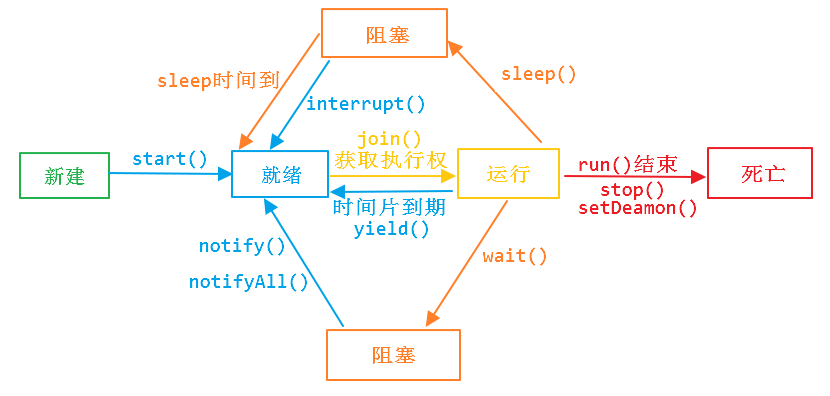

# 线程的状态

##进程的状态；

​               D (TASK_UNINTERRUPTIBLE) 	不可中断的睡眠状态
​               R (TASK_RUNNING)				正在运行，或在队列中的进程
​               S (TASK_INTERRUPTIBLE)		可中断的睡眠状态
​               T (TASK_STOPPED)				停止状态
​               t (TASK_TRACED)				被跟踪状态
​               Z (TASK_DEAD - EXIT_ZOMBIE)  退出状态，但没被父进程收尸，成为僵尸状态
​               W    						进入内存交换（从内核2.6开始无效）
​               X (TASK_DEAD - EXIT_DEAD)    退出状态，进程即将被销毁

               <    高优先级
               N    低优先级
               L    有些页被锁进内存
               s    包含子进程
               +    位于前台的进程组；
               l    多线程，克隆线程  multi-threaded (using CLONE_THREAD, like NPTL pthreads do)

----

线程从创建、运行到结束总是处于下面五个状态之一：新建状态、就绪状态、运行状态、阻塞状态及死亡状态。

下图是使用时间片轮转法的操作系统进程的状态和它们之间的转换。

挂起和睡眠是主动的，挂起恢复需要主动完成，睡眠恢复则是自动完成的，因为睡眠有一个睡眠时间，睡眠时间到则恢复到[就绪态](https://www.zhihu.com/search?q=就绪态&search_source=Entity&hybrid_search_source=Entity&hybrid_search_extra={"sourceType"%3A"answer"%2C"sourceId"%3A120217624})。而阻塞是被动的，是在等待某种事件或者资源的表现，一旦获得所需资源或者事件信息就自动回到就绪态。

睡眠和挂起是两种行为，阻塞则是一种状态。

**操作系统中睡眠、阻塞、挂起的区别形象解释： **

首先这些术语都是对于线程来说的。对线程的控制就好比你控制了一个雇工为你干活。你对雇工的控制是通过编程来实现的。

**阻塞一般需要某一个资源，得到某一个资源就会变成就绪状态，然后去争抢cpu；**

**挂起线程的意思就是你对主动对雇工说：“你睡觉去吧，用着你的时候我主动去叫你，然后接着干活”。**

**使线程睡眠的意思就是你主动对雇工说：“你睡觉去吧，某时某刻过来报到，然后接着干活”。**

**线程阻塞的意思就是，你突然发现，你的雇工不知道在什么时候没经过你允许，自己睡觉呢，但是你不能怪雇工，肯定你这个雇主没注意，本来你让雇工扫地，结果扫帚被偷了或被邻居家借去了，你又没让雇工继续干别的活，他就只好睡觉了。至于扫帚回来后，雇工会不会知道，会不会继续干活，你不用担心，雇工一旦发现扫帚回来了，他就会自己去干活的。因为雇工受过良好的培训。这个培训机构就是操作系统。**