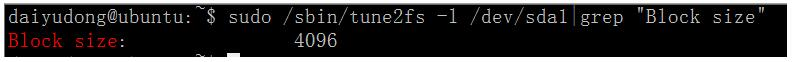
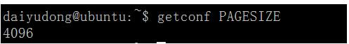

## 输入和输出设备

## 分类：

字符输出设备：

*字符设备是*指在I/O传输过程中以字符为单位进行传输的设备，例如*键盘*，打印机等。

是顺序读取，不能随机读取；就好像键盘的输入的字符有顺序；

块设备：

块设备是指在I/O传输过程中是以块为单位进行传输的设备，例如：硬盘之类的；

可以进行随机访问，可以寻址磁盘中位置；

## 内存页和文件系统中块的概念

linux查看文件系统块大小与内存页大小的简单方法

一：查看文件系统块大小

sudo /sbin/tune2fs -l /dev/sda1|grep "Block size"

需要注意到系统可能有多个盘多个文件系统，可通过df命令查看

数值单位是字节，如图示：

二：查看内存页大小

getconf PAGESIZE

数值单位是字节，如图示：

概念

扇区：磁盘的最小存储单位；
磁盘块：文件系统读写数据的最小单位；
页：内存的最小存储单位；

联系

一个磁盘块由连续几个（2^n）扇区组成；
页的大小为磁盘块大小的2^n倍；

查看

页大小查看： getconf PAGE_SIZE，常见为4K；
磁盘块大小查看：stat /boot/|grep “IO Block”，常见为4K；
扇区大小查看：fdisk -l，常见为512Byte；

# 几个概念 块 扇区  page  段

**块（Block）：**

**块是上层软件中（操作文件时）使用的最小的操作单元。**

就是（操作文件时）一个块一个块进行操作（块的大小格式化时可以设置【如linux、fatfs等等】）。

块（block），概念来自于**文件系统**，是内核对文件系统数据处理的基本单位，大小为若干个扇区，常见有512B、1KB、4KB等

**扇区：**

**扇区（Sector）**，概念来自于早期磁盘，在硬盘、DVD中还有用，在Nand/SD中已经没意义了，

扇区是块设备本身的特性，大小一般为512的整数倍，

因为历史原因很多时候都向前兼容定义为512，任何块设备硬件对数据处理的基本单位都是扇区。

硬盘的基本访问单位， SATA硬盘一般为512B；

任何块设备硬件对数据处理的基本单位。通常，1个扇区的大小为512byte。（对设备而言）；

**扇区是硬件被操作时软件使用的最小的操作单元。**

就是一个扇区一个扇区进行操作（扇区的大小在存储设备生产时就设计好）。

**扇区和块的关系：**

block由一个或多个sector组成，block是软件（OS、文件系统）中最小的操作单位；

操作系统的虚拟文件系统从硬件设备上读取一个block,实际为从硬件设备读取一个或多个sector。

**block最终要映射到sector上，所以block的大小一般是sector的整数倍**。

**文件和块的关系：**

**块的概念来自于文件系统**；

对于文件管理来说，每个文件对应的多个block可能是不连续的；一个文件至少占用一个块；

Determining **block size** in an OS is a case of tradeoffs. 
Every file must occupy at least one block, even if the file is 0 bytes long, so there's something for the file's metadata to be attached to.
Small block sizes are good when you need to store many small files.
On the other hand, more blocks = more metadata, so you end up wasting a chunk of your storage system on overhead, tracking the location of all the files.

**段（Section）:**

概念来自于内核，是内核的内存管理中一个页或者部分页，由若干个连续为块组成。

由若干个相邻的块组成。是Linux内存管理机制中一个内存页或者内存页的一部分。

**页（Page）:**

概念来自于内核，是内核内存映射管理的基本单位。linux内核的页式内存映射名称来源于此。

知行合一