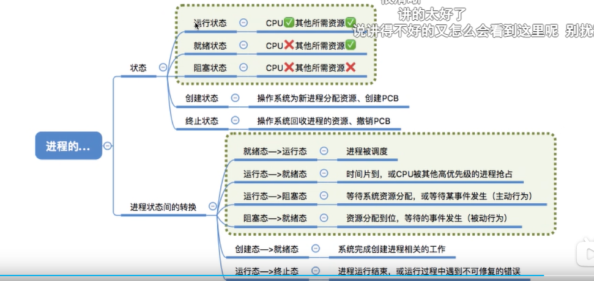

# 进程的几个状态

>只有执行的时候占用cpu；


1. 运行状态：进程正在处理器上上运行。在单处理器环境下，每个时刻最多只有一个进程处于运行状态。

2. 就绪状态：**进程已处于准备运行状态，即进程获得了除了处理器之外的一切所需资源，一旦得到处理器即可运行。**

3. 阻塞状态：**又称为等待状态，进程正在等待某一事件而暂停运行，如等待某资源为可用（不包括处理器）或等待输入/输出完成。即使处理器空闲，该进程也不能运行。**

   

**阻塞不占用 CPU 时间*,当某个线程阻塞时,该会触发 CPU 调度,即让新的线程在该 CPU 上运行(这也验证了上面说多的多线程的优势)**


1)       创建状态：进程正在被创建，尚未到就绪状态。

2)       结束状态：进程正在从系统中消失。可能是进程正常结束或其他原因中断退出运行。


  进程的3个基本状态是可以相互装换的，如图1-1所示。当一个就绪进程获得处理器时，其状态由就绪变为执行。

  当一个运行进程被剥夺处理器时，如用完系统分给他的时间片、出现更高优先级别的其他进程，其状态由运行变为就绪。

  当一个进程因为某件事情受阻时，如所申请资源被占用、启动I/O传输未完成，其状态由执行变为阻塞。

  当所等待事件发生时，如得到申请资源，I/O传输完成，其状态由阻塞变为就绪。

---


## 阻塞

* 挂起   

```
线程执行时,因为“主观”需要,需要暂停执行当前的线程,此时需要“挂起”当前线程.  挂起之后需要唤醒；唤醒之后就绪；
```

* 阻塞

```
在线程执行时,所需要的资源不能立马得到,则线程被“阻塞”,直到满足条件则会继续执行；得到资源之后；就绪；
```

* 睡眠

  

  ```
  线程执行时,因为“主观”需要,需要等待执行一段时间后再继续执行,此时需要让当前线程睡眠一段时间；sleep(100);一定的时间之后就绪；
  ```


- 创建：   进程正在被创建，尚未转到就绪状态。
- 就绪状态：进程已经处于准备运行状态，即进程获得了除处理器一切的所需资源，一旦得到处理器即可运行。
- 运行状态：进程正在处理器上运行。在单处理器环境下，每一个时刻最多只有一个进程处于运行状态。
- 阻塞状态：进程正在等待某一时间而暂停运行，如等待某资源为可用（不包括处理器）或等待输入、输出完成。即处理器空闲，该进程也不能运行。
- 结束状态：进程正从系统消失，可能是进程正常结束或者其他原因中断退出运行。

 

 

   可以想象成排队就餐的情况

----

##问题：


## 在少量连接请求的情况下，使用这种方式没有问题，响应速度也很高。但在发生大量连接请求时，就需要创建大量监听线程，这时如果线程没有数据就绪就会被挂起，然后进入阻塞状态。一旦发生线程阻塞，这些线程将会不断地抢夺 CPU 资源，从而导致大量的 CPU 上下文切换，增加系统的性能开销。 后面一句一旦发生线程阻塞，这些线程会不断的抢夺CPU资源，从而导致大量的CPU进行上下文切换，增加系统开销，这一句不是太明白，能解释一下吗？阻塞线程不是不会占用CPU资源吗？


作者回复: **阻塞线程在阻塞状态是不会占用CPU资源的，但是会被唤醒争夺CPU资源。操作系统将CPU轮流分配给线程任务，当线程数量越多的时候，当某个线程在规定的时间片运行完之后，会被其他线程抢夺CPU资源，此时会导致上下文切换。抢夺越激烈，上下文切换就越频繁。**


----


下面我们详情地讲下操作[系统](https://link.jianshu.com?t=http://www.2cto.com/os/)中的进程几个状态


进程的状态

就绪(Ready)状态

当进程已分配到除CPU以外的所有必要资源后，只要再获得CPU，便可立即执行，进程这时的状态称为就绪状态。在一个系统中处于就绪状态的进程可能有多个，通常将它们排成一个队列，称为就绪队列。

执行状态

进程已获得CPU，其程序正在执行。在单处理机系统中，只有一个进程处于执行状态； 在多处理机系统中，则有多个进程处于执行状态。

阻塞状态

正在执行的进程由于发生某事件而暂时无法继续执行时，便放弃处理机而处于暂停状态，亦即进程的执行受到阻塞，把这种暂停状态称为阻塞状态，有时也称为等待状态或封锁状态。致使进程阻塞的典型事件有：请求I/O，申请缓冲空间等。通常将这种处于阻塞状态的进程也排成一个队列。有的系统则根据阻塞原因的不同而把处于阻塞状态的进程排成多个队列。

**三者的转换图如下：**


**挂起状态**

在不少系统中进程只有上述三种状态，但在另一些系统中，又增加了一些新状态，最重要的是挂起状态。引入挂起状态的原因有：

(1) 终端用户的请求。当终端用户在自己的程序运行期间发现有可疑问题时，希望暂时使自己的程序静止下来。亦即，使正在执行的进程暂停执行；若此时用户进程正处于就绪状态而未执行，则该进程暂不接受调度，以便用户研究其执行情况或对程序进行修改。我们把这种静止状态称为挂起状态。

(2) 父进程请求。有时父进程希望挂起自己的某个子进程，以便考查和修改该子进程，或者协调各子进程间的活动。

(3) 负荷调节的需要。当实时系统中的工作负荷较重，已可能影响到对实时任务的控制时，可由系统把一些不重要的进程挂起，以保证系统能正常运行。

(4) 操作系统的需要。操作系统有时希望挂起某些进程，以便检查运行中的资源使用情况或进行记账。

**具有挂起状态的转换图**


**创建状态
**

创建一个进程一般要通过一下两个两个步骤

(1) 为一个新进程创建PCB，并填写必要的管理信息.

(2) 把该进程转入就绪状态并插入就绪队列之中。当一个新进程被创建时，系统已为其分配了PCB，填写了进程标识等信息，但由于该进程所必需的资源或其它信息，如主存资源尚未分配等，一般而言，此时的进程已拥有了自己PCB，但进程自身还未进入主存，即创建工作尚未完成，进程还不能被调度运行，其所处的状态就是创建状态。 引入创建状态，是为了保证进程的调度必须在创建工作完成后进行，以确保对进程控制块操作的完整性。同时，创建状态的引入，也增加了管理的灵活性，操作系统可以根据系统性能或主存容量的限制，推迟创建状态进程的提交。对于处于创建状态的进程，获得了其所必需的资源，以及对其PCB初始化工作完成后，进程状态便可由创建状态转入就绪状态。

终止状态

等待操作系统进行善后处理，然后将其PCB清零，并将PCB空间返还系统。当一个进程到达了自然结束点，或是出现了无法克服的错误，或是被操作系统所终结，或是被其他有终止权的进程所终结，它将进入终止状态。进入终止态的进程以后不能再执行，但在操作系统中依然保留一个记录，其中保存状态码和一些计时统计数据，供其它进程收集。一旦其它进程完成了对终止状态进程的信息提取之后，操作系统将删除该进程。

增加了创建状态和终止状态后，进程的三种基本状态及转换图衍变为五种状态及转换关系图


10人点赞


[日记本]()


	




作者：陕西搜讯
链接：https://www.jianshu.com/p/ac9ce2afd126
来源：简书
著作权归作者所有。商业转载请联系作者获得授权，非商业转载请注明出处。

----

在操作系统中，进程可以处于以下几种状态：

1. 新建（New）：当一个进程刚被创建时，它处于新建状态。在这个阶段，操作系统为进程分配必要的资源，并为其分配唯一的进程标识符（PID）。
2. 就绪（Ready）：一旦进程获得了所有必要的资源，它就进入就绪状态。在就绪状态下，进程已经准备好执行，但还没有被调度到CPU上运行。多个就绪状态的进程可能会等待CPU时间片。
3. 运行（Running）：当进程被调度到CPU上执行时，它进入运行状态。在运行状态下，进程的指令被CPU执行，进程可以访问和操作系统资源进行计算和处理。
4. 阻塞（Blocked）：在某些情况下，进程可能需要等待某些事件的发生，例如等待IO操作完成或等待某个信号。当进程处于等待状态时，它被称为阻塞状态。在阻塞状态下，进程不会占用CPU资源。
5. 终止（Terminated）：当进程完成其任务或被操作系统终止时，它进入终止状态。在终止状态下，进程的资源被释放，并从系统中移除。

这些状态通常被表示为进程控制块（PCB）中的状态字段。操作系统使用调度算法来管理进程的状态转换，以便合理地分配CPU资源和处理进程的请求。

需要注意的是，不同的操作系统可能会有不同的进程状态命名和定义，但通常都包括类似的概念。


---

挂起（Suspended）、睡眠（Sleeping）和阻塞（Blocked）是操作系统中不同的状态，它们有以下区别：

1. 挂起（Suspended）：当进程被挂起时，它的执行被暂时停止，并且它的状态信息被保存在内存中。挂起状态可以是主动的（由进程自身请求）或被动的（由操作系统或其他进程引起）。挂起的进程不会占用CPU资源，直到被恢复为止。
2. 睡眠（Sleeping）：**当进程处于睡眠状态时，它主动地放弃了CPU的使用权，并且等待某个特定的事件发生。****这个事件可能是一个定时器到期、IO操作完成或者其他进程发送的信号。**睡眠的进程不会占用CPU资源，直到等待的事件发生为止。
3. 阻塞（Blocked）：**当进程在执行过程中遇到了需要等待的事件时，它会进入阻塞状态。**阻塞的进程会暂时停止执行，并且不会占用CPU资源。常见的阻塞事件包括等待IO操作完成、等待锁释放或等待其他进程发送的信号。**一旦等待的事件发生，进程将被唤醒并转换到就绪状态。** （**需要等待事件时！！！）**

需要注意的是，挂起、睡眠和阻塞是不同的概念，但它们之间可能·存在一定的关联。例如，一个进程可能在执行过程中遇到阻塞事件而进入阻塞状态，然后被挂起以保存其状态信息，同时也可能处于睡眠状态等待某个事件的发生。

这些状态的具体实现和定义可能因操作系统而异，但它们都是为了有效管理进程和资源的状态转换。

----

挂机 可以看成程序的暂停运行！！！

**挂起（Suspended）是指进程的执行被暂时停止，并且进程的状态信息被保存在内存中**。当一个进程被挂起时，它不会占用CPU资源，也不会被调度执行。挂起状态可以是主动的（由进程自身请求）或被动的（由操作系统或其他进程引起）。

进程被挂起的原因可以是多种多样的，例如：

1. 用户请求：进程可能会主动请求挂起自己，例如在某些特定条件下暂停执行，等待用户输入或其他事件的发生。
2. 资源不足：当系统资源不足时，操作系统可能会选择挂起一些进程以释放资源给其他进程使用。
3. 调度策略：某些调度策略可能会将一些进程挂起，以便优先调度其他具有更高优先级的进程。

**在挂起状态下，进程的状态信息（如寄存器内容、程序计数器、堆栈等）会被保存在进程控制块（PCB）中，以便在恢复时能够恢复到挂起前的状态。当进程被恢复时，它会从挂起的地方继续执行。**

需要注意的是，挂起状态和终止状态是不同的。当一个进程被终止时，它的资源会被释放，并且从系统中移除。而当一个进程被挂起时，它的资源仍然保留在系统中，只是暂时停止了执行。

挂起状态的具体实现和操作方式可能因操作系统而异，但它是操作系统中用于管理进程状态的重要概念之一。


---

## sleep

**需要注意的是，Sleep状态是一种主动暂停执行的状态，与其他状态（如挂起状态或不可中断状态）有所区别。进程可以自行选择进入Sleep状态，并在指定的时间后恢复执行。而其他状态可能是由操作系统或外部事件引起的，并且进程无法主动从这些状态中恢复。**