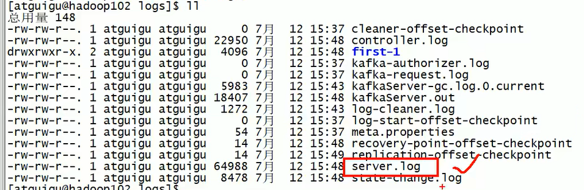
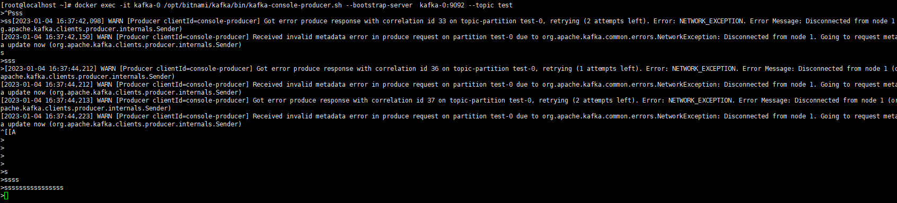
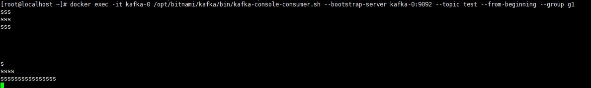

# kafka的命令

>**metadata  元数据，描述数据的数据；**

## kafka logs 日志；

docker 的查询方式；

``````shell
docker logs kafka-0  -f --tail  100 # 动态显示最后几行；
# -f follow the output 动态输出；
# 相当于去看 server.log日志；
#或者去 /var/lib/docker/containers/container_id/*.log  docker logs  就是从这边取的数据；
``````




## kafka的目录结构

````shell
I have no name!@kafka-1:/$ cd opt/bitnami/kafka/
I have no name!@kafka-1:/opt/bitnami/kafka$ ls -al
total 64
drwxrwxr-x. 1 root root    20 Jan  3 01:41 .
drwxrwxr-x. 1 root root    19 Jan  3 01:40 ..
-rw-rw-r--. 1 root root     0 Oct  6 16:10 .buildcomplete
-rw-rw-r--. 1 root root 14842 Oct  6 16:10 LICENSE
-rw-rw-r--. 1 root root 28184 Oct  6 16:10 NOTICE
drwxrwxr-x. 3 root root  4096 Oct  6 16:39 bin
drwxrwxr-x. 1 root root    85 Jan  3 01:41 config
drwxrwxr-x. 2 root root  8192 Oct  6 16:40 libs
drwxrwxr-x. 2 root root  4096 Oct  6 16:40 licenses
drwxrwxr-x. 2 root root     6 Jan  3 01:41 logs
drwxrwxr-x. 2 root root    44 Oct  6 16:40 site-docs

##bin  命令  config  配置  libs 依赖库； site-docs 文档； logs  日志；
````


## kafka-topic.sh

>**kafka-topics.sh 要指定服务节点node；**
>
>

zookeeper - 旧版Kafka的参数

bootstrap.server - 新版Kafka的参数

旧版（< v2.2）

kafka-topics.sh --zookeeper node1:2181,node2:2181,node3:2181 --create --topic topicName
新版（>= v2.2）

kafka-topics.sh **--bootstrap-server** node1:9092 --create --topic topicName

其中，2181是ZooKeeper的监听端口，9092是Kafka的监听端口。

旧版用--zookeeper参数，主机名（或IP）和端口用ZooKeeper的，**也就是server.properties文件中zookeeper.connect属性的配置值**

新旧用--bootstrap-server参数，主机名（或IP）和端口用某个节点的即可，即主机名（或主机IP）:9092


`````shell
[root@localhost kafka]# docker exec -it kafka-0 /opt/bitnami/kafka/bin/kafka-topics.sh \
> --create --bootstrap-server kafka-0:9092 \
> --topic my-topic \
> --partitions 3 --replication-factor 2
Created topic my-topic.


[root@localhost kafka]# docker exec -it kafka-0 /opt/bitnami/kafka/bin/kafka-topics.sh --describe --bootstrap-server kafka-0:9092 --topic my-topic
Topic: my-topic	TopicId: jxuzf6viQfKXytCK9kupPg	PartitionCount: 3	ReplicationFactor: 2	Configs: 
	Topic: my-topic	Partition: 0	Leader: 2	Replicas: 2,1	Isr: 2,1
	Topic: my-topic	Partition: 1	Leader: 1	Replicas: 1,0	Isr: 1,0
	Topic: my-topic	Partition: 2	Leader: 0	Replicas: 0,2	Isr: 0,2

## 查看所有的topic；
[root@localhost kafka]# docker exec -it kafka-0 /opt/bitnami/kafka/bin/kafka-topics.sh --list --bootstrap-server kafka-0:9092 --topic my-topic
my-topic

`````

### --bootstrap-server  

`````shell
#引导服务

###  一定要指定服务器节点 #  选择连接的kafka broker 节点 消息代理者的节点；
--bootstrap-server <String: server to    REQUIRED: The Kafka server to connect  
  connect to>                              to.
  
  ## topic 就是一个消息队列； 
  ## partitions 分区；提高消费能力；
  ## replication-factor 副本数不能超过 broker数；
  
  ### 增删查改；create delete list alter
  ###-------add-------------------------------------------------------------------------------
 --bootstrap-server --create --topic mq_test --partitions 3 --replication-factor 2
[root@localhost kafka]# docker exec -it kafka-0 /opt/bitnami/kafka/bin/kafka-topics.sh --bootstrap-server kafka-0:9092 --create --topic first --partitions 3 --replication-factor 2
Created topic first.
#----------list----------------------------------------------------------------------------------------

 --bootstrap-server --describe --topic topic_name  #显示详情信息；
 ##----------
##repliactions-factor  3  分区partitions会保存副本3份；
 Topic: first	TopicId: uDO89x8fStq2PjexAsenZg	PartitionCount: 3	ReplicationFactor: 2	Configs: 
	Topic: first	Partition: 0	Leader: 2	Replicas: 2,0	Isr: 2,0
	Topic: first	Partition: 1	Leader: 1	Replicas: 1,2	Isr: 1,2
	Topic: first	Partition: 2	Leader: 0	Replicas: 0,1	Isr: 0,1

 #------------------------------------------------------------------------------------------------
 
--list    # 显示所有的list；
  [root@localhost kafka]# docker exec -it kafka-0 /opt/bitnami/kafka/bin/kafka-topics.sh --bootstrap-server kafka-0:9092 --list
__consumer_offsets
my-topic
test

#-----------delete-----------------------------------------------------------------------
--delete --topic topic_name

#-----------alter-----------------------------------------------------------------------
--alter --topic new_topic_name

 				
`````


---

##一、topic 相关命令
1.1 创建topic

创建topic ，包含3个partitions，每个partitions 有3个副本
bin/kafka-topics.sh --bootstrap-server localhost:9092 --create --topic test --partitions 3 --replication-factor 3

创建topic ，手动分配副本
bin/kafka-topics.sh --bootstrap-server localhost:9092 --create --topic test2 --replica-assignment 0:1,1:2,0:2

创建topic ，同时指定配置参数，max.message.bytes=10485760，flush.messages=100
bin/kafka-topics.sh --bootstrap-server localhost:9092 --create --topic test --config max.message.bytes=10485760 --config flush.messages=100

1.2 topic列表
bin/kafka-topics.sh --bootstrap-server localhost:9092 --list

1.3 topic详情
bin/kafka-topics.sh --bootstrap-server localhost:9092 --describe --topic test

1.4 修改topic
bin/kafka-topics.sh --bootstrap-server localhost:9092 --alter --topic test --partitions 3

1.5 删除topic
bin/kafka-topics.sh --bootstrap-server localhost:9092 --delete --topic test


----


##二、producer相关命令 --控制台的生产者 和消费者；

启动生产者，常规启动


bin/kafka-console-producer.sh --bootstrap-server localhost:9092 --topic test





启动生产者，发送消失时带key，以”:”为key、value的分隔符

//property  属性；

bin/kafka-console-producer.sh --bootstrap-server localhost:9092 --topic test --property parse.key=true --property key.separator=:


`````php
--property <String: prop>                A mechanism to pass user-defined       
                                           properties in the form key=value to  
                                           the message reader. This allows      
                                           custom configuration for a user-     
                                           defined message reader.
               
--partition <Integer: partition>         The partition to consume from.         
                                           Consumption starts from the end of   
                                           the partition unless '--offset' is   
                                           specified.
--group <String: consumer group id>      The consumer group id of the consumer. 

`````


----


##三、consumer相关命令
从末尾开始拉取消息
bin/kafka-console-consumer.sh --bootstrap-server localhost:9092 --topic test

从头开始拉取消息
bin/kafka-console-consumer.sh --bootstrap-server localhost:9092 --topic test --from-beginning

**从指定offset开始拉取消息 指定分区； 消费者指定分区；**
**bin/kafka-console-consumer.sh --bootstrap-server localhost:9092 --topic test --partition 0 --offset 10**

最多拉取10条
bin/kafka-console-consumer.sh --bootstrap-server localhost:9092 --topic test --max-messages 10

打印key
bin/kafka-console-consumer.sh --bootstrap-server localhost:9092 --topic test --property print.key=true


指定消费组
**bin/kafka-console-consumer.sh --bootstrap-server localhost:9092 --topic test --from-beginning --group g1**

``````php
 #除了像 secfree 的回答一样使用 --consumer.config 选项，你也可以使用 

#--consumer-property group.id=your_group

#无需编辑配置文件即可指定组名的选项.

#这篇关于在命令行中在Kafka中创建多个消费者的文章就介绍到这了
``````




----


四、groups相关命令
4.1 消费组列表
bin/kafka-consumer-groups.sh --bootstrap-server localhost:9092 --list

4.2 消费组详情
bin/kafka-consumer-groups.sh --bootstrap-server localhost:9092 --describe --group g1

4.3 删除消费组
bin/kafka-consumer-groups.sh --bootstrap-server localhost:9092 --delete --group g1

---


五、config相关命令
6.1 查看配置

// entity 实体的；

bin/kafka-configs.sh --bootstrap-server localhost:9092 --entity-type topics --entity-name test --describe

6.2 增加配置
bin/kafka-configs.sh --bootstrap-server localhost:9092 --entity-type topics --entity-name test --alter --add-config max.message.bytes=10485760,flush.messages=100

6.3 删除配置
bin/kafka-configs.sh --bootstrap-server localhost:9092 --entity-type topics --entity-name test --alter --delete-config max.message.bytes,flush.messages


----


六、吞吐量测试相关命令

6.1 生产者吞吐量测试
bin/kafka-producer-perf-test.sh bootstrap.servers=localhost:9092 --topic test --num-records 1000000 --record-size 200 --throughput -1 --producer-props acks=-1

6.2 消费者吞吐量测试  perf 性能测试；
bin/kafka-consumer-perf-test.sh --bootstrap-server localhost:9092 --topic test --messages 1000000

————————————————
版权声明：本文为CSDN博主「cgzze」的原创文章，遵循CC 4.0 BY-SA版权协议，转载请附上原文出处链接及本声明。
原文链接：https://blog.csdn.net/cgzze/article/details/126445433


----


## kafka 配置 比较重要的几个参数	


**也就是server.properties文件中zookeeper.connect属性的配置值**

`````shell
############################# Zookeeper #############################

# Zookeeper connection string (see zookeeper docs for details).
# This is a comma separated host:port pairs, each corresponding to a zk
# server. e.g. "127.0.0.1:3000,127.0.0.1:3001,127.0.0.1:3002".
# You can also append an optional chroot string to the urls to specify the
# root directory for all kafka znodes.
zookeeper.connect=zookeeper:2181


############################ Log Basics #############################

# A comma separated list of directories under which to store log files
log.dirs=/bitnami/kafka/data


############################# Server Basics #############################

# The id of the broker. This must be set to a unique integer for each broker.
broker.id=0

############################# Socket Server Settings #############################

# The address the socket server listens on. If not configured, the host name will be equal to the value of
# java.net.InetAddress.getCanonicalHostName(), with PLAINTEXT listener name, and port 9092.
#   FORMAT:
#     listeners = listener_name://host_name:port
#   EXAMPLE:
#     listeners = PLAINTEXT://your.host.name:9092
listeners=INTERNAL://:9092,EXTERNAL://0.0.0.0:9093

`````


---


## zookeeper  的配置    

>kafka 为什么使用zookeeper；
>
>

`````shell
# zookeeper 
I have no name!@3b2114277313:/opt/bitnami/zookeeper/conf$ cat zoo.cfg | grep -v  "^#"
tickTime=2000
initLimit=10
syncLimit=5
# 最重要的两个参数 端口； 2128  
dataDir=/bitnami/zookeeper/data
clientPort=2181

maxClientCnxns=60
autopurge.snapRetainCount=3
autopurge.purgeInterval=0

preAllocSize=65536
snapCount=100000
maxCnxns=0
reconfigEnabled=false
quorumListenOnAllIPs=false
4lw.commands.whitelist=srvr, mntr
maxSessionTimeout=40000
admin.serverPort=8080
admin.enableServer=true


`````

