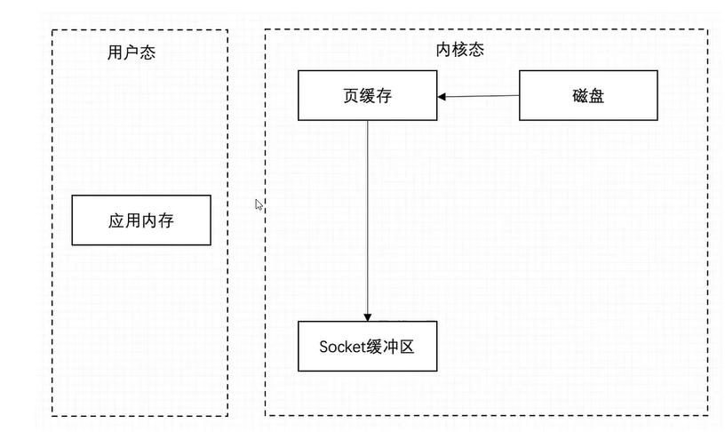

# 基础概念

---

>kafka 为什么这么快？
>
>
>
>kafka 优势：
>
>* 高吞吐量；partitions来实现的；高吞吐量；
>* 支持发布和订阅；
>* 分布式高吞吐量；
>* 可用性 replication-factor  副本集机制，实现数据冗余，保证数据不丢失 副本机制；sacable
>
>缺点：
>
>（2）不足
>
>无法弹性扩容：对partition的读写都在partition leader所在的broker，如果该broker压力过大，也无法通过新增broker来解决问题；
>
>扩容成本高：集群中新增的broker只会处理新topic，如果要分担老topic-partition的压力，需要手动迁移partition，这时会占用大量集群带宽；
>
>----
>
>
>
>**消费者新加入和退出会造成整个消费组rebalance：导致数据重复消费，影响消费速度，增加e2e延迟；**
>
>**partition过多会使得性能显著下降：ZK压力大，broker上partition过多让磁盘顺序写几乎退化成随机写。**


---

## cons of kafka

### Cons of Kafka

- Lack of [monitoring tools](https://cloudinfrastructureservices.co.uk/best-open-source-monitoring-tools/).

- New Brokers can **impact the performance.**

- Doesn’t embrace [wildcard topic](https://cloudinfrastructureservices.co.uk/kafka-architecture-cluster-topics-producers-partitions-consumers-zookeeper/) selection that disables addressing certain use cases.

- Constraint messaging patterns do not support request, reply and point to point queues.

- Sometimes it gets slow when the range of [Kafka cluster](https://cloudinfrastructureservices.co.uk/install-apache-kafka-on-ubuntu-20-04-cluster/)s is enhanced.

- The performance is decreased when the compressed messages by the consumer and broker are decompressed.

  

----


###一条消息一般带有一下数据

* 主题

* 分区


* 键

* 值

  主题下面的分区，分区可以实现分布在不同的服务器上，生产者将数据存储在不同的分区里面；

  两种模式：

  ​	1. 生产者指定

  2.  分区器（一个算法） 通过不同的key来分区
  3. 轮询的方式；默认方式不给分区器就只需要这么做；

  其实这里一般都是订阅模式的


但是也会有 只有一个分区的秒杀模式，因为要保证顺序性把，所以只能有一个分区，然后为了加快消费，可以创建多个消费者，但是这些消费者要处于同一个消费组；


---


## broker  服务节点 副本代理的意思；

broker 消息代理者；

一个服务器对应着一个服务节点；


---


###topic 就是主题，不同消息发送给不同的服务；


消费者如何拿到自己想要的数据；就是通过topic 主题；来实现的；生产者，将不同主题的信息发送到kafka中，消费者通过订阅不同的主题来消费自己想要的数据；


---


###partition  分区 ，一个主题


生产者在生产数据的时候，可以为每条消息指定Key，这样消息被发送到broker时，会根据分区规则选择被存储到哪一个分区中，如果分区规则设置的合理，那么所有的消息将会被均匀的分布到不同的分区中，这样就实现了负载均衡和水平扩展。另外，在消费者端，同一个消费组可以多线程并发的从多个分区中同时消费数据

但有一点需要注意，为Topic创建分区时，分区数最好是broker数量的整数倍，这样才能是一个Topic的分区均匀的分布在整个Kafka集群中，如果不是整数倍，会造成分步不均匀的问题


---


### replicas 副本； 复制

```css
bin/kafka-topics.sh --create --zookeeper localhost:2181 --replication-factor 3 --partitions 1 --topic test-topic
```

----


### offset 偏移量 来保下证消息顺序性； 注意 仅仅是保证同一个 分区的唯一性  如果要保证顺序性，最好就使用一个分区，比如秒杀；

就是ack  requireack  消费失败问题，可以重复消费的问题；


---


###  produce  生产者


---


### consume  消费者


---


### consume group   消费组的概念；

在[kafka](https://so.csdn.net/so/search?q=kafka&spm=1001.2101.3001.7020)中，某些Topic的主题拥有数百万甚至数千万的消息量，如果仅仅靠个消费者进程消费，那么消费速度会非常慢，所以我们需要使用使用kafka提供的消费组功能，同一个消费组的多个消费者就能分布到多个物理机器上以加速消费

**每个消费者组都会有一个独一无二的消费者组id来标记自己。每一个消费者group可能有一个或者多个消费者，对于当前消费组来说，topic中每条数据只要被消费组内任何一个消费者消费一次，那么这条数据就可以认定被当前消费组消费成功。**

总而言之，kafka的消费组有如下三个特征

1. 每个消费组有一个或者多个消费者
2. 每个消费组拥有一个唯一性的标识id
3. 消费组在消费topic的时候，topic的每个partition只能分配给一个消费者


----


### kafka cluster  kafka  集群；


----

###kafka的两种工作模式


点对点  就是 消费组的概念  只需要创建一个分区就可以了；

订阅模式； 就是我们平常用的模式；


----

##  kafka为什么这么快？

* 顺序读写； 持久化把；顺序读写；顺序读写数据；
* **批量删除，消费掉的数据是批量删除，并不是单个的删除；**
* **页缓存；直接用操作系统的页缓存，不会使用zend虚拟机；所以不会有gc部分的消耗；**
* 零拷贝；不牵扯用户态数据复制的过程；





//随机写性能差怎么去优化？？？ 


**随机写性能差，有什么优化方法呢？**

**架构设计中有两个常见的优化方法：**

（1）先写日志(write log first)，将随机写**优化为**顺序写；先写日志，然后再去落盘呗；

（2）将每次写**优化为**批量写； 批量写的优化；

**这两个优化，数据库都用上了**


