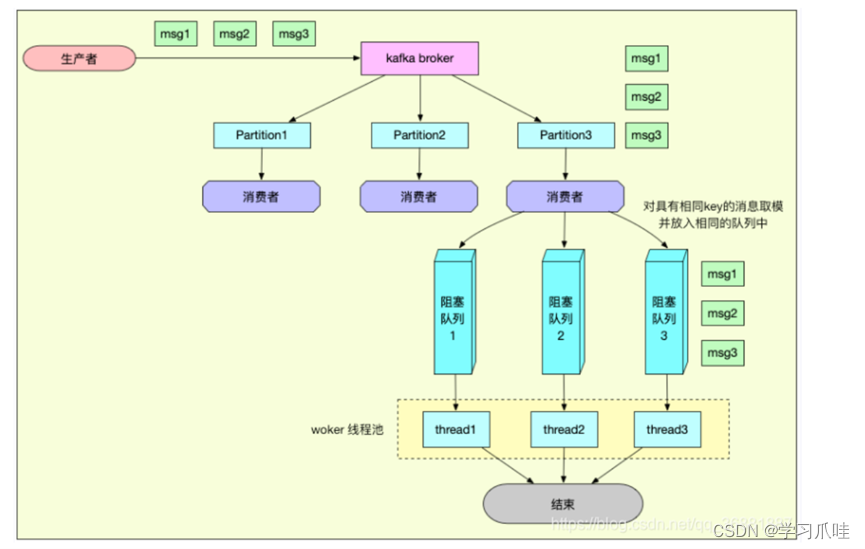
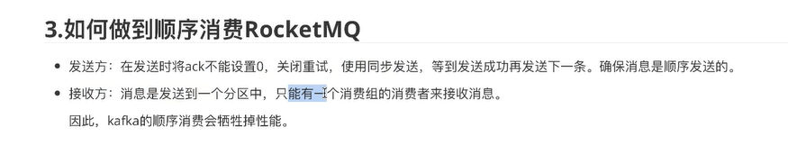

#  kafka 是如何保证有序性

>京东内部有两套Mq ，一套是数据流Kafka，另一套是业务流jmq(类似rocket Mq)。
>
>**一套保证高吞吐，一套保证功能丰富。感觉Kafka用在业务上确实功能太少，很多东西都要自己实现**
>
>**kafka的顺序消费并不多因为他牺牲掉了性能；rocketmq有一个专门顺序消费的功能；**

## 有序性

>所有的数据都放在一个partition 可以保证消息的有序性；

>但是一个分区只能被一个分组里面的消费者来消费；所以效率比较低；
>
>

 

##  kafka 保证有序性的方法

* 第一条是保证数据不丢失；ack  !=0 就是不能产生数据的丢失；
* 发送数据到同一个分区；来保证数据的顺序性；

因为只有一个分区，所以会牺牲掉kafka的性能；也就是他的高吞吐量；

kafka  需要自己去写这部分代码；rockerMQ；自己就可以实现；

