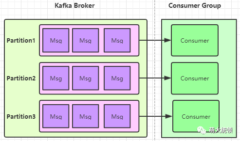

# kafka 多线程 消费者模式

**一、前言**

跟RabbitMQ相比，Kafka的分区机制（Partition）使其支持对同一个“队列”分片并行读取，这也是Kafka的吞吐量远高于RabbitMQ的原因之一。

注：当然，Kafka里并无严格的队列概念，此处只是为了便于类比，所以采用了“队列”的说法；

----

但Kafka内部也存在一定约束：每个Consumer Group所订阅的Topic下的每个Partition只能分配给该Group下的一个Consumer线程(当然该Partition还可以被分配给其他Group)，也即，**站在同一个Consumer Group的角度来看，****一个Partition只能被该Group里的一个Consumer线程消费，**因为该Partition只能与该Group内的一个Consumer线程建立Tcp连接，而不会与该Group内的其他Consumer建立连接，这意味着该Group内的其他Consumer也无法与该Partition通信（除非发生了Consumer Rebalance）。

注：RabbitMQ的客户端应用则可以多个线程消费同一个队列，因为与Kafka不同的是：

- RabbitMQ与客户端应用只有一个TCP连接(长连接)，而RabbitMQ与该客户端应用内的多个消费线程都可以基于该TCP连接内的多个Channel来通信
- 且RabbitMQ不需要记录每个消费线程的最新offset，其得到消费线程的ack回应也只是为了删除消息，因此RabbitMQ的客户端应用可以针对同一个队列开启多个线程来消费。

无论是Kafka官方提供的客户端API，还是Spring封装的Spring Kafka，在消息消费方面，均只是实现了默认情况下的1个Consumer1个线程。若希望1个Consumer有多个线程来加快消费速率，以进一步提升对partition的并行消费能力，则需要开发者自己实现（比如该Consumer一次拉取100条消息，分发给多个线程并行处理）。

**因此，默认情况下，每个Consumer Group的消费并行能力是依赖于其所订阅的Topic配置的Partition数量，消费线程数只能小于等于Partition数量，比如Partition数量为3，那么只能最多有3个消费线程来并行消费，如果超过了3个，只会浪费系统资源，因为多出的线程不会被分配到任何分区。**

这在一定程度上，也对客户端的并行消费能力造成了一定了限制，**默认情况下**，要提升并行能力，**则只能通过增加所订阅Topic的Partition数量，才能增加消费线程数量，进而才能扩展客户端的并行消费能力。**比如：

- 对现有的Kafka集群扩容（如增加broker实例数量，重新分区，增加Partition的数量）

- 将部分Topic从现有的Kafka集群中拆分出来，放到新建的Kafka集群中（本质上也属于一种扩容）

  

以上2种扩展方式不可避免的需要涉及到**数据迁移**，因此，客观来说，这2种扩展方式相对有点“重”。

如果不想再增加Partition的数量，希望能在现有的Partition数量基础上，进一步提升Kafka消费并行能力，该怎么办呢？