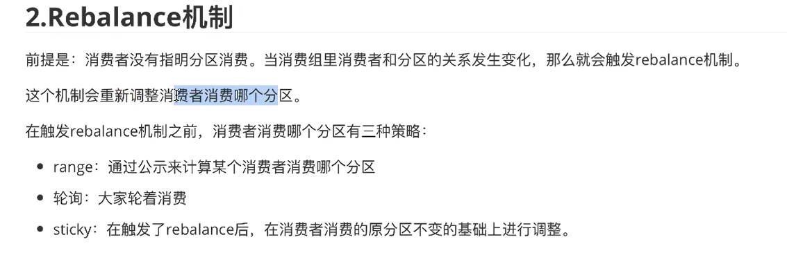

# reblance

>消费者变动！！！ 需要做reblance；
>
>Reblance就像他的名称一样，意思是再平衡，平衡什么？平衡消费者和分区之间的对应关系。本质上来讲，Reblance是一种协议，规定了一个Consumer Group下所有Consumer如何达成一致，来分配订阅Topic的每个分区，尽量让每个消费者分配到相对均匀的分区，使Consumer的资源都能得到充分利用，防止有些Consumer比较忙，有的Consumer比较闲。
>
>---
>
>https://blog.csdn.net/weixin_45701550/article/details/126572077  参考一下
>
>

---

**sticky :黏合的策略，在触发rebalance后，在消费者消费的原分区不变的基础上进行调整；**

##Reblance触发的时机
当kafka感知到存在让**分区和消费者分配不均匀**的事情发生时，就会触发Reblance，来保证分区和消费者再次平衡。那么那些事情会触发Reblance呢？或者说那些事情会导致分区和消费者分配不均匀呢？主要有三种：

1.消费者组消费的分区个数发生变化。

2.消费者组消费的主题个数发生变化。

3.消费者组内的消费者个数发生变化。

其实第2种情况，本质上是第1种情况的一个特例，消费组消费的主题个数发生变化，体现到消费组中的消费者身上，就是费配到消费者上的分区个数发生了变化。

##分区分配的策略有哪些
分配策略是指：当Reblance触发时，重新将分区分配给消费者的方式。常用的分区方式有三种：Range，RoundRobin 和 StickyAssignor。

为了方便描述分区分配的流程，我们假设以下场景：一个消费组中有3个消费者，分别为Consumer_1,Consumer_2和Consumer_3。消费7个分区，分别为partition_0-7。

Range分配策略是指按照分区号的范围进行分区分配。

RoundRobin分配策略是指轮训每个分区，将分区逐个分配给消费者

StickyAssignor分区策略，又称为粘性分配，所谓的有粘性，是指每次 Rebalance 时，该策略会尽可能地保留之前的分配方案，尽量实现分区分配的最小变动。

例如实例Consumer1之前负责消费分区 0、1、2，那么 Rebalance 之后，如果可能的话，最好还是让实例 Consumer1 继续消费分区0、1、2，而不是被重新分配其他的分区。这样的话，实例 Consumer1 连接这些分区所在 Broker 的 TCP 连接就可以继续用，不用重新创建连接其他 Broker 的 Socket 资源。

不过这个分配策略要到 kafka 0.11版本才可以使用。

Reblance产生的影响
Reblance产生的影响主要有两个：

##1.影响消费效率。
**因为发生Reblance时，所有消费者都会停止消费，比较影响消息消费效率，当一个消费组中消费者比较多的时候，Reblance的过程会比较耗时。**

##2.可能会产生消息重复消费

**因为Consumer消费分区消息的offset提交过程，不是实时的(以offset自动提交为例)，由参数auto.commit.interval.ms控制提交的最小频率，默认是5000，也就是最少每5s提交一次。我们试想以下场景：提交位移之后的 3 秒发生了 Rebalance ，在 Rebalance 之后，所有 Consumer 从上一次提交的位移处继续消费，但该位移已经是 3 秒前的位移数据了，故在 Rebalance 发生前 3 秒消费的所有数据都要重新再消费一次。虽然可以通过减少 auto.commit.interval.ms 的值来提高提交频率，但这么做只能缩小重复消费的时间窗口，不可能完全消除它。**

**很遗憾的是，目前kafka社区对于Reblance带来的影响，也没有彻底的解决办法。只能通过避免不必要的Reblance，来降低Reblance产生的影响。**

##减少Reblance的产生
有些时候，Reblance是不可避免的，比如在运维过程中，为了增加客户端的处理能力，需要增加partition个数或者consumer个数，那么不可避免的需要触发Reblance。

但是有些时候可能有些参数配置的问题，会导致一些不必要的Reblance的发生，这些Reblance的发生主要就是协调者错误的认为消费者实例挂了，然后触发Reblance。

有哪些参数配置异常，会导致协调者认为消费者实例挂了呢？

1.session.timeout.ms

这个参数是协调者最长等待消费者没有发送心跳的时间间隔，如果协调者在该参数指定的时间内没有收到某个消费者的心跳请求，那么就认为该消费者挂了，就会将这个消费者从组里面剔除，然后触发Reblance。

同时参数heartbeat.interval.ms,表示消费者向协调者发送心跳请求的时间间隔，这个参数设置的过大，会导致消费者长时间不会向协调者发送心跳，同时协调者向消费者发送的 Reblance的消息也会不及时(协调者不是主从向消费者发送Reblance消息的，而是将Reblance消息封装到消费者心跳请求的响应消息中)。设置的小一些，消息会及时一些，但是，可能会消耗过多的带宽。

通常在生产环境中保证session.timeout.ms >= 3 * heartbeat.interval.ms。

2.max.poll.interval.ms

消费者调用poll方法的时间间隔，如果时间间隔大于该参数的设置，会认为这个Consumer存在问题(消息处理效率低，消费者可能不健康)，那么Consumer会向协调者发送 leaveGroup请求，自动退出消费者组，此时消费者数量发生变化，触发Reblance。

在业务中，该参数可以设置的长一些，但是也不要违背了该参数的初衷(kafka对消费者的一种优胜劣汰的优化机制，poll的慢导致消息堆积)。因为业务上的确可能存在一些耗时的操作，或者poll拉去的消息过多，导致消息处理的慢，进而导致poll方法消息拉去的时间间隔过长，对于这种情况可以调整每次拉去消息个条数，或者优化消息处理逻辑，加快消息处理效率。
————————————————

五、如何避免不必要的Rebalance

除开consumer正常的添加和停掉导致rebalance外，在某些情况下，Consumer 实例会被 Coordinator 错误地认为 “已停止” 从而被“踢出”Group，导致rebalance，这种情况应该避免。

第一类非必要 Rebalance 是因为未能及时发送心跳，导致 Consumer 被 “踢出”Group 而引发的。这种情况下我们可以设置 session.timeout.ms 和 heartbeat.interval.ms 的值，来尽量避免rebalance的出现。（以下的配置是在网上找到的最佳实践，暂时还没测试过）

- 设置 session.timeout.ms = 6s。
- 设置 heartbeat.interval.ms = 2s。
- 要保证 Consumer 实例在被判定为 “dead” 之前，能够发送至少 3 轮的心跳请求，即 session.timeout.ms >= 3 * heartbeat.interval.ms。
- 这两个参数的区别 https://stackoverflow.com/questions/43881877/difference-between-heartbeat-interval-ms-and-session-timeout-ms-in-kafka-consume

将 session.timeout.ms 设置成 6s 主要是为了让 Coordinator 能够更快地定位已经挂掉的 Consumer，早日把它们踢出 Group。

第二类非必要 Rebalance 是 Consumer 消费时间过长导致的。此时，max.poll.interval.ms 参数值的设置显得尤为关键。如果要避免非预期的 Rebalance，你最好将该参数值设置得大一点，比你的下游最大处理时间稍长一点。