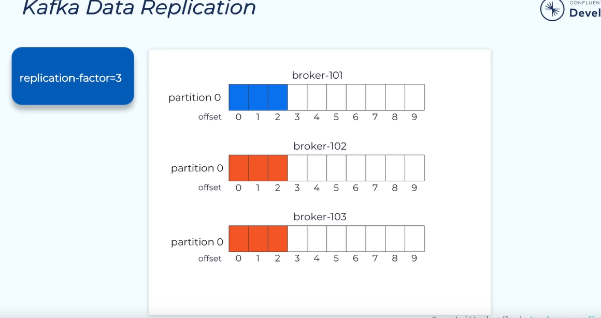
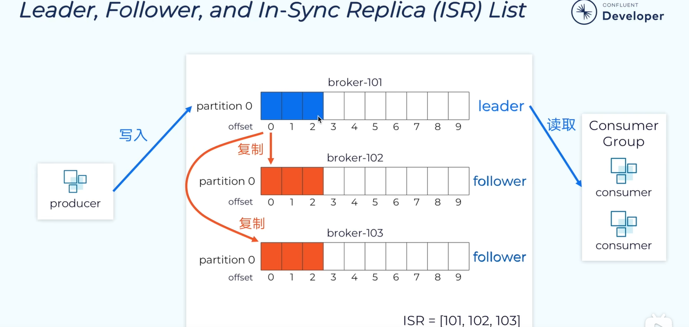
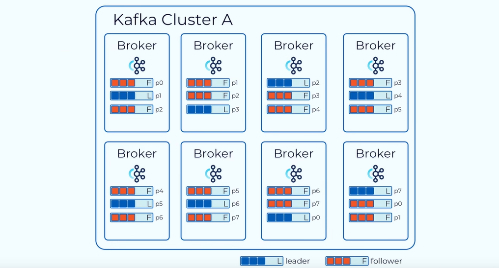

#  cluster and replication


cluster 多个kafka broker 服务器；


partition  不同的分区会分在不同的broker上；

不同的分区存储在不同的服务器上，这样就使得kafka具有扩展性，我们可以去调整分区的数量和节点（node）的数量，来对kafka进行扩展；

分区是一个线性增长的不可变的提交日志；当我们的消息存储到日志中去的时候，消息就不可变更；kafka会给每一条信息分配一个偏移量也就是offset，来记录每一条消息的位置；

kafka可以通过偏移量对消息进行提取；但是我们没法对消息的内容进行检索和查询；

偏移量在每一个分区内是唯一的，不可重复的；	并且是递增的；不同分区之间偏移量可以重复；


Recode 以key value的时候，存储的；

key为空的时候随机进入分区；


当key 不为空的时候，相同的key进入到相同的分区；


## kafka replication-factor=3；

>kafka 副本的数量；
>
>注意： 副本仅仅来做数据的冗余，当发生故障的时候，进行故障的转义；并不会去提供读写能力；
>
>follower 同步 leader的数据；保持数据的一致；
>
>replication-factor =3 包括主分区在内有3个副本;
>
>leader来做数据的读写；都是从leader来进行读写的；





维护的ISR的集合，当出现故障的时候，落后的比较多，将节点剔除，追赶上来之后恢复；


## ##高可用的两种方式：

###cluster 来保证数据的高可用；

>cluster  一个broker 宕机，另外以的broker可以正常工作；
>
>broker 宕机的高可用；




### replication

>分区宕机

实现高可用的另一个手段就是备份机制（Replication）。备份的思想很简单，就是把相同的数据拷贝到多台机器上，而这些相同的数据拷贝在 Kafka 中被称为副本（Replica）。好吧，其实在整个分布式系统里好像都叫这个名字。副本的数量是可以配置的，这些副本保存着相同的数据，但却有不同的角色和作用。Kafka 定义了两类副本：领导者副本（Leader Replica）和追随者副本（Follower Replica）。前者对外提供服务，这里的对外指的是与客户端程序进行交互；而后者只是被动地追随领导者副本而已，不能与外界进行交互。当然了，你可能知道在很多其他系统中追随者副本是可以对外提供服务的，比如 MySQL 的从库是可以处理读操作的，但是在 Kafka 中追随者副本不会对外提供服务。对了，一个有意思的事情是现在已经不提倡使用 Master-Slave 来指代这种主从关系了，毕竟 Slave 有奴隶的意思，在美国这种严禁种族歧视的国度，这种表述有点政治不正确了，所以目前大部分的系统都改成 Leader-Follower 了。

副本的工作机制也很简单：生产者总是向领导者副本写消息；而消费者总是从领导者副本读消息。至于追随者副本，它只做一件事：向领导者副本发送请求，请求领导者把最新生产的消息发给它，这样它能保持与领导者的同步。

虽然有了副本机制可以保证数据的持久化或消息不丢失，但没有解决伸缩性的问题。伸缩性即所谓的 Scalability，是分布式系统中非常重要且必须要谨慎对待的问题。什么是伸缩性呢？我们拿副本来说，虽然现在有了领导者副本和追随者副本，但倘若领导者副本积累了太多的数据以至于单台 Broker 机器都无法容纳了，此时应该怎么办呢？一个很自然的想法就是，能否把数据分割成多份保存在不同的 Broker 上？如果你就是这么想的，那么恭喜你，Kafka 就是这么设计的。


## 顺序读写；

讲完了消息层次，我们来说说 Kafka Broker 是如何持久化数据的。总的来说，Kafka 使用消息日志（Log）来保存数据，一个日志就是磁盘上一个只能追加写（Append-only）消息的物理文件。因为只能追加写入，故避免了缓慢的随机 I/O 操作，改为性能较好的顺序 I/O 写操作，这也是实现 Kafka 高吞吐量特性的一个重要手段。不过如果你不停地向一个日志写入消息，最终也会耗尽所有的磁盘空间，因此 Kafka 必然要定期地删除消息以回收磁盘。怎么删除呢？简单来说就是通过日志段（Log Segment）机制。在 Kafka 底层，一个日志又进一步细分成多个日志段，消息被追加写到当前最新的日志段中，当写满了一个日志段后，Kafka 会自动切分出一个新的日志段，并将老的日志段封存起来。Kafka 在后台还有定时任务会定期地检查老的日志段是否能够被删除，从而实现回收磁盘空间的目的。


``````shell
[root@localhost kafka]# docker volume ls
DRIVER              VOLUME NAME
local               kafka_kafka_0_data
local               kafka_kafka_1_data
local               kafka_kafka_2_data
local               kafka_zookeeper_data
[root@localhost kafka]# dokcer volume inspect kafka_kafka_0_data
-bash: dokcer: command not found
[root@localhost kafka]# docker volume inspect kafka_kafka_0_data
[
    {
        "Driver": "local",
        "Labels": null,
        "Mountpoint": "/var/lib/docker/volumes/kafka_kafka_0_data/_data",
        "Name": "kafka_kafka_0_data",
        "Options": {},
        "Scope": "local"
    }
]
## logsr日志的位置；
##  下面的映射 就是日志部分的映射；映射到数据卷volume中；
### - zookeeper_data:/bitnami/zookeeper  日志的映射；

version: "2"

services:
  zookeeper:
    image: docker.io/bitnami/zookeeper:3.8
#    ports:
#      - "2181"
    environment:
      - ALLOW_ANONYMOUS_LOGIN=yes
    volumes:
      - zookeeper_data:/bitnami/zookeeper

  kafka-0:
    image: docker.io/bitnami/kafka:3.3
    container_name: kafka-0
    hostname: kafka-0
#    ports:
#      - "9092"
    environment:
      - KAFKA_CFG_ZOOKEEPER_CONNECT=zookeeper:2181
      - KAFKA_CFG_BROKER_ID=0
      - ALLOW_PLAINTEXT_LISTENER=yes
      - KAFKA_CFG_LISTENER_SECURITY_PROTOCOL_MAP=INTERNAL:PLAINTEXT,EXTERNAL:PLAINTEXT
      - KAFKA_CFG_LISTENERS=INTERNAL://:9092,EXTERNAL://0.0.0.0:9093
      - KAFKA_CFG_ADVERTISED_LISTENERS=INTERNAL://kafka-0:9092,EXTERNAL://localhost:9093
      - KAFKA_CFG_INTER_BROKER_LISTENER_NAME=INTERNAL
    volumes:
      - kafka_0_data:/bitnami/kafka
    depends_on:
      - zookeeper

  kafka-1:
    image: docker.io/bitnami/kafka:3.3
    container_name: kafka-1
    hostname: kafka-1
#    ports:
#      - "9092"
    environment:
      - KAFKA_CFG_ZOOKEEPER_CONNECT=zookeeper:2181
      - KAFKA_CFG_BROKER_ID=1
      - ALLOW_PLAINTEXT_LISTENER=yes
      - KAFKA_CFG_LISTENER_SECURITY_PROTOCOL_MAP=INTERNAL:PLAINTEXT,EXTERNAL:PLAINTEXT
      - KAFKA_CFG_LISTENERS=INTERNAL://:9092,EXTERNAL://0.0.0.0:9094
      - KAFKA_CFG_ADVERTISED_LISTENERS=INTERNAL://kafka-1:9092,EXTERNAL://localhost:9094
      - KAFKA_CFG_INTER_BROKER_LISTENER_NAME=INTERNAL
    volumes:
      - kafka_1_data:/bitnami/kafka
    depends_on:
      - zookeeper

  kafka-2:
    image: docker.io/bitnami/kafka:3.3
    container_name: kafka-2
    hostname: kafka-2
#    ports:
#      - "9092"
    environment:
      - KAFKA_CFG_ZOOKEEPER_CONNECT=zookeeper:2181
      - KAFKA_CFG_BROKER_ID=2
      - ALLOW_PLAINTEXT_LISTENER=yes
      - KAFKA_CFG_LISTENER_SECURITY_PROTOCOL_MAP=INTERNAL:PLAINTEXT,EXTERNAL:PLAINTEXT
      - KAFKA_CFG_LISTENERS=INTERNAL://:9092,EXTERNAL://0.0.0.0:9095
      - KAFKA_CFG_ADVERTISED_LISTENERS=INTERNAL://kafka-2:9092,EXTERNAL://localhost:9095
      - KAFKA_CFG_INTER_BROKER_LISTENER_NAME=INTERNAL
    volumes:
      - kafka_2_data:/bitnami/kafka
    depends_on:
      - zookeeper

  nginx:
    container_name: nginx-kafka
    hostname: nginx
    image: nginx:1.22.0-alpine
    volumes:
    - ./nginx/nginx.conf:/etc/nginx/nginx.conf:ro
    ports:
    - "9093-9095:9093-9095"
    depends_on:
      - kafka-0
      - kafka-1
      - kafka-2


volumes:
  zookeeper_data:
    driver: local
  kafka_0_data:
    driver: local
  kafka_1_data:
    driver: local
  kafka_2_data:
    driver: local


###注意会有很多节点；

``````


整理一遍个人的理解： Kafka体系架构=M个producer +N个broker +K个consumer+ZK集群 

producer:生产者 Broker：服务代理节点，Kafka服务实例。 n个组成一个Kafka集群，通常一台机器部署一个Kafka实例，一个实例挂了其他实例仍可以使用，体现了高可用

 consumer：消费者 消费topic 的消息， 一个topic 可以让若干个consumer消费，若干个consumer组成一个 consumer group ，一条消息只能被consumer group 中一个consumer消费，若干个partition 被若干个consumer 同时消费，达到消费者高吞吐量 

topic ：主题 

partition： 一个topic 可以拥有若干个partition（从 0 开始标识partition ），分布在不同的broker 上， 实现发布与订阅时负载均衡。producer 通过自定义的规则将消息发送到对应topic 下某个partition，以offset标识一条消息在一个partition的唯一性。 一个partition拥有多个replica，提高容灾能力。

  replica 包含两种类型：leader 副本、follower副本， leader副本负责读写请求，follower 副本负责同步leader副本消息，通过副本选举实现故障转移。

 partition在机器磁盘上以log 体现，采用顺序追加日志的方式添加新消息、实现高吞吐量


## Q:

如果允许follower副本对外提供读服务（主写从读），首先会存在数据一致性的问题，消息从主节点同步到从节点需要时间，可能造成主从节点的数据不一致。主写从读无非就是为了减轻leader节点的压力，将读请求的负载均衡到follower节点，如果Kafka的分区相对均匀地分散到各个broker上，同样可以达到负载均衡的效果，没必要刻意实现主写从读增加代码实现的复杂程度


##  怎么去查看 kafka-topics.sh --describe

**怎么去查看？**

`````shell

## kafka-0  broker -0
I have no name!@kafka-0:/opt/bitnami/kafka/bin$ kafka-topics.sh --bootstrap-server kafka-0:9092 --describe --topic first
Topic: first	TopicId: uDO89x8fStq2PjexAsenZg	PartitionCount: 3	ReplicationFactor: 2	Configs: 
	Topic: first	Partition: 0	Leader: 2	Replicas: 2,0	Isr: 0,2
	Topic: first	Partition: 1	Leader: 2	Replicas: 1,2	Isr: 2,1
	Topic: first	Partition: 2	Leader: 0	Replicas: 0,1	Isr: 0,1
## kafka-1 broker-1
I have no name!@kafka-1:/bitnami/kafka/data$ /opt/bitnami/kafka/bin/kafka-topics.sh --bootstrap-server kafka-1:9092 --describe --topic first
Topic: first	TopicId: uDO89x8fStq2PjexAsenZg	PartitionCount: 3	ReplicationFactor: 2	Configs: 
	Topic: first	Partition: 0	Leader: 2	Replicas: 2,0	Isr: 0,2
	Topic: first	Partition: 1	Leader: 2	Replicas: 1,2	Isr: 2,1
	Topic: first	Partition: 2	Leader: 0	Replicas: 0,1	Isr: 0,1
	
	###########################  这个选择哪一个服务器都是一样的；
	
	## 0分区leader 在2号服务器上，1 号分区在2 broker上，2分区在0broker上；
	##  leader 代表的是进行读写的broker；
	## replicas 所有的副本broker，包括leader and follow； 不管是否存活；
	##  isr副本代表的是已经同步的节点集合，集合中所有的节点都是存活状态；
	
	
	#测试i一下 创建一个消费者 leader 只能进行读写；
	
`````

第一个行显示所有partitions的一个总结，以下每一行给出一个partition中的信息，如果我们只有一个partition，则只显示一行。

leader 是在给出的所有partitons中负责读写的节点，每个节点都有可能成为leader

**replicas 显示给定partiton所有副本所存储节点的节点列表，不管该节点是否是leader或者是否存活。**

isr 副本都已同步的的节点集合，这个集合中的所有节点都是存活状态，并且跟leader同步