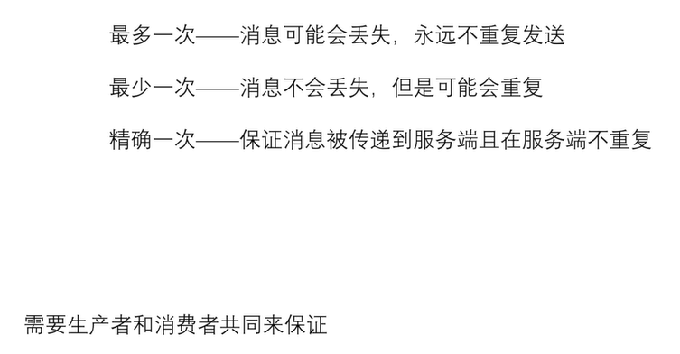
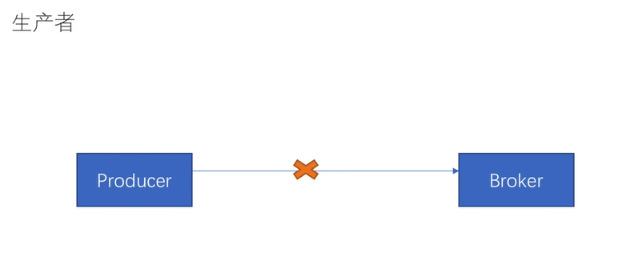
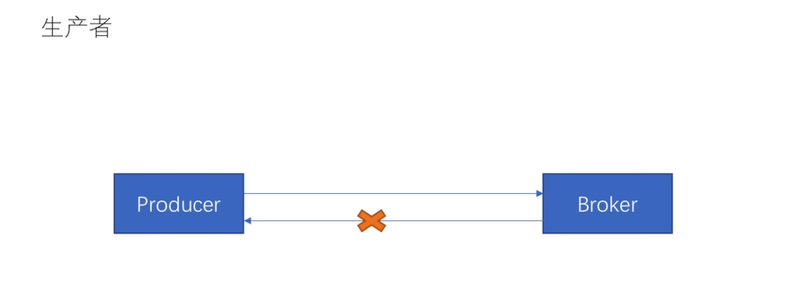
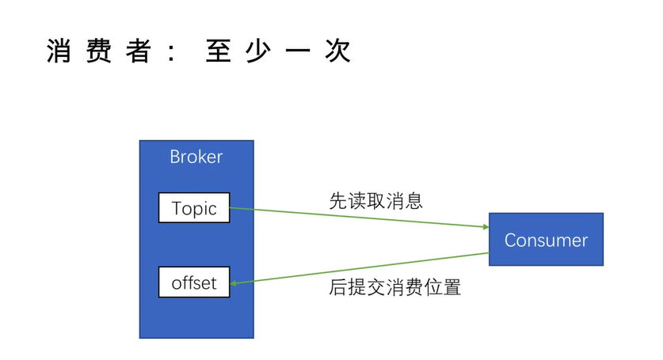
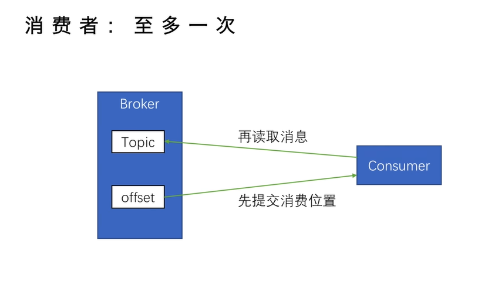
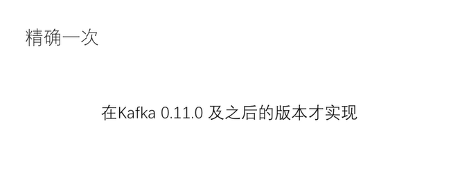
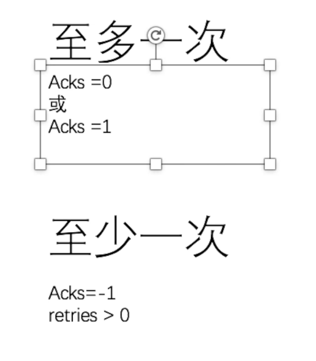
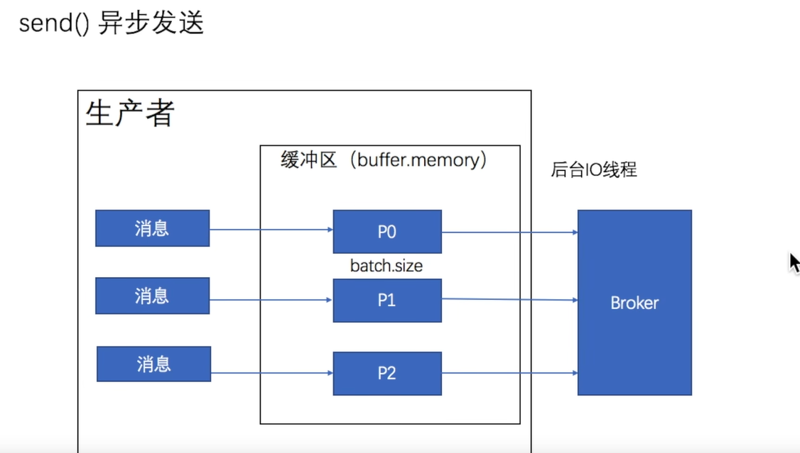

# 消息传递语义

> 一般使用的是最少一次；但是有可能会导致重复的问题；
>
> **在消息重复和消息丢失方面做一个平衡**；
>
> 

---

最多一次：消息可能会丢失，但是永远不重复发送；

最少一次：消息不会丢失，但是可能会重复；

精确一次：保证消息传递到客户端且在客户端不重复；

需要消费者和生产者共同来保证；

---

##  producer  生产者

>ack 来确认；

### 至多一次；

> 发送消息就失败 ；不进行ack，会导致**消息丢失**的问题；不会重复发送； 不管有没有收到我都不会重复发送；

### 至少一次

> ack的过程失败；producer 会重发，然后会导致**消息重复**问题；

## consumer   消费者

>offset 来确认；

### 至少一次

> 消费失败，还会读取上一条消息；就会导致重复消费的问题；

### 至多一次；

>消费失败，也会进入到下一个offset消息；会存在消息丢失的问题；

## 精确一次

----

acks 参数；

生产者的acks；

- **kafka在生产者发送完一个消息之后，要求broker在规定的时间内Ack应答；如果没有在规定时间内ack；生产者会尝试n次重新发送消息。**
- acks=1 （默认）**Leader会将Record写在其本地日志中；**但不会等待所有Follower的完全确认的情况下做出响应，这种情况下，如果**Leader在确认记录后立即失败，在Follower复制记录之前失败，则记录会丢失**
- acks=0 生产者不等待服务器确认，**将记录加载到缓冲区即视为发送**；这种情况不能保证服务器已收到记录；

- acks=all 表示Leader将等待全套同步副本确认记录。保证至少一个同步副本仍处于活动状态，记录不会丢失。-- 等效于acks= -1。

acks = 0; 不需要broker的确认； 至少一次；会导致数据的丢失；

acks = 1; 代表只需要leader服务器，ack，不会等待所有的follower服务器ack；会导致follower的复制数据丢失；

acks = all;  等待确认，并且主从同步； 数据不会丢失 ；

异步  只需要送到 缓冲区 就可以了；直接返回；ack；

ack = 0; 直接送到缓存区然后完事；

acks = 1；要磁盘化leader的数据；

acks = -1； ack 并且；

