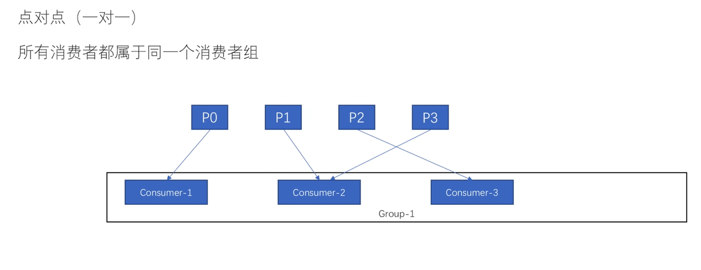

# 消费者组的概念

>消费者组的概念  --group g1;
>
>

## 为什么 同一个分区不能被同一个消费者组的消费者去消费

>如果是同一个消费者组去消费同一个分区partition肯定会存在，锁竞争的问题，因为要保证我们只需要一个消费者去消费就可以了； 提高吞吐量和并发性能，没有引入竞争的机制；
>
>不然会存在消费者竞争的问题；
>
>避免锁竞争的问题；


## 发布-订阅模式

>发布订阅，


## 点对点模式

>不能保证顺序性，同一个消费者有多个消费者，可以提高消费能力；
>
>



## 顺序的点对点模式

>kafka 要想保证顺序性，只能在同一个partition内；只能有一个消费者去消费数据；


## Kafka 消费者组

Consumer Group 是kafka 当中比较有亮点的设计了。

### 1. 消费者组的特点：


> <font color=red>**一个分区只可以被消费组中的一个消费者所消费。**</font>
>
> **一个消费组中的一个消费者可以消费多个分区，例如 `C1` 消费了 `P0, P3`。**

一个消费组中的不同消费者消费的分区一定不会重复，例如：


```armasm
C1 -> P0、P3
C2 -> P1、P2
```

所有消费者一起消费所有的分区，例如 `C1` 和 `C2` 共同完成了对 `P0、P1、P2、P3` 的消费。

在不同消费组中，每个消费组都会消费所有的分区，例如，消费组A、消费组B 都消费了 `P0、P1、P2、P3`。

同一个消费组里面的消费者对分区是互斥的，例如 `C1 和 C2` 不会消费同一个分区；而分区在不同的消费组间是共享的。

----


### 2. 消费者组的优势

- #### 高性能

[](https://img2022.cnblogs.com/blog/1723772/202208/1723772-20220812131845059-1038347212.png)

假设一个主题有10个分区，如果没有消费者组，只有一个消费者对这10个分区消费，他的压力肯定大。

[](https://img2022.cnblogs.com/blog/1723772/202208/1723772-20220812131919938-529839046.png)

如果有了消费者组，组内的成员就可以分担这10个分区的压力，提高消费性能。

- #### 消费模式灵活

**假设有4个消费者订阅一个主题，不同的组合方式就可以形成不同的消费模式。**

[](https://img2022.cnblogs.com/blog/1723772/202208/1723772-20220812132000515-1528046755.png)

**使用4个消费者组，每组里放一个消费者，利用分区在消费者组间共享的特性，就实现了广播（发布订阅）模式。**

[](https://img2022.cnblogs.com/blog/1723772/202208/1723772-20220812132036562-1713453403.png)

**只使用一个消费者组，把4个消费者都放在一起，利用分区在组内成员间互斥的特性，就实现了单播（队列）模式。**


---


- #### 故障容灾

如果只有一个消费者，出现故障后就比较麻烦了，但有了消费者组之后就方便多了。

消费组会对其成员进行管理，在有消费者加入或者退出后，消费者成员列表发生变化，消费组就会执行再平衡的操作。

**例如一个消费者宕机后，之前分配给他的分区会重新分配给其他的消费者，实现消费者的故障容错。**

#### 消费者组的好处：

- 消费效率更高
- 消费模式灵活
- 便于故障容灾

------

**Consumer Group 是 Kafka 提供的可扩展且具有容错性的消费者机制。**

- Consumer Group 下可以有一个或多个 Consumer 实例。
- Group ID 是一个字符串，在一个 Kafka 集群中，它标识唯一的一个 Consumer Group。
- Consumer Group 下所有实例订阅的主题的单个分区，只能分配给组内的某个 Consumer 实例消费。这个分区当然也可以被其他的 Group 消费。

----


#### 一般的消息队列模型

1. **传统点对点模型**是消息一旦被消费，就会从队列中被删除，而且只能被下游的一个 Consumer 消费。这既是特性，也是一种伸缩性比较差的缺陷。

   ----

   

2. **传统发布/订阅模型**允许消息被多个 Consumer 消费，但它的问题也是伸缩性不高，因为每个订阅者都必须要订阅消费主题的所有分区。

----


#### Kafka的消费者组解决的问题

**Kafka使用 Consumer Group 这一种机制，可以实现了传统消息引擎系统的两大模型。**如果所有实例都属于同一个 Group，那么它实现的就是消息队列模型；如果所有实例分别属于不同的 Group，那么它实现的就是发布 / 订阅模型。


**除此以外，因为同个消费组多个消费者实例共同分担消费各个Topic分区，也就提高了伸缩性。**

理想情况下，**Consumer 实例的数量应该等于该 Group 订阅主题的分区总数，这样每个Consumer实例理想情况都会分担一个分区都消费任务，也不会造成资源浪费(牺牲可用性)。**


### Kafka消费位移

针对 Consumer Group，Kafka 是怎么管理位移的呢？

消费者在消费的过程中需要记录自己消费了多少数据，即消费位置信息。在 Kafka 中，这个位置信息有个专门的术语：**位移（Offset）**。

##### 新老版本差异：

- **老版本的 Consumer Group 把位移保存在 ZooKeeper 中**。将位移保存在 ZooKeeper 外部系统的做法，最显而易见的好处就是减少了 Kafka Broker 端的状态保存开销。缺点：ZooKeeper 这类元框架其实并不适合进行频繁的写更新，而 Consumer Group 的位移更新却是一个非常频繁的操作。这种大吞吐量的写操作会极大地拖慢 ZooKeeper 集群的性能。
- **新版本的 Consumer Group 中，Kafka 社区重新设计了 Consumer Group 的位移管理方式，采用了将位移保存在 Kafka 内部主题的方法。这个内部主题就是让人既爱又恨的 __consumer_offsets。**