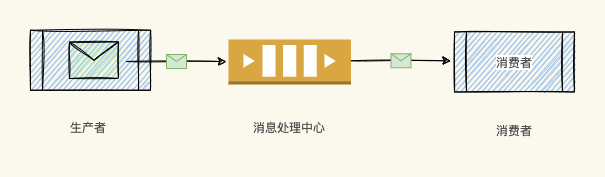
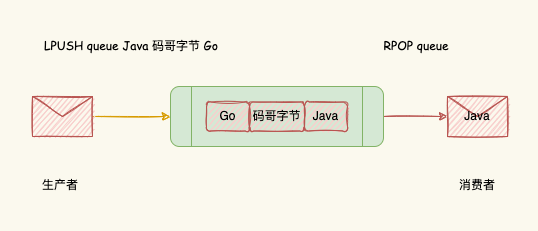
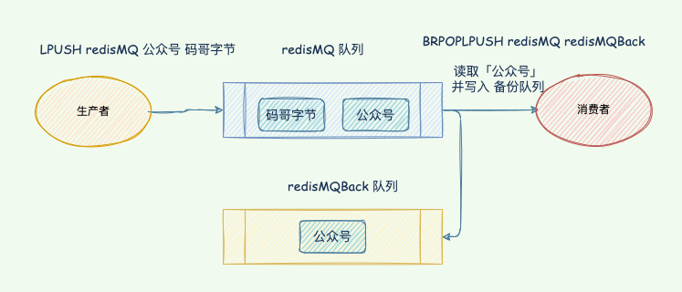
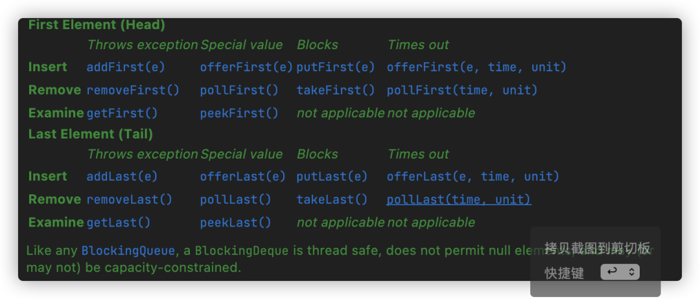

# redis 消息队列


## list 

缺点：

不支持重复消费，消费者拉取消息之后，这条消息，就从list中删除了，无法被其他的消费者再次消费，即**不支持多个消费者消费同一批数据；**


**消息丢失，消费者拉去消息之后，如果发生异常宕机，这条消息就会丢失；**


消息可以堆积，占用内存；可以无限的堆积；只要内存够；


## subscribe 订阅  消息的转发，不是一种数据类型；

多个消费者；


其他的都不满足；

阻塞也不满足；

他不是一种数据结构；所以不会持久化，所以肯定会有数据的丢失；

消费失败不满足重复消费；因为仅仅是消息的转发；当消费者不存在的时候直接丢弃消息；

消息堆积的时候，会踢掉消费者，直接把消息丢弃；


## stream

缺点：

* 本身的AOF的持久化；宕机后数据会丢失；  数据的丢失；
* 数据的堆积，需要去设置，内存限制大小，超出内存大小会会去丢失信息；  数据的堆积；


---


##  当消息堆积问题的解决方案？

* 限制生产者的生产速度；
* 丢弃信息；stream就是用这个方案；


## list 怎么保证消息队列重复消费的问题；


`````php
#BRPOPLPUSH
Redis有个命令叫做LPUSHRPOP（以及阻塞版本和不同方向的版本），即从一个队列弹出的同时将这个消息送入另一个队列，同时返回给客户端。原子操作。
    于是，可靠队列就能够实现了。
    #每一个消费者都维护一个 队列；
 假设待处理任务队列为 waitingTaskList N个消费者各自维护一个处理中队列 runningTaskListN大概处理流程如下：
    
    0. 重启/启动时检查runningTaskList N 中是否有上次未完成任务，每都要先检查runingtasklist 有没有消费完成；完成之后在处理后面的；
    1. 执行 LPUSHRPOP waitingTaskList runningTaskListN
    2. 执行处理
    3. 删除runningTaskListN中任务
    
    其实Redis官方文档上就提到过这事情怎么处理

`````


[分布式](https://so.csdn.net/so/search?q=分布式&spm=1001.2101.3001.7020)系统中必备的一个中间件就是消息队列，通过消息队列我们能对服务间进行异步解耦、流量消峰、实现最终一致性。

目前市面上已经有 `RabbitMQ、RochetMQ、ActiveMQ、Kafka`等，有人会问：“Redis 适合做[消息队列](https://so.csdn.net/so/search?q=消息队列&spm=1001.2101.3001.7020)么？”

在回答这个问题之前，我们先从本质思考：

- 消息队列提供了什么特性？
- Redis 如何实现消息队列？是否满足存取需求？

今天，码哥结合消息队列的特点一步步带大家分析使用 Redis 的 List 作为消息队列的实现原理，并分享如何把 SpringBoot 与 Redission 整合运用到项目中。

# 什么是消息队列

消息队列是一种异步的服务间通信方式，适用于分布式和微服务架构。消息在被处理和删除之前一直存储在队列上。

每条消息仅可被一位用户处理一次。消息队列可被用于分离重量级处理、缓冲或批处理工作以及缓解高峰期工作负载。



消息队列

- Producer：消息生产者，负责产生和发送消息到 Broker；
- Broker：消息处理中心。负责消息存储、确认、重试等，一般其中会包含多个 queue；
- Consumer：消息消费者，负责从 Broker 中获取消息，并进行相应处理；

**消息队列的使用场景有哪些呢？**

消息队列在实际应用中包括如下四个场景：

- 应用耦合：发送方、接收方系统之间不需要了解双方，只需要认识消息。多应用间通过消息队列对同一消息进行处理，避免调用接口失败导致整个过程失败；
- 异步处理：多应用对消息队列中同一消息进行处理，应用间并发处理消息，相比串行处理，减少处理时间；
- 限流削峰：广泛应用于秒杀或抢购活动中，避免流量过大导致应用系统挂掉的情况；
- 消息驱动的系统：系统分为消息队列、消息生产者、消息消费者，生产者负责产生消息，消费者(可能有多个)负责对消息进行处理；

## 消息队列满足哪些特性

**消息有序性**


消息是异步处理的，但是消费者需要按照生产者发送消息的顺序来消费，避免出现后发送的消息被先处理的情况。


<font color=red>**重复消息处理**  这个问题 怎么去解决 ，重复消费的问题？？？？</font >


**生产者可能因为网络问题出现消息重传导致消费者可能会收到多条重复消息。**

**同样的消息重复多次的话可能会造成一业务逻辑多次执行，需要确保如何避免重复消费问题。**


**可靠性**

list 可以用创建一个新的队列来处理，blpoprpush();来处理；

一次保证消息的传递。如果发送消息时接收者不可用，消息队列会保留消息，直到成功地传递它。

//消费者失败，数据会保留；

当消费者重启后，可以继续读取消息进行处理，防止消息遗漏。

# List 实现消息队列

Redis 的列表（List）是一种线性的有序结构，可以按照元素被推入列表中的顺序来存储元素，能满足「先进先出」的需求，这些元素既可以是文字数据，又可以是二进制数据。

**LPUSH**

生产者使用 `LPUSH key element[element...]` 将消息插入到队列的头部，如果 key 不存在则会创建一个空的队列再插入消息。

如下，生产者向队列 queue 先后插入了 「Java」「码哥字节」「Go」，返回值表示消息插入队列后的个数。

```go
> LPUSH queue Java 码哥字节 Go


(integer) 3
```

**RPOP**

消费者使用 `RPOP key` 依次读取队列的消息，先进先出，所以 「Java」会先读取消费：

```go
> RPOP queue


"Java"


> RPOP queue


"码哥字节"


> RPOP queue


"Go"
```



List队列

## 实时消费问题

65 哥：**这么简单就实现了么？**

别高兴的太早，`LPUSH、RPOP` 存在一个性能风险，生产者向队列插入数据的时候，List 并不会主动通知消费者及时消费。

我们需要写一个 `while(true)` 不停地调用 `RPOP` 指令，当有新消息就会返回消息，否则返回空。

程序需要不断轮询并判断是否为空再执行消费逻辑，这就会导致即使没有新消息写入到队列，消费者也要不停地调用 `RPOP` 命令占用 `CPU` 资源。

65 哥：**要如何避免循环调用导致的 CPU 性能损耗呢？**

Redis 提供了 `BLPOP、BRPOP` 阻塞读取的命令，**消费者在在读取队列没有数据的时候自动阻塞，直到有新的消息写入队列，才会继续读取新消息执行业务逻辑。**

```go
BRPOP queue 0
```

参数 0 表示阻塞等待时间无无限制


## <font color=red>重复消费</font>


- 消息队列为每一条消息生成一个「全局 ID」；
- 生产者为每一条消息创建一条「全局 ID」，消费者把一件处理过的消息 ID 记录下来判断是否重复。

其实这就是幂等，对于同一条消息，消费者收到后处理一次的结果和多次的结果是一致的。


## 消息可靠性

65 哥：**消费者从 List 中读取一条在消息处理过程中宕机了就会导致消息没有处理完成，可是数据已经没有保存在 List 中了咋办？**

本质就是消费者在处理消息的时候崩溃了，就无法再还原消息，缺乏一个消息确认机制。

Redis 提供了 `RPOPLPUSH、BRPOPLPUSH(阻塞)`两个指令，含义是从 List 从读取消息的同时把这条消息复制到另一个 List 中（备份），并且是原子操作。

我们就可以在业务流程正确处理完成后再删除队列消息实现消息确认机制。如果在处理消息的时候宕机了，重启后再从备份 List 中读取消息处理。

```go
LPUSH redisMQ 公众号 码哥字节


BRPOPLPUSH redisMQ redisMQBack
```

生产者用 `LPUSH` 把消息插入到 redisMQ 队列中，消费者使用 `BRPOPLPUSH` 读取消息「公众号」，同时该消息会被插入到 「redisMQBack」队列中。

如果消费成功则把「redisMQBack」的消息删除即可，异常的话可以继续从 「redisMQBack」再次读取消息处理。



redis消息确认机制

**需要注意的是，如果生产者消息发送的很快，而消费者处理速度慢就会导致消息堆积，给 Redis 的内存带来过大压力。**

# Redission 实战

在 Java 中，我们可以利用 Redission 封装的 API 来快速实现队列，接下来码哥基于 SpringBoot 2.1.4 版本来交大家如何整合并实战。

详细 API 文档大家可查阅：

https://github.com/redisson/redisson/wiki/7.-Distributed-collections

## 添加依赖

```go
<dependency>


  <groupId>org.redisson</groupId>


  <artifactId>redisson-spring-boot-starter</artifactId>


  <version>3.16.7</version>


</dependency>
```

添加 Redis 配置，码哥的 Redis 没有配置密码，大家根据实际情况配置即可。

```go
spring:


  application:


    name: redission


  redis:


    host: 127.0.0.1


    port: 6379


    ssl: false
```

## Java 代码实战

RBlockingDeque 继承 `java.util.concurrent.BlockingDeque` ，在使用过程中我们完全可以根据接口文档来选择合适的 API 去实现业务逻辑。

主要方法如下：



码哥采用了双端队列来举例

```go
@Slf4j


@Service


public class QueueService {


 


    @Autowired


    private RedissonClient redissonClient;


 


    private static final String REDIS_MQ = "redisMQ";


 


    /**


     * 发送消息到队列头部


     *


     * @param message


     */


    public void sendMessage(String message) {


        RBlockingDeque<String> blockingDeque = redissonClient.getBlockingDeque(REDIS_MQ);


 


        try {


            blockingDeque.putFirst(message);


            log.info("将消息: {} 插入到队列。", message);


        } catch (InterruptedException e) {


            e.printStackTrace();


        }


    }


 


    /**


     * 从队列尾部阻塞读取消息，若没有消息，线程就会阻塞等待新消息插入，防止 CPU 空转


     */


    public void onMessage() {


        RBlockingDeque<String> blockingDeque = redissonClient.getBlockingDeque(REDIS_MQ);


        while (true) {


            try {


                String message = blockingDeque.takeLast();


                log.info("从队列 {} 中读取到消息：{}.", REDIS_MQ, message);


            } catch (InterruptedException e) {


                e.printStackTrace();


            }


 


        }


    }
```

## 单元测试

```go
@RunWith(SpringRunner.class)


@SpringBootTest(classes = RedissionApplication.class)


public class RedissionApplicationTests {


 


    @Autowired


    private QueueService queueService;


 


    @Test


    public void testQueue() throws InterruptedException {


        new Thread(() -> {


            for (int i = 0; i < 1000; i++) {


                queueService.sendMessage("消息" + i);


            }


        }).start();


 


        new Thread(() -> queueService.onMessage()).start();


 


        Thread.currentThread().join();


    }


 


 


}
```

# 总结

可以使用 List 数据结构来实现消息队列，满足先进先出。为了实现消息可靠性，Redis 提供了 BRPOPLPUSH 命令是解决。

Redis 是一个非常轻量级的键值数据库，部署一个 Redis 实例就是启动一个进程，部署 Redis 集群，也就是部署多个 Redis 实例。

而 Kafka、[RabbitMQ](https://so.csdn.net/so/search?q=RabbitMQ&spm=1001.2101.3001.7020) 部署时，涉及额外的组件，例如 Kafka 的运行就需要再部署 ZooKeeper。相比 Redis 来说，Kafka 和 RabbitMQ 一般被认为是重量级的消息队列。

**需要注意的是，我们要避免生产者过快，消费者过慢导致的消息堆积占用 Redis 的内存。**

在消息量不大的情况下使用 Redis 作为消息队列，他能给我们带来高性能的消息读写，这似乎也是一个很好消息队列解决方案。

大家觉得是否合适作为消息队列呢？

