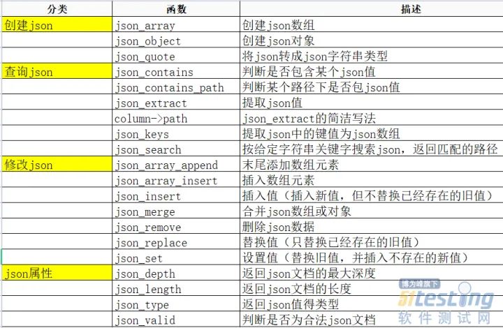

#  Json数据类型

>主要是存储json对象和json数组；
>
>要求是5.7.8 以上才能使用；
>
>select version();
>
>同 TEXT，BLOB 字段一样，JSON 字段不允许直接创建索引。

----


##JSON 数据格式；

JSON 是 JavaScript Object Notation（JavaScript 对象表示法）的缩写，是一个轻量级的，基于文本的，跨语言的数据交换格式。易于阅读和编写。

JSON 的基本数据类型如下：

- 数值：十进制数，不能有前导 0，可以为负数或小数，还可以为 e 或 E 表示的指数。

- <font color=red>字符串：字符串必须用双引号括起来。</font>

- 布尔值：true，false。

- 数组：一个由零或多个值组成的有序序列。每个值可以为任意类型。数组使用方括号`[]` 括起来，元素之间用逗号`,`分隔。譬如，

  ```
  [1, "abc", null, true, "10:27:06.000000", {"id": 1}]
  ```

- <font color=red>**对象：一个由零或者多个键值对组成的无序集合。其中键必须是字符串，值可以为任意类型。必须是键值对的形式；**</font>

  对象使用花括号`{}`括起来，键值对之间使用逗号`,`分隔，键与值之间用冒号`:`分隔。譬如，

  ```
  {"db": ["mysql", "oracle"], "id": 123, "info": {"age": 20}}
  ```

- 空值：null。


---

## MySQL json数据格式的使用；

>5,7 可以使用json数据类型把；

``````mysql
mysql> create database demo;
Query OK, 1 row affected (0.00 sec)

mysql> use demo;
Database changed
mysql> create table json(a json)
    -> ;
Query OK, 0 rows affected (0.05 sec)

mysql> desc json;
+-------+------+------+-----+---------+-------+
| Field | Type | Null | Key | Default | Extra |
+-------+------+------+-----+---------+-------+
| a     | json | YES  |     | NULL    |       |
+-------+------+------+-----+---------+-------+
1 row in set (0.00 sec)

mysql> insert into json values('{"ceshi":{"ceshi1":"ceshi12"},["ceshi2",1,null,false,true]}');
ERROR 3140 (22032): Invalid JSON text: "Missing a name for object member." at position 30 in value for column 'json.a'.
mysql> insert into json values('{"ceshi":{"ceshi1":"ceshi12"},"ceshi2":["ceshi21",1,null,false,true]}');
Query OK, 1 row affected (0.01 sec)

## JSON_EXTRACT的缩写方式，通过’$.’指定json中的值
mysql> select a->"$.ceshi1" from json;
+---------------+
| a->"$.ceshi1" |
+---------------+
| NULL          |
+---------------+
1 row in set (0.00 sec)

``````


## json 对象的操作





---

## 实例


```sql
-- 创建表时指定 JSON 数据类型的列
CREATE TABLE my_table (
  id INT PRIMARY KEY,
  data JSON
);

-- 插入 JSON 数据
INSERT INTO my_table (id, data) VALUES (1, '{"name": "John", "age": 30}');

-- 查询 JSON 数据
SELECT data->'$.name' AS name, data->'$.age' AS age FROM my_table WHERE id = 1;

-- 更新 JSON 数据
UPDATE my_table SET data = JSON_SET(data, '$.age', 31) WHERE id = 1;

-- 删除 JSON 数据中的某个属性
UPDATE my_table SET data = JSON_REMOVE(data, '$.age') WHERE id = 1;
-- 请注意，虽然 MySQL 5.7 支持 JSON 数据类型，但它的功能相对较简单

```

