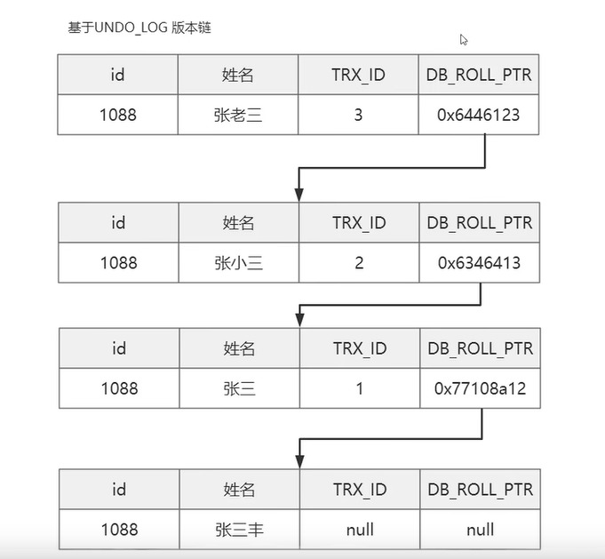

# MVCC  --- 精讲  MVCC  多版本并发控制；

> RC  和 RR 读提交和可重复读是基于mvcc进行并发控制的；
>
>mvcc 是基于“数据版本”对事物进行并发控制；

RC级别会出现不可重复的问题；

## mvcc的组成；

####**undo log 版本链**

不会被引用知乎才会进行删除；并不是立即删除；所有的事物都不会引用的时候会被删除

####ReadView   一致性视图

注意： select ... lock in share mode; 也是当前读；

注意： 只有快照读的时候才会使用mvcc；

当使用当前读的时候使用行锁和间隙锁来实现；

Readview  是一个数据结构，包括四个字段；

* m_Ids：当前活跃的事物编号记号；
* min_trx_id： 最小事物id；
* max_trx_Id: 最大事物id；
* creator_trx_Id: ReadView 创建者的事物id；

#### 

**快照读：普通读 是读取的一致性视图的内容；**

**当前读：当前读 是已经提交事务的最新数据；**

-----

## 快照下的MVCC

#### RC

在每次执行快照读的时候都会生成新的readview；

#### RR

在执行第一次sql语句的时候生成readview；

并且当执行一次当前读的时候生成readview；确实会更新readview；

----

**到底该返回哪个版本呢，这个是由ReadView决定的**！！！

---

**还存在的问题；当两个快照读之间有当前读的时候会产生幻读的问题；**

