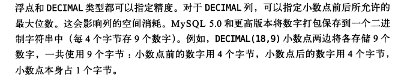
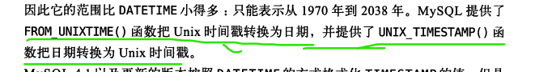
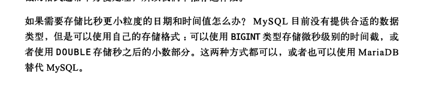
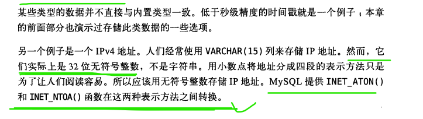
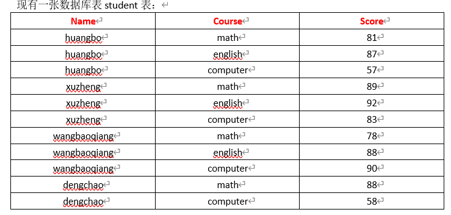

# SQL


````mysql
#基础操作命令
select * from table_name;
delete from table_name where id = xxx;
update table set column_name=134 where id = 111;
insert into table(column_name,...) values(),(),();  #插入

# 查看表结构
show create table table_name;  # 创建表的sql语句# 表结构；
desc table_name;


#DDL  数据定义语言
show  #也是数据定义语言；
create table 

alter #很重要；索引 和 字段；相关的操作；
	
drop table;
truncate table；

rename 
alter table table_name rename as new_table_name;
#DML 数据操作语言
select 
update
delete 
insert 

#DCL 数据控制语言

grant revoke  
CREATE USER '用户名'[@'登录主机名'] [ IDENTIFIED BY ] [  '密码' ]
mysql> create user 'laravel'@'%' identified by 'laravel';
Query OK, 0 rows affected (0.00 sec)

#在MySQL数据库中有一个很重要的特点就是权限传递，如果在为用户授权的时候没有添加with grant option参数，则权限不能传递，这个用户不能给他人赋予权限；
# '*.*' 第一个* 代表的是数据库 第二个代表的是表；
## 用户格式 就是''@''的形式！！！
mysql> grant all privileges on demo.* to 'laravel'@'%' with grant option;
Query OK, 0 rows affected (d0.00 sec)

revoke all privileges on *.*  from 'su'@'%';
flush privileges; #重写加载权限表；不需要去重新连接；

#TCL 事务控制语言
set autocommit = 0;
begin
commit 
set transaction_isolation;
rollback

show variables like "%pagesize%;查看属性"
show  processlist; ## 查看连接数；
show index from table_name;

#表的赋值和导入；----做数据的测试；
# as 是create view v_name as 
create table table_name  select * from tableA;
insert into table_name  select * from tableA;

````


## sql的执行顺序很重要

form  join  on =>   生成一个表

where 筛选记录

group by   分组； //注意 聚集函数  当没有group by的时候 就对整张表这个组来进行操作；  注意这里的group by：在不使用聚集函数的时候显示的仅仅是第一条数据；

having 对分组的筛选；一般是用

select  数据的查询； 


//之后的数据处理就需要临时表了？？？？  其实这边已经把结果返回来了，之后的操作都是对结果集的操作；

// 之后的数据就是对结果集的处理

注意这几个东西：下面的这个东西 也许需要临时表 或者sort的时候需要filesort的作用；


union union all 联表

order by  排序；  order by desc  asc；   <font color=red>  **order by column_name desc;  order by column_name1,colulmn_name2 desc   就是先根据name1 排序，然后相同的时候按照name2排序；**</font>

limit x offset y;  结果集的个数；


limit x offset y；

比较慢就是因为；	


### 联表join

一般使用内接；join  select \* from tableA,tableB; 加一个where条件；

`````mysql
# 联表条件 tableA join tableB on 关联条件 其实就是生成一个表；
select * from (tableA as a join tableB as b on a.id=c.id);
`````


 SELECT DISTINCT vend_id,prod_id FROM Products; distinct  就是这两个字段加载一起不同的；  

**注意：DISTICT 是对所有的字段定义的；**


用不用索引一个很好用的例子；

有索引就是有目录的书；

没有索引就是一本没有目录的书；

然后查询一些内容看需不需要目录；

not not in != 肯定用不到索引呀；你找一些不是锁的章节；肯定不走索引呀；需要一张一张的去找；


or  可以使用union来解决；  或者条件；

注意 联合查询的and条件  如果联合索引是a b c 那么and 只有 a=1111 and b = 222 这样b才会走索引；  如果是a>10 and b =1; a走索引b肯定不走索引；联合索引的条件；

只有a等一个数 b才会是顺序的，所以查询的受才会走索引；当你a>0 那么b肯定不是有序的，就不会走索引；


```mysql
### 少用"OR"的原因主要是因为"OR"操作符会导致查询性能下降。
###当使用"OR"操作符时，数据库引擎往往无法有效利用索引，因为"OR"操作符会导致多个条件的组合，使得优化器难以选择合适的索引进行查询。这可能会导致全表扫描，即使存在索引也无法有效利用索引。
##相比之下，使用"AND"操作符可以更好地利用索引，因为"AND"操作符可以逐步缩小结果集，使得优化器更容易选择合适的索引进行查询。另外，可以考虑使用UNION或者UNION ALL来替代"OR"操作符，以避免全表扫描，提高查询性能。因此，为了提高查询性能，应尽量避免在查询条件中过多地使用"OR"操作符。
```


### 两个比较重要的DDL 语言；

````mysql
#alter
# 字段--------------------------------------------------------------
alter table table_name add column column_name char(20);
#添加column 添加字段 在那个字段之后 after 或者 before
alter table actor
add column create_date datetime NOT NULL DEFAULT"2020-10-01 00:00:00"
after last_update;
# 删除
alter table table_name drop column column_name;

# 修改；
alter table table_name modify  column_name varchar(); #只能修改属性
alter table table_name change old_column_name new_column_name varchar();

#索引-------------------------------------------------
alter table table_name add index index_name(column_name);
alter table table_name add unique index index_name(column_name);
alter table table_name add index index_name(column_name1,column_name2);
alter table table_name drop index index_name;

#添加主键索引；
alter table table_name add primary key(column_name);
alter table table_name drop primary key;


#删除表----------------------------------------------------
drop table if exists actor;
#修改表名
alter table table_name rename as new_table_name;


#create table;
create database db_name;
#create table --------------------------------------

create table actor(
actor_id smallint(5) auto_increment not null,
first_name varchar(45) not null comment"名字",
last_name varchar(45) not null comment"xingshi",
last_update date not null comment"riqi",
primary key(actor_id)
)engine=innodb charset=utf8

| ceshi | CREATE TABLE `ceshi` (
  `id` int(11) unsigned NOT NULL AUTO_INCREMENT,
  `name` varchar(20) NOT NULL DEFAULT '',
  `age` int(11) NOT NULL DEFAULT '0',
  `time` timestamp NOT NULL DEFAULT CURRENT_TIMESTAMP ON UPDATE CURRENT_TIMESTAMP,
  `calass` enum('class1','class2','class3') DEFAULT NULL,
  `label` bit(1) NOT NULL DEFAULT '0',
  PRIMARY KEY (`id`),
   # KEY key_name('age')
  #   KEY key_name('age','name'),
     #UNIQUE KEY key_name1('time'),
) ENGINE=InnoDB DEFAULT CHARSET=utf8

#unsigned   无符号；
 create table ceshi( id int(11) unsigned auto_increment not null, primary key(id) )engine=innodb charset=utf8;
 
 
 
 CREATE TABLE `ceshi` (
  `id` int(11) unsigned NOT NULL AUTO_INCREMENT,
  `name` varchar(20) NOT NULL DEFAULT '',
  `age` int(11) NOT NULL DEFAULT '0',
  `time` timestamp NOT NULL DEFAULT CURRENT_TIMESTAMP ON UPDATE CURRENT_TIMESTAMP,
  `calass` enum('class1','class2','class3') DEFAULT NULL,
  `label` bit(1) NOT NULL DEFAULT '0',
  PRIMARY KEY (`id`),
) ENGINE=InnoDB DEFAULT CHARSET=utf8 


#mysql 的数据类型；
#整型
#2^32 = 42亿(总共显示10位)；9位是一亿；int(11) unsigned bigint(20)  能显示所有的位数就可以了 2^64总共也就20位显示20位完全够了；

tinyint 1字节 比较常用；
smallint 2字节
mediumint 3字节
int  4字节
bigint 8字节
bit 1位
#浮点型
float 4字节
double  8字节
decimal M+2;  amount DECIMAL(19,4); # 9位数是一亿；一般都是(19,4);
#字节数是 M+2
#DECIMAL列 的声明语法 是 . 参数值的范围如下： DECIMAL(M,D)

#M是最大位数（精度）。它的范围是 1 到 65。

#D是小数点右边的位数（刻度）。它的范围是 0 到 30，并且不能大于M.
# 字符串
char 0-255   
varchar 0-65535
##  create table test(id int(11) unsigned auto_increment,a int(11) not null default 1,b enum('nan','nv') default 'nv',primary key(id));
## insert into test(b) values(1); // 1 nan 
## 批量插入   insert into teset(b) values(1),(2);
enum  #用枚举来代替常用的字符串； e enum('nan','nv');  排序是按照数字来排序的，插入也是插入index 也是可以成功的，显示是枚举内容；

#几个text  和 blob 存储比较大的字符串设计的；
blob 二进制存储； 现在基本不怎么用了把； 存放一张图片；？？？？？
TEXT - 64KB(65,535个字符)
MEDIUMTEXT - 16MB(16,777,215个字符)
LONGTEXT - 4GB(4,294,967,295个字符)

# 时间
datetime 日期函数 8个字节;
timestamp  时间戳  4个字节；

#请注意，TEXT数据不存储在数据库服务器的内存中，因此，每当查询TEXT数据时，MySQL都必须从磁盘读取它，这与CHAR和VARCHAR相比要慢得多。

##  json数据格式；？？？？？//todo 搞一下；

# 可以存储 json对象和json对象数组
#特殊的数据类型
null
````

## 子查询

````mysql
#非相关子查询  注意 聚集函数  当没有group by的时候 就对整张表这个组来进行操作；
select * from books where  price > (select avg(price) from books )  #求超过平均价格的书籍；
select * from books where borrowid in (select borrowid from borrow)  #查看被借阅过书籍的信息；

#相关子查询--- 子查询执行多次；
select * from books as a where price > (select avg(price) from books as b where b.id = a.id); #求的是某一个编号的书籍大于平均价格的书籍；id 就是一个编号；
````

##  数据的备份和恢复

````mysql
#备份
mysqldump -uroot -p 数据库名字 表名 > sql.db
#恢复
mysql -uroot -p
use demo; # 选择数据库 
source sql.db  导入就可以了；
````


## 高性能mysql的一些基础；







````mysql
select from_unixtime();
select unix_timestamp();
````







````mysql
#select inet_aton('192.168.1.3');
mysql> select inet_aton('192.168.1.3');
+--------------------------+
| inet_aton('192.168.1.3') |
+--------------------------+
|               3232235779 |
+--------------------------+
1 row in set (0.00 sec)
#select inet_ntoa( 3232235779);
mysql> select inet_ntoa( 3232235779);
+------------------------+
| inet_ntoa( 3232235779) |
+------------------------+
| 192.168.1.3            |
+------------------------+
1 row in set (0.00 sec)
````


## 比较常用的时间函数

去看 时间函数那一章节；

`````mysql
date_format();  
`````


## 比较好的案例--- 面试比较常问的；


`````mysql
# https://blog.csdn.net/qq_30031221/article/details/111831724 原型；
#course （id ，name）
#student （id，name）
#student_score (course_id,student_id,score)
#  每一个课程最高分的 学生的名字 
(
	select 
)
#课程 最高分 学生名字
#课程|最高分分数|学生名

select c.name,c.id,max(ss.score), from course as c join student_score as ss on c.id = ss.course_id group by c.id;


### 2
#分组；
select gender,university,count(device_id) as user_num,avg(active_days_within_30) as avg_active_day,avg(question_cnt)
from user_profile
group by university,gender


# 连表查询

select o.cust_id,sum(oi.item_price * oi.quantity) as total_ordered 
from OrderItems as oi join Orders as o on oi.order_num = o.order_num
group by o.cust_id
order by total_ordered desc;

# 分类；
select '25岁以下' as age_cut,count(device_id) as number
from user_profile
where age<25 or age is null

union all

select '25岁及以上' as age_cut,count(device_id) as number
from user_profile
where age>=25;

# if 条件的运用；
SELECT
    IF(age < 25 OR age IS NULL, "25岁以下", "25岁及以上") AS age_cut,
    COUNT(id) AS num
FROM
    user_profile
GROUP BY
    age_cut
`````




`````mysql
#先抽取出一张最高成绩表max_tbl，再逐条对比，验证，打印
select stu.course, stu.name 
from student as stu, (select course, max(score) as maxscore from student group by course) as max_tbl 
where stu.course =  max_tbl.coursewe
and stu.score = max_tbl.maxscore;
 # 根据课程名 做一个联表；

#---注意相等的问题； 最高分 有可能会有很多个人；
##---肯定要做联表处理；
mysql> select course, max(score) as maxscore from student group by course;
+--------+----------+
| course | maxscore |
+--------+----------+
| amth   |       81 |
| yuwen  |       76 |
+--------+----------+

mysql> select * from student;
+-------+--------+-------+
| name  | course | score |
+-------+--------+-------+
| name1 | amth   |    81 |
| name2 | amth   |    81 |
| name3 | amth   |    80 |
| name4 | yuwen  |    76 |
| name4 | yuwen  |    71 |
| name4 | yuwen  |    76 |
+-------+--------+-------+
6 rows in set (0.00 sec)
# 上面两个联表；
##  注意   一个表中 有可能有多个相等的最大值；需要注意一下这个！！！
mysql> select stu.course, stu.name,stu.score  from student as stu join (select course, max(score) as maxscore from student group by course) as max_tbl on stu.course = max_tbl.course where stu.score=max_tbl.maxscore;
+--------+-------+-------+
| course | name  | score |
+--------+-------+-------+
| amth   | name1 |    81 |
| amth   | name2 |    81 |
| yuwen  | name4 |    76 |
| yuwen  | name4 |    76 |

## 可不可以通过 select *,stu.score,max(score) over(partition by course) as maxscores from student as stu where stu.score = maxscores; // 是失败的；因为字段取别名，是发生在select 阶段，所以where 无法识别取别名的字段；
###-----------------------------------------------------------------------------------------------------------
##  这个是最优解！！！
select stu.course, stu.name,stu.score  from student as stu join (select course, max(score) over(partition by course) from student) as max_tbl on stu.course = max_tbl.course where stu.score=max_tbl.maxscore;


## 这里需要用distinct 来做去重 就会等于，上面的group by;
select distinct course,max(score) over(partition by course) from student;
## 和上面等价！！！
select course,max(score) from student group by course;
`````


````mysql
Mysql练习----
-- 12.28 查询一班   各科 成绩最高   的学生姓名
T1228A  a
+-------+---------+---------+
| stuID | classID | stuName |
+-------+---------+---------+
|     1 | A       | zhang   |
|     2 | A       | li      |
|     3 | B       | wang    |
+-------+---------+---------+
T1228B b
+---------+-----------+
| classID | className |
+---------+-----------+
| A       | 一班      |
| B       | 二班      |
+---------+-----------+
T1228C c
+-------+--------+-------+
| stuID | course | score |
+-------+--------+-------+
|     1 | 语文   |    80 |
|     1 | 数学   |    90 |
|     1 | 英语   |    70 |
|     2 | 语文   |    89 |
|     2 | 数学   |    91 |
|     2 | 英语   |    88 |
|     3 | 语文   |    75 |
|     3 | 数学   |    77 |
|     3 | 英语   |    72 |
+-------+--------+-------+
结果
+-------+---------+--------+-------+
| stuID | stuName | course | score |
+-------+---------+--------+-------+
|     2 | li      | 数学   |    91 |
|     2 | li      | 英语   |    88 |
|     2 | li      | 语文   |    89 |
+-------+---------+--------+-------+


方法一：
SELECT T1228A.stuID,stuName,t.course,t.score 
FROM T1228A JOIN
(
	SELECT stuID,course,score,
	ROW_NUMBER() OVER(PARTITION BY course ORDER BY score DESC) rk 
	FROM T1228C
) t
ON T1228A.stuID = t.stuID AND t.rk = 1
JOIN T1228B ON T1228A.classID=T1228B.classID AND T1228B.className = '一班' 

方法二：
## group 就决定了 最高和最低 min() max() 并不能看到 组的里面；必须和聚集函数来配合；
SELECT T1228A.stuID,T1228A.stuName,x.course,x.score FROM
(
    #  一班各科成绩最高的成绩和课程；
  SELECT c.course,MAX(c.score) score
	FROM T1228C c
	JOIN
	(
		SELECT a.stuID,a.stuName FROM T1228A a
  		JOIN T1228B b
  		ON a.classID = b.classID
  		WHERE b.className = '一班'
	)t 
	ON c.stuId = t.stuId
	GROUP BY c.course
)x
JOIN T1228C ON x.course = T1228C.course AND x.score = T1228C.score
JOIN T1228A ON T1228A.stuID = T1228C.stuID

————————————————
版权声明：本文为CSDN博主「jialun0116」的原创文章，遵循CC 4.0 BY-SA版权协议，转载请附上原文出处链接及本声明。
原文链接：https://blog.csdn.net/qq_30031221/article/details/111831724


### 自己的思路；
### --- 先求一班孩子的stu_id and stu_name

select a.stu_Id,a.stu_name from a join b on a.classId = b.classId where b.classNmae='一班';

###求孩子各科的最高成绩；
select 
````


//一些普通的sq练习

## join sql的练习

//todo

join  其实就是 笛卡尔积 ，然后用on过滤掉一部分数据？？？？

join 和on的区别？？


https://blog.csdn.net/qq_30031221/article/details/117753279


````mysql
###### 一定要练习和明白这个sql思维方式--- 做拆分；子查询和join的替换； --- 必看；
##  第二高的一个薪水；
编写一个 SQL 查询，获取 employee 表中第二高的薪水（salary） 。

mysql> select * from employee;
+----+--------+
| id | salary |
+----+--------+
|  1 |    100 |
|  2 |    200 |
|  3 |    300 |
|  4 |    200 |
+----+--------+
4 rows in set (0.01 sec)
例如上述 Employee 表，SQL查询应该返回 200 作为第二高的薪水。如果不存在第二高的薪水，那么查询应返回 null。

+---------------+
| second_salary |
+---------------+
|           200 |
+---------------+
###   --- 1
### limit 1 offset 1; // offset 偏移量是1，开始，limit，1结束；
select salary as second_salary from employee group by salary order by desc limit 1 offset 1;
select salary as second_salary from employee group by salary order by salary desc limit 1 offset 1;
### 获取第二高薪水的id；所有的id  --- 2
select e1.id from employee as e1 where salary = (
	select e2.salary from employee as e2 group by e2.salary order by e2.salary desc limit 1 offset 1;
);
### join的写法 --- 3 --- 使用派生表来实join 和 子查询的转换；
select id from employee as e1 join (select e2.salary from employee as e2 group by e2.salary desc limit 1 offset 1)
as t on t.salary = e1.salary;

#---------------------------------------------------------------------------------------------------------
mysql> create table employee(id int(11) unsigned auto_increment primary key,salary int(11) not null default 0)engine=innodb,charset=utf8mb4;
Query OK, 0 rows affected (0.02 sec)

mysql> insert into employee(salary) values(100),(200),(300);
Query OK, 3 rows affected (0.01 sec)
Records: 3  Duplicates: 0  Warnings: 0
### test 1
mysql> select salary as second_salary from employee group by salary desc limit 1 offset 1;
+---------------+
| second_salary |
+---------------+
|           200 |
+---------------+
1 row in set, 1 warning (0.01 sec)

### test 2
mysql> select e1.id from employee as e1 where salary=(select e2.salary from employee as e2 group by e2.salary order by e2.salary desc limit 1 offset 1);
+----+
| id |
+----+
|  2 |
|  4 |
+----+
2 rows in set (0.00 sec)

### test 3 找到第二高的薪的id；
mysql> select id from employee as e1 join (select e2.salary from employee as e2 group by e2.salary desc limit 1 offset 1) as t on t.salary = e1.salary;
+----+
| id |
+----+
|  2 |
|  4 |
+----+
2 rows in set, 1 warning (0.00 sec)

### 作者的------------------- 

select ifnull(
(select distinct salary from Employee order by salary desc limit 1,1),NULL) 
AS SecondHighestSalary

##第n高的薪水

   select ifnull(Salary, NULL)
   from 
    (  ## 派生表；
        select distinct Salary, dense_rank() over(order by Salary desc) rn 
        from Employee
    )t 
    where rn=N;
————————————————
版权声明：本文为CSDN博主「jialun0116」的原创文章，遵循CC 4.0 BY-SA版权协议，转载请附上原文出处链接及本声明。
原文链接：https://blog.csdn.net/qq_30031221/article/details/117753279
````


````mysql
####  ---- 
Employee 表包含所有员工，他们的经理也属于员工。每个员工都有一个 Id，此外还有一列对应员工的经理的 Id。

+----+-------+--------+-----------+
| Id | Name  | Salary | ManagerId |
+----+-------+--------+-----------+
| 1  | Joe   | 70000  | 3         |
| 2  | Henry | 80000  | 4         |
| 3  | Sam   | 60000  | NULL      |
| 4  | Max   | 90000  | NULL      |
+----+-------+--------+-----------+
给定 Employee 表，编写一个 SQL 查询，该查询可以获取收入超过他们经理的员工的姓名。在上面的表格中，Joe 是唯一一个收入超过他的经理的员工。

+----------+
| Employee |
+----------+
| Joe      |
+----------+

####  做一个数据的过滤就好了；
select a.name form employee as e1 join employee as e2 on e1.managerid=e2.id where e1.salary > e2.salary;

### 所有管理层id is null 无法使用索引，一般数据量比较小，所以也不需要使用索引，然后再一个就是 最好default 0 ; 会更好一些；
select id form employee where managerid is null;
 


select a.Name as Employee
from employee a inner join employee b
on a.ManagerId = b.Id
where a.salary > b.salary

````


`````mysql
## 重复邮箱名字；
编写一个 SQL 查询，查找 Person 表中所有重复的电子邮箱。

示例：

+----+---------+
| Id | Email   |
+----+---------+
| 1  | a@b.com |
| 2  | c@d.com |
| 3  | a@b.com |
+----+---------+
根据以上输入，你的查询应返回以下结果：

+---------+
| Email   |
+---------+
| a@b.com |
+---------+
说明：所有电子邮箱都是小写字母。
# 注意这里having  对聚集函数的筛选；

select Email from person
group by Email having count(1) > 1

`````


``````mysql
某网站包含两个表，Customers 表和 Orders 表。编写一个 SQL 查询，找出所有从不订购任何东西的客户。

Customers 表：

+----+-------+
| Id | Name  |
+----+-------+
| 1  | Joe   |
| 2  | Henry |
| 3  | Sam   |
| 4  | Max   |
+----+-------+
Orders 表：

+----+------------+
| Id | CustomerId |
+----+------------+
| 1  | 3          |
| 2  | 1          |
+----+------------+

例如给定上述表格，你的查询应返回：

+-----------+
| Customers |
+-----------+
| Henry     |
| Max       |
+-----------+

###

select c.Id,c.Name from Customers as c left join Orders as o on c.Id=o.CustomerId where o.Id is null;


##子查询；
select customers.name as Customers
from customers
where customers.id not in
(
    select customerid from orders
);

``````


``````mysql
### --- 这一个也是一个很典型的问题 ---这个必须要会！！！

SQL架构
Employee 表包含所有员工信息，每个员工有其对应的      (Id, salary 和 department Id。)

+----+-------+--------+--------------+
| Id | Name  | Salary | DepartmentId |
+----+-------+--------+--------------+
| 1  | Joe   | 70000  | 1            |
| 2  | Jim   | 90000  | 1            |
| 3  | Henry | 80000  | 2            |
| 4  | Sam   | 60000  | 2            |
| 5  | Max   | 90000  | 1            |
+----+-------+--------+--------------+
Department 表包含公司所有部门的信息。

+----+----------+
| Id | Name     |
+----+----------+
| 1  | IT       |
| 2  | Sales    |
+----+----------+
#编写一个 SQL 查询，找出每个部门工资最高的员工。员工信息是部门名称，名字，薪水；
##test -- 注意 每个部门工资最高的员工有可能有多个！！！

对于上述表，您的 SQL 查询应返回以下行（行的顺序无关紧要）。

+------------+----------+--------+
| Department | Employee | Salary |
+------------+----------+--------+
| IT         | Max      | 90000  |
| IT         | Jim      | 90000  |
| Sales      | Henry    | 80000  |
+------------+----------+--------+
解释：

Max 和 Jim 在 IT 部门的工资都是最高的，Henry 在销售部的工资最高。

#####  ----各个部门最高的工资；
## 


### ---------------------------------------------------------
###学会写这个就行了，不要要求太高了！！！
select d.name,e1.name,e1.salary from employee1 as e1 join (
    select max(e2.salary) as maxsalaryinde from employee1 as e2 group by e2.departmentid
) as m 
on e1.salary=m.maxsalaryinde 
join department as d 
on d.id=e1.departmentid;

## join怎么关联三张表；

select * 
from a 
join b 
on a.id=bid
join c 
on a.id=c.id;


## test 
 insert into employee1(name,salary,departmmysql> insert into employee1(name,salary,departmentid) values('joe',70000,3);
Query OK, 0 rows affected (0.04 sec)

                       
mysql> select * from employee1;
+----+-------+--------+--------------+
| id | name  | salary | departmentid |
+----+-------+--------+--------------+
|  1 | joe   |  70000 |            1 |
|  3 | jim   |  90000 |            1 |
|  4 | henry |  80000 |            2 |
|  5 | sam   |  60000 |            2 |
|  6 | max   |  90000 |            2 |
+----+-------+--------+--------------+
5 rows in set (0.00 sec)

mysql> select * from department;
+----+-------+
| id | name  |
+----+-------+
|  1 | IT    |
|  2 | Sales |
+----+-------+
2 rows in set (0.00 sec)


mysql> select * from employee1 as e1 join (select max(e2.salary) as maxsalaryinde from employee1 as e2 group by e2.departmentid) as m on e1.salary=m.maxsalaryinde;
+----+-------+--------+--------------+---------------+
| id | name  | salary | departmentid | maxsalaryinde |
+----+-------+--------+--------------+---------------+
|  3 | jim   |  90000 |            1 |         90000 |
|  4 | henry |  80000 |            2 |         80000 |
|  6 | max   |  90000 |            1 |         90000 |
+----+-------+--------+--------------+---------------+
3 rows in set (0.00 sec)


mysql> select * from employee1 as e1 join (select max(e2.salary) as maxsalaryinde from employee1 as e2 group by e2.departmentid) as m on e1.salary=m.maxsalaryinde join department as d on d.id=e1.departmentid;
+----+-------+--------+--------------+---------------+----+-------+
| id | name  | salary | departmentid | maxsalaryinde | id | name  |
+----+-------+--------+--------------+---------------+----+-------+
|  3 | jim   |  90000 |            1 |         90000 |  1 | IT    |
|  4 | henry |  80000 |            2 |         80000 |  2 | Sales |
|  6 | max   |  90000 |            1 |         90000 |  1 | IT    |
+----+-------+--------+--------------+---------------+----+-------+

mysql> select d.name,e1.name,e1.salary from employee1 as e1 join (select max(e2.salary) as maxsalaryinde from employee1 as e2 group by e2.departmentid) as m on e1.salary=m.maxsalaryinde join department as d on d.id=e1.departmentid;
+-------+-------+--------+
| name  | name  | salary |
+-------+-------+--------+
| IT    | jim   |  90000 |
| Sales | henry |  80000 |
| IT    | max   |  90000 |
+-------+-------+--------+
3 rows in set (0.00 sec)

                       
#### //todo  
select b.name as Department,a.name as Employee,a.salary
from(
    # 形成一个表；
    select *,dense_rank() over(partition by departmentid order by salary desc) as rn
    from employee
)a
inner join department b
on a.departmentid = b.id
where a.rn = 1

``````


````mysql
########################  也是比较重要的必须要看的；
185. 部门工资前三高的所有员工

SQL架构
Employee 表包含所有员工信息，每个员工有其对应的工号 Id，姓名 Name，工资 Salary 和部门编号 DepartmentId 。

+----+-------+--------+--------------+
| Id | Name  | Salary | DepartmentId |
+----+-------+--------+--------------+
| 1  | Joe   | 85000  | 1            |
| 2  | Henry | 80000  | 2            |
| 3  | Sam   | 60000  | 2            |
| 4  | Max   | 90000  | 1            |
| 5  | Janet | 69000  | 1            |
| 6  | Randy | 85000  | 1            |
| 7  | Will  | 70000  | 1            |
+----+-------+--------+--------------+
 表包含公司所有部门的信息。

+----+----------+
| Id | Name     |
+----+----------+
| 1  | IT       |
| 2  | Sales    |
+----+----------+
#编写一个 SQL 查询，找出每个部门获得前三高工资  的所有员工。例如，根据上述给定的表，查询结果应返回：

+------------+----------+--------+
| Department | Employee | Salary |
+------------+----------+--------+
| IT         | Max      | 90000  |
| IT         | Randy    | 85000  |
| IT         | Joe      | 85000  |
| IT         | Will     | 70000  |
| Sales      | Henry    | 80000  |
| Sales      | Sam      | 60000  |
+------------+----------+--------+
解释：

IT 部门中，Max 获得了最高的工资，Randy 和 Joe 都拿到了第二高的工资，Will 的工资排第三。销售部门（Sales）只有两名员工，Henry 的工资最高，Sam 的工资排第二。


####   对分组内的数据进行操作；

select d.name as department,c.name,c.salary from 
(select *,dense() over(partition by departmentid order order by salary) as rankid from employee) 
as c
join department as d
on d.id=c.departmentid;
where rankid <=3


select b.name as Department,a.name as Employee,a.salary
from(
    select *,dense_rank() over(partition by departmentid order by salary desc) as rn
    from employee
)a
inner join department b
on a.departmentid = b.id
where a.rn <= 3

````


`````mysql
#连续出现的数字；
表：Logs

+-------------+---------+
| Column Name | Type    |
+-------------+---------+
| id          | int     |
| num         | varchar |
+-------------+---------+
id 是这个表的主键。
 

编写一个 SQL 查询，查找所有至少连续出现三次的数字。

返回的结果表中的数据可以按 任意顺序 排列。

 

查询结果格式如下面的例子所示：

 

Logs 表：
+----+-----+
| Id | Num |
+----+-----+
| 1  | 1   |
| 2  | 1   |
| 3  | 1   |
| 4  | 2   |
| 5  | 1   |
| 6  | 2   |
| 7  | 2   |
+----+-----+

Result 表：
+-----------------+
| ConsecutiveNums |
+-----------------+
| 1               |
+-----------------+
####   1 是唯一连续出现至少三次的数字。

##### // 注意是 连续 出现过三次的
 


### 一个大的分区； 加order by 都会逐次的去计算；不加order 都是整体去计算；
### 不需要分区 ，整个的表都是一个分区的概念；
###其实和select max(salary) from table;;; // 一样都是把一张表看成一个大的组；

mysql> select *,row_number() over(order by id) from logs;
+----+-----+--------------------------------+
| id | num | row_number() over(order by id) |
+----+-----+--------------------------------+
|  1 |   1 |                              1 |
|  2 |   1 |                              2 |
|  3 |   1 |                              3 |
|  4 |   2 |                              4 |
|  5 |   1 |                              5 |
|  6 |   2 |                              6 |
|  7 |   2 |                              7 |
+----+-----+--------------------------------+
7 rows in set (0.00 sec)

##  我也不知道为什么会这样 我还以为全部都是 777777; 还是本来就是顺序的呀；
mysql> select *,row_number() over() from logs;
+----+-----+---------------------+
| id | num | row_number() over() |
+----+-----+---------------------+
|  1 |   1 |                   1 |
|  2 |   1 |                   2 |
|  3 |   1 |                   3 |
|  4 |   2 |                   4 |
|  5 |   1 |                   5 |
|  6 |   2 |                   6 |
|  7 |   2 |                   7 |
+----+-----+---------------------+
7 rows in set (0.00 sec)


###
SELECT
	DISTINCT t2.num AS ConsecutiveNums 
FROM
	Logs t1,
	Logs t2,
	Logs t3 
WHERE
	t1.id = t2.id + 1 
	AND t2.id = t3.id + 1 
	AND t1.num = t2.num 
	AND t2.num = t3.num;
+-----------------+
| ConsecutiveNums |
+-----------------+
|               1 |
+-----------------+
1 row in set (0.00 sec)


## 
SELECT DISTINCT a.Num "ConsecutiveNums"
FROM Logs a
    INNER JOIN Logs b ON a.id + 1 = b.id
    INNER JOIN Logs c ON b.id + 1 = c.id
WHERE a.Num = b.Num AND b.Num = c.Num;

+-----------------+
| ConsecutiveNums |
+-----------------+
|               1 |
+-----------------+
1 row in set (0.00 sec)
————————————————

##  

###  本身作者的写法；   // count(1)= count(*)  可以是null;  count(字段) 必须是not null；

select distinct(num) as ConsecutiveNums
from
(
    select id,num,(row_number() over(order by id) - row_number() over(partition by num order by id))as id_rn
    from logs
)t
group by id_rn,t.num    ## 
having count(1) >= 3;


##  这种方法是最好的
#思路三：窗口函数row_number+等差数列
#思路一和思路二都存在一个验证的问题，现在求的是连续出现超过3次，如果是求连续出现超过5次，连续出现超过10次呢？条件的复杂度就会指数级增长。

#我们可以使用row_number()给数字做一个标记，构成一个数列，原来的数字是另一个数列。使用数字的数列减去标记的数列，相同的数字减去自己的标记得到的结果也是相同的，我们再根据差值分组，计数，数值大于3的数字就是结果了。


`````


## case  when的多种用法；

```mysql
SELECT
    case                   -------------如果
    when sex='1' then '男' -------------sex='1'，则返回值'男'
    when sex='2' then '女' -------------sex='2'，则返回值'女'
    else '其他'                 -------------其他的返回'其他’
    end                    -------------结束
from   sys_user

### -----------------------------------------------------------------------------------------------------
--简单case函数
case sex
  when '1' then '男'
  when '2' then '女'
  else '其他' end
  
--case搜索函数
case when sex = '1' then '男'
     when sex = '2' then '女'
     else '其他' end  

```


## if

````mysql
if (expr, true_value, false_value)

case when expr then true_value else false_value end
````

