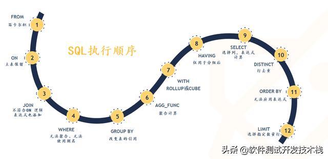
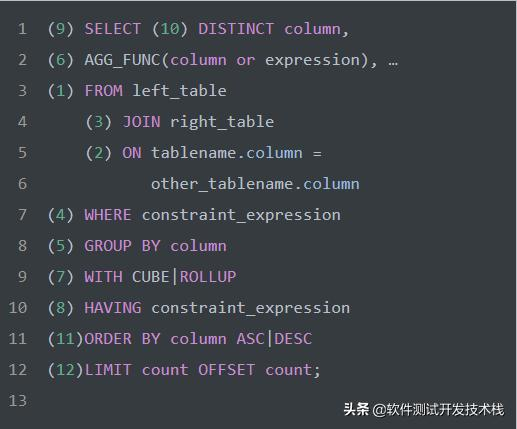
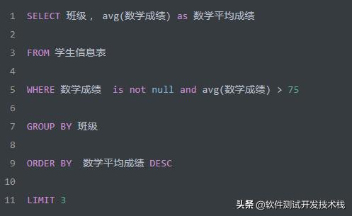
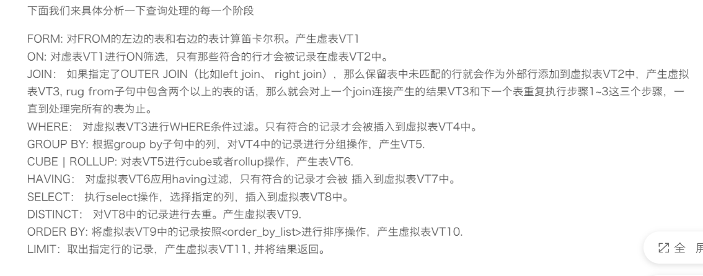

# SQL的执行顺序

>union === distinct ;
>
>**聚合函数，在group by之后的关键词之后才可以使用，所以where 是不能使用的；**
>
>**select关键词，会对列重命名，所以也不能在select 之前使用重命名的列；**







---

aggregate fcuntion  聚集函数；

- AVG：返回平均值
- COUNT：返回行数
- FIRST：返回第一个记录的值
- LAST：返回最后一个记录的值
- MAX： 返回最大值
- MIN：返回最小值
- SUM： 返回总和

---


**思考一下，如果我们将上面语句改成，如下会怎样？**



 **多注意一下这个问题；**

**我们发现，若将 avg(数学成绩) > 75 放到WHERE子句中，此时GROUP BY语句还未执行，因此此时聚合值 avg(数学成绩) 还是未知的，因此会报错**。


----

//todo  

##  下面的执行顺序；

# **1 FROM** 执行笛卡尔积

```mysql
select * from t1,t2; #形成笛卡尔积；
```


FROM 才是 SQL 语句执行的第一步，并非 SELECT 。对FROM子句中的前两个表执行笛卡尔积(交叉联接），生成虚拟表VT1，获取不同数据源的数据集。

**FROM子句执行顺序为从后往前、从右到左**，**FROM 子句中写在最后的表(基础表 driving table)将被最先处理，即最后的表为驱动表，当FROM 子句中包含多个表的情况下，我们需要选择数据最少的表作为基础表。**

------

# **2 ON 应用ON过滤器**

对虚拟表**VT1** 应用ON筛选器，ON 中的逻辑表达式将应用到虚拟表 **VT1**中的各个行，筛选出满足ON 逻辑表达式的行，生成虚拟表 **VT2** 。

------

# **3 JOIN 添加外部行**

如果指定了OUTER JOIN保留表中未找到匹配的行将作为外部行添加到虚拟表 **VT2**，生成虚拟表 **VT3**。保留表如下：

- LEFT OUTER JOIN把左表记为保留表
- RIGHT OUTER JOIN把右表记为保留表
- **FULL OUTER JOIN把左右表都作为保留表**

在虚拟表 **VT2**表的基础上添加保留表中被过滤条件过滤掉的数据，非保留表中的数据被赋予NULL值，最后生成虚拟表 **VT3**。

如果FROM子句包含两个以上的表，则对上一个联接生成的结果表和下一个表重复执行步骤1~3，直到处理完所有的表为止。

----




###  虚表和临时表的区别？？？

在MySQL中，虚表（也称为视图）和临时表是两种不同的概念和用途。

1. 虚表（视图）：
   - 虚表是一个逻辑表，它是基于一个或多个实际表的查询结果定义的。
   - 虚表可以被视为一个预定义的查询，可以像表一样进行查询操作，但实际上并不存储任何数据。
   - 虚表提供了一种方便的方式来组织和重用复杂的查询逻辑，简化了查询的编写和维护。
   - 虚表的定义存储在数据库中，可以在需要时被引用和使用。
2. 临时表：
   - 临时表是在运行时创建的表，用于存储临时数据。
   - 临时表的生命周期仅限于当前会话（session），当会话结束时，临时表会自动被删除。
   - 临时表可以被用于存储中间结果，进行复杂的数据处理和计算。
   - 临时表的使用可以提高查询性能，减少对实际表的访问次数。


---

## sql的执行顺序：


from ： https://www.zhihu.com/question/491194787/answer/3265591884

>**where条件中不能使用列的别名，并且不能使用聚集函数！！！**
>
>````mysql
>mysql> select ctime as t from t where t <=> NULL;
>ERROR 1054 (42S22): Unknown column 't' in 'where clause'
>
>##error
>select ctime as t, count(ceshi) as num from t group by ceshi where num > 1;
>-- true  -- 这个是一个聚集函数，所以可以直接使用！！！
>select ctime as ct,count(ceshi) as num from t group by ceshi having num > 1;
>````
>
>


---


## 列别名的问题

> **列别名的问题；**

**在 SQL 中，通常情况下是不能在 WHERE 子句中直接使用列的别名的。这是因为 WHERE 子句的执行顺序在 SQL 查询中是比较靠前的，而别名是在查询的结果集中产生的，所以在 WHERE 子句中使用别名可能会导致语法错误或意外的结果。**

然而，虽然不能直接在 WHERE 子句中使用列的别名，但可以通过使用子查询或者直接重复列的表达式来实现类似的效果。例如，可以这样使用子查询来使用列的别名：

```mysql
CopyOpenSELECT *
FROM (
    -- 差不多把，但是没太大用！！ 也行吧 子查询 优化一下
    SELECT column_name AS alias_name
    FROM table_name
    
) AS subquery
WHERE alias_name = some_value;
```

**另外，一些数据库系统也支持使用 HAVING 子句来对聚合函数的结果进行过滤，这时可以使用列的别名。但需要注意的是，不同的数据库系统对于使用列的别名在 WHERE 子句中的支持程度可能会有所不同。**

----


