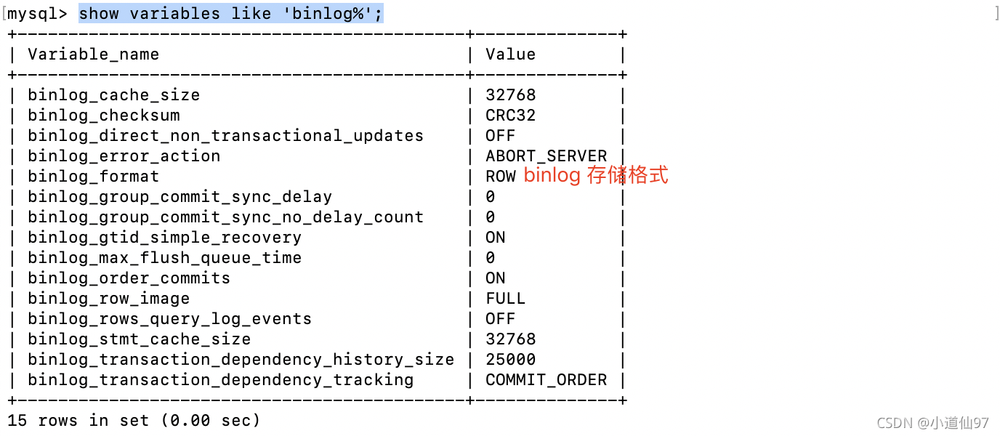

# binlog 数据的恢复

>https://blog.csdn.net/Tomwildboar/article/details/120707318?ops_request_misc=%257B%2522request%255Fid%2522%253A%2522167239604416782427414465%2522%252C%2522scm%2522%253A%252220140713.130102334.pc%255Fblog.%2522%257D&request_id=167239604416782427414465&biz_id=0&utm_medium=distribute.pc_search_result.none-task-blog-2~blog~first_rank_ecpm_v1~rank_v31_ecpm-2-120707318-null-null.blog_rank_default&utm_term=%E4%B8%BB%E4%BB%8E%E6%A8%A1%E5%BC%8F&spm=1018.2226.3001.4450

## 配置

在 `my.cnf` 里面加上配置如下配置，重启mysql。

一般来说 my.cnf 在：`/etc/mysql/my.cnf` 或 `/etc/my.cnf`

`````mysql
# binlog存储的位置 也是打开了log-bin
log-bin=/var/lib/mysql/mysql-bin
# 日志过期时间
expire_logs_days=30
# 不加这个启动会报错
server-id=123454
`````




show variables like 'binlog_format';


----


2-5-2、恢复数据
2-5-2-1、开启新的日志
执行命令 flush logs 开启新的日志记录，这样我们就不会收到后面操作的干扰。

2-5-2-2、找到我们要操作的日志
这里我要操作的日志是 mysql-bin.000013

----


执行命令查看日志结构     **show binlog events in 'mysql-bin.000013';**


###### 2-5-2-3、使用 pos 恢复数据

从上面的图，我们可以看到pos的开始和结束的位置，我们可恢复此阶段的数据

`````mysql
# 进入到 binlog 目录下
cd /var/lib/mysql
# 数据恢复命令
mysqlbinlog --start-position=开始的pos --stop-position=结束的pos --database=要操作的数据库 binlog的名称 | mysql -u登陆名 -p登陆密码 -v 要操作的数据库

# 最终执行命令（我的）
mysqlbinlog --start-position=669 --stop-position=980 --database=my_test mysql-bin.000013 | mysql -uroot -p123456 -v my_test

`````

**再次进入数据库，查询，发现数据有了**

---


###### 2-5-2-4、使用时间恢复数据

使用命令查看binlog日志

````mysql
 mysqlbinlog -vv --base64-output=decode-rows mysql-bin.000013
````


数据比较多，这里我只截图需要的部分


mysqlbinlog --start-datetime='2021-10-14 12:47:12' --stop-datetime='2021-10-14 12:52:40' --database=my_test mysql-bin.000013 | mysql -uroot -p123456 -v my_test


---

# 测试案例

``````mysql
mysql> show variables like '%dir%'
    -> ;
+-----------------------------------------+--------------------------------+
| Variable_name                           | Value                          |
+-----------------------------------------+--------------------------------+
| basedir                                 | /usr/                          |
| binlog_direct_non_transactional_updates | OFF                            |
| character_sets_dir                      | /usr/share/mysql-8.0/charsets/ |
| datadir                                 | /var/lib/mysql/                |
| innodb_data_home_dir                    |                                |
| innodb_directories                      |                                |
| innodb_doublewrite_dir                  |                                |
| innodb_log_group_home_dir               | ./                             |
| innodb_max_dirty_pages_pct              | 90.000000                      |
| innodb_max_dirty_pages_pct_lwm          | 10.000000                      |
| innodb_redo_log_archive_dirs            |                                |
| innodb_temp_tablespaces_dir             | ./#innodb_temp/                |
| innodb_tmpdir                           |                                |
| innodb_undo_directory                   | ./                             |
| lc_messages_dir                         | /usr/share/mysql-8.0/          |
| plugin_dir                              | /usr/lib/mysql/plugin/         |
| replica_load_tmpdir                     | /tmp                           |
| slave_load_tmpdir                       | /tmp                           |
| tmpdir                                  | /tmp                           |
+-----------------------------------------+--------------------------------+
19 rows in set (0.01 sec)
datadir /var/lib/mysql/ #默认的地方

``````


````mysql
mysql> show variables like '%binlog%'
    -> ;
+------------------------------------------------+----------------------+
| Variable_name                                  | Value                |
+------------------------------------------------+----------------------+
| binlog_cache_size                              | 32768                |
| binlog_checksum                                | CRC32                |
| binlog_direct_non_transactional_updates        | OFF                  |
| binlog_encryption                              | OFF                  |
| binlog_error_action                            | ABORT_SERVER         |
| binlog_expire_logs_seconds                     | 2592000              |
|# binlog_format                                  | ROW                  |
| binlog_group_commit_sync_delay                 | 0                    |
| binlog_group_commit_sync_no_delay_count        | 0                    |
| binlog_gtid_simple_recovery                    | ON                   |
| binlog_max_flush_queue_time                    | 0                    |
| binlog_order_commits                           | ON                   |
| binlog_rotate_encryption_master_key_at_startup | OFF                  |
| binlog_row_event_max_size                      | 8192                 |
| binlog_row_image                               | FULL                 |
| binlog_row_metadata                            | MINIMAL              |
| binlog_row_value_options                       |                      |
| binlog_rows_query_log_events                   | OFF                  |
| binlog_stmt_cache_size                         | 32768                |
| binlog_transaction_compression                 | OFF                  |
| binlog_transaction_compression_level_zstd      | 3                    |
| binlog_transaction_dependency_history_size     | 25000                |
| binlog_transaction_dependency_tracking         | COMMIT_ORDER         |
| innodb_api_enable_binlog                       | OFF                  |
| log_statements_unsafe_for_binlog               | ON                   |
| max_binlog_cache_size                          | 18446744073709547520 |
| #max_binlog_size                1G                | 1073741824           |
| max_binlog_stmt_cache_size                     | 18446744073709547520 |
|# sync_binlog                                    | 1                    |
+------------------------------------------------+----------------------+
29 rows in set (0.00 sec)

````


---


##  其他的一些命令


#### 2-N-3、其它命令

- 查看全部的日志 `show master logs;` 
- 查看日志的最后一次操作 `show master status;`
- 刷新binlog日志，也就是新开启一个日志文件 `flush logs` (这个在恢复数据的时候很有用)

#### 2-N-1、binlog 文件大小

可以使用命令来查看binlog 单个文件大小，默认是1G，如果超过了1G就会新增一个文件 `show variables like 'max_binlog_size';`

#### 2-N-2、过期删除

前面也说了，我们可以使用 `expire_logs_days=30` 来配置日志保存时间，我们最好不要自己去删除binlog日志，这样会导致过期删除出错，如果非要删除，要记得更新一下 `xxxxx.mysql-bin.index`


## test

```mysql
# 东八区；
vim /etc/my.cnf ##在[mysqld]区域中加上 default-time_zone = ‘+8:00’


mysql> show variables like '%log_bin%'
    -> ;
+---------------------------------+-----------------------------+
| Variable_name                   | Value                       |
+---------------------------------+-----------------------------+
| log_bin                         | ON                          |
| log_bin_basename                | /var/lib/mysql/binlog       |
| log_bin_index                   | /var/lib/mysql/binlog.index |
| log_bin_trust_function_creators | OFF                         |
| log_bin_use_v1_row_events       | OFF                         |
| sql_log_bin                     | ON                          |
+---------------------------------+-----------------------------+
```


````mysql
#docker  mysql8.0
Database changed
mysql> show tables;
+----------------+
| Tables_in_demo |
+----------------+
| department     |
| employee1      |
| logs           |
+----------------+
3 rows in set (0.00 sec)

mysql> select * from employee1;
+----+-------+--------+--------------+
| id | name  | salary | departmentid |
+----+-------+--------+--------------+
|  1 | joe   |  70000 |            3 |
|  2 | jim   |  90000 |            1 |
|  3 | sam   |  60000 |            2 |
|  4 | henry |  80000 |            2 |
|  5 | max   |  90000 |            1 |
+----+-------+--------+--------------+
5 rows in set (0.00 sec)

mysql>
mysql> delete from employee1 where id = 5;
Query OK, 1 row affected (0.01 sec)

## docker mysql8.0

mysql> show master status
    -> ;
+---------------+----------+--------------+------------------+-------------------+
| File          | Position | Binlog_Do_DB | Binlog_Ignore_DB | Executed_Gtid_Set |
+---------------+----------+--------------+------------------+-------------------+
| binlog.000007 |      455 |              |
|                   |
+---------------+----------+--------------+------------------+-------------------+
1 row in set (0.00 sec)


### --------------------------------------
root@e2625b36dc3e:/var/lib/mysql# mysqlbinlog -vv --base64-output=decode-rows binlog.000007
# The proper term is pseudo_replica_mode, but we use this compatibility alias
# to make the statement usable on server versions 8.0.24 and older.
/*!50530 SET @@SESSION.PSEUDO_SLAVE_MODE=1*/;
/*!50003 SET @OLD_COMPLETION_TYPE=@@COMPLETION_TYPE,COMPLETION_TYPE=0*/;
DELIMITER /*!*/;
# at 4
#221230 11:43:19 server id 1  end_log_pos 125 CRC32 0x89b4acd2  Start: binlog v 4, server v 8.0.27 created 221230 11:43:19 at startup
# Warning: this binlog is either in use or was not closed properly.
ROLLBACK/*!*/;
# at 125
#221230 11:43:19 server id 1  end_log_pos 156 CRC32 0x1ea3d419  Previous-GTIDs
# [empty]
# at 156
#221230 11:57:43 server id 1  end_log_pos 235 CRC32 0xf0a95c7c  Anonymous_GTID  last_committed=0        sequence_number=1       rbr_only=yes    original_committed_timestamp=1
                immediate_commit_timestamp=1672401463538852     transaction_length=299
/*!50718 SET TRANSACTION ISOLATION LEVEL READ COMMITTED*//*!*/;
# original_commit_timestamp=1672401463538852 (2022-12-30 11:57:43.538852 UTC)
# immediate_commit_timestamp=1672401463538852 (2022-12-30 11:57:43.538852 UTC)
/*!80001 SET @@session.original_commit_timestamp=1672401463538852*//*!*/;
/*!80014 SET @@session.original_server_version=80027*//*!*/;
/*!80014 SET @@session.immediate_server_version=80027*//*!*/;
SET @@SESSION.GTID_NEXT= 'ANONYMOUS'/*!*/;
# at 235
##-------------------------------------------------------------------------------------------------------
#221230 11:57:43 server id 1  end_log_pos 310 CRC32 0x00072c91  Query   thread_id=9     exec_time=0     error_code=0
SET TIMESTAMP=1672401463/*!*/;
SET @@session.pseudo_thread_id=9/*!*/;
SET @@session.foreign_key_checks=1, @@session.sql_auto_is_null=0, @@session.unique_checks=1, @@session.autocommit=1/*!*/;
SET @@session.sql_mode=1168113696/*!*/;
SET @@session.auto_increment_increment=1, @@session.auto_increment_offset=1/*!*/;
/*!\C latin1 *//*!*/;
SET @@session.character_set_client=8,@@session.collation_connection=8,@@session.collation_server=255/*!*/;
SET @@session.lc_time_names=0/*!*/;
SET @@session.collation_database=DEFAULT/*!*/;
/*!80011 SET @@session.default_collation_for_utf8mb4=255*//*!*/;
BEGIN
/*!*/;
# at 310
#221230 11:57:43 server id 1  end_log_pos 375 CRC32 0xe23ce213  Table_map: `demo`.`employee1` mapped to number 91
# at 375
#221230 11:57:43 server id 1  end_log_pos 424 CRC32 0xa4d824e2  Delete_rows: table id 91 flags: STMT_END_F
### DELETE FROM `demo`.`employee1`
### WHERE
###   @1=5 /* INT meta=0 nullable=0 is_null=0 */
###   @2='max' /* STRING(40) meta=65064 nullable=0 is_null=0 */
###   @3=90000 /* INT meta=0 nullable=0 is_null=0 */
###   @4=1 /* TINYINT meta=0 nullable=0 is_null=0 */
# at 424
#221230 11:57:43 server id 1  end_log_pos 455 CRC32 0x0e1620ca  Xid = 25
COMMIT/*!*/;
##-------------------end 结束；修改的内容；
SET @@SESSION.GTID_NEXT= 'AUTOMATIC' /* added by mysqlbinlog */ /*!*/;
DELIMITER ;
# End of log file
/*!50003 SET COMPLETION_TYPE=@OLD_COMPLETION_TYPE*/;
/*!50530 SET @@SESSION.PSEUDO_SLAVE_MODE=0*/;

### ----------------------------------
mysql> show binlog events in 'binlog.000007';
+---------------+-----+----------------+-----------+-------------+--------------------------------------+
| Log_name      | Pos | Event_type     | Server_id | End_log_pos | Info                                 |
+---------------+-----+----------------+-----------+-------------+--------------------------------------+
| binlog.000007 |   4 | Format_desc    |         1 |         125 | Server ver: 8.0.27, Binlog ver: 4    |
| binlog.000007 | 125 | Previous_gtids |         1 |         156 |                                      |
| binlog.000007 | 156 | Anonymous_Gtid |         1 |         235 | SET @@SESSION.GTID_NEXT= 'ANONYMOUS' |
| binlog.000007 | 235 | Query          |         1 |         310 | BEGIN                                |
| binlog.000007 | 310 | Table_map      |         1 |         375 | table_id: 91 (demo.employee1)        |
| binlog.000007 | 375 | Delete_rows    |         1 |         424 | table_id: 91 flags: STMT_END_F       |
| binlog.000007 | 424 | Xid            |         1 |         455 | COMMIT /* xid=25 */                  |
+---------------+-----+----------------+-----------+-------------+--------------------------------------+
7 rows in set (0.00 sec)
# binlog 结束
#pos 235-455

#datetime的恢复；
##  区分不开吗？
mysqlbinlog --start-datetime='22-12-30 11:57:43' --stop-datetime='22-12-30 11:57:43' --database=demo binlog.000007 | mysql -uroot -proot -v demo

mysqlbinlog --start-datetime='2021-10-14 12:47:12' --stop-datetime='2021-10-14 12:52:40' --database=my_test mysql-bin.000013 | mysql -uroot -p123456 -v my_test


##
mysqlbinlog --start-position=669 --stop-position=980 --database=my_test mysql-bin.000013 | mysql -uroot -p123456 -v my_test

##pos
mysqlbinlog --start-position=235 --stop-position=4
55 --database=demo binlog.000007 | mysql -uroot -proot -v demo

## 报错 是因为数据不全的问题吗？

mysql> select * from employee1;
+----+-------+--------+--------------+
| id | name  | salary | departmentid |
+----+-------+--------+--------------+
|  1 | joe   |  70000 |            3 |
|  2 | jim   |  90000 |            1 |
|  3 | sam   |  60000 |            2 |
|  4 | henry |  80000 |            2 |
+----+-------+--------+--------------+
4 rows in set (0.00 sec)

mysql> insert into employee1(name,salary,departmentid) values('ss',90000,1)
    -> ;
Query OK, 1 row affected (0.02 sec)

mysql> show binlog events in 'binlog.000007';
+---------------+-----+----------------+-----------+-------------+--------------------------------------+
| Log_name      | Pos | Event_type     | Server_id | End_log_pos | Info                                 |
+---------------+-----+----------------+-----------+-------------+--------------------------------------+
| binlog.000007 |   4 | Format_desc    |         1 |         125 | Server ver: 8.0.27, Binlog ver: 4    |
| binlog.000007 | 125 | Previous_gtids |         1 |         156 |                                      |
| binlog.000007 | 156 | Anonymous_Gtid |         1 |         235 | SET @@SESSION.GTID_NEXT= 'ANONYMOUS' |
| binlog.000007 | 235 | Query          |         1 |         310 | BEGIN                                |
| binlog.000007 | 310 | Table_map      |         1 |         375 | table_id: 91 (demo.employee1)        |
| binlog.000007 | 375 | Delete_rows    |         1 |         424 | table_id: 91 flags: STMT_END_F       |
| binlog.000007 | 424 | Xid            |         1 |         455 | COMMIT /* xid=25 */                  |
| binlog.000007 | 455 | Anonymous_Gtid |         1 |         534 | SET @@SESSION.GTID_NEXT= 'ANONYMOUS' |
| binlog.000007 | 534 | Query          |         1 |         609 | BEGIN                                |
| binlog.000007 | 609 | Table_map      |         1 |         674 | table_id: 91 (demo.employee1)        |
| binlog.000007 | 674 | Write_rows     |         1 |         722 | table_id: 91 flags: STMT_END_F       |
| binlog.000007 | 722 | Xid            |         1 |         753 | COMMIT /* xid=248 */                 |
+---------------+-----+----------------+-----------+-------------+--------------------------------------+
12 rows in set (0.00 sec)

## pos

mysqlbinlog --start-position=534 --stop-position=722 --database=demo binlog.000007 | mysql -uroot -proot -v demo

````

