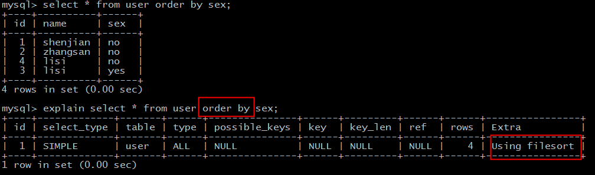

# explain -extra

---

其实，explain结果中还有一个Extra字段，对分析与优化SQL有很大的帮助，今天花1分钟简单和大家聊一聊。

 

**数据准备**：

*create table user (*

*id int* *primary key**,*

*name varchar(20),*

*sex varchar(5),*

*index(name)*

*)engine=innodb;*

 

*insert into user values(1, 'shenjian','no');*

*insert into user values(2, 'zhangsan','no');*

*insert into user values(3, '**lisi**', 'yes');*

*insert into user values(4, '**lisi**', 'no');*

 

**数据说明**：

用户表：id**主键索引**，name**普通索引**（非唯一），sex**无索引**；

四行记录：其中name普通索引存在重复记录lisi；

 

**实验目的**：

通过构造各类SQL语句，对explain的Extra字段进行说明，启发式定位待优化低性能SQL语句。

 

**一、【Using where】**

**实验语句**：

*explain select \* from user* *where* *sex='no';*

 

**结果说明**：

Extra为Using where说明，SQL使用了where条件过滤数据。

 

需要注意的是：

（1）返回所有记录的SQL，不使用where条件过滤数据，大概率不符合预期，对于这类SQL往往需要进行优化；

（2）使用了where条件的SQL，并不代表不需要优化，往往需要配合explain结果中的type（连接类型）来综合判断；

*画外音：**join type在《上》**中有详细叙述，本文不再展开。*

 

本例虽然Extra字段说明使用了where条件过滤，但type属性是ALL，表示需要扫描全部数据，仍有优化空间。

 

常见的优化方法为，在where过滤属性上添加索引。

*画外音：**本例中，sex字段区分度不高，添加索引对性能提升有限。*

 

**二、【Using index】**

**实验语句**：

*explain select* *id,name* *from user where name='shenjian';*

 

**结果说明**：

Extra为Using index说明，SQL所需要返回的所有列数据均在一棵索引树上，而无需访问实际的行记录。

*画外音：**The column information is retrieved from the table using only information in the index tree without having to do an additional seek to read the actual row.*

 

这类SQL语句往往性能较好。

 

**问题来了，什么样的列数据，会包含在索引树上呢？**

 

**三、【Using index condition】**

实验语句：

*explain select* *id,name,sex* *from user* 

*where name='shenjian';*

*画外音：**该SQL语句与上一个SQL语句不同的地方在于，被查询的列，多了一个sex字段。*

 

结果说明：

Extra为Using index condition说明，确实命中了索引，但不是所有的列数据都在索引树上，还需要访问实际的行记录。

*画外音：**聚集索引，普通索引的底层实现差异，之前撰文过**。*

 

这类SQL语句性能也较高，但不如Using index。

 

**问题来了，如何优化为Using index呢？**

 

**四、【Using filesort】**

实验语句：

*explain select \* from user* *order by* *sex;*

 

结果说明：

Extra为Using filesort说明，得到所需结果集，需要对所有记录进行文件排序。

 

这类SQL语句性能极差，需要进行优化。

 

典型的，在一个没有建立索引的列上进行了order by，就会触发filesort，常见的优化方案是，在order by的列上添加索引，避免每次查询都全量排序。

 

**五、【Using temporary】**

实验语句：

*explain select \* from user* *group by* *name* *order by* *sex;*

 

结果说明：

Extra是Using temporary说明，需要建立临时表(temporary table)来暂存中间结果。

 

这类SQL语句性能较低，往往也需要进行优化。

 

**典型的，group by和order by同时存在，且作用于不同的字段时，就会建立临时表，以便计算出最终的结果集。**

 

**六、【Using join buffer (Block Nested Loop)】**

实验语句：

*explain select \* from user where id in(select id from user where sex='no');*

 

结果说明：

Extra为Using join buffer (Block Nested Loop)说明，需要进行嵌套循环计算。

*画外音：**内层和外层的type均为ALL，rows均为4，需要循环进行4\*4次计算。*

 

这类SQL语句性能往往也较低，需要进行优化。

 

典型的，两个关联表join，关联字段均未建立索引，就会出现这种情况。常见的优化方案是，在关联字段上添加索引，避免每次嵌套循环计算。

 

**结尾**：

explain是SQL优化中最常用的工具，搞定type和Extra，explain也就基本搞定了。

using index，查询的列全部在索引树上，无需回表。查询的列只包含索引列和主键。

**name, sex 弄个联合索引，索引覆盖 就不需要回表了。就优化成Using index了**