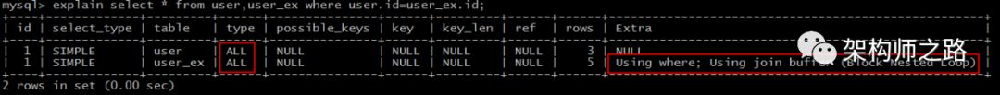

# explain -type

---

**explain**是MySQL性能调优过程中必须掌握的工具，今天花1分钟简单说下，explain结果中常见的type结果及代表的含义，并且通过同一个SQL语句的性能差异，说明建立正确的索引多么重要。

 

**explain结果中的type字段代表什么意思？**

MySQL的官网解释非常简洁，只用了3个单词：**连接类型**(the join type)。它描述了找到所需数据使用的扫描方式。

 

最为常见的扫描方式有：

**（1）system**：系统表，少量数据，往往不需要进行磁盘IO；

**（2）const**：常量连接；

**（3）eq_ref**：主键索引(primary key)或者非空唯一索引(unique not null)等值扫描；

**（4）ref**：非主键非唯一索引等值扫描；

**（5）range**：范围扫描；

**（6）index**：索引树扫描；

**（7）ALL**：全表扫描(full table scan)；

*画外音：**这些是最常见的，大家去explain自己工作中的SQL语句，95%都是上面这些类型。*

 

上面各类扫描方式**由快到慢**：

system > const > eq_ref > ref > range > index > ALL

下面一一举例说明。

 

**一、system**

*explain select \* from mysql.time_zone;*

上例中，从系统库mysql的系统表time_zone里查询数据，扫码类型为system，这些数据已经加载到内存里，不需要进行磁盘IO。

这类扫描是速度最快的。

*explain select \* from (select \* from user where id=1) tmp;*

再举一个例子，内层嵌套(const)返回了一个临时表，外层嵌套从临时表查询，其扫描类型也是system，也不需要走磁盘IO，速度超快。

 

**二、const**

数据准备：

*create table user (*

*id int* *primary key**,*

*name varchar(20)*

*)engine=innodb;*

 

*insert into user values(1,'shenjian');*

*insert into user values(2,'zhangsan');*

*insert into user values(3,'lisi');*

const扫描的条件为：

（1）命中主键(primary key)或者唯一(unique)索引；

（2）被连接的部分是一个常量(const)值；

 

*explain select \* from user where id=1;*

如上例，id是PK，连接部分是常量1。

*画外音：这里注意，防止隐式类型转换。*

 

这类扫描效率极高，返回数据量少，速度非常快。

 

**三、eq_ref**

数据准备：

*create table user (*

*id int* *primary key**,*

*name varchar(20)*

*)engine=innodb;*

 

*insert into user values(1,'shenjian');*

*insert into user values(2,'zhangsan');*

*insert into user values(3,'lisi');*

 

*create table user_ex (*

*id int* *primary key**,*

*age int*

*)engine=innodb;*

 

*insert into user_ex values(1,18);*

*insert into user_ex values(2,20);*

*insert into user_ex values(3,30);*

*insert into user_ex values(4,40);*

*insert into user_ex values(5,50);*

eq_ref扫描的条件为，对于前表的每一行(row)，后表只有一行被扫描。

 

再细化一点：

（1）join查询；

（2）命中主键(primary key)或者非空唯一(unique not null)索引；

（3）等值连接；

 

*explain select \* from user,user_ex* 

  *where user.id=user_ex.id;*

如上例，id是主键，该join查询为eq_ref扫描。

这类扫描的速度也异常之快。

 

**四、ref**

数据准备：

*create table user (*

*id int,*

*name varchar(20) ,*

*index(id)*

*)engine=innodb;*

 

*insert into user values(1,'shenjian');*

*insert into user values(2,'zhangsan');*

*insert into user values(3,'lisi');*

 

*create table user_ex (*

*id int,*

*age int,*

*index(id)*

*)engine=innodb;*

 

*insert into user_ex values(1,18);*

*insert into user_ex values(2,20);*

*insert into user_ex values(3,30);*

*insert into user_ex values(4,40);*

*insert into user_ex values(5,50);*

如果把上例eq_ref案例中的主键索引，改为普通非唯一(non unique)索引。

 

*explain select \* from user,user_ex* 

  *where user.id=user_ex.id;*

就由eq_ref降级为了ref，此时对于前表的每一行(row)，后表可能有多于一行的数据被扫描。

 

*explain select \* from user where id=1;*

当id改为普通非唯一索引后，常量的连接查询，也由const降级为了ref，因为也可能有多于一行的数据被扫描。

 

ref扫描，可能出现在join里，也可能出现在单表普通索引里，每一次匹配可能有多行数据返回，虽然它比eq_ref要慢，但它仍然是一个很快的join类型。

 

**五、range**

数据准备：

*create table user (*

*id int* *primary key**,*

*name varchar(20)*

*)engine=innodb;*

 

*insert into user values(1,'shenjian');*

*insert into user values(2,'zhangsan');*

*insert into user values(3,'lisi');*

*insert into user values(4,'wangwu');*

*insert into user values(5,'zhaoliu');*

range扫描就比较好理解了，它是索引上的范围查询，它会在索引上扫描特定范围内的值。

 

*explain select \* from user where id between 1 and 4;*

*explain select \* from user where idin(1,2,3);*

*explain select \* from user where id>3;*

像上例中的between，in，>都是典型的范围(range)查询。

*画外音：必须是索引，否则不能批量"跳过"。*

 

**六、index**

index类型，需要扫描索引上的全部数据。

 

*explain count (\*) from user;*

如上例，id是主键，该count查询需要通过扫描索引上的全部数据来计数。

*画外音：此表为InnoDB引擎。*

 

它仅比全表扫描快一点。

 

**七、ALL**

数据准备：

*create table user (*

*id int,*

*name varchar(20)*

*)engine=innodb;*

 

*insert into user values(1,'shenjian');*

*insert into user values(2,'zhangsan');*

*insert into user values(3,'lisi');*

 

*create table user_ex (*

*id int,*

*age int*

*)engine=innodb;*

 

*insert into user_ex values(1,18);*

*insert into user_ex values(2,20);*

*insert into user_ex values(3,30);*

*insert into user_ex values(4,40);*

*insert into user_ex values(5,50);*

*explain select \* from user,user_ex* 

  *where user.id=user_ex.id;*

如果id上不建索引，对于前表的每一行(row)，后表都要被全表扫描。

今天这篇文章中，这个相同的join语句出现了三次：

（1）扫描类型为eq_ref，此时id为主键；

（2）扫描类型为ref，此时id为非唯一普通索引；

（3）扫描类型为ALL，全表扫描，此时id上无索引；

 

由此可见，**建立正确的索引，对数据库性能的提升是多么重要。**

全表扫描代价极大，性能很低，是应当极力避免的，通过explain分析SQL语句，非常有必要。

 

**总结**

（1）explain结果中的**type字段**，表示（广义）连接类型，它描述了找到所需数据使用的扫描方式；

（2）常见的扫描类型有：

system>const>eq_ref>ref>range>index>ALL

其扫描速度由快到慢；

（3）各类扫描类型的要点是：

- **system**最快：不进行磁盘IO
- **const**：PK或者unique上的等值查询
- **eq_ref**：PK或者unique上的join查询，等值匹配，对于前表的每一行(row)，后表只有一行命中
- **ref**：非唯一索引，等值匹配，可能有多行命中
- **range**：索引上的范围扫描，例如：between/in/>
- **index**：索引上的全集扫描，例如：InnoDB的count
- **ALL**最慢：全表扫描(full table scan)

（4）建立正确的索引(index)，非常重要；

（5）使用explain了解并优化执行计划，非常重要；