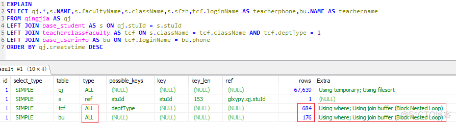
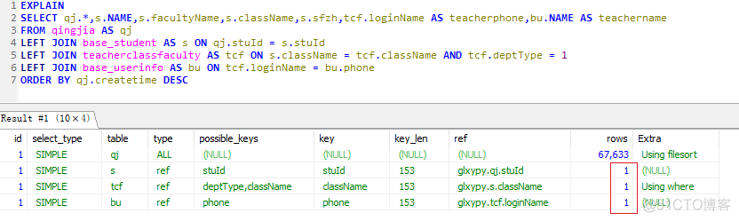
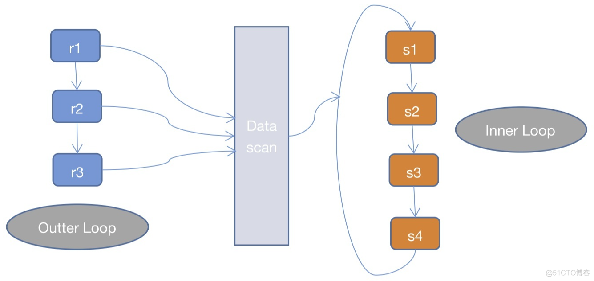
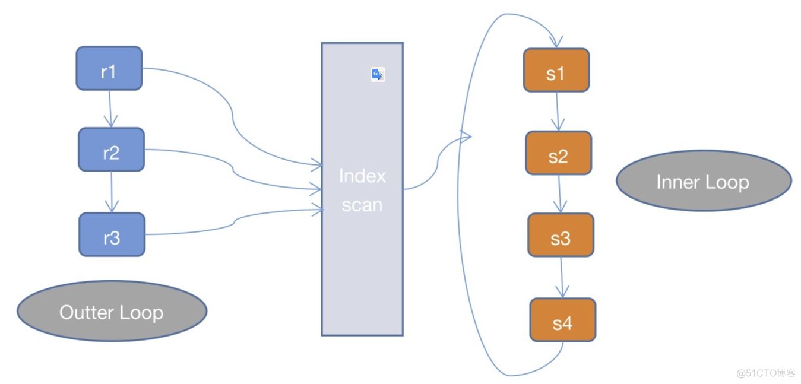
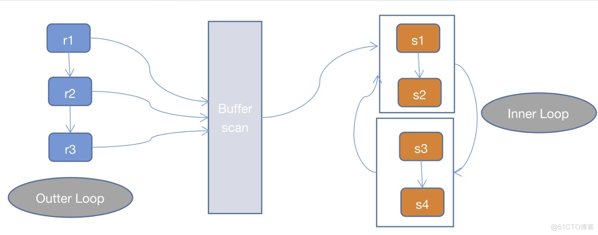
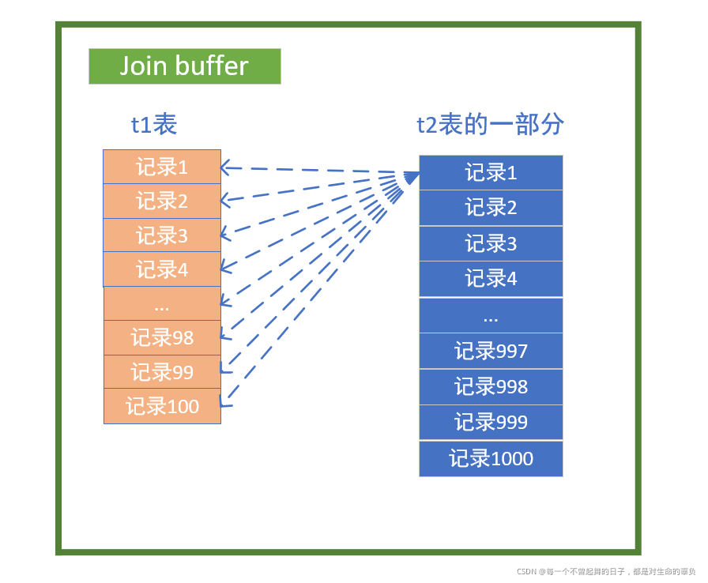

#Nested Loop Join    块嵌套循环  block nested loop  块嵌套循环


# Using join buffer (Block Nested Loop)调优


## Mysql5.7 Explain

[ 官网](https://dev.mysql.com/doc/refman/5.7/en/explain-output.html)

## Using join buffer (Block Nested Loop)

### 调优前

```
EXPLAIN SELECT qj.*,s.NAME,s.facultyName,s.className,s.sfzh,tcf.loginName AS teacherphone,bu.NAME AS teachername
FROM qingjia AS qj
LEFT JOIN base_student AS s ON qj.stuId = s.stuId
LEFT JOIN teacherclassfaculty AS tcf ON s.className = tcf.className AND tcf.deptType = 1
LEFT JOIN base_userinfo AS bu ON tcf.loginName = bu.phone 
ORDER BY qj.createtime DESC1.2.3.4.5.6.
```


Using join buffer (Block Nested Loop)是因为右表没有在join列上建索引导致嵌套循环。

### 添加被驱动表索引调优

添加被驱动表(右侧表)索引，当添加组合索引时，要遵从**最左匹配原则**

```
ALTER TABLE `base_userinfo` ADD INDEX `phone` (`phone`);
alter table teacherclassfaculty add index className(className);1.2.
```

### 调优后



## Nested Loop Join原理

### 1.第一步筛选出驱动表符合条件的记录

驱动表为explain第一条记录，即qj表，**如果where条件为驱动表字段，那么从qj表中拿到第一条记录的时候发现是符合where判断的，可以留下，然后该去被驱动表s表中进行匹配。**

```
-- 驱动表
select * from 驱动表 where sql中where字段 = ''1.2.
```

### 2.通过连接条件on后的条件对被驱动表的数据筛选

驱动表qj第一条记录stuId和被驱动表s相等stuId，且满足on的其他条件，则该条记录留下。

```
-- 被驱动表
select * from 被驱动表 where 被驱动表on关联字段 = '逐行驱动表记录字段数值' and 其他on条件;

-- 被驱动表s
select * from base_student where stuId = 'qj_id';
-- 被驱动表tcf
select * from teacherclassfaculty where className = 's_classname' and depttype = 1;1.2.3.4.5.6.7.
```

**如果被驱动表s的on字段没有添加索引，则会查询被驱动表中的所有记录。**

### 3.将查询的结果与驱动表进行连接并返回给客户端

连接就要根据左连接还是右连接进行匹配了，没有的加null值，等等。


## Nested Loop Join三种算法

NLJ是通过两层循环，用第一张表做Outter Loop，第二张表做Inner Loop，Outter Loop的每一条记录跟Inner Loop的记录作比较，符合条件的就输出。而NLJ又有3种细分的算法


### 1、[ Simple Nested Loop Join（SNLJ）](https://dev.mysql.com/doc/refman/5.7/en/nested-loop-joins.html#nested-loop-join-algorithm)

```mysql
for each row in t1 matching range {
  for each row in t2 matching reference key {
    for each row in t3 {
      if row satisfies join conditions, send to client
    }
  }
}1.2.3.4.5.6.7.
```


SNLJ就是两层循环全量扫描连接的两张表，得到符合条件的两条记录则输出，这也就是让两张表做笛卡尔积，比较次数是R * S，是比较暴力的算法，会比较耗时，所以mysql查询优化器。


#### Index Nested Loop Join（INLJ）




INLJ是在SNLJ的基础上做了优化，通过连接条件确定可用的索引，在Inner Loop中扫描索引而不去扫描数据本身，从而提高Inner Loop的效率。

而INLJ也有缺点，就是如果扫描的索引是非聚簇索引，并且需要访问非索引的数据，会产生一个回表读取数据的操作，这就多了一次随机的I/O操作。


### 2、[ Block Nested Loop Join（BNLJ）](https://dev.mysql.com/doc/refman/5.7/en/nested-loop-joins.html#block-nested-loop-join-algorithm)



一般情况下，MySQL优化器在索引可用的情况下，会优先选择使用INLJ算法，但是在无索引可用，或者判断full scan可能比使用索引更快的情况下，还是不会选择使用过于粗暴的SNLJ算法。

这里就出现了BNLJ算法了，BNLJ在SNLJ的基础上使用了  join buffer，会提前读取之前的表关联记录到buffer中，以提高Inner Loop的效率。

```mysql
for each row in t1 matching range {
  for each row in t2 matching reference key {
    store used columns from t1, t2 in join buffer  -- 将之前的关联表存入buffe
    if buffer is full {
      for each row in t3 {
        for each t1, t2 combination in join buffer {
          if row satisfies join conditions, send to client
        }
      }
      empty join buffer
    }
  }
}

-- 当有之前表join的buffer数据,则直接用t3作为outer去loop
if buffer is not empty {
  for each row in t3 {
    for each t1, t2 combination in join buffer {
      if row satisfies join conditions, send to client
    }
  }
}
```

###join [buffer](https://so.csdn.net/so/search?q=buffer&spm=1001.2101.3001.7020)的作用


<font color=red>就是针对**被驱动表**的连接字段没有索引的情况下需要进行全表扫描，所以引入了join buffer内存缓冲区来对这个全表扫描过程进行优化。</font>

在这个过程中，不再是每次从t1表中取1条记录。而是在开始时用内存缓冲区join buffer将t1表全部装入内存，每次取t2表的1000条记录调入内存。然后，让t1表与t2表在内存的这一部分（t2表在内存的这一部分作为外层循环，t1表作为内层循环）通过双重for循环进行匹配，然后循环这个过程，直到t2表的10000条数据都调入内存一次（即需要十次IO调入）。




##注意join buffer  当只有被驱动表关联字段没有使用索引的时候才会使用，join buffer ；当有索引的时候 时间复杂度是很低的基本都是logn，没有必要去做一个优化了，当没有使用索引字段，那么mysql 就会自动使用，join buffer 来做优化；


---


## join对于下面这个三个表的join语句

````mysql
select * 
from t1 
join t2 on(t1.a=t2.a) 
join t3 on (t2.b=t3.b) 
where t1.c>=X and t2.c>=Y and t3.c>=Z;
````


若改写成straight_join，要怎么指定连接顺序，以及怎么给三个表创建索引？

尽量使用BKA算法
使用BKA，并非“先计算两个表join的结果，再跟第三个表join”，而是直接嵌套查询的。具体实现：在t1.c>=X、t2.c>=Y、t3.c>=Z这三个条件里，选择一个经过过滤以后，数据最少的那个表，作为第一个驱动表。此时，可能会出现如下两种情况。
如果选出来是表t1或者t3，那剩下的部分就固定了：

如果驱动表是t1，则连接顺序是t1->t2->t3，要在被驱动表字段创建上索引，也就是t2.a 和 t3.b上创建索引
如果驱动表是t3，则连接顺序是t3->t2->t1，需要在t2.b 和 t1.a上创建索引。
同时，我们还需要在第一个驱动表的字段c上创建索引。

第二种情况是，若选出来的第一个驱动表是表t2，则需要评估另外两个条件的过滤效果。

思路就是，尽量让每一次参与join的驱动表的数据集，越小越好，因为这样我们的驱动表就会越小。


----

aaaaaaaaaaaaaaa 

**思考一下，如果我们将上面语句改成，如下会怎样？**


 


我们发现，若将 **avg(数学成绩) > 75** 放到WHERE子句中，此时GROUP BY语句还未执行，因此此时聚合值 **avg(数学成绩)** 还是未知的，因此会报错。


## 是否创建索引

对于是否需要为`createtime`列创建索引，需要考虑以下几个因素：

1. 查询频率：如果在查询中经常使用`createtime`列作为过滤条件或排序条件，那么为该列创建索引可能会提高查询性能。
2. 数据分布：如果`createtime`列的值在表中分布广泛且唯一，那么为该列创建索引可能会提高查询性能。然而，如果`createtime`列的值分布不均匀，即存在大量重复值，那么为该列创建索引的效果可能会有限。
3. 表的大小：如果表中的数据量很大，那么为`createtime`列创建索引可能会提高查询性能，因为索引可以帮助数据库快速定位满足查询条件的行。
