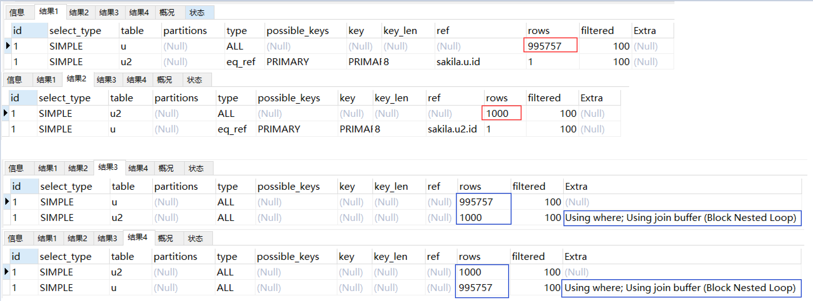
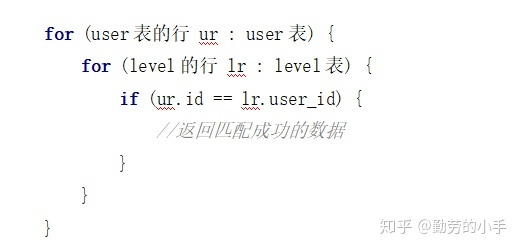
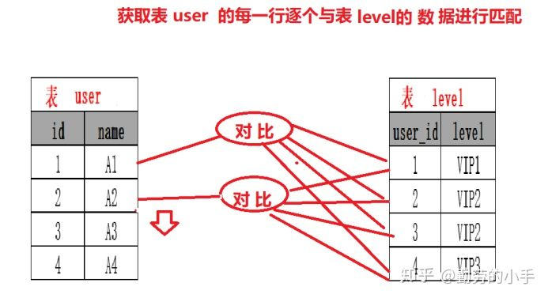
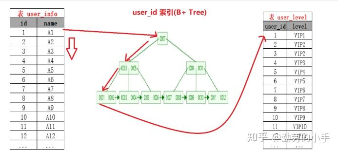
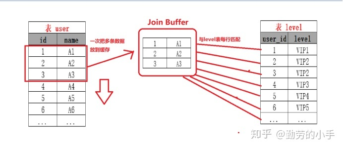
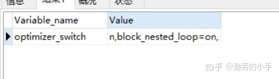

# json的优化

>N 驱动表示外层for循环遍历次数；
>
>M 被驱动表是内层for循环遍历次数；
>
>block nested loop join 缓存到内存里面去；join buffer；//todo  join buffer  是如何提高join效率的；


# 一 、join应如何优化

先列出答案：

**1、为join的连接条件增加索引（减少内层表的循环次数）**

**2、尽量用小表join大表（其本质就是减少外层循环的数据次数）**

**3、增大`join buffer size`的大小（一次缓存的数据越多，那么外层表循环的次数就越少）**/

**4、减少不必要的字段查询（字段越少，join buffer 所缓存的数据就越多，外层表的循环次数就越少）**

**5、如果是大表join大表，这种情况对大表建立分区表再进行join，效果会比较明显。**


---


注意：
1.join优化的最重要的步骤是给join连接字段建立索引，这样才能大幅度降低查询速度；

2.小表join大表能提高查询速度有2个前提：1.当连接字段为索引字段时才可提高查询速度，如果连接字段为非索引字段则没有什么效果；

2.**join连接需是left join或right join才可以，因为inner join的join顺序是mysql会根据优化器自行决定查询顺序，比如a表join b表，mysql在执行查询的时候可能先查b表再查a表（即把b表作为驱动表）**。

3.网上有很一些文章说”小表join大表能提高查询速度是错误的，理由是mysql执行器不会根据我们join的顺序去查询，比如a表join b表，mysql在执行查询的时候可能先查b表再查a表（把b表作为驱动表）”，这个说法其实在inner join的前提下才是有效的。


----


# 二、实验验证

## 创建表，并插入数据

说明：user表为大表（100万条数据），user2为小表（1000条数据），两个表结构一致，都只含有一个索引，即主键(id)索引


```mysql
-- 创建表user+插入数据（100万条）
create table user(id bigint not null primary key auto_increment, 
    name varchar(20) not null default '' comment '姓名', 
    age tinyint not null default 0 comment 'age', 
    gender char(1) not null default 'M'  comment '性别',
    phone varchar(16) not null default '' comment '手机号',
    create_time datetime NOT NULL DEFAULT CURRENT_TIMESTAMP COMMENT '创建时间',
    update_time datetime NOT NULL DEFAULT CURRENT_TIMESTAMP ON UPDATE CURRENT_TIMESTAMP COMMENT '修改时间'
    ) engine = InnoDB DEFAULT CHARSET=utf8mb4 COMMENT '用户信息表';
##  存储过程 看看把

CREATE PROCEDURE insert_user_data(num INTEGER) 
BEGIN
DECLARE v_i int unsigned DEFAULT 0; # 申请某个变量；
set autocommit= 0;
WHILE v_i < num DO
insert into user(`name`, age, gender, phone) values (CONCAT('lyn',v_i), mod(v_i,120), 'M', CONCAT('152',ROUND(RAND(1)*100000000)));
SET v_i = v_i+1;
END WHILE;
commit;
END

call insert_user_data(1000000);

-- 创建表user2+插入数据（1000条）
create table user2 select * from user where 1=2;-- 复制表，仅复制表结构（不会创建自增主键，索引，需手工创建）
ALTER TABLE `user2` ADD PRIMARY KEY ( `id` ) ;-- 创建主键索引

CREATE PROCEDURE insert_user2_data(num INTEGER) 
BEGIN
DECLARE v_i int unsigned DEFAULT 0;
set autocommit= 0;
WHILE v_i < num DO
insert into user2(`name`, age, gender, phone) values (CONCAT('lyn',v_i), mod(v_i,120), 'M', CONCAT('152',ROUND(RAND(1)*100000000)));
SET v_i = v_i+1;
END WHILE;
commit;
END

call insert_user2_data(1000);
```

## 测试

说明：下面测试按join的连接字段是否为索引列分2种情况测试，先测试大表join小表，再测试小表join大表，分别执行3次，注释中记录了3次的查询时间


```mysql
-- join的连接字段为索引列
SELECT * from user u LEFT JOIN user2 u2 on u.id = u2.id;-- 3.681s 3.770s 3.650s
SELECT * from user2 u2 LEFT JOIN user u on u.id = u2.id;-- 0.002s 0.002s 0.003s

-- join的连接字段为非索引列
SELECT * from user u LEFT JOIN user2 u2 on u.name = u2.name;-- 124.450s 139.875s 142.904s
SELECT * from user2 u2 LEFT JOIN user u on u.name = u2.name;-- 140.093s 142.917s 139.737s
```

通过上述测试结果发现：1.join的连接字段为索引列比非索引列快了十条街；2.在join的连接字段为索引列时，小表join大表比大表join小表快了十条街，在join的连接字段为非索引列时，小表join大表与大表join小表的查询速度似乎差不多。这足以验证第一节的join优化结论。

## 分析

下面看下执行计划


```mysql
-- 连接字段为索引列
EXPLAIN SELECT * from user u LEFT JOIN user2 u2 on u.id = u2.id;-- 3.681s 3.770s 3.650s
EXPLAIN SELECT * from user2 u2 LEFT JOIN user u on u.id = u2.id;-- 0.002s 0.002s 0.003s

-- 连接字段为非索引列
EXPLAIN SELECT * from user u LEFT JOIN user2 u2 on u.name = u2.name;-- 124.450s 139.875s 142.904s
EXPLAIN SELECT * from user2 u2 LEFT JOIN user u on u.name = u2.name;-- 140.093s 142.917s 139.737s
```

执行计划结果（按上面的sql依次执行）

[](https://img2020.cnblogs.com/blog/797348/202102/797348-20210223235540385-92030459.png)

从执行结果中红框标注看，可以得知为什么小表join大表比较快，这是因为小表u2作为驱动表只大概扫描了1000行，而大表u作为驱动表大概扫描了995757行。从红框标注与蓝框标注对比可以得知为什么join中的连接条件使用索引字段比非索引字段要快，首先前者比后者扫描的行数要少，其次我们注意到后者在Extra中明确表示用到了join的BNL算法（Block Nested Loop）°?从第3节的Block Nested-Loop算法介绍上看，这种算法是把外层驱动表的一部分数据放到了join buffer中以减少驱动表的循环次数，但是从上图中的第4个结果看，内层表也用到了这种算法——这是否为mysql在新版本做出的优化不得而知。到了这里，我们只能从实验证实我们的优化结论是正确的，但是为什么小表join大表比大表join小表快，为什么join的连接字段使用索引字段比使用非索引字段快，为什么当join的连接字段为非索引字段时，大表Join小表与小表join大表的速度差不多？还需要我们学习第3节才能找到答案。


---


# 三、三种join算法

本文第1节说明了join优化结论，并在第2节进行验证，如果要想搞懂优化结论的原理，则需搞明白mysql在join时的相关算法：

NLJ算法 Nested Loop Join（或Simple Nested-Loop Join）：这种算法是最low的，你可以简单理解为这种算法就是一个双层for循环算法，在join匹配时循环次数是最多的，在5.6之前如果join字段为非索引字段，会采用这种join算法。

BNLJ算法 Block Nested-Loop Join：这是5.6之后，mysql替换NLJ的升级算法，所以升级之处就在于它把join的驱动表放到了内存buffer中，拿内存buffer中的数据批量与内层表数据匹配，从而减少了驱动表的循环（匹配）次数。

INLJ算法 index Nested Loop Join：这是当join字段为索引字段时，mysql采用的算法，这种算法让驱动表不直接与内层表进行逐行匹配，而是与内层表的连接索引字段进行匹配，这样就减少了内层表的循环（匹配）次数。

不论是Index Nested-Loop Join 还是 Block Nested-Loop Join 都是在Simple Nested-Loop Join的算法的基础上 减少嵌套的循环次数， 不同的是 Index Nested-Loop Join 是通过索引的机制减少内层表的循环次数，Block Nested-Loop Join 是通过一次缓存多条数据批量匹配的方式来减少外层表的循环次数。

下面是这3种算法的详细介绍：

## Simple Nested-Loop Join（简单的嵌套循环连接）

简单来说嵌套循环连接算法就是一个双层for 循环 ，通过循环外层表的行数据，逐个与内层表的所有行数据进行比较来获取结果，当执行

**select * from user tb1 left join level tb2 on tb1.id=tb2.user_id**

时，我们会按类似下面代码的思路进行数据匹配：

[](https://pic3.zhimg.com/80/v2-5b8274aaa3b92d6a1e28d2e476c2035e_hd.jpg)

整个匹配过程会如下图：

 

[](https://pic2.zhimg.com/80/v2-567a542528fa39b821712231e47dc2e9_hd.jpg)

特点：

Nested-Loop Join 简单粗暴容易理解，就是通过双层循环比较数据来获得结果，但是这种算法显然太过于粗鲁，如果每个表有1万条数据，那么对数据比较的次数=1万 * 1万 =1亿次，很显然这种查询效率会非常慢。

当然mysql 肯定不会这么粗暴的去进行表的连接，所以就出现了后面的两种对Nested-Loop Join 优化算法，在执行join 查询时mysql 会根据情况选择 后面的两种优join优化算法的一种进行join查询。

---


## Index Nested-Loop Join（索引嵌套循环连接）

Index Nested-Loop Join其优化的思路 主要是为了减少内层表数据的匹配次数， 简单来说Index Nested-Loop Join 就是通过外层表匹配条件 直接与内层表索引进行匹配，避免和内层表的每条记录去进行比较， 这样极大的减少了对内层表的匹配次数，从原来的匹配次数=外层表行数 * 内层表行数，变成了 外层表的行数 * 内层表索引的高度，极大的提升了 join的性能。

案例：

如SQL：select * from user tb1 left join level tb2 on tb1.id=tb2.user_id

当level 表的 user_id 为索引的时候执行过程会如下图：

[](https://pic4.zhimg.com/80/v2-c8790aa879ca6fedb83d529558bb40e3_hd.jpg)

注意：使用Index Nested-Loop Join 算法的前提是匹配的字段必须建立了索引。

---


## Block Nested-Loop Join（缓存块嵌套循环连接）

Block Nested-Loop Join 其优化思路是减少外层表的循环次数，Block Nested-Loop Join 通过一次性缓存多条数据，把参与查询的列缓存到join buffer 里，然后拿join buffer里的数据**批量°？**这里我不太理解为什么把驱动表的数据拿到缓存buffer中就能批量与内层表进行匹配，比如说join buffer一次性缓存了3条数据，则这3条数据只需与内层表匹配一次即可？与内层表的数据进行匹配，从而减少了外层循环的次数，当我们不使用Index Nested-Loop Join的时候，默认使用的是Block Nested-Loop Join。

案例：

如SQL：select * from user tb1 left join level tb2 on tb1.id=tb2.user_id

当level 表的 user_id 不为索引的时候执行过程会如下图：

[](https://pic1.zhimg.com/80/v2-2425a011e750063a3308d1a2894056b0_hd.jpg)

---


## 小结

好了，根据对mysql的join算法的理解，我们可以回答第2节最后提出的问题了：

1、为什么join的连接字段使用索引字段比使用非索引字段快？
因为采用了Index Nested-Loop Join算法，极大的减少了内层表的匹配次数。

2、为什么小表join大表比大表join小表快？
这里先讨论Join字段为索引字段的情况，因为小表join大表更能显著地减少外层驱动表的循环次数，比如在第2节的举例，外层驱动表为100万条数据，内层表为1000条数据。如果外层驱动表为大表，即使采用Block Nested-Loop Join算法，因为join buffer的大小总是有限的，最终外层驱动表还是需要接近10万次循环；而用小表join大表的话，外层驱动表仅用了1000次左右的循环，再加上join字段为索引字段，用到了Index Nested-Loop Join算法，又极大的减少了内层大表的循环次数，所以join字段为索引字段+小表join大表结合起来的查询速度非常快。

3、为什么当join的连接字段为非索引字段时，大表Join小表与小表join大表的速度差不多？
因为虽然说把小表作为驱动表能极大减少外层循环的次数，但是内层表为大表，由于连接字段为非索引字段，不能用Index Nested-Loop Join算法减少内层循环的次数，所以当join的连接字段为非索引字段时，两种形式的区别不大。


注意： 

1、使用Block Nested-Loop Join 算法需要开启优化器管理配置的optimizer_switch的设置block_nested_loop为on 默认为开启，如果关闭则使用Simple Nested-Loop Join 算法；

通过指令：Show variables like 'optimizer_switc%'; 查看配置

[](https://pic4.zhimg.com/80/v2-4298abf35e3b7642a392e1117f5df61b_hd.jpg)

2、设置join buffer 的大小

通过join_buffer_size参数可设置join buffer的大小

指令：Show variables like 'join_buffer_size%';

[](https://pic4.zhimg.com/80/v2-282106d704a0c1294346137807e467bf_hd.jpg)


----

# join buffer的详解


众所周知,join buffer是多表join时MySQL为线程分配的空间，默认大小是256K，不同的索引结构和不同的join语句以及不同的数据量，都会影响MySQL的join算法。


```
create table test_join_a(
    id bigint(20) primary key auto_increment,
    name varchar(255),
    address varchar(255)
);


create table test_join_b(
    id bigint(20) primary key auto_increment,
    relation_id bigint(20),
    name varchar(255),
    address varchar(255)
);
```


创建如上两个表，表b逻辑关联表a的主键，分别查看表a做驱动表join表b，和表b做驱动表join表a的执行计划，可以发现,表b做驱动表时执行计划明显走了索引，而表a做驱动表时都走了全表扫描，这是因为表b的relation_id字段没有建立索引, 因此在使用a表做驱动表，查询表b的relation_id与a的id相等这一条件时没有可用索引。


```
create index idx_relation_id on test_join_b(relation_id);
```

----


**接下来在表b的relation_id建立索引，重新执行表a驱动表b，可以看到这时候也可以走上索引，这种join算法叫index nested-loop join,在没有where条件过滤时，驱动表做全表扫描，被驱动表走索引扫描，假设驱动表示M行，被驱动表示M行，那么时间复杂度就是NlognM，n为多路搜索树的阶数。接下来比较一下大表join小表和小表join大表的差别，假设小表a1000行，大表b10000行，为方便计算，取搜索树阶数为10，小表join大表复杂度为1000 * lg10000 = 4000,而大表join小表复杂度为10000 * lg1000 = 30000,这个复杂度的差别还是非常明显的，因此表关联需要用小表join大表。**


**但是某些情况下，join关联字段没有索引，这时候就无法走树搜索，就回到了上面的全表扫描的情况。这时候，MySQL先取出驱动表数据放在join buffer，然后一行一行取被驱动表和驱动表做比较，匹配到满足条件的行则作为结果集的一部分，一直到完成全表扫描，这种join算法叫simple nested-loop join,整个复杂度是N * M, 因此如果是1000 行的驱动表和 10000行的被驱动表做关联，时间复杂度就是10000000。这个时间复杂度已经非常恐怖了，但这还不是最糟糕的，因为这10000000次都是内存判断。上面说了join buffer默认只有256K，如果驱动表非常大，join buffer放不下，那么一次就只能取一部分，然后取被驱动表数据进行比较，完成之后取下一部分，重复加在表b数据进行判断，直到完成整个过程，这个过程中判断次数依然是n * m,但是表b的数据会被多次加载到磁盘，消耗额外的磁盘io，因此这种join的效率更低,这种join方式叫block nested-loop join。了解了join的过程，那么想要优化就很显然了，一是尽可能在被驱动表join字段添加列索引，二是恰当地调大join buffer size的值，使驱动表可以加载更多数据。**


**blcok 减少的随机io口的访问；**

### 总结

1.尽量使用index nested-loop join,即在被驱动列上添加索引。

2.适当设置join buffer size的值，使驱动表加载次数尽量的少。


## block nested-loop 

`BLOCK NESTED-LOOP`连接算法和`INDEX NESTED-LOOP`连接算法在不同的场景下可能具有不同的性能表现。它们的相对效率取决于查询的具体情况和表的结构。

`BLOCK NESTED-LOOP`连接算法的优点是它可以处理较小的数据集，并且对内存的使用较少。它适用于驱动表和被驱动表都是较小的情况。然而，对于大型数据集或连接操作涉及的行数较多的情况，`BLOCK NESTED-LOOP`连接算法的性能可能较低，因为它需要对驱动表的每一行进行查找操作。

相比之下，`INDEX NESTED-LOOP`连接算法利用了被驱动表上的索引来加速连接操作。它首先在驱动表上进行扫描，然后使用索引查找被驱动表中的匹配行。这种算法适用于被驱动表较大的情况，并且被驱动表上存在适当的索引。

因此，如果被驱动表上存在适当的索引，并且被驱动表较大，那么`INDEX NESTED-LOOP`连接算法可能会比`BLOCK NESTED-LOOP`连接算法更高效。它可以利用索引的快速查找特性，减少了对被驱动表的全表扫描。


---


是的，通过增加`join_buffer`的大小可以提高`BLOCK NESTED-LOOP`连接算法的速度。

`join_buffer`是MySQL中用于存储连接操作中的临时数据的缓冲区。在`BLOCK NESTED-LOOP`连接算法中，MySQL会从驱动表中读取一块数据，并将其存储在`join_buffer`中。然后，对于每一行驱动表的数据，MySQL会在被驱动表中进行查找匹配的行。


**如果`join_buffer`的大小足够大，可以容纳更多的驱动表数据，从而减少对被驱动表的查找次数，提高连接操作的速度。**

**index nexted-loop 是通过，提高被驱动表数据的查询效率，来提高连接速度！！**


可以通过修改`join_buffer_size`参数来增加`join_buffer`的大小。该参数的默认值通常是较小的，可以根据实际情况进行调整。例如，可以使用以下语句来增加`join_buffer_size`的大小：

```
CopyOpen
SET GLOBAL join_buffer_size = 1M;
```

需要注意的是，增加`join_buffer`的大小会占用更多的内存资源。因此，在增加`join_buffer_size`之前，需要确保系统具有足够的可用内存，并且评估增加缓冲区大小对系统性能的影响


---

是的，MySQL优化器在执行连接操作时会尽量选择小表作为驱动表。

优化器的目标是选择最有效的执行计划来执行查询。在连接操作中，驱动表是首先被读取的表，而被驱动表是根据驱动表的每一行进行查找的表。选择小表作为驱动表可以带来以下优势：

1. 减少内存使用：小表的数据量较小，可以更容易地放入内存中的缓冲区，减少磁盘I/O的次数。
2. 减少查找次数：小表的数据量较小，对于每一行驱动表的数据，查找匹配行的次数较少，提高连接操作的效率。
3. 提前过滤数据：选择小表作为驱动表可以在连接操作之前先对数据进行过滤，减少需要处理的数据量。

优化器会根据表的大小、索引情况、查询条件等因素来评估选择驱动表的最佳策略。它会使用统计信息和启发式规则来估计查询的成本，并选择最优的执行计划。在某些情况下，优化器可能会选择使用临时表或排序操作来优化连接操作。

需要注意的是，优化器的选择并不是绝对的，它可能会根据查询的具体情况做出不同的决策。可以使用`EXPLAIN`语句来查看查询计划，以了解优化器选择的驱动表和执行计划。如果发现优化器的选择不符合预期，可以考虑使用查询提示（如`STRAIGHT_JOIN`）来指导优化器的选择。