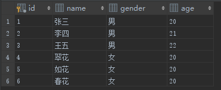
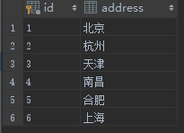
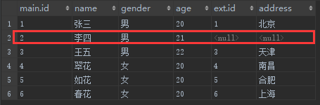
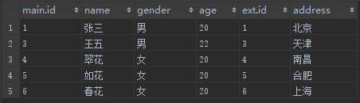
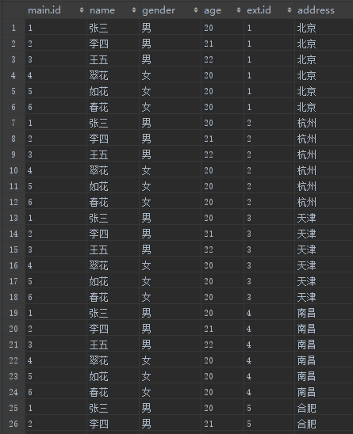
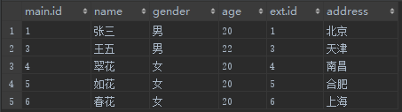
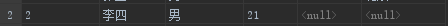

# on 和 where的区别

>一般on后面只写连接条件，不写过滤条件，这样逻辑清晰一些
>
>-----------------------------------------------------------------------------
>
>
>
>主要还是  outer join 的区别；cross join  和 inner join 都是一样的；
>
>1，先笛卡尔积；
>
>2，on 筛选；
>
>**3，添加外部行；**   on 的话 会恢复外部行  where 不会；会有一个表作为基础表来添加外部行；
>
>4，where 过滤；
>
>
>
>---------------------------------------------------------------------------------
>
>outer join on  会有添加外部行的部分；
>
>outer join where 直接不会以左表或者右表为基准；


sql查询这个东西， 要说它简单， 可以很简单， 通常情况下只需使用增删查改配合编程语言的逻辑表达能力，就能实现所有功能。 但是增删查改并不能代表sql语句的所有， 完整的sql功能会另人望而生畏。 就拿比普通增删查改稍微复杂一个层次的连接查询来说, 盲目使用, 也会出现意料之外的危险结果，导致程序出现莫名其妙的BUG。

**在连接查询语法中，另人迷惑首当其冲的就要属on筛选和where筛选的区别了， 在我们编写查询的时候， 筛选条件的放置不管是在on后面还是where后面， 查出来的结果总是一样的， 既然如此，那为什么还要多此一举的让sql查询支持两种筛选器呢？ 事实上， 这两种筛选器是存在差别的，只是如果不深挖不容易发现而已。**


**sql中的连接查询分为3种， cross join，inner join，和outer join ， 在 cross join和inner join中，筛选条件放在on后面还是where后面是没区别的，极端一点，在编写这两种连接查询的时候，只用on不使用where也没有什么问题。因此，on筛选和where筛选的差别只是针对outer join，也就是平时最常使用的left join和right join。**

**cross join 就是  select \* from t1,t2 where t1.id=t2.id;** 


来看一个示例，有两张数据表，结构和数据如图所示

表main




表ext



可以把这两张表看作是用来存放用户信息的， main放置主要信息，ext表放置附加信息，两张表的关系是1对1的，以id字符作为对应关系键。现在我们需要将地址不为杭州的所有用户信息筛选出来，结果中需要包含main表和ext表的所有字段数据。

**select \* from main left JOIN exton main.id = ext.id and address <> '杭州'**

闭上眼睛， 请用大脑人肉运行一下这段SQL， 想象一下是什么结果。



当把 **address <> '杭州'** 这个筛选条件放在on之后，查询得到的结果似乎跟我们预料中的不同，从结果中能看出，这个筛选条件好像只过滤掉了ext表中对应的记录，而main表中的记录并没有被过滤掉，也就是上图中标记为红色的那条记录。**outer join相对于inner join的一个主要特性就是以一侧的表为基础，但是在这里以左表为基这一点却可以无视筛选条件，这未免也太霸道了一些。**

把查询语句稍微改动一下，将地址的筛选条件从on转移至where

**select \* from main left JOIN ext on main.id = ext.id where address <> '杭州'**

结果就如我们预期的那样了



造成这种结果上的差异要从outer join查询的逻辑查询的各个阶段说起。总的来说，outer join 的执行过程分为4步

##注意

**1、先对两个表执行交叉连接(笛卡尔积)**

**2、应用on筛选器**

**3、添加外部行**

**4、应用where筛选器**


就拿上面不使用where筛选器的sql来说，执行的整个详细过程如下

**第一步**，对两个表执行交叉连接，结果如下，这一步会产生36条记录（此图显示不全）




**第二步**，应用on筛选器。筛选器中有两个条件，**main.id = ext.id and address<> '杭州'**，符合要求的记录如下




这似乎正是我们期望中查询的结果，然而在接下来的步骤中这个结果会被打乱

**第三步**，添加外部行。o**uter join有一个特点就是以一侧的表为基，假如另一侧的表没有符合on筛选条件的记录，则以null替代。**在这次的查询中，这一步的作用就是将那条原本应该被过滤掉的记录给添加了回来




是不是不种画蛇添足的感觉, 结果就成了这样


**第四步**，应用where筛选器

在这条问题sql中，因为没有where筛选器，所以上一步的结果就是最终的结果了。

**而对于那条地址筛选在where条件中的sql，这一步便起到了作用，将所有地址不属于杭州的记录筛选了出来**


通过上面的讲解，已经能反应出在outer join中的筛选条件在on中和where中的区别，开发人员如能详细了解之中差别，能规避很多在编写sql过程中出现的莫名其妙的错误。


##on 

> 表和表的连接条件！！！
>
>---
>
>

当在查询中使用`JOIN`操作连接多个表时，`ON`和`WHERE`关键字可以用于指定不同类型的条件。

1. ```
   ON
   ```

   关键字：

   - `ON`关键字用于指定连接表之间的关联条件。
   - `ON`条件是在执行连接操作时确定如何将行匹配到连接的表。
   - `ON`条件通常用于`JOIN`操作，用于指定连接表之间的关联关系。


## where 代表的是 对	

1. ```
   WHERE
   ```

   关键字：

   - `WHERE`关键字用于指定过滤条件，用于筛选满足条件的行。
   - `WHERE`条件是在执行查询或操作之前对行进行过滤。
   - `WHERE`条件通常用于`SELECT`、`UPDATE`、`DELETE`等语句，用于限制返回结果或操作的行。
   - `WHERE`条件可以包含比较运算符、逻辑运算符和其他条件表达式。
   - `WHERE`条件是在查询或操作过程中进行的，它决定了哪些行符合条件。