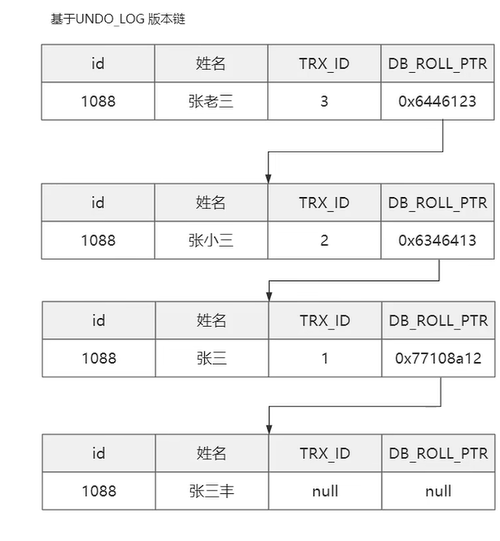
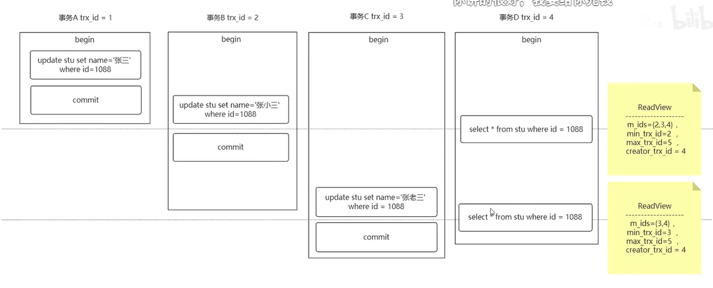

# undo log

那你们知道undo log这个版本链除了做回滚操作，还有其他的作用么？这里给大家提示下，undo log除了可以做回滚，还可以解决各种并发问题呢！这里给大家引入个名字 mvcc ,咱们下期在来说这个玩意。


MVCC 的实现依赖于版本链，版本链是通过表的三个隐藏字段实现。

**DB_TRX_ID：当前事务id，通过事务id的大小判断事务的时间顺序。**
**DB_ROLL_PRT：回滚指针，指向当前行记录的上一个版本，通过这个指针将数据的多个版本连接在一起构成undo log版本链。**
**DB_ROLL_ID：主键，如果数据表没有主键，InnoDB会自动生成主键。 每条表记录大概是这样的：**

name	age	DB_TRX_ID	DB_ROLL_PRT	DB_ROLL_ID
小志	18	1	2	0*233333
使用事务更新行记录的时候，就会生成版本链，执行过程如下：

`````mysql
1.用排他锁锁住该行；
2.将该行原本的值拷贝到undo log，作为旧版本用于回滚；
3.修改当前行的值，生成一个新版本，更新事务id，使回滚指针指向旧版本的记录，这样就形成一条版本链。
下面举个例子方便大家理解。
#  因为 当执行 update的时候就会形成版本链，不需要commit；当rollback的时候就根据roll_ptr 返回到上一个版本；上一个版本肯定是已经提交的版本；这里多注意一下；
`````







## undo log 第一条最新数据有可能是没有提交的事务，你只要执行update  他就会生成这一条事务，但是只能一个事务占有，因为有行锁，其他的事务没有办法操作！！所以最新的版本链，有且仅有一条未提交的版本！！！当然当前读，是去读最新的，但是不回去读未提交的； 当前读直接读版本链中最新的提交数据就可以了！！！可以结合上面的来做分析；；；


----


1、初始数据如下，其中DB_ROW_ID和DB_ROLL_PTR为空。

name	age	DB_TRX_ID	DB_ROLL_PRT	DB_ROLL_ID
小志	18	1	null	null

2、事务A对该行数据做了修改，将age修改为12，效果如下：

name	age	DB_TRX_ID	DB_ROLL_PRT	DB_ROLL_ID
小志	18	1	1	0*100000
name	age	DB_TRX_ID	DB_ROLL_PRT	DB_ROLL_ID
小志	18	1	null	null
3、之后事务B也对该行记录做了修改，将age修改为8，效果如下：

name	age	DB_TRX_ID	DB_ROLL_PRT	DB_ROLL_ID
小志	8	1	2	0*233333
name	age	DB_TRX_ID	DB_ROLL_PRT	DB_ROLL_ID
小志	12	1	1	0*100000
name	age	DB_TRX_ID	DB_ROLL_PRT	DB_ROLL_ID
小志	18	1	null	null
4、此时undo log有两行记录，并且通过回滚指针连在一起。


最左匹配原则：索引中的最左边的索引


---


索引设计原则；

1.索引列的区分度越高，索引的效果越好。比如使用性别这种区分度很低的列作为索引，效果就会很差。
2.尽量使用短索引，对于较长的字符串进行索引时应该指定一个较短的前缀长度，因为较小的索引涉及到的磁盘I/O较少，查询速度更快。
3.索引不是越多越好，每个索引都需要额外的物理空间，维护也需要花费时间。
4.利用最左前缀原则。

-----


什么是前缀索引？

有时需要在很长的字符列上创建索引，这会造成索引特别大且慢。使用前缀索引可以避免这个问题。

前缀索引是指对文本或者字符串的前几个字符建立索引，这样索引的长度更短，查询速度更快。

创建前缀索引的关键在于选择足够长的前缀以保证较高的索引选择性。索引选择性越高查询效率就越高，因为选择性高的索引可以让MySQL在查找时过滤掉更多的数据行。
建立前缀索引的方式：

// email列创建前缀索引 ALTER TABLE table_name ADD
 KEY(column_name(prefix_length));


----


InnoDB存储引擎

InnoDB是MySQL默认的事务型存储引擎，使用最广泛，基于聚簇索引建立的。InnoDB内部做了很多优化，如能够自动在内存中创建自适应hash索引，以加速读操作。

优点：支持事务和崩溃修复能力；引入了行级锁和外键约束。

缺点：占用的数据空间相对较大。

适用场景：需要事务支持，并且有较高的并发读写频率。

----


MyISAM存储引擎

数据以紧密格式存储。对于只读数据，或者表比较小、可以容忍修复操作，可以使用MyISAM引擎。MyISAM会将表存储在两个文件中，数据文件.MYD和索引文件.MYI。

优点：访问速度快。

缺点：MyISAM不支持事务和行级锁，不支持崩溃后的安全恢复，也不支持外键。

适用场景：对事务完整性没有要求；表的数据都会只读的。

----


MEMORY存储引擎

MEMORY引擎将数据全部放在内存中，访问速度较快，但是一旦系统奔溃的话，数据都会丢失。

MEMORY引擎默认使用哈希索引，将键的哈希值和指向数据行的指针保存在哈希索引中。

优点：访问速度较快。

缺点：

1.哈希索引数据不是按照索引值顺序存储，无法用于排序。
2. 不支持部分索引匹配查找，因为哈希索引是使用索引列的全部内容来计算哈希值的。
3. 3.只支持等值比较，不支持范围查询。 当出现哈希冲突时，存储引擎需要遍历链表中所有的行指针，逐行进行比较，直到找到符合条件的行。

---


1.是否支持行级锁 : MyISAM 只有表级锁，而InnoDB 支持行级锁和表级锁，默认为行级锁。

2.是否支持事务和崩溃后的安全恢复： MyISAM 不提供事务支持。而InnoDB 提供事务支持，具有事务、回滚和崩溃修复能力。

3.是否支持外键： MyISAM不支持，而InnoDB支持。

4.是否支持MVCC ：MyISAM不支持，InnoDB支持。**应对高并发事务**，MVCC比单纯的加锁更高效。并发能力比较强；

5.MyISAM不支持聚集索引，InnoDB支持聚集索引。


---


那么MySQL是如何避免幻读？

1.在快照读情况下，MySQL通过mvcc来避免幻读。
2.在当前读情况下，MySQL通过next-key来避免幻读（加行锁和间隙锁来实现的）。
next-key lock 包括两部分：行锁和间隙锁。行锁是加在索引上的锁，间隙锁是加在索引之间的。

Serializable隔离级别也可以避免幻读，会锁住整张表，并发性极低，一般不会使用。


----


**MySQL中int(10)和char(10)的区别？**

> int(10)中的10表示的是显示数据的长度，而char(10)表示的是存储数据的长度。