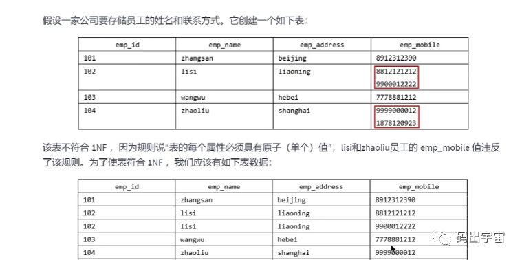

# 数据库设计-三大范式

>**核心：减少数据的冗余；保证数据的正确性；**
>
>范式设计的优点：
>
>* 减少数据的冗余；（关系型数据库一般都会有这个理念，一份数据只存 一份！！！）
>* 保证数据的正确性；insert  delete update；
>
>缺点：
>
>* 查询速度比较慢；需要联表；

----


## 1NF （Normal Form）

**每个字段都具有原子性，列不可分；**

---


## 2NF

**非主属性完全依赖于候选码；不应该部分依赖；**

**一个表中的候选码可能会有多个主属性；所以会产生部分依赖；**

例子 就是 ：  user_id  name age class  score；  // 可以反向来看是否依赖，不同的课程不能的分数，不同的人也会有不同的分数； 

（user_id,class）->  score;  那么就是完全依赖；依赖于全部的候选码；

 (user_id,class)-> nama age  都依赖于 user_id 那么就是部分依赖；

下面是做拆分；i


----

-

## 3NF

**非主属性直接依赖于候选码；不应该间接依赖（传递函数依赖）；**

例子：

user_id  name age 系  系主任；

系主任依赖于 系  而系依赖于id 所以系主任间接依赖于id；

这里并不是直接依赖；是间接依赖；

所以也要做拆分；


----

## 反范式的设计

当冗余信息能大幅度提高查询效率的时候，我们才会采取反范式的优化。

> 空间换时间；减少联表，来增加查询效率；
>
> 增加冗余字段的建议
>
> 增加冗余冗余字段一定要符合下面的两个条件，满足下面的两个条件才可以考虑增加冗余字段
>
> ①这个冗余字段不需要经常进行修改
>
> ②这个冗余字段查询的时候不可或缺


优点：

* 大幅度提高查询的效率；空间换时间，减少联表来提高查询的效率；

反范式虽然可以通过空间换实际，提升查询的效率，但是反范式也会带来一些新问题：

- 存储空间变大了
- **一个表中字段做了修改，另外一个表中冗余字段也要同步进行修改，不然会导致数据不一致**
- 如果用存储过程了支持数据的更新，删除等操作，如果操作频繁，就会消耗系统资源
- **在数据量小的情况下，反范式不能体现性能的优势，可能还会让数据库的设计更加复杂。数据量比较多的时候比较适合；**


----


## BCNF


----


## 概念；

**候选码：假设k为表中的某个属性，如果k确定的情况下，这个表里的其他属性都可以确定，那么k就叫做候选码；也叫做码；**

**主属性：就是候选码里面的字段；**

**非主属性：就是不再码里面的字段；**


**函数依赖：函数y=f(x)代表了给定一个x的值，y的值也是确定的.那么就叫做x--->y;y依赖于x；**

**完全依赖：（X1，X2）----> Y;  这个叫完全依赖；全部的码来决定一个属性；这就叫全部依赖；依赖于全部的码；**

**部分函数依赖：（学号，课名）----->  姓名； 依赖于部分的码；**

----


传递函数依赖：Y----->Z  X------>Y;   那么X依赖于Z； 传递依赖；

--------> 依赖；

(球员编号，比赛编号)——>(姓名，年龄，比赛时间，比赛场地，得分)；这是部分依赖；

**(球员编号)——>(姓名，年龄)**

**(比赛编号)——>(比赛时间，比赛场地)**

**非主属性并非完全依赖候选键，这样会产生下面的问题。**


----


## 文档


1.为什么需要数据库设计

设计数据表的时候，要考虑很多的问题:

- 用户需要哪些数据，我们在数据表中要保存哪一些数据
- 怎么保证数据表中的数据的正确性
- 如何降低数据表的冗余度
- 开发人员怎么才能更方便的使用数据库


如果数据库设计得不合理的话，可能导致下面的几种问题:

- 设计容易，信息重复，存储空间浪费
- 数据更新，插入，删除的异常
- 不能正确表示信息
- 丢失有效信息
- 程序性能差


我们可以看出设计良好的数据库是很重要的，它有下面的优点:

- 节省数据的存储空间
- 能够保证数据的完整性
- 方便进行数据库应用系统的开发
- 设计数据库，我们得重视数据表的设计，为了建立冗余度小，结构合理的数据库，设计数据库必须遵循一定的规则。


2.范式(Normal Formal）

**2.1范式概述**

关系型数据库中，关于数据表设计的基本原则，规则就称为范式，范式是我们在设计数据库结构过程中需要遵循的规则和指导方法。


不过，有的时候为了提高某一些查询性能，我们还需要破坏范式规则，也就是反规范化。


**2.2键和相关属性的概念**

范式的定义会用到主键和候选键，我们先来看看相关的概念，数据库中的键是由一个或多个属性组成的，我们来看一下数据表中常用的几种键和属性的定义。


**2.3第一范式(1NF)**

- 第一范式主要是保证数据表中的每一个字段的值必须具有原子性，也就是数据表中的每个字段的值是不可再拆分的最小数据单元




- 属性的原子性是主观的，我们要根据实际项目的需求来设计，比如说地址，如果项目没有说要细分为省，市，县，镇这么具体的话，我们一般就可以不拆分。


2.4第二范式(2NF）

- 第二范式要求在满足第一范式的基础上，还要满足数据表里的每一条数据记录，都是可唯一标识的，**而且所有的非主键字段，都必须完全依赖主键，不能只依赖主键的一部分。**
- 如果知道主键的所有属性的值，我们就可以检索任何元组(行)的任何属性的任何值(要求中的主键可以拓展替换为候选键)


> 比如说，在成绩表(学号，课程号，成绩)关系中，(学号，课程号)可以决定成绩，因为一个学生可以选多门课，一门课也可以被多个学生选择，所以学号或课程号都不能单独决定成绩。
>
> 所以(学号，课程号)——>成绩就是完全依赖关系。


> 比赛表里面包含球员编号，姓名，年龄，比赛编号，比赛实际和比赛场地等属性，候选键和主键都是(球员编号，比赛编号),我们可以通过候选键(主键)来决定下面的关系。
>
> (球员编号，比赛编号)——>(姓名，年龄，比赛时间，比赛场地，得分)
>
> 但是这个数据表不满足第二范式，因为数据表中的字段之间还存在下面的对应关系:
>
> 
>
> **(球员编号)——>(姓名，年龄)**
>
> **(比赛编号)——>(比赛时间，比赛场地)**
>
> **非主属性并非完全依赖候选键，这样会产生下面的问题。**


- 数据冗余:如果一个球员参加m场比赛，那么球员的姓名和年龄就重复了m-1次，一个比赛可能有n个球员参加，比赛时间和地点就重复了n-1次
- 插入异常:如果我们要添加一场新的比赛，但是这时还没有确定参加的球员都有谁2，那么就没发插入
- 删除异常:我们想删除某个球员编号，但是如果没有单独保存比赛表的话，就会同时把比赛信息删除掉
- 更新异常:如果我们调整了某个比赛时间，那么数据表所有的这个比赛的时间都得进行调整，不然就会出现同一场比赛但是时间不同的情况。


为了避免上述情况，我们可以把球员比赛表设计成下面的三张表。


这样的话，每张数据表都符合第二范式，，就避免了异常情况的发生


第二范式要求实体的属性完全依赖主关键字，如果存在不完全依赖，那么这个属性和主关键字的这一部分就应该分离处理形成一个新的实体，新实体和原来实体之间是一对多的关系


**2.5第三范式(3NF）**

- 第三范式建立在已经满足第二范式的基础上
- 数据表中的每一个非主键字段都和主键字段直接相关
- 也就是说数据表中的所有非主键字段不能依赖于其他非主键字段
- 这个规则的意思是所有非主属性之间不能有依赖关系，它们是互相独立的
- 这里的主键可以拓展成为候选键


、

**2.6范式的优缺点**

- 优点:


- - 数据的标准化有助于消除数据库中的数据冗余
  - 第三范式通常被认为在性能，扩展性和数据完整性方面达到了最好的平衡


- 缺点:


- - 降低了查询效率，因为范式等级越高，设计出来的表就越多，进行数据查询的时候就可能需要关联多张表，不仅代价昂贵，而且可能会使得一些索引失效


- - 范式只是提出设计的标标准，实际设计的时候，我们可能为了性能和读取效率违反范式的原则，通过增加少量的冗余或重复的数据来提高数据库的读取性能，减少关联查询，实现空间换时间的目的


3.反范式化

**3.1概述**

- 遵循业务优先的原则
- 首先满足业务需求，再进来减少冗余
- 有时候我们想要对查询效率进行优化，反范式化也是一种优化思路，我们可以通过在数据表中增加冗余字段来提高数据库的读性能。


**3.2 反范式的新问题**

反范式虽然可以通过空间换实际，提升查询的效率，但是反范式也会带来一些新问题


- 存储空间变大了
- 一个表中字段做了修改，另外一个表中冗余字段也要同步进行修改，不然会导致数据不一致
- 如果用存储过程了支持数据的更新，删除等操作，如果操作频繁，就会消耗系统资源
- 在数据量小的情况下，反范式不能体现性能的优势，可能还会让数据库的设计更加复杂。


**3.3反范式的适用场景**

当冗余信息能大幅度提高查询效率的时候，我们才会采取反范式的优化。


> 增加冗余字段的建议
>
> 增加冗余冗余字段一定要符合下面的两个条件，满足下面的两个条件才可以考虑增加冗余字段
>
> ①这个冗余字段不需要经常进行修改
>
> ②这个冗余字段查询的时候不可或缺
>
> ‍


4.BCNF(巴斯范式)


这个表符合第三范式


---

## eg

> 一个商品表的设计！！

`````php
`````

