# 主从复制 

**读写分离；**

**减轻主库读的压力**

**主库 负责去写，从库负责去读；这样即使主库发生了锁表的情景，通过读从库也可以保证业务正常的运行；**


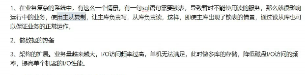

## 什么叫主从复制；

 **异步的形式；**

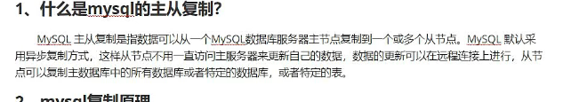


## mysql 复制原理

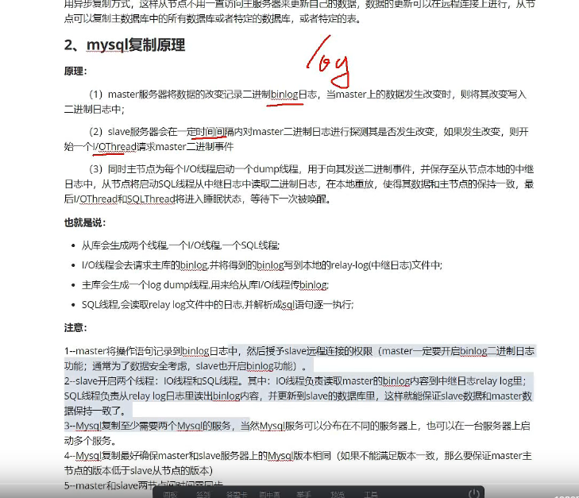


增删改；                 


这个需要去了解一下；                                                 

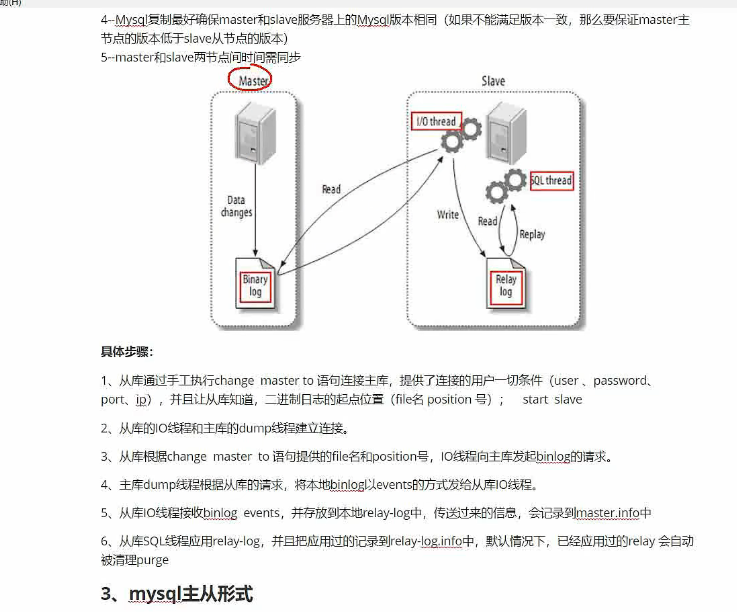


注意点：

5.7 需要获取一个临时的密码；

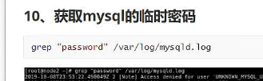

修改密码不能太简单；

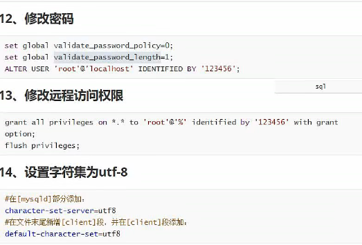

utf8mb4


% 所有的地址都可以访问；

`````mysql
server_id = 2                #唯一标识，主库从库不能重复
log_bin = mysql-bin          #开启日志
#binlog_format="mixed"      　　 #日志记录的格式
max_binlog_size = 512M  　　 #wnjiandaxiao
expire_logs_day = 3          #日志有效期（天）
binlog_do_db = test1,test2    #日志记录那些数据库
binlog_ignore_db = mysql,performance_schema,information_schema #日志记录忽略那些数据库的
bind-address = 0.0.0.0
`````


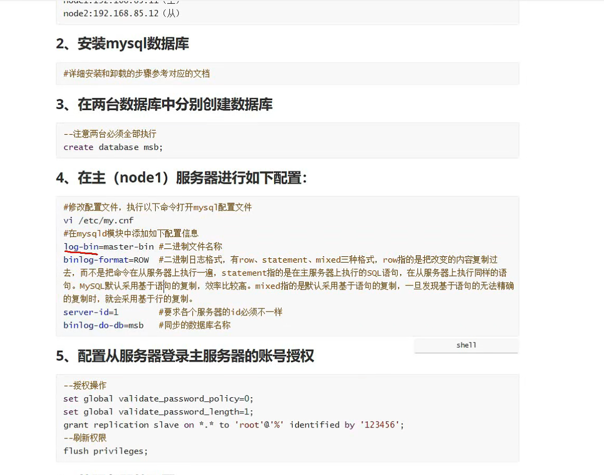


statement 是语句的复制；

row是把改变的内容复制过去；

mixed  是默认基于sql语句的复制，但是无法精准复制的时，需要采用基于行的复制；


需要同步必须要给他权限

````mysql
# 复制 replication  slave on// 就是给从库账号授权；

grant replication slave on *.* 'root'@'%' identidied by '123456'
flush privileges;
````


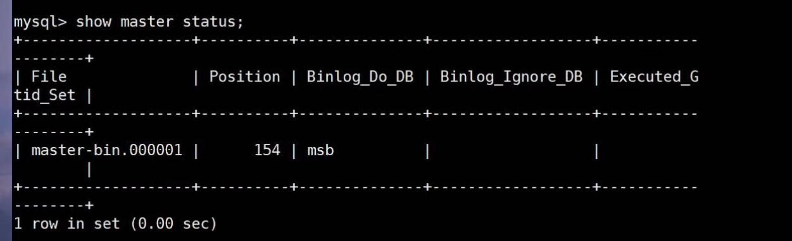


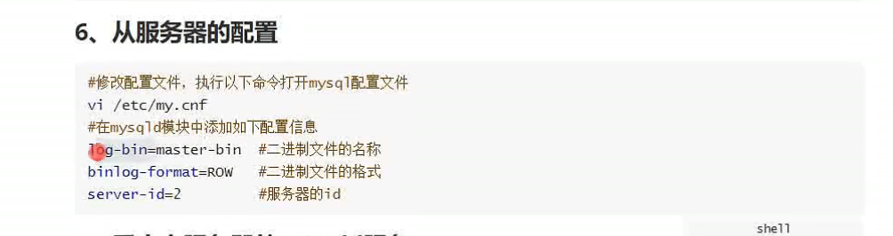

pos  就是同步的位置；

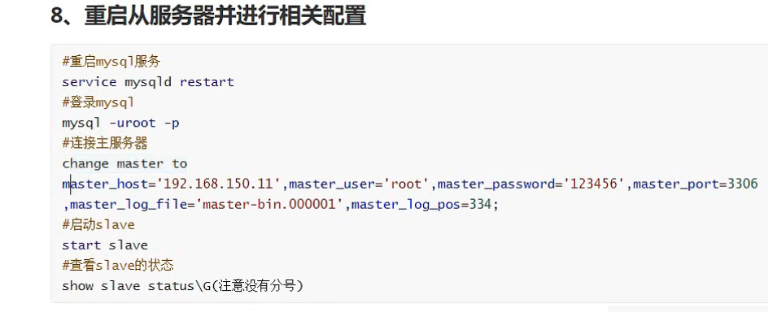


判断是否成功；

**需要看salve_io 拉数据的**

**slave_sql  执行sql语句的；**

如果不是yes

那么就去var/log/mysqld.log 里面去看错误；

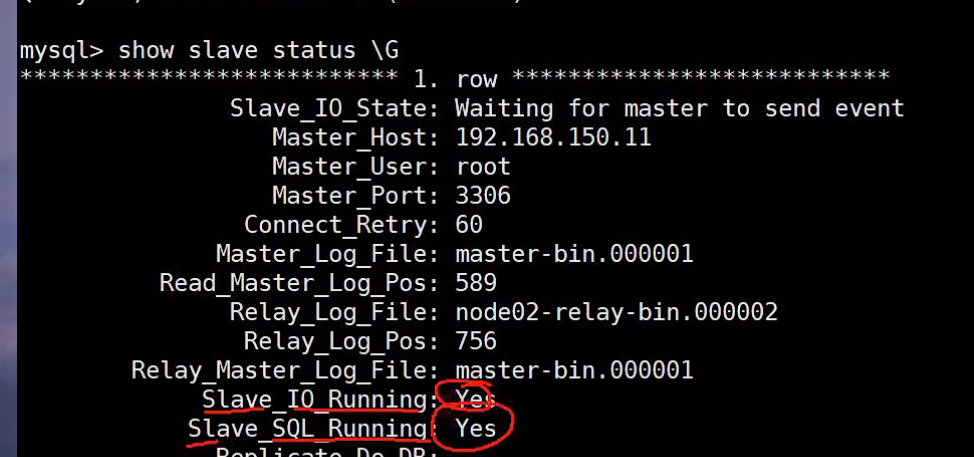


## 读写分离

mysql_proxy  lua 来区分是读请求 还是一个写请求；

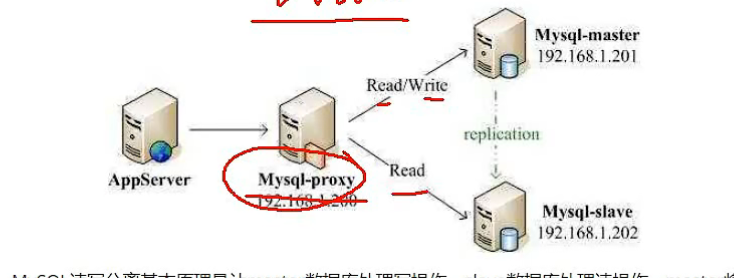


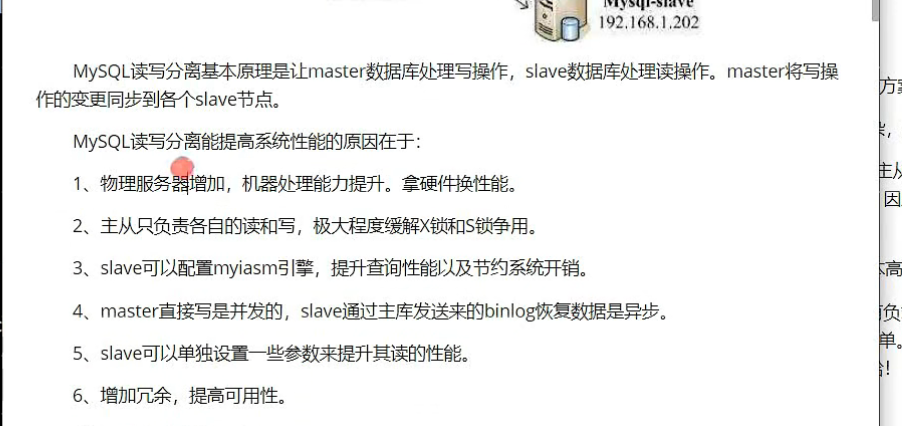


alibaba 的amoba来实现读写分离


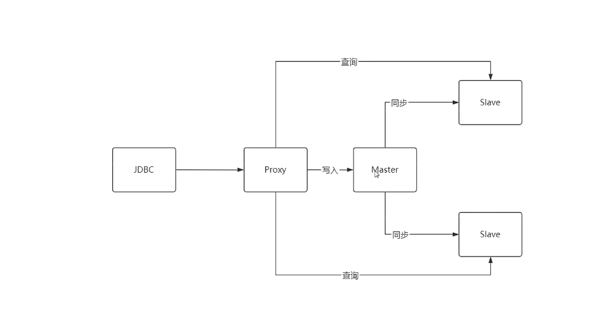


**主从同步出现延迟的问题：**  数据不一致的问题？？？

怎么去解决？

**推荐用这种方法；**


**要求实时性比较强的直接走主库就可以了把； 主库压力比较大，可能会出现瓶颈的问题；**


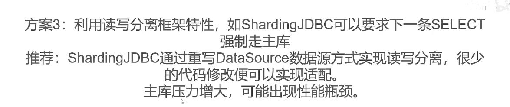


**延迟查询，为主从同步留出足够的时间；  不建议使用；**


**强一致性？？？？？**


## 用docker mysql 来测试 一下主从辅助； 开启两个mysql 8.0 容器


``````shell
docker run -tid --name mysql8.0 -e MYSQL_ROOT_PASSWORD=root --restart=always mysql

docker run -tid --name mysql8.0-v1 -e MYSQL_ROOT_PASSWORD=root --restart=always mysql
``````

````shell
# 配置vim  ----  最好重启一下容器 有可能会出报错；。。。。。 无语。。。。
G:\website\docker-lnmp
$ docker cp php7.2:/root/.vimrc .

G:\website\docker-lnmp
$ ls
1.txt           apt_update_bak.sh*  conf/               --help/        multiRedis.txt  php7.2/     settings.json.2   tmp/
60              apt-update-163.sh*  docker-compose.yml  ideavimrc.bak  mysql/          portainer/  sources.list.bak  txt
apt_update.sh*  cacert.pem          -h/                 logs/          openresty/      ROOT/       start*            xdebug-3.1.2.tgz

G:\website\docker-lnmp
$ ls -al
total 483
drwxr-xr-x 1 Leaveone 197121      0 12月 30 19:36 ./
drwxr-xr-x 1 Leaveone 197121      0 12月  9 22:58 ../
-rw-r--r-- 1 Leaveone 197121     13 11月 29  2018 .gitignore
-rw-r--r-- 1 Leaveone 197121    343 12月 21 18:43 .vimrc
-rw-r--r-- 1 Leaveone 197121   2381 12月 22  2020 1.txt
-rw-r--r-- 1 Leaveone 197121      0  4月  4  2022 60
-rwxr-xr-x 1 Leaveone 197121    716  7月 30  2020 apt_update.sh*
-rwxr-xr-x 1 Leaveone 197121    587  7月 21  2020 apt_update_bak.sh*
-rwxr-xr-x 1 Leaveone 197121   1301  7月 30  2020 apt-update-163.sh*
-rw-r--r-- 1 Leaveone 197121 208065 12月 11  2021 cacert.pem
drwxr-xr-x 1 Leaveone 197121      0  8月  9 14:38 conf/
-rw-r--r-- 1 Leaveone 197121   1667  7月 31 12:58 docker-compose.yml
drwxr-xr-x 1 Leaveone 197121      0  6月 11  2019 -h/
drwxr-xr-x 1 Leaveone 197121      0  6月 11  2019 --help/
-rw-r--r-- 1 Leaveone 197121    635  4月 12  2022 ideavimrc.bak
drwxr-xr-x 1 Leaveone 197121      0  7月  6 00:51 logs/
-rw-r--r-- 1 Leaveone 197121    368  7月 16  2020 multiRedis.txt
drwxr-xr-x 1 Leaveone 197121      0 12月 30 15:40 mysql/
drwxr-xr-x 1 Leaveone 197121      0  8月 11 16:28 openresty/
drwxr-xr-x 1 Leaveone 197121      0  8月  1 00:13 php7.2/
drwxr-xr-x 1 Leaveone 197121      0 10月 23  2021 portainer/
drwxr-xr-x 1 Leaveone 197121      0 10月 22  2021 ROOT/
-rw-r--r-- 1 Leaveone 197121      0 12月  1  2021 settings.json.2
-rw-r--r-- 1 Leaveone 197121    421  4月 22  2020 sources.list.bak
-rwxr-xr-x 1 Leaveone 197121    112 11月 29  2018 start*
drwxr-xr-x 1 Leaveone 197121      0 11月 15  2021 tmp/
-rw-r--r-- 1 Leaveone 197121      2 10月 26  2021 txt
-rw-r--r-- 1 Leaveone 197121 230023 12月  2  2021 xdebug-3.1.2.tgz

G:\website\docker-lnmp
$ docker .vimrc mysql8.0:/root/
docker: '.vimrc' is not a docker command.
See 'docker --help'

G:\website\docker-lnmp
$ docker ./.vimrc mysql8.0:/root/
docker: './.vimrc' is not a docker command.
See 'docker --help'

G:\website\docker-lnmp
$ docker cp ./.vimrc mysql8.0:/root/

G:\website\docker-lnmp
$ ls
1.txt           apt_update_bak.sh*  conf/               --help/        multiRedis.txt  php7.2/     settings.json.2   tmp/
60              apt-update-163.sh*  docker-compose.yml  ideavimrc.bak  mysql/          portainer/  sources.list.bak  txt
apt_update.sh*  cacert.pem          -h/                 logs/          openresty/      ROOT/       start*            xdebug-3.1.2.tgz

G:\website\docker-lnmp
$ docker cp ./.vimrc mysql8.0-v1:/root/

G:\website\docker-lnmp
$
````


### 修改配置my.cnf

`````shell
`````

