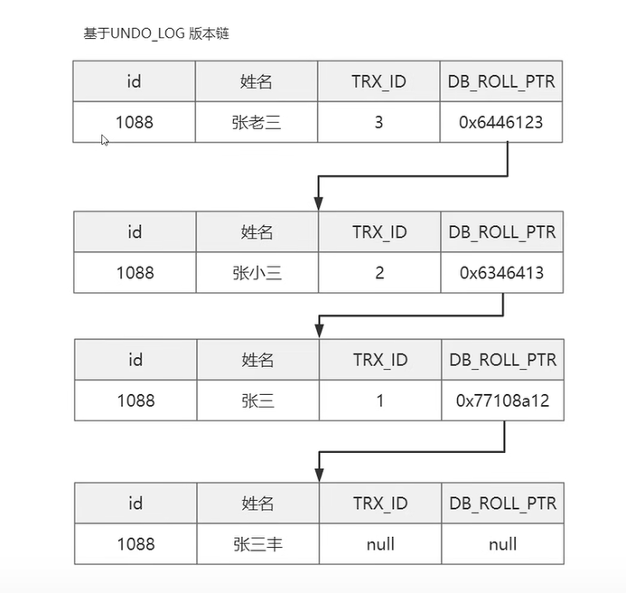
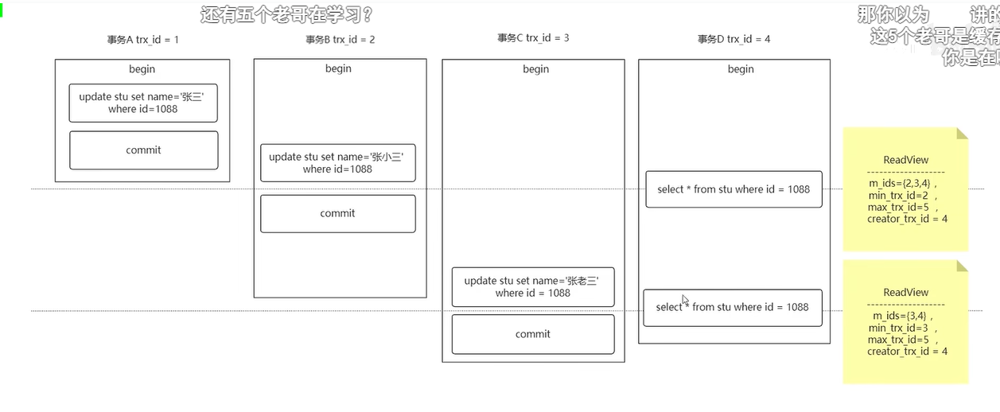
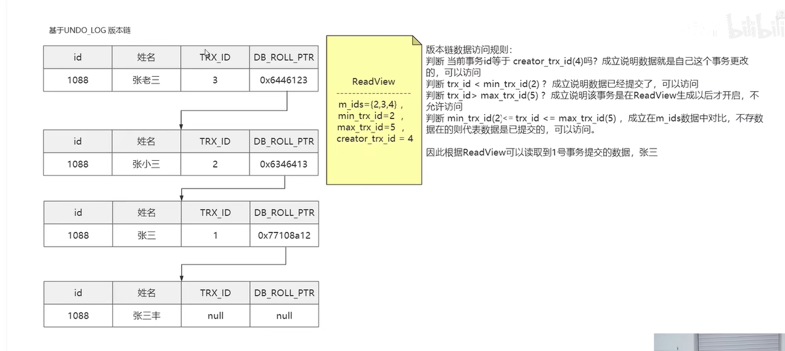
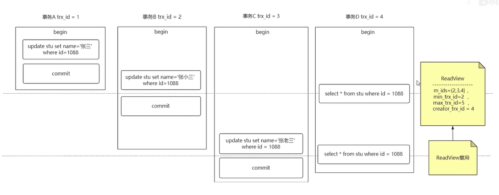
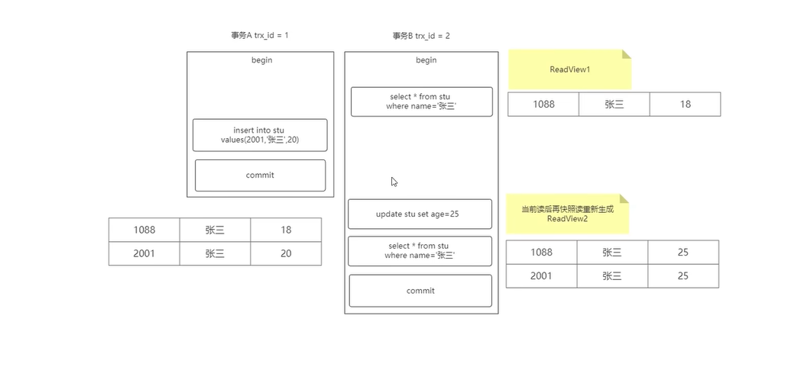

# 事务


## 随机IO和顺序IO的区别

随机IO 需要找到位置 然后添加数据

顺序IO，直接直到位置，直接添加数据就可以了；

顺序IO很快的；可以和内存随机写入差不多的速度；

---


## ACID

A atomicity  原子性  一系列操作作为一个整体，要么成功要么失败；  


| 事务特性：          | 简述                                   | 原理                                      |
| ------------------- | -------------------------------------- | ----------------------------------------- |
| A atomicity 原子性  | 一系列操作，要么成功要么失败；         | undo log 回滚日志；                       |
| c consistent 一致性 | 数据的一致性；                         | 共同来保证；                              |
| i isolation  隔离性 | 并发执行事务；并发执行事务；           | mvcc  和  锁；                            |
| d durability 持久性 | 一旦事务提交对数据库的更新就是持久的； | redo log WAL预写日志 cash-safe 崩溃安全； |


**如果 没有redolog  内存里面的数据就没法 恢复；就会导致一个数据不一致的问题；数据会丢失；**


**写数据的时候，我们会先去修改内存的数据，然后先写redolog   然后去落盘处理；**


`````mysql
mysql> select version();
# 事务的修改 0 1 2 3 分别代表四个隔离级别，这个只是临时的修改；
mysql> set transaction_isolation=1;  

mysql> set tx_isolation=1;
Query OK, 0 rows affected (0.00 sec)
# 自动提交关闭；

mysql> set autocommit=0;
Query OK, 0 rows affected (0.00 sec)


mysql> show variables like 'tx_isolation';
+---------------+----------------+
| Variable_name | Value          |
+---------------+----------------+
| tx_isolation  | READ-COMMITTED |
+---------------+----------------+
1 row in set (0.00 sec)


#5.7之后
mysql> show variables like 'transaction_isolation';
#5.6之前版本都是tx_transation 默认都是可重读读；5.6版本有了索引下推，5.5版本默认engine存储引擎是innodb；

show variables like 'tx_isolation'

mysql> show variables like "tx_isolation";
+---------------+-----------------+
| Variable_name | Value           |
+---------------+-----------------+
| tx_isolation  | REPEATABLE-READ |
+---------------+-----------------+
1 row in set (0.00 sec)

#这句写错了，应该是tx_isolation。测试了一下 5.6 或者之前的版本；
#作者回复: 你是不是用的5.6或更早的版本😄

#5.7引入了transaction_isolation用来替换tx_isolation了，到8.0.3就去掉了后者了
`````


---


## I  isolation  隔离性   并发执行事务之间的隔离性，或者说可见性；

**隔离级别**

* 读未提交  read-uncommit  
  *  脏读  事务还没有提交，别的事务就可以读到修改；
  * 幻读   是因为同一个事务内，两次查询的数据数量发生变化；
  * 不可重读   同一个事务内，两次的select 的数据不一致的问题；

  
  
* 读已提交 read-committed   一致性视图是在每一条sql的时候创建的；

  * 不可重读
  * 幻读；

  

* 可重复读 repeatable-read   一致性视图是在执行第一条sql语句的时候创建的；

  * 幻读

  

* serializable  串行化；

  

**在“可重复读”隔离级别下，这个视图是在事务启动时创建的，整个事务存在期间都用这个视图。**

**在“读提交”隔离级别下，这个视图是在每个 SQL 语句开始执行的时候创建的。**

**这里需要注意的是，“读未提交”隔离级别下直接返回记录上的最新值，没有视图概念；**

**而“串行化”隔离级别下直接用加锁的方式来避免并行访问。**

---

## MVCC 多版本并发控制；是乐观锁的一种实现方式把

> 快照读不需要枷锁；


一致性视图：  一条记录有多个版本；主要是分为几部分组成；


````mysql
select * from for update; # 写锁；
select * from lock in share mode; # 加共享锁；
#写锁；
update   
insert
delete 
#就是它读取的是记录的最新版本，读取时还要保证其他并发事务不能修改当前记录，会对读取的记录进行加锁
````


**快照读：普通读 是读取的一致性视图的内容；**

**当前读：当前读 是已经提交事务的最新数据；**


````mysql
#像不加锁的 select 操作就是快照读，即不加锁的非阻塞读；快照读的前提是隔离级别不是串行级别，串行级别下的快照读会退化成当前读；之所以出现快照读的情况，是基于提高并发性能的考虑，快照读的实现是基于多版本并发控制，即 MVCC ,可以认为 MVCC 是行锁的一个变种，但它在很多情况下，避免了加锁操作，降低了开销；既然是基于多版本，即快照读可能读到的并不一定是数据的最新版本，而有可能是之前的历史版本
#不需要加锁；

#说白了 MVCC 就是为了实现读-写冲突不加锁，而这个读指的就是快照读, 而非当前读，当前读实际上是一种加锁的操作，是悲观锁的实现


#总之在**RC隔离级别下，是每个快照读都会生成并获取最新的Read View；**

#而在**RR隔离级别下**，**第一条sql语句，会创建一个readview**；则是同一个事务中的**第一个快照读才会创建Read View**, 之后的快照读获取的都是同一个Read View。每一个当前读会重新创建一个新的**read view**；
````


## mvcc 进行并发事务的控制；

一个记录会有多个版本；


他是有两部分组成；


undo log版本链  行 有很多隐藏字段---   **trx_Id   roll_ptr**  pointer




readview


rc 隔离级别






m_ids 就是没有被提交的事务id，所以肯定不能被访问；

rr 可重复读 隔离级别

仅仅会生成一个readview;	





**mvcc这个很重要并没有完全解决 幻照读的问题；** 

 **仅仅解决了多次快照读的幻读问题；**





```mysql
# client1
mysql> begin;
Query OK, 0 rows affected (0.00 sec)
#  
mysql> select * from student;
+-------+--------+-------+
| name  | course | score |
+-------+--------+-------+
| name1 | amth   |    81 |
| name2 | amth   |    81 |
| name3 | amth   |    80 |
| name4 | yuwen  |    76 |
| name4 | yuwen  |    72 |
| name4 | yuwen  |    76 |
+-------+--------+-------+
6 rows in set (0.00 sec)
#添加数据 
mysql> update student set score=76 where score=72;
Query OK, 1 row affected (0.00 sec)
Rows matched: 1  Changed: 1  Warnings: 0

mysql>

#client2--------------------------------------------------------------------------------
                                                          
mysql> begin;                                             
Query OK, 0 rows affected (0.00 sec)                      
                                                          
mysql> select * from student where score=76;              
+-------+--------+-------+                                
| name  | course | score |                                
+-------+--------+-------+                                
| name4 | yuwen  |    76 |                                
| name4 | yuwen  |    76 |                                
+-------+--------+-------+                                
2 rows in set (0.00 sec)                                  
 # 解决了多次快照读的一个幻读问题；                                                         
mysql> select * from student where score=76;              
+-------+--------+-------+                                
| name  | course | score |                                
+-------+--------+-------+                                
| name4 | yuwen  |    76 |                                
| name4 | yuwen  |    76 |                                
+-------+--------+-------+                                
2 rows in set (0.00 sec)                                  
                                                          
mysql> insert into student values('name5','eng',90);      
Query OK, 1 row affected (0.00 sec)                       
# 当有当前读的时候需要重新创建readview；                                                          
mysql> insert into student values('name6','eng',76);      
Query OK, 1 row affected (0.00 sec)                       
                                                          
mysql> select * from student where score=76;              
+-------+--------+-------+                                
| name  | course | score |                                
+-------+--------+-------+                                
| name4 | yuwen  |    76 |                                
| name4 | yuwen  |    76 |                                
| name6 | eng    |    76 |                                
+-------+--------+-------+                                
3 rows in set (0.00 sec)                                  
```

