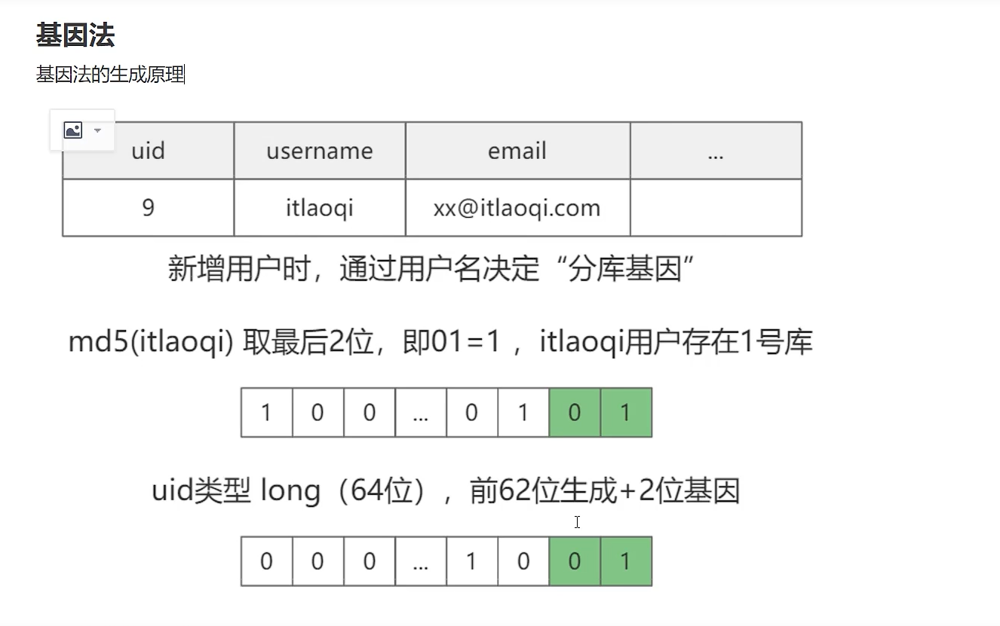

# 分表和分库

>水平和垂直；

分表 水平  就是 表的数量来划分；

垂直就是按照字段来划分；

---

## 这里一般使用的是 一致性哈希

* 扩容比较容易，仅仅只有少部分数据失效；

* 一致性哈希在处理数据偏移的问题，需要用到虚拟结点来处理；

---

## 水平分表

* 根据某个字段去分析，那么查询的时候只能根据这个字段来查询；

* 如果 要进行一些复杂的范围查询那么只能使用es，xunsearch；这些全文索引来做这部分内容；

----

## 了解一下倒索引和基因法；  es 全文索引应该就是用这个做的，用空间换时间；

> 用空间换时间；

**//也可以使用范围来实现分库分表的； range id 的范围  1--1000 或者 1001-2000 可以做分表；  就是求余% 1000**

 **//注意：  这里使用的是hash 计算  来进行分库和分表；  扩展比较麻烦 ，但是可以使用一致性还行来解决这个问题；**

### 基因法

 后面使用基因；//  

  4个数据库 所以要去2位；2\^2 = 4;

// 优点：  性能极高；

缺点：

// 主键生成器 要求很高；

//不能做扩展；

//  使用在关键字段上面，但是不能使用的太多，只能由一个非主键字段与之主键对应；

/

###  倒排索引法

// 倒索引法//

  // 因为uid 的不唯一性，所以还要保存库名（或者表名）；

优点：

* 通用的分库分表索引方案，几乎适用于所有的系统；

缺点：

* 倒索引，还需要查询一次，性能降低；
* 对内存需求量大；还有一个关于数据库和缓存的一致性问题都需要去解决;;;

##  原理

**只要带上分片字段就会查询单表，只要不带那么就只有全部都去查询；  或者范围查询只能去查询所有表；**

##  问题 必须要去解决的//todo

然后 分表之后 范围查询怎么去查询  或者分页之后怎么去解决？？？？？？  //todo

连续且唯一的全局id；

分库分表  数据库中间件 ，范围查询 是怎么做？  分页是怎么查询的？  mycat  shadingj'dbc；  分库和分表

中间件就是截取 发送到数据库的sql语句 截取where 条件部分，来判断是否使用分片字段，来改写这个要操作数据库的名称；然后 来操作数据库；

分页  怎么去分页  一般也是 每个表都去查询 limit 2 然后三个表都返回给中间件然后中间件选出2个来；

范围查询也是吗？ 如果对分片字段来进行范围查询，那么就需要保证id 是连续唯一的全局id；  仅仅是分表之后 id 功能弱化了吗？//todo？？？

如果是其他字段的范围查询，也是可以通过，所有的表都查询来做这些操作；

##  es 全文索引

如果你真的想提高范围查询的效率，那么只能是全文索引；  只能使用这个来查询了；提高查询效率；

