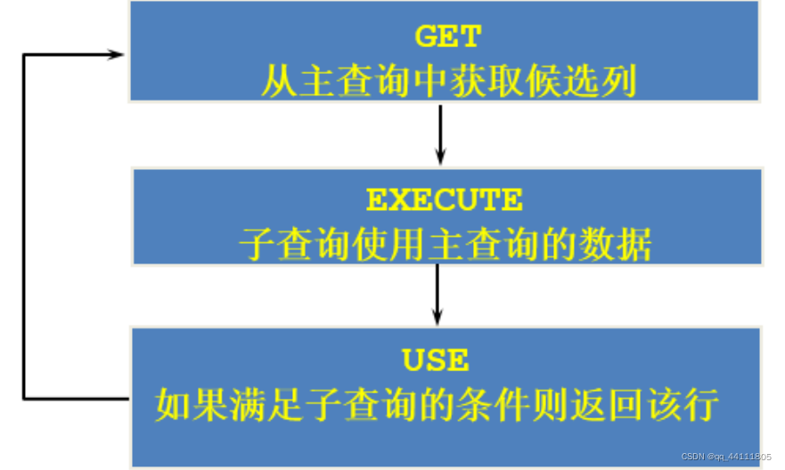
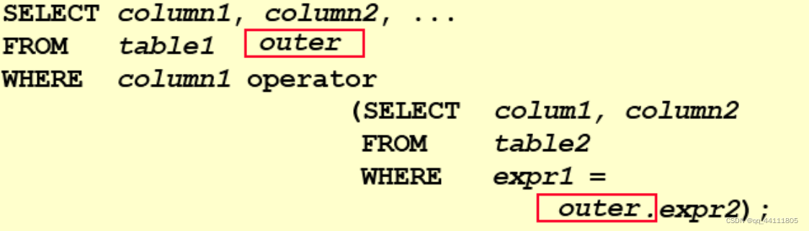

# 子查询

>https://blog.csdn.net/qq_44111805/article/details/124680208


一、子查询定义

子查询指一个查询语句嵌套在另一个查询语句内部的查询，这个特性从MySQL 4.1开始引入。

<font color=red>**SQL 中子查询的使用大大增强了 SELECT 查询的能力，因为很多时候查询需要从结果集中获取数据**</font>，或者需要从同一个表中先计算得出一个数据结果，然后与这个数据结果（可能是某个标量，也可能是某个集合）进行比较。

二、子查询的基本使用

1、子查询（内查询）在主查询之前一次执行完成。
2、子查询的结果被主查询（外查询）使用。
3、注意事项：

（1）子查询要包含在括号内
（2）将子查询放在比较条件的右侧
（3）单行操作符对应单行子查询，多行操作符对应多行子查询


三、子查询分类

1、分类方式一

<font color=red>**我们按内查询的结果返回一条还是多条记录，将子查询分为 单行子查询 、 多行子查询。**</font>

2、分类方式二

### 相关子查询和非相关子查询的定义；

<font color=red>**我们按内查询是否被执行多次，将子查询划分为 相关(或关联)子查询 和 不相关(或非关联)子查询。**</font>

**子查询从数据表中查询了数据结果，如果这个数据结果只执行一次，然后这个数据结果作为主查询的条件进行执行，那么这样的子查询叫做不相关子查询。**

**如果子查询需要执行多次，即采用循环的方式，先从外部查询开始，每次都传入子查询进行查询，然后再将结果反馈给外部，这种嵌套的执行方式就称为相关子查询。**


## 相关子查询


**1、相关子查询执行流程**

**如果子查询的执行依赖于外部查询，通常情况下都是因为子查询中的表用到了外部的表，并进行了条件关联，因此每执行一次外部查询，子查询都要重新计算一次，这样的子查询就称之为 关联子查询。**

**相关子查询按照一行接一行的顺序执行，主查询的每一行都执行一次子查询。**





````sql
# 查询员工中工资大于本部门平均工资的员工的last_name,salary和其department_id

# 法一：相关子查询
SELECT last_name,salary,department_id
FROM employees e1
WHERE salary>(
              SELECT AVG(salary)
              FROM employees e2   
              WHERE department_id=e1.department_id); # 注意“本部门”关键字眼
##相关子查询 转换成 join的形式！！
# 法二：在from中声明子查询

# from型的子查询：子查询是作为from的一部分，子查询要用()引起来，并且要给这个子查询取别
#名， 把它当成一张“临时的虚拟的表”来使用。
SELECT e.last_name,e.salary,e.department_id #注意此处要标明department_id所属的表，不然会报错(Column 'department_id' in field list is ambiguous)
FROM employees e,(
                  SELECT department_id,AVG(salary) avg_sal     
                  FROM employees
                  GROUP BY department_id) t_dept_avg_sal
WHERE e.department_id=t_dept_avg_sal.department_id
AND e.salary>t_dept_avg_sal.avg_sal;

# 查询员工的id,salary,按照department_name 排序
SELECT employee_id,salary
FROM employees e
ORDER BY (SELECT department_name # department_name在departmnets表中
          FROM departments d
          WHERE e.department_id=d.department_id);

# 重要结论：在SELECT中，除了GROUP BY 和 LIMIT之外，其他位置都可以声明子查询


# 若employees表中employee_id与job_history表中employee_id相同的数目不小于2，输出这些相同
# id的员工的employee_id,last_name和其job_id
SELECT e.employee_id,e.last_name,e.job_id
FROM employees e
WHERE 2<=(SELECT COUNT(*)
          FROM job_history
          WHERE employee_id=e.employee_id);

````


2、EXISTS 与 NOT EXISTS关键字

（1）关联子查询通常也会和 EXISTS操作符一起来使用，用来检查在子查询中是否存在满足条件的行。
（2）如果在子查询中不存在满足条件的行：

条件返回 FALSE ；
继续在子查询中查找。

（3）如果在子查询中存在满足条件的行：

不在子查询中继续查找；
条件返回 TRUE。

（4）NOT EXISTS关键字表示如果不存在某种条件，则返回TRUE，否则返回FALSE。

举例：

````sql
# 查询公司管理者的employee_id，last_name，job_id，department_id信息
# 方式一：自连接
SELECT DISTINCT e1.employee_id,e1.last_name,e1.job_id,e1.department_id # 因为管理者可能管理多个员工，所以需要去重
FROM employees e1 JOIN employees e2 # 相当于求交集
WHERE e1.employee_id=e2.manager_id;

# 方式二：子查询
SELECT employee_id,last_name,job_id,department_id
FROM employees
WHERE employee_id IN(
                    SELECT DISTINCT manager_id
                    FROM employees);

# 方式三：exists
SELECT e1.employee_id,e1.last_name,e1.job_id,e1.department_id
FROM employees e1
WHERE EXISTS(
              SELECT *
              FROM employees e2
              WHERE e1.employee_id=e2.manager_id
            );


# 查询departments表中，不存在于employees表中的部门的department_id和department_name
# 方式一：右连接
SELECT d.department_id,d.department_name
FROM employees e RIGHT JOIN departments d
ON e.department_id = d.department_id
WHERE e.department_id IS NULL; # employees表中没有的department_id

# 方式二：not exists(与上面一题方式三类似)
SELECT department_id,department_name
FROM departments d
WHERE NOT EXISTS (
		SELECT *
		FROM employees e
		WHERE d.department_id= e.department_id
		);

````


## 怎么把子查询转换成 join 的形式！！！

---

### 相关子查询案例

#### 1. 查找每个部门中工资最高的员工

```mysql
CopyOpenSELECT department_id, name, salary
FROM employees e
WHERE salary = (SELECT MAX(salary) FROM employees WHERE department_id = e.department_id);
```

在这个示例中，子查询 `(SELECT MAX(salary) FROM employees WHERE department_id = e.department_id)` 是一个相关子查询，它依赖于外部查询的每一行，根据不同的部门动态地计算最高工资。

#### 2. 查找每个部门中工资高于平均工资的员工

```
CopyOpenSELECT name, salary
FROM employees e
WHERE salary > (SELECT AVG(salary) FROM employees WHERE department_id = e.department_id);
```

这个示例中的子查询 `(SELECT AVG(salary) FROM employees WHERE department_id = e.department_id)` 也是一个相关子查询，它根据外部查询的每一行来计算平均工资。

### 非相关子查询案例

#### 1. 查找销售部门的员工数量

```mysql
-- 
SELECT (SELECT COUNT(*) FROM employees WHERE department_id = (SELECT id FROM departments WHERE name = 'Sales')) AS sales_employee_count;
```

在这个示例中，子查询 `(SELECT COUNT(*) FROM employees WHERE department_id = (SELECT id FROM departments WHERE name = 'Sales'))` 是一个非相关子查询，它独立于外部查询，并返回一个值用于外部查询的条件。

#### 2. 查找工资高于所有部门平均工资的员工

```mysql
SELECT name, salary
FROM employees
WHERE salary > (SELECT AVG(salary) FROM employees);

-- 转换成join  肯定需要一个派生表； 
select name , salary from employees as e2 join employees as e1 on 
```

这个示例中的子查询 `(SELECT AVG(salary) FROM employees)` 也是一个非相关子查询，它独立于外部查询，并返回一个值用于外部查询的条件。

这些案例展示了相关子查询和非相关子查询在实际查询中的应用。相关子查询依赖于外部查询的结果，而非相关子查询独立于外部查询。

----

## 相关子查询和非相关子查询

> 本质： 非相关子查询，不依赖于外部查询；相关子查询依赖于外部查询；

相关子查询和非相关子查询是两种不同类型的子查询，它们在执行时的行为和使用方式有所不同。

1. 非相关子查询：

   - 非相关子查询是独立于外部查询的子查询，它可以单独执行并返回结果。
   - 非相关子查询在执行时只需要一次，并且不依赖于外部查询的结果。
   - 非相关子查询通常用于提供外部查询所需的额外信息，例如在WHERE子句中使用子查询来过滤数据。

   以下是一个使用非相关子查询的示例：

   ```mysql
   CopyOpenSELECT name
   FROM employees
   WHERE department_id = (SELECT id FROM departments WHERE name = 'Sales');
   ```

   在这个示例中，子查询 `(SELECT id FROM departments WHERE name = 'Sales')` 是一个非相关子查询，它独立于外部查询，并返回一个值用于外部查询的条件。

2. 相关子查询：

   - 相关子查询依赖于外部查询的结果，它根据外部查询的每一行来执行，并返回与外部查询相关的结果。
   - 相关子查询在执行时需要多次，每次都根据外部查询的不同行来计算结果。
   - 相关子查询通常用于根据外部查询的条件动态地计算子查询的结果。

   以下是一个使用相关子查询的示例：

   ```mysql
   CopyOpenSELECT name
   FROM employees e
   WHERE e.salary > (SELECT AVG(salary) FROM employees WHERE department_id = e.department_id);
   ```

   在这个示例中，子查询 `(SELECT AVG(salary) FROM employees WHERE department_id = e.department_id)` 是一个相关子查询，它依赖于外部查询的每一行，并根据不同的部门动态地计算平均工资。

**总的来说，非相关子查询是独立于外部查询的，而相关子查询依赖于外部查询的结果。在实际使用中，需要根据具体的需求和数据关系来选择使用哪种类型的子查询**

---

