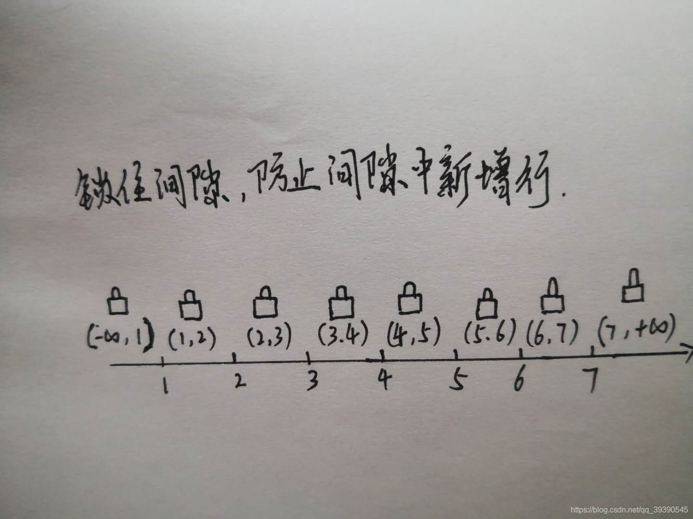

# 幻读问题

>**MVCC 已经解决了幻读的问题，无论是当前读，还是快照读，都可以解决！！**
>
>**但是当快照读和当前读，混着用的话，还是存在当前读的问题的；**
>
>//todo  为啥同一个事务内的两次当前读，（或者一次当前读，一次快照读）不会产生幻读的问题，因为间隙锁呀； 间隙锁解决了这部分问题！！1


# 什么是[幻读](https://so.csdn.net/so/search?q=幻读&spm=1001.2101.3001.7020)

要知道什么是幻读，首先要知道以下四点：

## 一、幻读定义

**幻读是指在同一个事务中，存在前后两次查询同一个范围的数据，但是第二次查询却看到了第一次查询没看到的行，一般情况下特指事务执行中新增的其他行。**

## 二、幻读示例

测试表数据：

```sql
mysql> select * from LOL;


+----+--------------+--------------+-------+


| id | hero_title   | hero_name    | price |


+----+--------------+--------------+-------+


|  1 | 刀锋之影     | 泰隆         |  6300 |


|  2 | 迅捷斥候     | 提莫         |  6300 |


|  3 | 光辉女郎     | 拉克丝       |  1350 |


|  4 | 发条魔灵     | 奥莉安娜     |  6300 |


|  5 | 至高之拳     | 李青         |  6300 |


|  6 | 无极剑圣     | 易           |   450 |


|  7 | 疾风剑豪     | 亚索         |  6300 |


+----+--------------+--------------+-------+


7 rows in set (0.00 sec)
```


下面是一个出现幻读情况示例，我们一起来看一下；

| **时刻T** | **Session A**                                                | **Session B**                                          | **Session C**                                      |
| --------- | ------------------------------------------------------------ | ------------------------------------------------------ | -------------------------------------------------- |
| T1        | begin;-- Query1select * from LOL where price=450 for update; **Result：(6,'无极剑圣',450)** |                                                        |                                                    |
| T2        |                                                              | update LOL set price=450 where hero_title = '疾风剑豪' |                                                    |
| T3        | -- Query2select * from LOL where price=450 for update; **Result：(6,'无极剑圣',450),(7,'疾风剑豪',450)** |                                                        |                                                    |
| T4        |                                                              |                                                        | insert into LOL values(10,'雪人骑士','努努','450') |
| T5        | -- Query3select * from LOL where price=450 for update; **Result：(6,'无极剑圣',450),(7,'疾风剑豪',450),****(10,'雪人骑士\**',4\**50)** |                                                        |                                                    |
| T6        | commit;                                                      |                                                        |                                                    |

 

可以看到，session A 里执行了三次查询，分别是 Q1、Q2 和 Q3。它们的 SQL 语句相同，都是 select * from LOL where price=450 for update。这个语句的意思你应该很清楚了，查所有 price=450 的行，而且使用的是当前读，并且加上写锁。现在，我们来看一下这三条 SQL 语句，分别会返回什么结果。

1. Q1 只返回 **"无极剑圣"** 这一行；
2. 在 T2 时刻，session B 把 **"疾风剑豪"** 这一行的 price 值改成了 450，因此 T3 时刻 Q2 查出来的是 **"无极剑圣"** 和 **"疾风剑豪"** 这两行；
3. 在 T4 时刻，session C 又插入一行 (10,'雪人骑士','努努','450')，因此 T5 时刻 Q3 查出来 price = 450 的是**"无极剑圣"** 、**"疾风剑豪" 和** **"雪人骑士"** 这三行。

其中，Q3 读到 **(10,'雪人骑士\**',4\**50)** 这一行的现象，被称为“幻读”。**也就是说，幻读指的是一个事务在前后两次查询同一个范围的时候，后一次查询看到了前一次查询没有看到的行。**

## **三、幻读出现的场景**

> **注意：mvcc 解决了，快照读的问题；读取的是快照；去读快照，所以数据的数量是一致的；**
>
>**当前读可以使用next-key lock 锁去实现；**

1. 幻读出现在可重复读（RR）隔离级别下，普通的SELECT查询就是快照读，是不会看到别的事务插入的数据的。因此，幻读在“当前读”下才会出现。（当前读会生成行锁，但行锁只能锁定存在的行，针对新插入的操作没有限定）
2. 上面 session B 的修改结果，被 session A 之后的 select 语句用“当前读”看到，不能称为幻读。幻读仅专指“新插入的行”。

因为这三个查询都是加了 for update，都是当前读。而当前读的规则，就是要能读到所有已经提交的记录的最新值。并且，session B 和 sessionC 的两条语句，执行后就会提交，所以 Q2 和 Q3 就是应该看到这两个事务的操作效果，而且也看到了，这跟事务的可见性规则并不矛盾。


##  四、解决幻读问题的必要性

在高并发数据库系统中，需要保证事务与事务之间的隔离性，还有事务本身的一致性。

#  如何解决幻读

如果你看到了这篇文章，那么我会默认你了解了**脏读 、不可重复读与可重复读**。如果还不清楚可以先参阅[《上个厕所的功夫，搞懂MySQL事务隔离级别》](https://blog.csdn.net/qq_39390545/article/details/107343711)

场景如上，场景隔离级别为RR，当前读。

## 一、原理解读

那么幻读能仅通过行锁解决么？答案是否定的，如上面示例，首先说明一下，select xx for update（当前读）是将所有条件涉及到的（符合where条件）行加上行锁。但是，就算我在select xx for update 事务开启时将所有的行都加上行锁。那么也锁不住Session C新增的行，**因为在我给数据加锁的时刻，压根就还没有新增的那行，自然也不会给新增行加上锁。**

**所以要解决幻读，就必须得解决新增行的问题。**

**现在你应该明白了，产生幻读的原因是：行锁只能锁住行，但是新插入记录这个动作，要更新的是记录之间的“间隙”。因此，为了解决幻读问题，InnoDB 只好引入新的锁，也就是间隙锁 (Gap Lock)。**顾名思义，间隙锁，锁的就是两个值之间的空隙。比如文章开头的表 LOL，初始化插入了 7 个记录，这就产生了 8 个间隙。




## 二、next-key lock

这样，当你执行 select * from LOL where hero_title = '疾风剑豪' for update 的时候，就不止是给数据库中已有的 7 个记录加上了行锁，还同时加了 8 个间隙锁。这样就确保了无法再插入新的记录，也就是Session C在T4新增(10,'雪人骑士','努努','450') 行时，由于ID大于7，被间隙锁（7，+∞）锁住。

**在一行行扫描的过程中，不仅将给行加上了行锁，还给行两边的空隙，也加上了间隙锁。MySQL将行锁 + 间隙锁组合统称为 next-key lock，通过 next-key lock 解决了幻读问题。**

**注意**

**next-key lock的确是解决了幻读问题，但是next-key lock在并发情况下也经常会造成死锁。死锁检测和处理也会花费时间，一定程度上影响到并发量**。


##<font color=red>**next-key lock是一个锁，加锁，当然 mysql是多线程的，并且支持事务；所以自然就会存在死锁的问题；需要注意一下；**</font>


**死锁 ：两个或者多个线程去争抢资源，并且形成了资源依赖，如果没有外力，一直持续这个状态；就会形成死锁；**