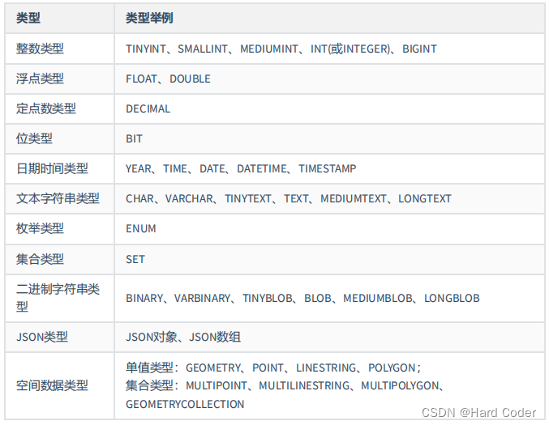
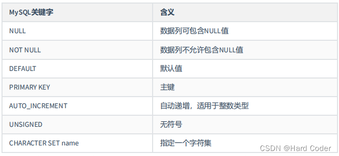

#  数据类型

[数据类型链接](https://blog.csdn.net/qq_44111805/article/details/124643227)


最全的数据类型；





**看一下 json 对象和 enum；枚举；**





3.1 **定点数类型介绍**

（1）MySQL中的定点数类型只有 DECIMAL 一种类型。

**使用 DECIMAL(M,D) 的方式表示高精度小数。其中，M被称为精度，D被称为标度。**<font color=red>**0<=M<=65， 0<=D<=30，D<M。**</font>
**例如，定义DECIMAL（5,2）的类型，表示该列取值范围是-999.99~999.99。**
**（2）DECIMAL(M,D)的最大取值范围与DOUBLE类型一样，但是有效的数据范围是由M和D决定的。DECIMAL 的存储空间并不是固定的，由精度值M决定，总共占用的存储空间为M+2个字节。也就是** **说，在一些对精度要求不高的场景下，比起占用同样字节长度的定点数，浮点数表达的数值范围可以更大一些。**
**（3）定点数在MySQL内部是以 字符串的形式进行存储，这就决定了它一定是精准的。**
**（4）浮点数和定点数的对比：**

**浮点数相对于定点数的优点是在长度一定的情况下，浮点类型取值范围大，但是不精准，适用于需要取值范围大，又可以容忍微小误差的科学计算场景（比如计算化学、分子建模、流体动力学等）;**
**定点数类型取值范围相对小，但是精准，没有误差，适合于对精度要求极高的场景 （比如涉及金额计算的场景）。**


----

##  为什么mecimal   M +2；

当看到 `DECIMAL` 字段时，它的字节数是 `M+2`，这个让我很不解，是为什么？

## 查阅+理解

`DECIAML` 与 `FLOAT` 和 `DOUBLE` 的存储方式不同。

`FLOAT` 和 `DOUBLE` 是用二进制存储数据的，所以会有部分精度问题。

`DECIAML` 是用字符串的方式存储的，所以它不存在精度问题，那么它的长度就是存储字节的长度。

那么问题来了，例如：`DECIMAL(5,2)` 的最大值是 `999.99`，那么总长度也就是 `5+1`，又为什么是 `5+2` 呢？

## 隐藏的 `+`

第二天工作的时候，帮忙拉取一个数据，就手动操作了一把，其中两个数据要相加一下。当我看到那个 `+` 号时，我想通了。

`DECIMAL` 也是有符号位的，而当时我只看的最大值，如果看最小值的话，就能够想通为什么是 `M+2` 了。

// 符号位置 

<font color=red>**所以最终 `DECIMAL` 的长度计算方式是：1个字节的符号位 + 一个字节的小数点位 + 纯数字的长度(M) = 1 + 1 + M = M + 2。**</font>

## 结语

困点得以解决，这种思考是被人直接告知要更加难得的，问题虽小，值得纪念。


作者：imjcw
链接：https://www.jianshu.com/p/65ed244eaeff
来源：简书
著作权归作者所有。商业转载请联系作者获得授权，非商业转载请注明出处。

-----


2.2 数据精度说明

（1）对于浮点类型，在MySQL中单精度值使用 4 个字节，双精度值使用 8 个字节。
**（2）MySQL允许使用 非标准语法 （其他数据库未必支持，因此如果涉及到数据迁移，则最好不要这么用）： FLOAT(M,D) 或 DOUBLE(M,D) 。这里，M称为精度 ，D称为标度 。(M,D)中 M=整数位+小数位，D=小数位。 D<=M<=255，0<=D<=30。**

例如，定义为FLOAT(5,2)的一个列可以显示为-999.99-999.99。如果超过这个范围会报错。
（3）FLOAT和DOUBLE类型在不指定(M,D)时，默认会按照实际的精度（由实际的硬件和操作系统决定）来显示。
（4）浮点类型，也可以加 UNSIGNED ，但是不会改变数据范围。

例如：FLOAT(3,2) UNSIGNED仍然只能表示0-9.99的范围。
（5）不管是否显式设置了精度(M,D)，这里MySQL的处理方案如下：

如果存储时，整数部分超出了范围，MySQL就会报错，不允许存这样的值；
如果存储时，小数点部分若超出范围，就分以下情况：
（1）若四舍五入后，整数部分没有超出范围，则只警告，但能成功操作并四舍五入删除多余的小数位后保存。
例如在FLOAT(5,2)列内插入999.009，近似结果是999.01。
（2）若四舍五入后，整数部分超出范围，则MySQL报错，并拒绝处理。
如FLOAT(5,2)列内插入999.995和-999.995都会报错。

（6）从MySQL 8.0.17开始，FLOAT(M,D) 和DOUBLE(M,D)用法在官方文档中已经明确不推荐使用，将来可能被移除。另外，关于浮点型FLOAT和DOUBLE的UNSIGNED也不推荐使用了，将来也可能被移除。

----


7、 ENUM类型
7.1 ENUM类型介绍

（1）ENUM类型也叫作枚举类型，ENUM类型的取值范围需要在定义字段时进行指定。设置字段值时，ENUM类型只允许从成员中选取单个值，不能一次选取多个值。
（2）**其所需要的存储空间由定义ENUM类型时指定的成员个数决定。**


1、当ENUM类型包含1～255个成员时，需要1个字节的存储空间。
2、当ENUM类型包含256～65535个成员时，需要2个字节的存储空间。
3、ENUM类型的成员个数的上限为65535个。
———————————————

----


## 定点和浮点的区别？


````php
// 说白了，就是浮点数需要科学技术法来表示，那么那个点就是可以浮动的；
// 定点数，就是比如decimal(4,2);就是表示两位小数，并不会福鼎；  //适用于精确计算，不会存在，舍入误差！！


//舍入误差是指在进行数值计算时，由于数值精度有限而导致的近似值与实际值之间的差异。
// 舍入误差产生的途径，主要就分为这几种，这种误差通常是由于数值被截断或四舍五入而产生的。

//在计算机中，浮点数和定点数都有固定的精度限制，因此在进行数值计算时，可能会出现舍入误差。例如，当对一个无限循环小数进行近似表示时，就会产生舍入误差。另外，由于浮点数的表示方式是基于二进制，有些十进制小数无法精确表示为二进制浮点数，也会导致舍入误差。
    
//舍入误差可能会在数值计算中累积，并最终导致结果与实际值之间的差异。在需要高精度计算的领域，如金融、科学计算等，舍入误差可能会对计算结果产生重大影响。
````


浮点型和定点型是两种不同的数值表示方式。

浮点型是一种用科学计数法表示的数值类型，通常由尾数和指数两部分组成。在计算机中，浮点型通常使用IEEE 754标准来表示，包括单精度浮点数（float）和双精度浮点数（double）。**浮点型适用于需要广泛动态范围的数值计算，但在精度要求较高的情况下可能存在舍入误差。**

定点型是一种固定小数点位数的数值类型，通常由整数部分和小数部分组成。在计算机中，定点型通常使用固定位数的小数表示，例如DECIMAL类型。**定点型适用于需要精确小数位数的数值计算，因为它们不会出现浮点数舍入误差。**

总的来说，浮点型适用于广泛动态范围的数值计算，而定点型适用于需要精确小数位数的数值计算。选择使用哪种类型取决于具体的数值计算需求和精度要求。

## [定点数与浮点数区别](https://www.cnblogs.com/cloudseawang/archive/2007/02/06/641652.html)

最近做HDR时，经常要用NV提供的16位纹理，它的说明书16位能达到24位的精度，就很奇怪？一直搞不懂浮点数的精度怎么算的？
今天认真看了一下IEEE float point的标准，终于明白是什么了
\1. 什么是浮点数
在计算机系统的发展过程中，曾经提出过多种方法表达实数。典型的比如相对于浮点数的定点数（Fixed Point Number）。在这种表达方式中，小数点固定的位于实数所有数字中间的某个位置。货币的表达就可以使用这种方式，比如 99.00 或者 00.99 可以用于表达具有四位精度（Precision），小数点后有两位的货币值。由于小数点位置固定，所以可以直接用四位数值来表达相应的数值。SQL 中的 NUMBER 数据类型就是利用定点数来定义的。还有一种提议的表达方式为有理数表达方式，即用两个整数的比值来表达实数。

**定点数表达法的缺点在于其形式过于僵硬，固定的小数点位置决定了固定位数的整数部分和小数部分，不利于同时表达特别大的数或者特别小的数**。

**最终，绝大多数现代的计算机系统采纳了所谓的浮点数表达方式。这种表达方式利用科学计数法来表达实数，即用一个尾数（Mantissa ），一个基数（Base），一个指数（Exponent）以及一个表示正负的符号来表达实数。比如 123.45 用十进制科学计数法可以表达为 1.2345 × 102 ，其中 1.2345 为尾数，10 为基数，2 为指数。浮点数利用指数达到了浮动小数点的效果，从而可以灵活地表达更大范围的实数。**

提示: 尾数有时也称为有效数字（Significand）。尾数实际上是有效数字的非正式说法。

同样的数值可以有多种浮点数表达方式，比如上面例子中的 123.45 可以表达为 12.345 × 101，0.12345 × 103 或者 1.2345 × 102。因为这种多样性，有必要对其加以规范化以达到统一表达的目标。规范的（Normalized）浮点数表达方式具有如下形式：

±d.dd...d × β e , (0 ≤ d i < β)

其中 d.dd...d 即尾数，β 为基数，e 为指数。尾数中数字的个数称为精度，在本文中用 p 来表示。每个数字 d 介于 0 和基数之间，包括 0。小数点左侧的数字不为 0。

基于规范表达的浮点数对应的具体值可由下面的表达式计算而得：

±(d 0 + d 1β-1 + ... + d p-1β-(p-1))β e , (0 ≤ d i < β)

对于十进制的浮点数，即基数 β 等于 10 的浮点数而言，上面的表达式非常容易理解，也很直白。计算机内部的数值表达是基于二进制的。从上面的表达式，我们可以知道，二进制数同样可以有小数点，也同样具有类似于十进制的表达方式。只是此时 β 等于 2，而每个数字 d 只能在 0 和 1 之间取值。比如二进制数 1001.101 相当于 1 × 2 3 + 0 × 22 + 0 × 21 + 1 × 20 + 1 × 2-1 + 0 × 2-2 + 1 × 2-3，对应于十进制的 9.625。其规范浮点数表达为 1.001101 × 23。


\2. IEEE 浮点数
**计算机中是用有限的连续字节保存浮点数的。保存这些浮点数当然必须有特定的格式，Java 平台上的浮点数类型 float 和 double 采纳了 IEEE 754 标准中所定义的单精度 32 位浮点数和双精度 64 位浮点数的格式**。

注意: Java 平台还支持该标准定义的两种扩展格式，即 float-extended-exponent 和 double-extended-exponent 扩展格式。这里将不作介绍，有兴趣的读者可以参考相应的参考资料。

在 IEEE 标准中，浮点数是将特定长度的连续字节的所有二进制位分割为特定宽度的符号域，指数域和尾数域三个域，其中保存的值分别用于表示给定二进制浮点数中的符号，指数和尾数。这样，通过尾数和可以调节的指数（所以称为"浮点"）就可以表达给定的数值了。具体的格式参见下面的图例：

 

在上面的图例中，第一个域为符号域。其中 0 表示数值为正数，而 1 则表示负数。

**第二个域为指数域，对应于我们之前介绍的二进制科学计数法中的指数部分。其中单精度数为 8 位，双精度数为 11 位。以单精度数为**例，8 位的指数为可以表达 0 到 255 之间的 255 个指数值。但是，指数可以为正数，也可以为负数。为了处理负指数的情况，实际的指数值按要求需要加上一个偏差（Bias）值作为保存在指数域中的值，单精度数的偏差值为 127，而双精度数的偏差值为 1023。比如，单精度的实际指数值 0 在指数域中将保存为 127；而保存在指数域中的 64 则表示实际的指数值 -63。 偏差的引入使得对于单精度数，实际可以表达的指数值的范围就变成 -127 到 128 之间（包含两端）。我们不久还将看到，实际的指数值 -127（保存为 全 0）以及 +128（保存为全 1）保留用作特殊值的处理。这样，实际可以表达的有效指数范围就在 -127 和 127 之间。在本文中，最小指数和最大指数分别用 emin 和 emax 来表达。

**图例中的第三个域为尾数域，其中单精度数为 23 位长，双精度数为 52 位长。** 这部分才是精确度；   


除了我们将要讲到的某些特殊值外，IEEE 标准要求浮点数必须是规范的。这意味着尾数的小数点左侧必须为 1，因此我们在保存尾数的时候，可以省略小数点前面这个 1，从而腾出一个二进制位来保存更多的尾数。这样我们实际上用 23 位长的尾数域表达了 24 位的尾数。比如对于单精度数而言，二进制的 1001.101（对应于十进制的 9.625）可以表达为 1.001101 × 23，所以实际保存在尾数域中的值为 00110100000000000000000，即去掉小数点左侧的 1，并用 0 在右侧补齐。

值得注意的是，对于单精度数，由于我们只有 24 位的指数（其中一位隐藏），所以可以表达的最大指数为 224 - 1 = 16,777,215。特别的，16,777,216 是偶数，所以我们可以通过将它除以 2 并相应地调整指数来保存这个数，这样 16,777,216 同样可以被精确的保存。相反，数值 16,777,217 则无法被精确的保存。由此，我们可以看到单精度的浮点数可以表达的十进制数值中，真正有效的数字不高于 8 位。事实上，对相对误差的数值分析结果显示有效的精度大约为 7.22 位。参考下面的示例：

​    true value        stored value
​    \--------------------------------------
​    16,777,215        1.6777215E7
​    16,777,216        1.6777216E7
​    16,777,217        1.6777216E7
​    16,777,218        1.6777218E7
​    16,777,219        1.677722E7
​    16,777,220        1.677722E7
​    16,777,221        1.677722E7
​    16,777,222        1.6777222E7
​    16,777,223        1.6777224E7
​    16,777,224        1.6777224E7
​    16,777,225        1.6777224E7
​    --------------------------------------根据标准要求，无法精确保存的值必须向最接近的可保存的值进行舍入。这有点像我们熟悉的十进制的四舍五入，即不足一半则舍，一半以上（包括一半）则进。不过对于二进制浮点数而言，还多一条规矩，就是当需要舍入的值刚好是一半时，不是简单地进，而是在前后两个等距接近的可保存的值中，取其中最后一位有效数字为零者。从上面的示例中可以看出，奇数都被舍入为偶数，且有舍有进。我们可以将这种舍入误差理解为"半位"的误差。所以，为了避免 7.22 对很多人造成的困惑，有些文章经常以 7.5 位来说明单精度浮点数的精度问题。

提示: 这里采用的浮点数舍入规则有时被称为舍入到偶数（Round to Even）。相比简单地逢一半则进的舍入规则，舍入到偶数有助于从某些角度减小计算中产生的舍入误差累积问题。因此为 IEEE 标准所采用。

\3. 实数和浮点数之间的变换
现在我们已经明白了浮点数的 IEEE 表达方式。我们来做些实数和浮点数之间的变换练习以加深理解。在这些练习中，你还会发现一些围绕浮点数运算的令人吃惊的事实。

首先我们来看看事情简单的一面，从浮点数变换到实数。理解了浮点数的格式，做这个练习并不难。假定我们有一个 32 位的数据，用十六进制表示为 0xC0B40000，并且我们知道它实际上是一个单精度的浮点数。为了得到该浮点数实际表达的实数，我们首先将它变换为二进制形式：

 C  0  B  4  0  0  0  0
1100 0000 1011 0100 0000 0000 0000 0000接着按照浮点数的格式切分为相应的域：

1 10000001 01101000000000000000000符号域 1 意味着负数；指数域为 129 意味着实际的指数为 2 （减去偏差值 127）；尾数域为 01101 意味着实际的二进制尾数为 1.01101 （加上隐含的小数点前面的 1）。所以，实际的实数为：

-1.01101 × 22
-(20 + 2-2 + 2-3 2-5) × 22
-5.625从实数向浮点数变换稍微麻烦一点。假定我们需要将实数 -9.625 表达为单精度的浮点数格式。方法是首先将它用二进制浮点数表达，然后变换为相应的浮点数格式。

首先，将小数点左侧的整数部分变换为其二进制形式，9 的二进制性形式为 1001。处理小数部分的算法是将我们的小数部分乘以基数 2，记录乘积结果的整数部分，接着将结果的小数部分继续乘以 2，并不断继续该过程：

0.625 × 2 = 1.25    1
0.25 × 2 = 0.5     0
0.5  × 2 = 1      1
0当最后的结果为零时，结束这个过程。这时右侧的一列数字就是我们所需的二进制小数部分，即 0.101。这样，我们就得到了完整的二进制形式 1001.101。用规范浮点数表达为 1.001101 × 23。

因为是负数，所以符号域为 1。指数为 3，所以指数域为 3 + 127 = 130，即二进制的 10000010。尾数省略掉小数点左侧的 1 之后为 001101，右侧用零补齐。最终结果为：

1 10000010 00110100000000000000000最后可以将浮点数形式表示为十六进制的数据如下：

1100 0001 0001 1010 0000 0000 0000 0000
 C  1  1  A  0  0  0  0最终结果为 0xC11A0000。

很简单？等等！你可能已经注意到了，在上面这个我们有意选择的示例中，不断的将产生的小数部分乘以 2 的过程掩盖了一个事实。该过程结束的标志是小数部分乘以 2 的结果为 1，不难想象，很多小数根本不能经过有限次这样的过程而得到结果（比如最简单的 0.1）。我们已经知道浮点数尾数域的位数是有限的，为此，浮点数的处理办法是持续该过程直到由此得到的尾数足以填满尾数域，之后对多余的位进行舍入。换句话说，除了我们之前讲到的精度问题之外，十进制到二进制的变换也并不能保证总是精确的，而只能是近似值。事实上，只有很少一部分十进制小数具有精确的二进制浮点数表达。再加上浮点数运算过程中的误差累积，结果是很多我们看来非常简单的十进制运算在计算机上却往往出人意料。这就是最常见的浮点运算的"不准确"问题。参见下面的 Java 示例：

System.out.print("34.6-34.0=" + (34.6f-34.0f));这段代码的输出结果如下：

34.6-34.0=0.5999985产生这个误差的原因是 34.6 无法精确的表达为相应的浮点数，而只能保存为经过舍入的近似值。这个近似值与 34.0 之间的运算自然无法产生精确的结果。


\4. 特殊值
通过前面的介绍，你应该已经了解的浮点数的基本知识，这些知识对于一个不接触浮点数应用的人应该足够了。不过，如果你兴趣正浓，或者面对着一个棘手的浮点数应用，可以通过本节了解到关于浮点数的一些值得注意的特殊之处。

我们已经知道，指数域实际可以表达的指数值的范围为 -127 到 128 之间（包含两端）。其中，值 -127（保存为 全 0）以及 +128（保存为全 1）保留用作特殊值的处理。本节将详细 IEEE 标准中所定义的这些特殊值。

浮点数中的特殊值主要用于特殊情况或者错误的处理。比如在程序对一个负数进行开平方时，一个特殊的返回值将用于标记这种错误，该值为 NaN（Not a Number）。没有这样的特殊值，对于此类错误只能粗暴地终止计算。除了 NaN 之外，IEEE 标准还定义了 ±0，±∞ 以及非规范化数（Denormalized Number）。

对于单精度浮点数，所有这些特殊值都由保留的特殊指数值 -127 和 128 来编码。如果我们分别用 emin 和 emax 来表达其它常规指数值范围的边界，即 -126 和 127，则保留的特殊指数值可以分别表达为 emin - 1 和 emax + 1; 。基于这个表达方式，IEEE 标准的特殊值如下所示：

 

其中 f 表示尾数中的小数点右侧的（Fraction）部分。第一行即我们之前介绍的普通的规范化浮点数。随后我们将分别对余下的特殊值加以介绍。

4.1. NaN
NaN 用于处理计算中出现的错误情况，比如 0.0 除以 0.0 或者求负数的平方根。由上面的表中可以看出，对于单精度浮点数，NaN 表示为指数为 emax + 1 = 128（指数域全为 1），且尾数域不等于零的浮点数。IEEE 标准没有要求具体的尾数域，所以 NaN 实际上不是一个，而是一族。不同的实现可以自由选择尾数域的值来表达 NaN，比如 Java 中的常量 Float.NaN 的浮点数可能表达为 01111111110000000000000000000000，其中尾数域的第一位为 1，其余均为 0（不计隐藏的一位），但这取决系统的硬件架构。Java 中甚至允许程序员自己构造具有特定位模式的 NaN 值（通过 Float.intBitsToFloat() 方法）。比如，程序员可以利用这种定制的 NaN 值中的特定位模式来表达某些诊断信息。

定制的 NaN 值，可以通过 Float.isNaN() 方法判定其为 NaN，但是它和 Float.NaN 常量却不相等。实际上，所有的 NaN 值都是无序的。数值比较操作符 <，<=，> 和 >= 在任一操作数为 NaN 时均返回 false。等于操作符 == 在任一操作数为 NaN 时均返回 false，即使是两个具有相同位模式的 NaN 也一样。而操作符 != 则当任一操作数为 NaN 时返回 true。这个规则的一个有趣的结果是 x!=x 当 x 为 NaN 时竟然为真。

可以产生 NaN 的操作如下所示：

 

此外，任何有 NaN 作为操作数的操作也将产生 NaN。用特殊的 NaN 来表达上述运算错误的意义在于避免了因这些错误而导致运算的不必要的终止。比如，如果一个被循环调用的浮点运算方法，可能由于输入的参数问题而导致发生这些错误，NaN 使得 即使某次循环发生了这样的错误，也可以简单地继续执行循环以进行那些没有错误的运算。你可能想到，既然 Java 有异常处理机制，也许可以通过捕获并忽略异常达到相同的效果。但是，要知道，IEEE 标准不是仅仅为 Java 而制定的，各种语言处理异常的机制不尽相同，这将使得代码的迁移变得更加困难。何况，不是所有语言都有类似的异常或者信号（Signal）处理机制。

注意: Java 中，不同于浮点数的处理，整数的 0 除以 0 将抛出 java.lang.ArithmeticException 异常。

4.2. 无穷
和 NaN 一样，特殊值无穷（Infinity）的指数部分同样为 emax + 1 = 128，不过无穷的尾数域必须为零。无穷用于表达计算中产生的上溢（Overflow）问题。比如两个极大的数相乘时，尽管两个操作数本身可以用保存为浮点数，但其结果可能大到无法保存为浮点数，而必须进行舍入。根据 IEEE 标准，此时不是将结果舍入为可以保存的最大的浮点数（因为这个数可能离实际的结果相差太远而毫无意义），而是将其舍入为无穷。对于负数结果也是如此，只不过此时舍入为负无穷，也就是说符号域为 1 的无穷。有了 NaN 的经验我们不难理解，特殊值无穷使得计算中发生的上溢错误不必以终止运算为结果。

无穷和除 NaN 以外的其它浮点数一样是有序的，从小到大依次为负无穷，负的有穷非零值，正负零（随后介绍），正的有穷非零值以及正无穷。除 NaN 以外的任何非零值除以零，结果都将是无穷，而符号则由作为除数的零的符号决定。

回顾我们对 NaN 的介绍，当零除以零时得到的结果不是无穷而是 NaN 。原因不难理解，当除数和被除数都逼近于零时，其商可能为任何值，所以 IEEE 标准决定此时用 NaN 作为商比较合适。

4.3. 有符号的零
因为 IEEE 标准的浮点数格式中，小数点左侧的 1 是隐藏的，而零显然需要尾数必须是零。所以，零也就无法直接用这种格式表达而只能特殊处理。

实际上，零保存为尾数域为全为 0，指数域为 emin - 1 = -127，也就是说指数域也全为 0。考虑到符号域的作用，所以存在着两个零，即 +0 和 -0。不同于正负无穷之间是有序的，IEEE 标准规定正负零是相等的。

零有正负之分，的确非常容易让人困惑。这一点是基于数值分析的多种考虑，经利弊权衡后形成的结果。有符号的零可以避免运算中，特别是涉及无穷的运算中，符号信息的丢失。举例而言，如果零无符号，则等式 1/(1/x) = x 当x = ±∞ 时不再成立。原因是如果零无符号，1 和正负无穷的比值为同一个零，然后 1 与 0 的比值为正无穷，符号没有了。解决这个问题，除非无穷也没有符号。但是无穷的符号表达了上溢发生在数轴的哪一侧，这个信息显然是不能不要的。零有符号也造成了其它问题，比如当 x=y 时，等式1/x = 1/y 在 x 和 y 分别为 +0 和 -0 时，两端分别为正无穷和负无穷而不再成立。当然，解决这个问题的另一个思路是和无穷一样，规定零也是有序的。但是，如果零是有序的，则即使 if (x==0) 这样简单的判断也由于 x 可能是 ±0 而变得不确定了。两害取其轻者，零还是无序的好。

4.4. 非规范化数
我们来考察浮点数的一个特殊情况。选择两个绝对值极小的浮点数，以单精度的二进制浮点数为例，比如 1.001 × 2-125 和 1.0001 × 2-125 这两个数（分别对应于十进制的 2.6448623 × 10-38 和 2.4979255 × 10-38）。显然，他们都是普通的浮点数（指数为 -125，大于允许的最小值 -126；尾数更没问题），按照 IEEE 754 可以分别保存为 00000001000100000000000000000000（0x1100000）和 00000001000010000000000000000000（0x1080000）。

现在我们看看这两个浮点数的差值。不难得出，该差值为 0.0001 × 2-125，表达为规范浮点数则为 1.0 × 2-129。问题在于其指数大于允许的最小指数值，所以无法保存为规范浮点数。最终，只能近似为零（Flush to Zero）。这中特殊情况意味着下面本来十分可靠的代码也可能出现问题：

if (x != y) {
    z = 1 / (x -y);
}正如我们精心选择的两个浮点数展现的问题一样，即使 x 不等于 y，x 和 y 的差值仍然可能绝对值过小，而近似为零，导致除以 0 的情况发生。

为了解决此类问题，IEEE 标准中引入了非规范（Denormalized）浮点数。规定当浮点数的指数为允许的最小指数值，即 emin 时，尾数不必是规范化的。比如上面例子中的差值可以表达为非规范的浮点数 0.001 × 2-126，其中指数 -126 等于 emin。注意，这里规定的是"不必"，这也就意味着"可以"。当浮点数实际的指数为 emin，且指数域也为 emin 时，该浮点数仍是规范的，也就是说，保存时隐含着一个隐藏的尾数位。为了保存非规范浮点数，IEEE 标准采用了类似处理特殊值零时所采用的办法，即用特殊的指数域值 emin - 1 加以标记，当然，此时的尾数域不能为零。这样，例子中的差值可以保存为 00000000000100000000000000000000（0x100000），没有隐含的尾数位。

有了非规范浮点数，去掉了隐含的尾数位的制约，可以保存绝对值更小的浮点数。而且，也由于不再受到隐含尾数域的制约，上述关于极小差值的问题也不存在了，因为所有可以保存的浮点数之间的差值同样可以保存。


A 16-bit floating-point number has a 1-bit sign (S), a 5-bit
  exponent (E), and a 10-bit mantissa (M). The value of a 16-bit
  floating-point number is determined by the following:

​    (-1)^S * 0.0,            if E == 0 and M == 0,
​    (-1)^S * 2^-14 * (M / 2^10),     if E == 0 and M != 0,
​    (-1)^S * 2^(E-15) * (1 + M/2^10),  if 0 < E < 31,
​    (-1)^S * INF,            if E == 31 and M == 0, or
​    NaN,                 if E == 31 and M != 0,

  where

​    S = floor((N mod 65536) / 32768),
​    E = floor((N mod 32768) / 1024), and
​    M = N mod 1024.

因此当E=0时，按非规范浮点数处理得到的结果就2^-24精度的数字


---

**DB哥MySQL高级教程-系统学习MySQL共149课时**

关注微信公众号免费学：【DB哥】

文末有MySQL高级课程目录


------


## **1、MySQL 数据类型**

MySQL 支持多种类型，大致可以分为三类：数值、日期/时间和字符串（字符）类型。

### **1.2、mysql中编码和字符**

在 mysql 中，一个中文汉字所占的字节数与编码格式有关：

- 如果是GBK编码，则一个中文汉字占2个字节，英文占1个字节
- 如果是UTF8编码，则一个中文汉字占3个字节，而英文字母占1字节。

比如定义某个字段数据类型为：varchar(32)，表示这个可以存储 32 个字符，此时表示的是字符，所以跟中英文无关，也就是该字段可以存储 32 个中文，或者是 32 个英文，或者是 32 个中文和英文的混搭都行。但如果字符数超过 32 个的话就会报错。

## **2、数值类型**

MySQL 支持所有标准 SQL 数值数据类型，mysql 的数值数据类型可以大致划分为两个类别，一个是整数，另一个是浮点数或小数。并且 MySQL 允许我们指定数值字段中的值是否有正负之分（UNSIGNED）或者用零填补（ZEROFILL）

在 MySQL 中支持的 5 个主要整数类型是 TINYINT，SMALLINT，MEDIUMINT，INT 和 BIGINT。这些类型在很大程度上是相同的，只有它们存储的值的大小是不相同的。浮点型有：FLOAT、DOUBLE、DECIMAL。

下面的表显示了需要的每个数值类型的存储所占用的字节和可表示的数值范围：

1 bit 即 1位　　1字节 = 8 bit　　1K = 1024字节　　1M = 1024K


| 类型         | 大小                                     | 范围（有符号，默认）                                         | 范围（无符号）                                               | 用途                                                   | 对应java类           |
| ------------ | ---------------------------------------- | ------------------------------------------------------------ | ------------------------------------------------------------ | ------------------------------------------------------ | -------------------- |
| TINYINT      | 1 Bytes                                  | (-128，127)                                                  | (0，255)                                                     | 小整数值一个很小很小的整数                             | Integer              |
| SMALLINT     | 2 Bytes                                  | (-32 768，32 767)                                            | (0，65 535)                                                  | 大整数值一个小整数                                     | Integer              |
| MEDIUMINT    | 3 Bytes                                  | (-8 388 608，8 388 607)                                      | (0，16 777 215)                                              | 大整数值一个中等大小的整数                             | Integer              |
| INT或INTEGER | 4 Bytes                                  | (-2 147 483 648，2 147 483 647)                              | (0，4 294 967 295)                                           | 大整数值一个int大小的整数 （大都用来做id）             | Integer              |
| BIGINT       | 8 Bytes                                  | (-9,223,372,036,854,775,808，9 223 372 036 854 775 807)      | (0，18 446 744 073 709 551 615)                              | 极大整数值一个蛮大的整数（也常用来做id）               | Long                 |
| FLOAT        | 4 Bytes                                  | (-3.402 823 466 E+38，-1.175 494 351 E-38)，0，(1.175 494 351 E-38，3.402 823 466 351 E+38) | 0，(1.175 494 351 E-38，3.402 823 466 E+38)                  | 单精度，浮点数值。学生成绩、允许有误差的、单精度浮点数 | Float                |
| DOUBLE       | 8 Bytes                                  | (-1.797 693 134 862 315 7 E+308，-2.225 073 858 507 201 4 E-308)，0，(2.225 073 858 507 201 4 E-308，1.797 693 134 862 315 7 E+308) | 0，(2.225 073 858 507 201 4 E-308，1.797 693 134 862 315 7 E+308) | 双精度，浮点数值。学生成绩、允许有误差的、双精度浮点数 | Double               |
| DECIMAL      | 对DECIMAL(M,D) ，如果M>D，为M+2否则为D+2 | 依赖于M和D的值例如定义 DECIMAL(5,2) ，则表示最大位数为5位，小数点后2位，于是取值范围为 -999.99至999.99 | 依赖于M和D的值                                               | 小数值。用来计算工资、盈利、金融方面                   | Java.math.BigDecimal |


比如 INT 类型，该类型所占字节为 4 个字节。比如数据库中某列的字段类型为 INT，则每条数据的该列的数据都会占服务器容量的 4 个字节的存储容量，并且该列所能显示的数值范围只能是 -128~127 ，或者如果该列是无符号的话，则范围是 0~255。如果你存储超出最大范围则会提示 out of range value ....，比如往 INT 且有符号的数据类型里面存储 2147483648 的值，则会报错并且不会存储成功。

### **2.1、整数类型的长度**

常用的整数数据类型有 tinyint ，smallint ，mediumint ， int ，bigint 共计5种。

在声明整数类型列时，我们可以跟上一个数值，例如 int(n) ，但实际上这里的 n 跟存储没有什么关系，无论 n 是什么，INT 数据类型都是 4 个字节，只能存储 -2 147 483 648~2 147 483 647（有符号时）范围的数据。

在mysql手册中这个 n 表示最大显示宽度，显示宽度与存储大小和数据类型所能包含的值的范围无关，最大有效的显示宽度是255，即 n 的值最大是 255。

比如我声明一个字段为 `number` INT(5) ，此时该 number 字段也是占 4 个字节，也只能存储 -2 147 483 648~2 147 483 647（有符号时）范围的数据。这个 n 的作用只有在我们给列加上 ZEROFILL（用 0 填充）属性时才会体现出来，并且只有在使用一些特定的客户端输出时才会有体现。比如：


1. `number` int(5) unsigned zerofill -- 加上zerofill属性则必须同时加unsigned属性


此时，当该列某条数据的数字小于 5 位时，在某些特定的客户端检索输出时，会在数字前 “补0”，凑足5位数字。例如存储的数字是123，那么输出00123 。如果大于 5 位则原样显示原数字。

注意，不是在数据库中存储时会自动补 0 ，而是在某一些客户端查询输出时才有显示效果，目前仅发现使用在MySQL Shell才有显示效果，其他客户端连接时均无。

所以说，基本没有开发者会使用这个特性，因为基本没什么用。

### **2.2、浮点型**

FLOAT 类型固定占用4个字节， DOUBLE 类型固定占用8个字节，逻辑和上述的整型类似。

DECIMAL 类型的定义方式是 DECIMAL(M,D) ，其中 M 表示最大位数，D 表示小数点右侧的位数。这里的“位”不是二进制的比特位，而是指十进制的数字的位数。

例如我们定义 DECIMAL(5,2) ，则表示最大位数为5位，小数点后2位，于是取值范围为 -999.99至999.99 。可以这样理解：M-D 的值为小数点前的位数，D 的值为小数点后的位数，要算取值范围则各个位置填充9，取正负范围。那么容易计算 DECIMAL(5,1) 的取值范围是 -9999.9至9999.9 ；DECIMAL(4,2) 的取值范围是 -99.99至99.99 。

DECIMAL(M,D) 的存储方式和其他数字类型都完全不同，它是以字符串形式进行存储的。这可能有点不好理解，以整型 tinyint 为例，它存储的值是直接为十进制到二进制的转换，以无符号型为例，当需要存入的值为100值，将100转化为二进制为1100100 ，使用1个字节即8位记录，实际存入的是 01100100 。但是用 DECIMAL 类型存储时，比如定义 DECIMAL(3,0) ，存入100时，实际存入的是由字符“1”，“0”，“0”拼接而成的字符串“100”的二进制值，存入时占用3个字节，分别是31，30，30（注意这是十六进制）。
1个数字字符占用1个字节，因此定义为 DECIMAL(M,D) 占用 M 个字节。（同上所述，M个字节为数据本身的占用空间，另外描述该数据的元数据还固定占用2个字节的空间）。
需要注意的是， DECIMAL 类型在存储时有补0操作。小数点前不足，向更高位补0，小数点后不足，向更低位补0。
以 DECIMAL(5,2) 为例，如果准备存入9.5，小数点前应为3位，缺2位，小数点后应为2位，缺1位，各补0后，实际存入 '009.50' ，转化为十六进制为30 30 39 2E 35 30 。但是在检索输出时，小数点前的0一般会省略，而小数点后的0会保留，这一点也需要注意。

## **3、字符串类型**

MySQL 提供了 8 个基本的字符串类型，包括 CHAR、VARCHAR、BINARY、VARBINARY、BLOB、TEXT、ENUM 和 SET，可以存储的范围从简单的一个字符到巨大的文本块或二进制字符串数据。


| 类型       | 大小                  | 用途             | 对应java类 |
| ---------- | --------------------- | ---------------- | ---------- |
| CHAR       | 0-255 bytes（字节）   | 定长字符串       | String     |
| VARCHAR    | 0-65535 bytes         | 变长字符串       | String     |
| TINYTEXT   | 0-255 bytes           | 短文本字符串     | String     |
| TEXT       | 0-65 535 bytes        | 长文本数据       | String     |
| MEDIUMTEXT | 0-16 777 215 bytes    | 中等长度文本数据 | String     |
| LONGTEXT   | 0-4 294 967 295 bytes | 极大文本数据     | String     |


**`TEXT` 和 `VARCHAR` 都是 MySQL 中用于存储文本数据的数据类型，但它们之间有一些重要的区别：**

1. 存储空间：
   - `VARCHAR` 类型用于存储可变长度的字符串，它需要根据实际存储的数据来动态分配存储空间，最大长度需要在定义时指定。
   - `TEXT` 类型用于存储较大的文本数据，它可以存储最大长度为 65,535 个字符的文本数据。
2. 索引和排序：
   - `VARCHAR` 类型的字段可以被索引和排序，适合于较短的字符串数据。
   - `TEXT` 类型的字段在某些情况下不支持索引或排序，因为它存储的是较大的文本数据。

因此，当需要存储较短的字符串数据，并且需要对字段进行索引和排序时，可以选择使用 `VARCHAR` 类型；而当需要存储较大的文本数据时，可以选择使用 `TEXT` 类型。在选择数据类型时，需要根据实际的数据存储需求和操作需求来进行选择。


### **3.1、字符串类型长度**

常用的字符串类型的数据类型有 CHAR 和 VARCHAR 两种，两者后面都必须要跟上一个数字表示长度，例如 CHAR(10)、VARCHAR(10)。

char(n) 和 varchar(n) 括号中的 n 代表最大可容纳的字符的个数，并不代表字节个数。注意，一个中文和一个英文都是 1 个字符，只不过 mysql 的编码格式不同时，1 个中文和 1 个英文所占用的存储字节不同而已。（虽然在早期的版本中，n 指的是字节数，但已经是非常旧的版本了，估计一般人也用不到）

CHAR(n) 和 VARCHAR(n) 都是表示可存储 n 个字符，但是 char 类型在少于 n 个字符时，会在字符串的右边使用空格来填充以达到 n 个字符。

比如：CHAR(4) 和 VARCHAR(4) ，对于 CHAR(4) 表示固定容纳4个字符，当少于4个字符时，会使用空格填充空缺的部分，如果超过4个字符，会自动截断超出部分。例如你存入数据为 'ab' ，实际会存入 'ab ' （ab后有2个空格）。但是如果我们使用 select 语句来查询 char 类型的字段时，会发现根本就没有自动补空格，这是因为 CHAR 字段在检索输出时，会自动省略右侧的空格。

VARCHAR 是 CHAR 类型的一个变体，它是一种可变长度的字符串类型，并且在声明时也必须要指定字符长度。VARCHAR 类型对于未达到 n 字符的情况不会补空。

CHAR 和 VARCHGAR 不同之处在于 MYSQL 数据库处理这个指示器（即 n）的方式：CHAR 把这个大小视为值的大小，在长度不足的情况下就用空格补足。而 VARCHAR 类型只会把 n 作为限制字符串的最大长度，短于指示器长度的 VARCHAR 类型不会被空格填补，但长于指示器的值仍然会被截短。

关于计算 VARCHAR 类型字符串的占用空间，有一点需要说明的是， VARCHAR 类型字符串的占用空间实际上包含2部分，一是存储数据本身占用的空间，二是描述数据的元数据占用的空间，例如 VARCHAR 类型会使用1个字节记录存入数据实际的字符数。

比如下面示例说明 varchar 字段的字符长度和占用存储字节数：

（1） 'a啊b' —— 字符数为3，不补空，实际存入为 'a啊b' ，字符数为3，字节数为 1+3+1=5 。

（2）'a啊b哈ccccccccc' —— 字符数超出4，仅保留前4个字符，因此实际存入 'a啊b哈' ，字符数：4，字节数：1+3+1+3=8 。这种情况和 CHAR 类型处理一致。

（3）'a啊和哈' —— 字符数刚好为4，不需要截断和补齐，因此实际存入 'a啊和哈' ，字符数：4，字节数：1+3+3+3=10

两者的使用场景：因为 VARCHAR 类型可以根据实际内容动态改变存储值的长度，所以在不能确定字段需要多少字符时使用 VARCHAR 类型可以大大地节约磁盘空间、提高存储效率。但如果确切知道字符串长度，比如就在50~55之间，那就用 CHAR，因为 CHAR 类型由于本身定长的特性使其性能要高于 VARCHAR。

## **4、日期和时间类型**

在处理日期和时间类型的值时，MySQL 带有 5 个不同的数据类型可供选择。它们可以被分成简单的日期（DATE）、时间类型（TIME）、年份（YEAR）、混合日期（DATETIME）、时间类型（TIMESTAMP）。

每一个时间、日期类型都有合法的取值范围，当指定确定不合法的值时，系统将“零”值插入数据库中。


| 类型      | 大小( 固定长度、单位为字节) | 范围                                                         | 格式                                | 用途                     |
| --------- | --------------------------- | ------------------------------------------------------------ | ----------------------------------- | ------------------------ |
| DATE      | 3                           | 1000-01-01/9999-12-31                                        | YYYY-MM-DD（年月日）                | 日期值                   |
| TIME      | 3                           | '-838:59:59'/'838:59:59'                                     | HH:MM:SS（时分秒）                  | 时间值或持续时间         |
| YEAR      | 1                           | 1901/2155                                                    | YYYY                                | 年份值                   |
| DATETIME  | 8                           | 1000-01-01 00:00:00/9999-12-31 23:59:59                      | YYYY-MM-DD HH:MM:SS（年月日时分秒） | 混合日期和时间值         |
| TIMESTAMP | 4                           | 1970-01-01 00:00:00/2038结束时间是第 2147483647 秒，北京时间 2038-1-19 11:14:07，格林尼治时间 2038年1月19日 凌晨 03:14:07 | YYYYMMDD HHMMSS                     | 混合日期和时间值，时间戳 |


这个时间的对应的Java类、只要格式正确、都是可以取的，主要看需求是什么。不管你后端是String、Date 类型、只要格式是对应的就是可以的。

### **4.1、DATETIME**

DATETIME类型后面可以接后缀，当然也可以没有，如datetime、datetime(3)、datetime(6)，这个后缀是用来定义毫秒的精度的。这个后缀最大是6，超过就会报错。

假设建表语句为：


则存储结果分别为：


## **5、二进制数据类型**

主要包含下列几种数据类型：tityblob，blob，mediumblob，longblob。

blob数据类型；占用多少个字节；


**在 MySQL 中，`BLOB` 是一种用于存储大型二进制对象的数据类型。`BLOB` 表示 "Binary Large OBject"，它可以存储大量的二进制数据，如图像、音频、视频等。**

MySQL 提供了几种不同的 `BLOB` 类型，包括：

1. **`TINYBLOB`：最大长度为 255 个字节。**
2. **`BLOB`：最大长度为 65,535 个字节。**
3. **`MEDIUMBLOB`：最大长度为 16,777,215 个字节。**
4. **`LONGBLOB`：最大长度为 4,294,967,295 个字节。**

**这些 `BLOB` 类型可以存储不同大小范围的二进制数据，根据实际需求选择合适的类型。在数据库设计中，通常会使用 `BLOB` 类型来存储需要以二进制形式进行存储和检索的大型数据。**


## json

数据库可以保存json字符串和区json字符串；

````mysql
在 MySQL 中，JSON 是一种数据类型，用于存储和操作 JSON（JavaScript Object Notation）格式的数据。JSON 是一种轻量级的数据交换格式，常用于在不同系统之间传输和存储数据。

##在 MySQL 5.7 及更新版本中，引入了对 JSON 数据类型的支持。使用 JSON 数据类型，可以存储 JSON 格式的数据，并且可以使用一系列内置函数来查询和操作 JSON 数据。

以下是一些常见的 JSON 数据类型的操作：

存储 JSON 数据：


Copy

Open
CREATE TABLE example (
    id INT PRIMARY KEY,
    data JSON
);
INSERT INTO example VALUES (1, '{"name": "John", "age": 30}');
查询 JSON 数据：


Copy

Open
SELECT data->>'$.name' AS name FROM example;
更新 JSON 数据：


Copy

Open
UPDATE example SET data = JSON_SET(data, '$.age', 31) WHERE id = 1;
通过使用 JSON 数据类型，可以更方便地存储和操作 JSON 格式的数据，使得 MySQL 在处理半结构化数据时更加灵活和强大。


##3----------------

在 MySQL 中，可以使用一些内置函数和操作符来处理 JSON 数据类型。以下是一些常见的 JSON 数据类型的操作：

提取 JSON 值： 使用 -> 或 ->> 操作符可以从 JSON 对象中提取特定的值。

-> 用于提取 JSON 对象中的属性，并返回 JSON 对象或数组。
->> 用于提取 JSON 对象中的属性，并返回属性的字符串值。

Copy

Open
SELECT data->'$.name' AS name FROM example;
SELECT data->>'$.name' AS name FROM example;
更新 JSON 值： 使用 JSON_SET 函数可以更新 JSON 对象中的属性值。


Copy

Open
UPDATE example SET data = JSON_SET(data, '$.age', 31) WHERE id = 1;
合并 JSON 对象： 使用 JSON_MERGE 函数可以合并多个 JSON 对象。


Copy

Open
SELECT JSON_MERGE('{"name": "John"}', '{"age": 30}') AS merged_data;
查询 JSON 数组： 使用 JSON_ARRAYAGG 函数可以将查询结果聚合为 JSON 数组。


Copy

Open
SELECT JSON_ARRAYAGG(name) AS names FROM users;
这些操作使得在 MySQL 中处理 JSON 数据变得更加方便和灵活，可以满足处理半结构化数据的需求。

### SELECT LENGTH(data) AS json_length FROM example; 查看数据类型的字节数；

###在 MySQL 中，JSON 数据类型的存储空间取决于存储的实际数据内容。由于 JSON 数据类型可以存储各种不同类型和结构的数据，因此无法简单地确定其占用的固定字节数。

data json

````


## enum

`````mysql
在 MySQL 中，ENUM 是一种用于定义列值集合的数据类型。ENUM 列可以存储一个预定义的字符串值集合中的一个值。这种数据类型对于限制列值的范围很有用，因为它只允许列中的值为预定义的值之一。

以下是创建和使用 ENUM 数据类型的示例：

创建表时使用 ENUM 数据类型：


Copy

Open
CREATE TABLE example (
    id INT PRIMARY KEY,
    status ENUM('active', 'inactive', 'pending')
);
插入数据时使用 ENUM 数据类型：


Copy

Open
INSERT INTO example VALUES (1, 'active');
查询数据时使用 ENUM 数据类型：


Copy

Open
SELECT * FROM example WHERE status = 'active';
在上面的示例中，status 列被定义为 ENUM 类型，并且只允许存储 'active'、'inactive' 或 'pending' 中的一个值。这样可以确保列中的值始终是预定义的值之一。

###需要注意的是，虽然 ENUM 类型提供了对列值的限制，但在某些情况下可能会限制了灵活性。因此，在使用 ENUM 类型时，需要仔细考虑列值的范围和可能的变化。

create table t_enum(

	id int(11),
	status enum("a","b","c")
	);
	#插入的时候 可以用1，2插入；插入，分别代表的是；1,2,3
	insert into t_enum(id,status) values(1,2),(2,1),(3,3); 
	# 显示的是a b c
	select * from t_enum;
	
	truncate table t_enum;
	
	
	
	在 MySQL 中，ENUM 数据类型的存储空间取决于定义 ENUM 列时指定的值的数量。每个 ENUM 列的存储空间都是固定的，取决于定义时指定的值的数量。

存储空间计算公式如下：

##1 字节，如果 ENUM 列的可能值少于 256 个。
##2 字节，如果 ENUM 列的可能值多于 255 个。
##因此，如果定义的 ENUM 列的可能值少于 256 个，则每个 ENUM 列将占用 1 字节的存储空间；如果可能值多于 255 个，则每个 ENUM 列将占用 2 字节的存储空间。

要确定特定 ENUM 列占用的存储空间，可以使用 SHOW COLUMNS 命令来查看列的元数据信息，其中包括 ENUM 列的存储空间信息。

###------这个没啥用
###SHOW COLUMNS FROM example LIKE 'status';
##这将显示关于 status 列的信息，包括存储空间的大小。


## 测试----
如果一个 ENUM 列有 600 个可能的值，那么每个 ENUM 列将占用 2 字节的存储空间。要计算总的内存占用量，可以使用以下公式：

总内存占用量 = ENUM列的数量 * 2字节

假设有 n 个 ENUM 列，那么总内存占用量为：

总内存占用量 = n * 2 字节

因此，如果有 600 个 ENUM 列，每个列有 2 字节的存储空间，那么总内存占用量将是：

总内存占用量 = 600 * 2 字节 = 1200 字节

这意味着对于 600 个具有 600 个可能值的 ENUM 列，总内存占用量将是 1200 字节。
`````

