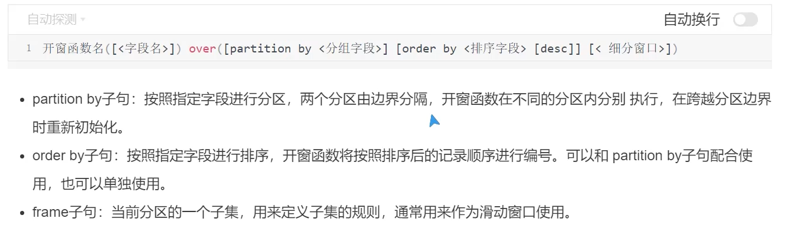
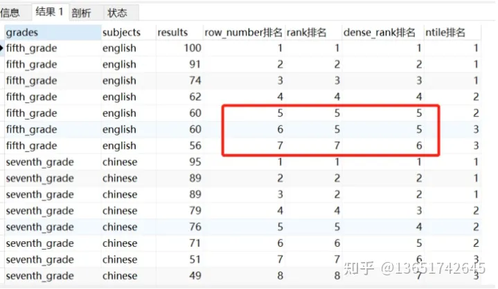
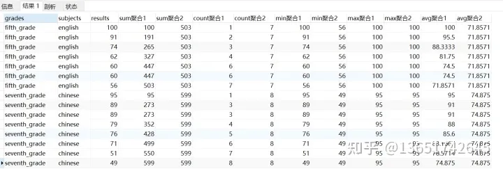
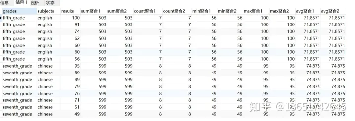
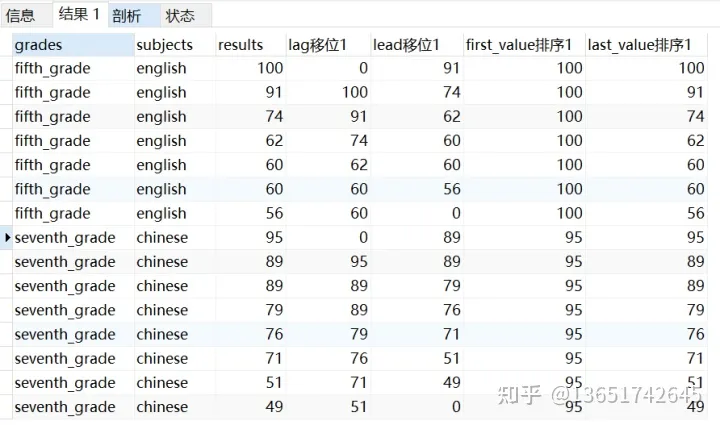
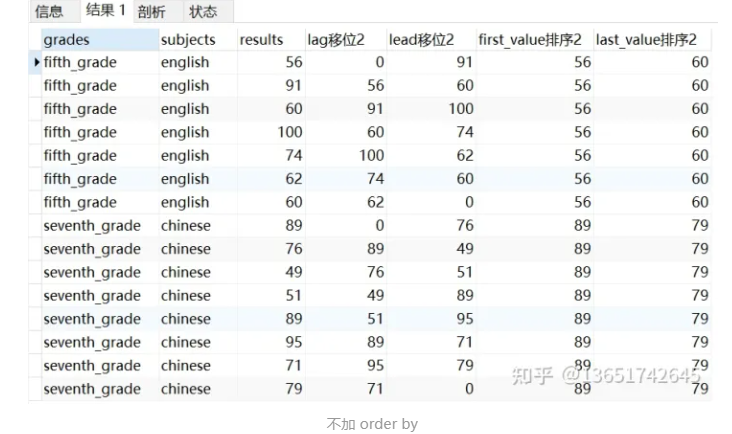
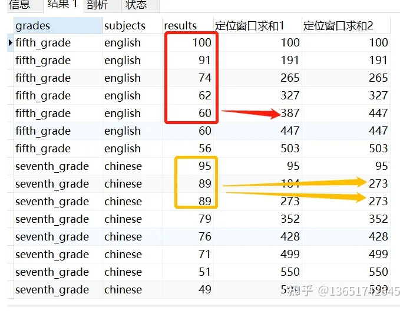

# 窗口函数 开窗函数；


mysql8.0 的开窗函数；


`````shell
docker run -tid --name mysql8.0 -e MYSQL_ROOT_PASSWORD=root --restart=always mysql  mysqld   ## 注意密码不要设置 123456
docker run -tid --name mysql8.0 -e MYSQL_ALLOW_EMPTY_PASSWORD=root --restart=always mysql:8.0 mysqld

docker run -tid --name mysql5.7  -e MYSQL_ALLOW_EMPTY_PASSWORD=123456 mysql:5.7 mysqld

# - MYSQL_ROOT_PASSWORD
# - MYSQL_ALLOW_EMPTY_PASSWORD
# - MYSQL_RANDOM_ROOT_PASSWORD

##  $ docker ps -f name=mysql8.0  docker 自身带的过滤；
## 这个是成功的；
$ docker run -tid --name mysql8.0 -e MYSQL_ROOT_PASSWORD=root --restart=always mysql
`````


`````mysql
## 开窗函数--partition by 
#### partition by  之后的order by  指的是对分区内部的排序；不使用排序就看成一个整体；
#####  不排序 ----> 整体（都是一样的值，当成group by 来用但是保留基础列）   排序----->依次操作；


## group by ;
## 注意 group by 分组之后对分组里面的内容操作能力太低，只能用一些聚合函数来进行操作；
## group by name order by name asc; 默认会带有name的排序；顺序排序； 默认会带有排序 如果不想要排序可以使用order by null； 来消除排序；
#php8.0 没有自动去排序；  我记得 5.7  自动回去排序 对分组字段去排序；

mysql> select max(salary) from employee1 group by departmentid;
+-------------+
| max(salary) |
+-------------+
|       70000 |
|       90000 |
|       80000 |
+-------------+
3 rows in set (0.00 sec)

mysql> select max(salary) from employee1 group by departmentid order by departmentid;
+-------------+
| max(salary) |
+-------------+
|       90000 |
|       80000 |
|       70000 |
+-------------+
3 rows in set (0.00 sec)

`````


## 开窗函数

>**开窗函数**
>
>
>
>**<font color=red>注意：</font>**
>
>**<font color=red>无partition by 就把整个表当成 一个窗口；</font>**
>
>**<font color=red>partition by；可能会形成多个窗口，但是没有order by 就把每一个窗口，当成一个整体，窗口函数回去整体操作；</font>**
>
>**<font color=red>partition by and order by 会有多个窗口，并且会有顺序，那么要按照顺序依次的去计算；因为有oder by  函数会一次的去运行聚合函数；</font>**
>
>
>
>`````mysql
>#开窗函数([<字段名>]) over([partition by <分组字段>]) [order by <排序字段>[desc/asc]] [<细分窗口>])>
>`````

​	

**order  by  代表的是分区内的顺序；**





## 什么是开窗函数？

>---
>
>
>
>**<font color=red>group by 不能返回基础列的列，只能返回聚合列；</font>**
>
>**<font color=red>partition by 基础列的列和聚合列都可以返回；</font>**
>
>----
>
>

开窗函数对一组值进行操作，它不像普通聚合函数那样需要使用GROUP BY子句对数据进行分组，能够在同一行中  **同时返回基础行的列和聚合列**

----


开窗函数的语法形式为：函数 + over(partition by <分组用列> order by <排序用列>)，表示对数据集按照分组用列进行分区，并且并且对每个分区按照函数聚合计算，最终将计算结果按照排序用列排序后返回到该行。括号中的两个关键词partition by 和order by 可以只出现一个。

**注意：开窗函数不会互相干扰，因此在同一个查询语句中可以同时使用多个开窗函数**

**开窗函数适用于 mysql 8.0以上版本， sql sever 、hive、oracle 等**

----


## 开窗函数分类

窗口函数大致分为以下几类：

### 一、排序开窗函数

**① row_number() -- 相同值排名顺延，返回结果1、2、3、4** //顺序；

> <font color=red>rank() dense_rank()必须要有order by  不然会出现全部是1的问题</font>

**② rank() -- 相同结果排名相同，后续排名不连续，返回结果为 1、2、2、4**      // 不连续的；

**③ dense_rank() -- 相同结果排名相同，后续排名顺延，返回结果为 1、2、2、3**   // 连续的；dense紧凑的，连续的；

④ ntile(n) -- 分组排名，将数据分为n组并返回对应组号1、2......n

具体例子如下：

```mysql
select grades
,subjects
,results
,row_number() over(partition by grades,subjects order by results desc) as row_numbers
,rank() over(partition by grades,subjects order by results desc) as ranks
,dense_rank() over(partition by grades,subjects order by results desc) as dense_ranks
,ntile(3) over(partition by grades,subjects order by results desc) as ntiles
from test11
```

表示将数据集按照grades、subjects字段进行分组后，根据对应排序函数并按照results字段降序返回排名，具体结果如下




## test ---rank(); row_number();dense_rank();

````mysql

## select *,rank() over(partition by departmentid order by name desc) from employee1;

mysql> select *,rank() over(partition by departmentid order by name desc) from employee1;
+----+-------+--------+--------------+-----------------------------------------------------------+
| id | name  | salary | departmentid | rank() over(partition by departmentid order by name desc) |
+----+-------+--------+--------------+-----------------------------------------------------------+
|  5 | max   |  90000 |            1 |                                                         1 |
|  2 | jim   |  90000 |            1 |                                                         2 |
|  3 | sam   |  60000 |            2 |                                                         1 |
|  4 | henry |  80000 |            2 |                                                         2 |
|  1 | joe   |  70000 |            3 |                                                         1 |
+----+-------+--------+--------------+-----------------------------------------------------------+
## dense_rank();  连续；


##
mysql>  select *,dense_rank() over(partition by departmentid order by name) from employee1;
+----+-------+--------+--------------+------------------------------------------------------------+
| id | name  | salary | departmentid | dense_rank() over(partition by departmentid order by name) |
+----+-------+--------+--------------+------------------------------------------------------------+
|  2 | jim   |  90000 |            1 |                                                          1 |
|  5 | max   |  90000 |            1 |                                                          2 |
|  4 | henry |  80000 |            2 |                                                          1 |
|  3 | sam   |  60000 |            2 |                                                          2 |
|  1 | joe   |  70000 |            3 |                                                          1 |
+----+-------+--------+--------------+------------------------------------------------------------+
5 rows in set (0.00 sec)


## select *,rank() over(partition by departmentid) from employee1;  //确实都是1，默认以 order by 来排序的；
### 注意一下 为什么都是1 ；
mysql> select *,rank() over(partition by departmentid) from employee1;
+----+-------+--------+--------------+----------------------------------------+
| id | name  | salary | departmentid | rank() over(partition by departmentid) |
+----+-------+--------+--------------+----------------------------------------+
|  2 | jim   |  90000 |            1 |                                      1 |
|  5 | max   |  90000 |            1 |                                      1 |
|  3 | sam   |  60000 |            2 |                                      1 |
|  4 | henry |  80000 |            2 |                                      1 |
|  1 | joe   |  70000 |            3 |                                      1 |
+----+-------+--------+--------------+----------------------------------------+
5 rows in set (0.00 sec)

##   row_number --- 行数 可以只使用，
mysql> select *,rank() over(partition by departmentid) from employee1;  ##行数； row_number(); column  列
mysql> select *,row_number() over(partition by departmentid) from employee1;
+----+-------+--------+--------------+----------------------------------------------+
| id | name  | salary | departmentid | row_number() over(partition by departmentid) |
+----+-------+--------+--------------+----------------------------------------------+
|  2 | jim   |  90000 |            1 |                                            1 |
|  5 | max   |  90000 |            1 |                                            2 |
|  3 | sam   |  60000 |            2 |                                            1 |
|  4 | henry |  80000 |            2 |                                            2 |
|  1 | joe   |  70000 |            3 |                                            1 |
+----+-------+--------+--------------+----------------------------------------------+
5 rows in set (0.01 sec)

````


----


### 二、聚合开窗函数


① sum() -- 分组求和

② count() -- 分组求总数

③ min() -- 分组求最小值

④ max() -- 分组求最大值

⑤ avg() --分组求均值


具体例子如下：

```mysql
select grades
,subjects
,results
,sum(results) over(partition by grades,subjects order by results desc) as sum聚合1
,sum(results) over(partition by grades,subjects) as sum聚合2
,count(results) over(partition by grades,subjects order by results desc) as count聚合1
,count(results) over(partition by grades,subjects) as count聚合2
,min(results) over(partition by grades,subjects order by results desc) as min聚合1
,min(results) over(partition by grades,subjects) as min聚合2
,max(results) over(partition by grades,subjects order by results desc) as max聚合1
,max(results) over(partition by grades,subjects) as max聚合2
,avg(results) over(partition by grades,subjects order by results desc) as avg聚合1
,avg(results) over(partition by grades,subjects) as avg聚合2
from test11
```

><font color=red>**order by 之后是依次聚合，不带代表的是整体的聚合；**</font> 
>
>order by 省略了，range unbounded 

**聚合1表示将数据集按照grades、subjects进行分组后，按照results降序排序，将每组中的results依次聚合；**

**聚合2表示将数据集按照grades、subjects进行分组后，将每组中的results整体聚合。**

`````mysql
## 只有加
mysql> select *,sum(salary) over(partition by departmentid order by name) from employee1;
+----+-------+--------+--------------+-----------------------------------------------------------+
| id | name  | salary | departmentid | sum(salary) over(partition by departmentid order by name) |
+----+-------+--------+--------------+-----------------------------------------------------------+
|  2 | jim   |  90000 |            1 |                                                     90000 |
|  5 | max   |  90000 |            1 |                                                    180000 |
|  4 | henry |  80000 |            2 |                                                     80000 |
|  3 | sam   |  60000 |            2 |                                                    140000 |
|  1 | joe   |  70000 |            3 |                                                     70000 |
+----+-------+--------+--------------+-----------------------------------------------------------+
5 rows in set (0.01 sec)

mysql> select *,sum(salary) over(partition by departmentid) from employee1;
+----+-------+--------+--------------+---------------------------------------------+
| id | name  | salary | departmentid | sum(salary) over(partition by departmentid) |
+----+-------+--------+--------------+---------------------------------------------+
|  2 | jim   |  90000 |            1 |                                      180000 |
|  5 | max   |  90000 |            1 |                                      180000 |
|  3 | sam   |  60000 |            2 |                                      140000 |
|  4 | henry |  80000 |            2 |                                      140000 |
|  1 | joe   |  70000 |            3 |                                       70000 |
+----+-------+--------+--------------+---------------------------------------------+
5 rows in set (0.00 sec)

`````


因此 count(results) over(partition by grades,subjects order by results desc) 与 row_number() over(partition by grades,subjects order by results desc) 可以达到同样目的

`````mysql
#  over 创建一个窗口  然后用函数去运行窗口里面的内容，当然可以形成多个窗口；
## 下面两个一样是本身id 有索引吗？？？ //todo
mysql> select *,row_number() over() from logs;
+----+-----+---------------------+
| id | num | row_number() over() |
+----+-----+---------------------+
|  1 |   1 |                   1 |
|  2 |   1 |                   2 |
|  3 |   1 |                   3 |
|  4 |   2 |                   4 |
|  5 |   1 |                   5 |
|  6 |   2 |                   6 |
|  7 |   2 |                   7 |
+----+-----+---------------------+

mysql> select *,row_number() over(order by id) from logs;
+----+-----+--------------------------------+
| id | num | row_number() over(order by id) |
+----+-----+--------------------------------+
|  1 |   1 |                              1 |
|  2 |   1 |                              2 |
|  3 |   1 |                              3 |
|  4 |   2 |                              4 |
|  5 |   1 |                              5 |
|  6 |   2 |                              6 |
|  7 |   2 |                              7 |
+----+-----+--------------------------------+

### count(id) over  
### 查看整体，不需要一次次的运行；没有order by 的依次运行！！！
mysql> select *,count(id) over() from logs;
+----+-----+------------------+
| id | num | count(id) over() |
+----+-----+------------------+
|  1 |   1 |                7 |
|  2 |   1 |                7 |
|  3 |   1 |                7 |
|  4 |   2 |                7 |
|  5 |   1 |                7 |
|  6 |   2 |                7 |
|  7 |   2 |                7 |
+----+-----+------------------+
7 rows in set (0.01 sec)

mysql> select *,count(id) over(order by id) from logs;
+----+-----+-----------------------------+
| id | num | count(id) over(order by id) |
+----+-----+-----------------------------+
|  1 |   1 |                           1 |
|  2 |   1 |                           2 |
|  3 |   1 |                           3 |
|  4 |   2 |                           4 |
|  5 |   1 |                           5 |
|  6 |   2 |                           6 |
|  7 |   2 |                           7 |
+----+-----+-----------------------------+
`````





深挖两者的差异，主要是 order by **默认统计范围**是 rows between unbounded preceding and current row，**也就是取当前行数据与当前行之前的数据**运算。

如果在聚合1 order by 条件的后面加上语句：rows between unbounded preceding and unbounded following，也就可以对分组中的所有数据进行运算，可以得到聚合1相同结果。如下

```mysql
select grades
,subjects
,results
,sum(results) over(partition by grades,subjects order by results desc rows between unbounded preceding and unbounded following) as sum聚合1
,sum(results) over(partition by grades,subjects) as sum聚合2
,count(results) over(partition by grades,subjects order by results desc rows between unbounded preceding and unbounded following) as count聚合1
,count(results) over(partition by grades,subjects) as count聚合2
,min(results) over(partition by grades,subjects order by results desc rows between unbounded preceding and unbounded following) as min聚合1
,min(results) over(partition by grades,subjects) as min聚合2
,max(results) over(partition by grades,subjects order by results desc rows between unbounded preceding and unbounded following) as max聚合1
,max(results) over(partition by grades,subjects) as max聚合2
,avg(results) over(partition by grades,subjects order by results desc rows between unbounded preceding and unbounded following) as avg聚合1
,avg(results) over(partition by grades,subjects) as avg聚合2
from test11
```



关于这一部分下文详细描述

----


### 三、其他开窗函数

>lag() lead()； 不加order by 就是无序的上/下偏移；
>
>加  order by ；就是有序的上/下偏移；

**① lag(字段名,n,0) -- 移位开窗函数，表示返回向上第n行指定字段对应数据。其中n代表向上偏移n行，0代表若偏移行数超出表范围则返回0也可以改成其他值，若不写则默认null**

**② lead(字段名,n,0) -- 移位开窗函数，与lag()相反，表示返回向下第n行指定字段对应数据**

>order  by 依次来计算；
>
>无order by堪称一个整体，整体的第一个数值和最后一个数值；

**③ first_value() -- 取分组内排序后，截止到当前行，第一个值``**

**④ last_value() -- 取分组内排序后，截止到当前行，最后一个值**  //注意加了 order by是从第一行开始，到当前行，所以当前行就是最后一个值；

具体例子如下：

```mysql
#加order by
select grades
,subjects
,results
,lag(results,1,0) over(partition by grades,subjects order by results desc) as lag移位1
,lead(results,1,0) over(partition by grades,subjects order by results desc) as lead移位1
,first_value(results) over(partition by grades,subjects order by results desc) as first_value排序1
,last_value(results) over(partition by grades,subjects order by results desc) as last_value排序1
from test11
```

加 order by 代表将数据集按照grades、subjects进行分组后，再根据results降序排序，然后根据函数**取当前行数据与当前行之前的数据**运算。若不加 order by 则是对分组后的数据直接运算



```mysql
 #不加order by 
select grades
,subjects
,results
,lag(results,1,0) over(partition by grades,subjects) as lag移位2
,lead(results,1,0) over(partition by grades,subjects) as lead移位2
,first_value(results) over(partition by grades,subjects) as first_value排序2
,last_value(results) over(partition by grades,subjects) as last_value排序2
from test11
```




**不加 order by**

⑤ ratio_to_report(字段名) over(partition by 字段名) -- 百分比分析函数，rratio_to_report(字段名) 为分子，over(partition by 字段名) 为分母，若分母中partition by 字段名 省略则表示占数据集整体百分比。为**Oracle数据库函数**，mysql不能使用

具体例子如下：

```mysql
select grades
,subjects
,results
,ratio_to_report(results) over()  百分比函数1
,ratio_to_report(results) over(partition by grades,subjects) 百分比函数2
from test11
```

----


## 开窗函数的定位框架

>**默认是rows between unbounded  preceding and current row;**
>
>**还可以设置   x preceding    y following**
>
>​				**前面x行    和   后面y 行；**

窗口函数除了经常使用的 partition by <分组用列> order by <排序用列> 外，在order by 后存在可省略的窗口框架 range/rows between x and y ，主要用于对partition by的分组结果做进一步限制，并定位出限制后的运算范围。

其中range表示按照值的范围进行范围的定义，而rows表示按照行的范围进行范围的定义。若order by 后未指定框架，那么默认框架将采用 **range unbounded preceding and current row**，表示**从开窗后的第一行到当前行。**

若窗口函数没有order by，也就不存在框架range/rows between x and y。

框架range/rows between x and y 具体x、y可取值见下表：

| 可取值              | 含义                                 |
| ------------------- | ------------------------------------ |
| unbounded preceding | partition by 分组order by后 第一行   |
| unbounded following | partition by 分组order by后 最后一行 |
| current row         | partition by 分组order by后 当前行   |
| n preceding         | partition by 分组order by后 前n行    |
| n following         | partition by 分组order by后 后n行    |

说明：rows between 5 preceding and current row 可缩写为 rows 5 preceding

range 只支持使用 unbounded preceding、 unbounded following、current row

具体例子如下：

```mysql
select grades
,subjects
,results
,sum(results) over(partition by grades,subjects order by results desc rows between unbounded preceding and current row) as 定位窗口求和1
,sum(results) over(partition by grades,subjects order by results desc range between unbounded preceding and current row) as 定位窗口求和2
from test11
```



由结果可见，定位窗口求和1 中**rows** 按照固定行定义，此处表示返回从当前行到分组后第一行之和

定位窗口求和2 中**range** 按照值进行范围定义，此处仍表示返回从当前行到分组后第一行之和，不过由于当前行存在2个相同order by值（如上图黄框中89），则会先对这两行汇总后再向分组后第一行求和。

----


## 开窗函数使用场景

开窗函数应用比较多的场景，以下简单列举：

① 求某个分组下的最大/最小值/TOPn值对应信息，如年级中每个班级的第一名，大区中销售额最高城市，此处用排序函数row_number()，需用order by 排序

②对某个分组求和/个数/均值，如城市历史截至昨天累积销售额/营业天数/平均销售额，此处用sum()/count()/avg()，需用order by 默认的定位框架

③相邻时间求时间差，如用户复购时间周期，此处用lag()，需用order by 排序

----


 [from](https://zhuanlan.zhihu.com/p/450298503)

---

