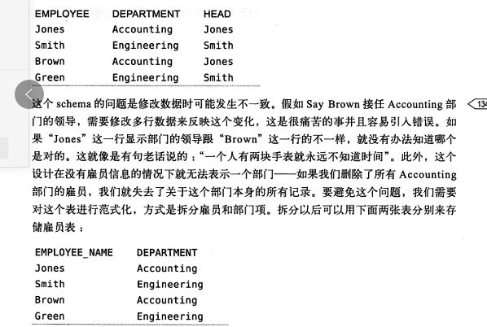

# 范式和反范式

>**total：**
>
>范式：**每个数据只出现了一次；**
>
>反范式：数据是冗余的，存在于多个地方；

----

## 范式的优点和缺点：

* 优点：

  * **更新操作比反范式快；重复的数据少，所以只需要修改更少的数据；**
  * **范式表一般比较小，占用的内存比较小；**
  * 较少的使用DISTINCT  和 group by；

  

* 缺点：**联表查询效率比较低；**联表查询效率低；

一般实际生产环境中一般都是  **混合使用范式和反范式；**

----

## 范式

* 每一列都不可分： 原子性；
* 每一列都和主键相关； 一张表只描述一件事情；
* 每一列都和主键直接相关； 不能间接相关；

## 高性能MySQL 一些数据参考；

