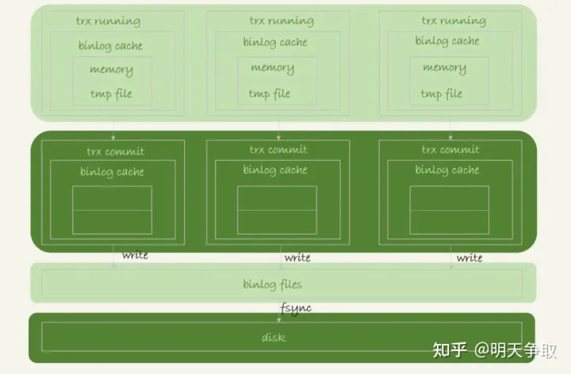

## 落盘策略

>主要分为几个 redo log buffer（数据库的缓冲区） ----write---> os buffer（减少频繁写入的次数） ---fsync--->磁盘
>
>sync 同步；
>
>async 异步；


(1) 图中的 write，指的就是指把日志写入到文件系统的 page cache，并没有把数据持久化到磁盘，所以速度比较快。


(2) 图中的 fsync，才是将数据持久化到磁盘的操作。一般情况下，我们认为 fsync 才占磁盘的 IO。

**write 和 fsync 的时机，是由参数 sync_binlog 控制的：**
**sync_binlog=0 的时候，表示每次提交事务都只 write，不 fsync；交给操纵系统去fsync 文件同步；**

**sync_binlog=1 的时候，表示每次提交事务都会执行 fsync；**

**sync_binlog=N(N>1) 的时候，表示每次提交事务都 write，但累积 N 个事务后才 fsync。**


**因此，在出现 IO 瓶颈的场景里，将 sync_binlog 设置成一个比较大的值，可以提升性能。在实际的业务场景中，考虑到丢失日志量的可控性，一般不建议将这个参数设成 0，比较常见的是将其设置为 100~1000 中的某个数值。**


**但是，将 sync_binlog 设置为 N，对应的风险是：如果主机发生异常重启，会丢失最近 N 个事务的 binlog 日志。**


## 1、binlog（归档日志）

## 1.1、日志内容


记录了对MySQL数据库执行更改的所有操作。但是不包括SELECT和SHOW这类操作，因为

这类操作对数据本身并没有修改。然而若操作没有导致数据库发生变化，并不意味着该操作

不会写入二进制日志。


## 1.2、binlog的作用

- 恢复

mysqlbinlog可以使用start-datetime/stop-datetime选取某个时间段内的日志，或者start-position/stop-position选取某个log_pos范围内的日志。这一点可以用来做Point-in-Time recovery。

- 复制

实现数据的同步至另一台MySQL主机。

- 审计

通过对二进制日志信息的审计，判断数据库是否被注入攻击。


## 1.3、binlog文件存储内容的格式

| format    | 说明                                                   | 优点                           | 缺点                                          |
| --------- | ------------------------------------------------------ | ------------------------------ | --------------------------------------------- |
| statement | 记录的是逻辑SQL语句                                    | 日志文件小，节约IO，提高性能   | 准确性查，对一些系统函数不能准确复制，如now() |
| row       | 记录表的行更改情况                                     | 准确性强，能准确复制数据的变更 | 日志文件大，较大的网络IO和磁盘IO              |
| mixed     | 默认采用statement格式记录日志，特定情况下会使用row格式 | 准确性强，文件大小适中         | 有可能发生主从不一致的问题                    |


## 1.4、binlog 的写入机制


binlog 的写入逻辑比较简单：事务执行过程中，先把日志写到 binlog cache，事务提交的时候，再把 binlog cache 写到 binlog 文件中。


一个事务的 binlog 是不能被拆开的，因此不论这个事务多大，也要确保一次性写入。这就涉及到了 binlog cache 的保存问题。


系统给 binlog cache 分配了一片内存，每个线程一个，参数 binlog_cache_size 用于控制单个线程内 binlog cache 所占内存的大小。如果超过了这个参数规定的大小，就要暂存到磁盘。

事务提交的时候，执行器把 binlog cache 里的完整事务写入到 binlog 中，并清空 binlog cache。

状态如图 所示。





可以看到，每个线程有自己 binlog cache，但是共用同一份 binlog 文件。

图中的 write，指的就是指把日志写入到文件系统的 page cache（binlog file），并没有把数据持久化到磁盘，所以速度比较快。

图中的 fsync，才是将数据持久化到磁盘的操作。一般情况下，我们认为 fsync 才占磁盘的 IOPS。


write 和 fsync 的时机，是由参数 sync_binlog 控制的：

sync_binlog=0 的时候，表示每次提交事务都只 write，不 fsync；

sync_binlog=1 的时候，表示每次提交事务都会执行 fsync；

sync_binlog=N(N>1) 的时候，表示每次提交事务都 write，但累积 N 个事务后才 fsync。


因此，在出现 IO 瓶颈的场景里，将 sync_binlog 设置成一个比较大的值，可以提升性能。在实际的业务场景中，考虑到丢失日志量的可控性，一般不建议将这个参数设成 0，比较常见的是将其设置为 100~1000 中的某个数值。但是，将 sync_binlog 设置为 N，对应的风险是：如果主机发生异常重启，会丢失最近 N 个事务的 binlog 日志。


## 1.5、binlog_cache相关参数介绍

| 属性                  | 说明                                   |
| --------------------- | -------------------------------------- |
| binlog_cache_size     | 表示binlog_cache的容量，默认大小为32K. |
| Binlog_cache_use      | 记录了使用缓冲写二进制日志的次数       |
| Binlog_cache_disk_use | 记录了使用临时文件写二进制日志的次数   |

binlog_cache_size是基于会话(session)的。每个线程一个，参数 binlog_cache_size 用于控制单个线程内 binlog cache 所占内存的大小。如果超过了这个参数规定的大小，就要暂存到磁盘（临时文件中）。

```text
show global status like 'binlog_cache%'
show variables  like 'binlog_cache_size'
```

## 1.6、binlog的存储位置

```text
show variables like 'datadir'
```

## 1.7、查询binlog文件的默认大小

```text
show variables  like 'max_binlog_size'
```

max_binlog_size 指定了单个二进制文件的最大值（默认1G）。如果超过该值，则产生新的二进制文件，后缀名+1，并记录到index文件。


## 1.8、日志自动清理

```text
show variables  like 'expire_logs_days'
```
