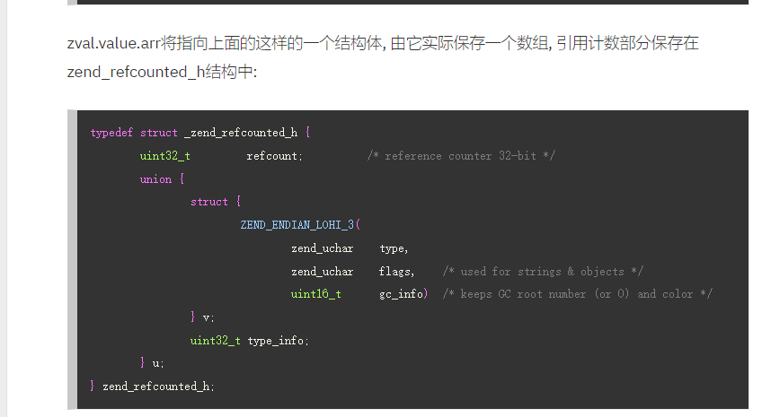
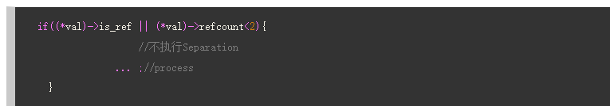
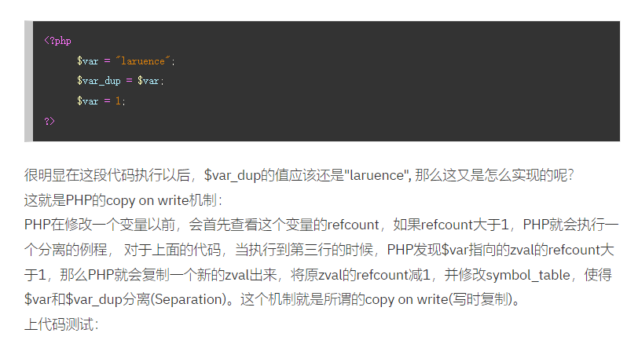
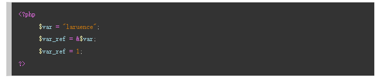
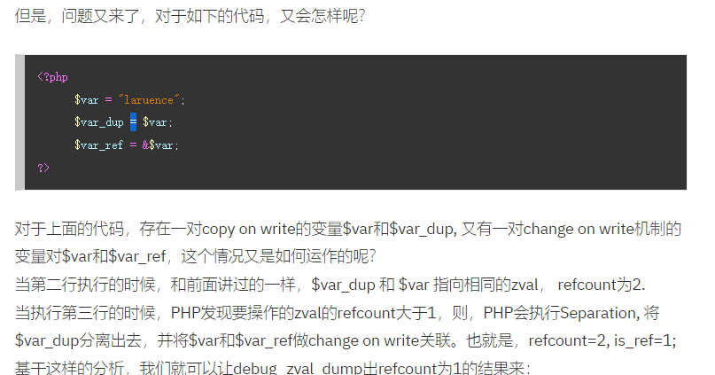
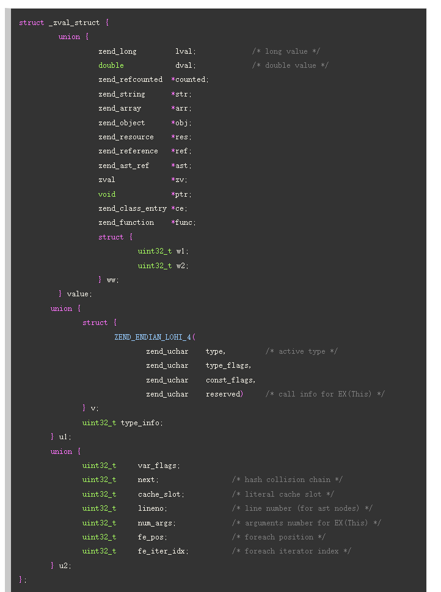
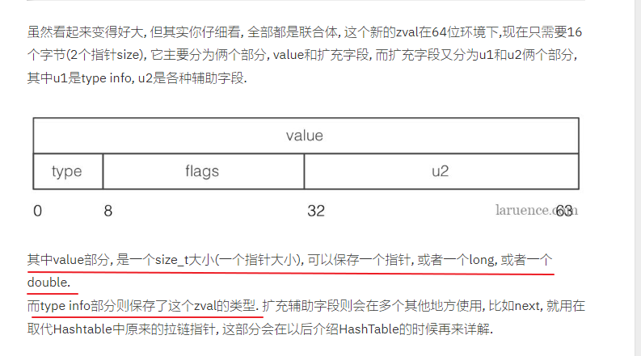
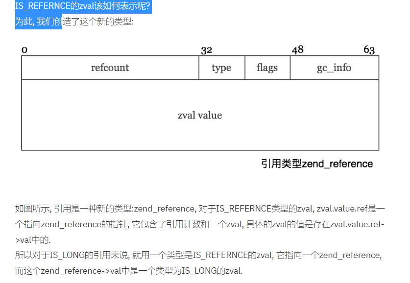
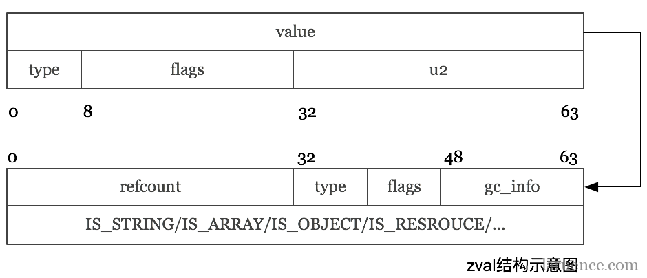
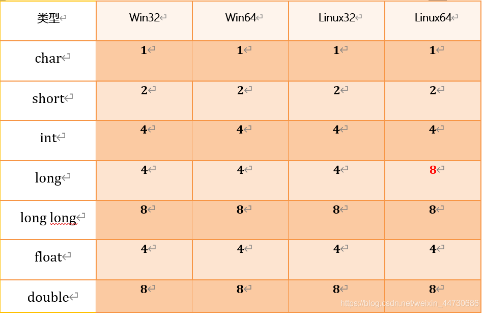

# 待解决的问题


##  问题--解决案例

php 变量作用域  https://www.laruence.com/2008/08/26/463.html

php 变量  https://www.laruence.com/2008/08/22/412.html

php5 变量的分离   php5 copy on write https://www.laruence.com/2008/09/19/520.html

php7 REFERENCE 引用 变量   https://www.laruence.com/2008/08/22/412.html

---

在 PHP 中引用意味着用不同的名字访问同一个变量内容。这并不像 C 的指针：例如你不能对他们做指针运算，他们并不是实际的内存地址…… 查看[引用不是什么](https://www.php.net/manual/zh/language.references.arent.php)了解更多信息。 替代的是，引用是符号表别名。注意在PHP 中，变量名和变量内容是不一样的， 因此同样的内容可以有不同的名字。最接近的比喻是 Unix 的文件名和文件本身——变量名是目录条目，而变量内容则是文件本身。引用可以被看作是 Unix 文件系统中的硬链接


---

 ？？？？ 也不知道对不对 这里是随便写的；

//  以前 resource 和 obj 都是传引用（句柄）的； 所以需要两套的GC；

//现在 只需要一套就可以了；refcount 以前是在struct.zval.refcount  现在都是在 struct.zval.value.refcount 




----


##php7 zval

> struct  和 union的区别  一个是结构体一个是联合体 ，结构体，是所有的变量总共占有的内存，联合体，是最大的变量 占用的内存；
>
> php5的zval 占用 24字节？  

---


### php5 zval的缺点

PHP5的zval定义是随着Zend Engine 2诞生的, 随着时间的推移, 当时设计的局限性也越来越明显:
**首先这个结构体的大小是(在64位系统)24个字节, 我们仔细看这个zval.value联合体, 其中zend_object_value是最大的长板, 它导致整个value需要16个字节, 这个应该是很容易可以优化掉的, 比如把它挪出来, 用个指针代替,因为毕竟IS_OBJECT也不是最最常用的类型.**

第二, 这个结构体的每一个字段都有明确的含义定义, 没有预留任何的自定义字段, 导致在PHP5时代做很多的优化的时候, 需要存储一些和zval相关的信息的时候, 不得不采用其他结构体映射, 或者外部包装后打补丁的方式来扩充zval, 比如5.3的时候新引入专门解决循环引用的GC, 它不得采用如下的比较hack的做法:

第三, PHP的zval大部分都是按值传递, 写时拷贝的值, 但是有俩个例外, 就是对象和资源, 他们永远都是按引用传递, 这样就造成一个问题, 对象和资源在除了zval中的引用计数以外, 还需要一个全局的引用计数, 这样才能保证内存可以回收. 所以在PHP5的时代, 以对象为例, 它有俩套引用计数, 一个是zval中的, 另外一个是obj自身的计数:

除了上面提到的两套引用以外, 如果我们要获取一个object, 则我们需要通过如下方式:

```c
EG(objects_store).object_buckets[Z_OBJ_HANDLE_P(z)].bucket.obj
```

经过漫长的多次内存读取, 才能获取到真正的objec对象本身. 效率可想而知.
这一切都是因为Zend引擎最初设计的时候, 并没有考虑到后来的对象. 一个良好的设计, 一旦有了意外, 就会导致整个结构变得复杂, 维护性降低, 这是一个很好的例子.

第四, 我们知道PHP中, 大量的计算都是面向字符串的, 然而因为引用计数是作用在zval的, 那么就会导致如果要拷贝一个字符串类型的zval, 我们别无他法只能复制这个字符串. 当我们把一个zval的字符串作为key添加到一个数组里的时候, 我们别无他法只能复制这个字符串. 虽然在PHP5.4的时候, 我们引入了INTERNED STRING, 但是还是不能根本解决这个问题.

还比如, PHP中大量的结构体都是基于Hashtable实现的, 增删改查Hashtable的操作占据了大量的CPU时间, 而字符串要查找首先要求它的Hash值, 理论上我们完全可以把一个字符串的Hash值计算好以后, 就存下来, 避免再次计算等等
第五, 这个是关于引用的, PHP5的时代, 我们采用写时分离, 但是结合到引用这里就有了一个经典的性能问题: 

其实就是  change  on write的问题；

```php
<?php
    function dummy($array) {}
    $array = range(1, 100000);
    $b = &$array;
    dummy($array);
?>
```

当我们调用dummy的时候, 本来只是简单的一个传值就行的地方, 但是因为$array曾经引用赋值给了$b, 所以导致$array变成了一个引用, 于是此处就会发生分离, 导致数组复制, 从而极大的拖慢性能,

---


struct zval{

value   值  

struct union

​	{

​		long lval

​		double dval

​		struct str {

​				str \*str

​				len int;

​		}

​		hashtable \*arr；

​		object  handler  =>  {handle 通过handler 去brucket 里面去找对象 很慢 }

​	}

​		type   zval 的类型；

​		refcount  引用次数

​		is_ref   是否被引用

}


**最核心的；**

**if(is_ref || refcount <2){**

​		**不分离** 

**}**


**xdebug_debug_zval  查看一下 zval的属性就可以了；**








**这个是肯定是不分离的；**

**因为refcount =1**




**这个肯定分离  因为 一开始refcount = 2；  所以肯定分离**

//这里是change on  write  所以肯定会发生写入；肯定会发生分离；




----

---

---


### PHP7


php7 zval  https://www.laruence.com/2018/04/08/3170.html

php7 reference  https://www.laruence.com/2018/04/08/3179.html

php7 和 php5的比较  https://blog.csdn.net/veloi/article/details/114634381

php zval详解  https://blog.csdn.net/weixin_43885417/article/details/100990106

---


**php7 zval**    目录 ：php-src-php-7.2.2    zend/zend_types.h  数据类型的一个目录；





---

## gc 方面的一个最大的改革；

 gc 不再属于zval  而是属于数据本身；所以对于一些直接可以保存在zval中的数据就不需要计数了，计数现在不存在于zval，而是存在于另外一个结构体内部；下面有很多例子；比如str 和 obj  都是这样的；

----

​	**zval 的组成  主要分为 四个部分； value里面会存在gc 垃圾回收计数；**  <font color=red>php7的zval的大小是16个字节；</font>

<font color=red>64位操作系统也就才8个字节的指针；所以最大是8个字节；value部分；其中lval  long  最大也是8个字节，double也是八个字节；</font>

**注意地址一般都是写的是十六进制；如果十六进制差一位那么就是差16，那么就是差16个字节；**

**案例： 第一个zval = 0x7ffff5e140e0;下一个zval = ox7ffff5e140f0; 那么就是这两个zval相差的是16个字节；**


**zval主要分为**



**u1部分：**

type_flag:　对应变量类型的特有标记，不同类型的变量对应的flag也不同。所对应的标记如下：

````c
/* zval.u1.v.type_flags */  // 左移 就是次方；  2^n

IS_TYPE_CONSTANT                (1<<0)                  //是常量类型 1
IS_TYPE_IMMUTABLE               (1<<1)               //不可变的类型，比如存在共享内存中的数组   2
IS_TYPE_REFCOUNTED              (1<<2)                 //需要引用计数的类型  4 
IS_TYPE_COLLECTABLE             (1<<3)             //可能包含循环引用的类型（IS_ARRAY, IS_OBJECT)）类型  8 
IS_TYPE_COPYABLE                (1<<4)               //可复制类型  16 
````

----

**reference 引用；**




​			

​		如图所示, 引用是一种新的类型:zend_reference, 对于IS_REFERNCE类型的zval, zval.value.ref是一个指向zend_reference的指针, 它包含了引用计数和一个zval, 具体的zval的值是存在zval.value.ref->val中的.

所以对于IS_LONG的引用来说, 就用一个类型是IS_REFERNCE的zval, 它指向一个zend_reference, 而这个zend_reference->val中是一个类型为IS_LONG的zval.

注意这里的，zval.value.ref 就是代表的是


### 对比 php5 和php7 change on write的对比；

php5 会存在 change on write  但是php7 只有写时复制	q


；

### Change On Write   赋值引用（&）的时候需要 做（复制）；

PHP采用引用计数来做简单的垃圾回收, 考虑如下的代码:

```php
<?php
1. $val = "laruence";
2. $ref = &$val;
3. $copy = $val;
4. $copy =  'string'; //因为refcount >=2  所以 肯定要写时复制的；要左分离；
5. unset($val); // 仅仅是修改的zend_reference 的数据类型就可以了修改成type = 10 ；0就可以了；‘
?>
```

```php
$ref和$val是指向同一个zval的引用, 在PHP5的时候, 我们是通过一个引用计数(is_ref)为2, 并且引用标志位为1来表示这种情况, 当把$val复制给$copy(line 3)的时候, 我们发现$val是一个计数大于1的引用, 所以要产生Change on write, 也就是分离. 所以我们需要复制这个zval.
    
而在PHP7中, 情况就变得简单了很多, 首先在引用赋值给$ref(line 2)的时候, 生成一个IS_REFERNCE类型, 然后因为此时有俩个变量引用它所以zend_reference这个结构的引用计数zval.value.ref->gc.refcount为2. 
 zval.value.ref->[gc[refcount = 2],value.str->[gc [refcount = 1], 'string', hash, len]];
    
再随后的赋值给$copy(line 3)的时候, 发现$val是一个引用, 于是让$copy指向的是zval.value.ref->val, 也就是字符串值为laruence的zval, 然后把zval的引用计数+1, 也就是zval.value.ref->val.value.str.gc.refcount为2. 并没有产生复制.
    
 zval.value.ref->[gc[refcount = 2],value.str->[gc [refcount = 2], 'string', hash, len]];
// 如果存在 unset($ref); 也需要注意的是 $val 和$ref 都拥有独立的zval zend_reference 但是zval.value.ref->zval 都是同一个str zval而已； 都是同一个 仅仅是都是一样的而已；所以unset 仅仅是需要修改b的type = 10 也就是等于0就可以了
那么仅仅是修改了 仅仅是把$ref的数据类型变成了type = 0 也就是null而已；


```


<font color=red>注意：下面的几个源码是和上面的图片 zend_reference 是有关的，需要对照着看才能看懂！！！！</font>



```c
//  gc  所有的value的部分垃圾回收部分；
// refcount  存在于 zval.val.gc.refcount(_zend_refcounted_h) 部分；
// type 存在于 u1内部；
typedef struct _zend_refcounted_h {
   uint32_t         refcount;       /* reference counter 32-bit */
   union {
      struct {
         ZEND_ENDIAN_LOHI_3(
            zend_uchar    type,   /*注意这里和zvalde u1结构体的区别*/
            zend_uchar    flags,    /* used for strings & objects */
            uint16_t      gc_info)  /* keeps GC root number (or 0) and color */
      } v;
      uint32_t type_info;
   } u;
} zend_refcounted_h;
//所有的复杂类型的定义, 开始的时候都是zend_refcounted_h结构, 这个结构里除了引用计数以外, 还有GC相关的结构. 从而在做GC回收的时候, GC不需要关心具体类型是什么, 所有的它都可以当做zend_refcounted*结构来处理.
```


```c
struct _zend_reference {
   zend_refcounted_h gc;
   zval              val;  // 对应着哪一个zval；	
};
```


```c
struct _zend_object {
   zend_refcounted_h gc;
   uint32_t          handle; // TODO: may be removed ???
   zend_class_entry *ce;   //ce 直接获取到object 对应值；
   const zend_object_handlers *handlers;
   HashTable        *properties;
   zval              properties_table[1];
};
```


```c
struct _zend_resource {
   zend_refcounted_h gc;
   int               handle; // TODO: may be removed ???
   int               type;
   void             *ptr;
};
```

````c
//zval.val.str = p  是一个指针
struct _zend_string {
	zend_refcounted_h gc;
    zend_ulong h;   /*  hash value 数组中的哈希值 保存在这里*/
    size_t len;
    char val[1];
}
````


---


xdebug的应用 那些是不计数的  ： https://www.ysext.com/articleinfo/1024.html

**原因**
在 PHP7 中，为一个变量赋值的时候，包含了两部分操作：

1、为符号量（即变量名）申请一个 zval_struct 结构

2、将变量的值储存到 zval_struct.value 中 对于 zval 在 value 字段中能保存下的值，就不会在对他们进行引用计数，而是在拷贝的时候直接赋值，这部分类型有：

**IS_LONG**
**IS_DOUBLE**
即我们在 PHP 中的整形与浮点型。

那么 var_str 的 refcount 为什么也是 0 呢？
这就牵扯到 PHP 中字符串的两种类型： 

1、interned string 内部字符串（函数名、类名、变量名、静态字符串）：

```
$str = '233';  // 静态字符串
```

2、普通字符串：

```
 ``$str = '233' . time();
```


<font color=red>**对于内部字符串而言，字符串的内容是唯一不变的，相当于 C 语言中定义在静态变量区的字符串，他们的生存周期存在于整个请求期间，request 完成后会统一销毁释放，自然也就无需通过引用计数进行内存管理。 这里和一些常量常量，不可变数组都不需要计数；都是在请求结束的时候释放**</font>

 而变量字符串，变动的字符串，需要去计数；


**三. 为什么初始数组的引用计数器的值为 2**
现象

```
$var_empty_arr = [1, 2, '3'];``xdebug_debug_zval('var_empty_arr');``/** 输出 **``var_arr:``(refcount=2, is_ref=0)``array (size=3)`` ``0 => (refcount=0, is_ref=0)int 1`` ``1 => (refcount=0, is_ref=0)int 2`` ``2 => (refcount=1, is_ref=0)string '3' (length=1)``**********/
```

原因
**这牵扯到 PHP7 中的另一个概念，叫做 immutable array（不可变数组）。**

```
For arrays the not-refcounted variant is called an "immutable array". If you use opcache, then constant array literals in your code will be converted into immutable arrays. Once again, these live in shared memory and as such must not use refcounting. Immutable arrays have a dummy refcount of 2, as it allows us to optimize certain separation paths.
```

不可变数组是 opcache 扩展优化出的一种数组类型，简单的说，所有多次编译结果恒定不变的数组，都会被优化为不可变数组，下面是一个反例：

```
$array = [1, 2, time()];
```

PHP 在编译阶段无法得知 time() 函数的返回值，所以此处的 $array 是可变数组。


**不可变数组和我们上面讲到的内部字符串一样，都是不使用引用计数的，但是不同点是，内部字符串的计数值恒为 0，而不可变数组会使用一个伪计数值 2。**


**总结**:

**简单数据类型**

整形（不使用引用计数）
浮点型（不使用引用计数）
布尔型（不使用引用计数）
NULL（不使用引用计数）

**复杂数据类型**

**字符串  interned interned 内部字符串 也不需要去计数；**

普通字符串（使用引用计数，初始值为 1）
内部字符串（不使用引用计数，引用计数值恒为 0）
数组  

普通数组（使用引用计数，初始值为 1）
不可变数组（不使用引用计数，使用伪计数值 2）
对象（使用引用计数，初始值为 1）


##hashtable 

**key =》value 就是zval；**

**变量名 =》 zval的一个哈希表；通过这些哈希表去查找全局变量或者某个函数；**





### 句柄

 只有操作的权限，没有

　　**句柄就是操作某个对象的资源，即操作某个目标的，句柄就是回调函数。句柄(handle)也可以理解为把手。拥有把手就相当于拥有资源。针对句柄进行操作就等于顺藤摸瓜操作资源。实际上对象在内存地址中不是固定的，固定的句柄指向相应对象内存中所在的地址。也可以说句柄是一种通道，一个保持着某种状态的对象。**

　　**一个资源在某种特定的性致下无法直接使用，所以使用句柄来操作。**
