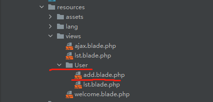

# Blade  模板


**最初得时候应用：php嵌入到html来生成动态页面；**

````php
Route::get("/staticpage/visitor",function (){
     return view('User.add');
});
return view('welcome',[
    'ceshi1'=>$ceshi1,
    'ceshi2'=>$ceshi2,
    'ceshi3'=>$ceshi3,
]);
//利用数组来传递参数
//return view('welcome');
//当有form表单得时候需要  {{csrf_field()}}

//html
<!DOCTYPE HTML PUBLIC "-//W3C//DTD HTML 4.01 Transitional//EN" "http://www.w3.org/TR/html4/loose.dtd">
<html lang="en">
<head>
    <meta http-equiv="Content-Type" content="text/html;charset=UTF-8">
    <title>post请求</title>
</head>
<body>
    //应用参数  
{{$ceshi1}}
<form action="/user/add" method="post">
    {{csrf_field()}}
    用户名：<input type="text" name = 'name'>
    <input type="submit" name='btn' value="提交">
</form>
</body>
</html>
````

目录结构：




